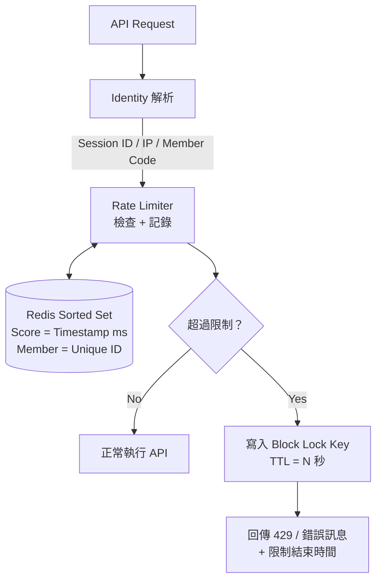
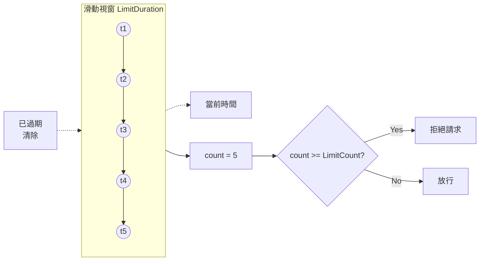
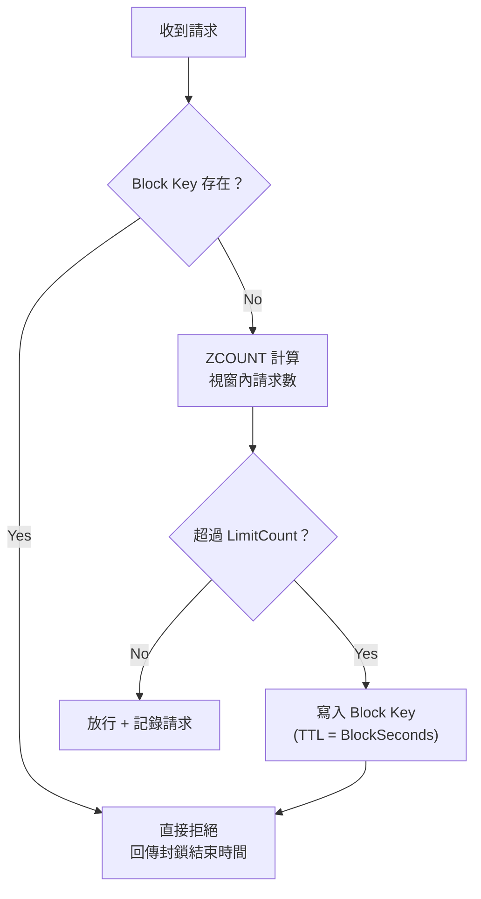

## 前言

在面向全球用戶的平台系統中，API 被濫用幾乎是必然會遇到的問題——無論是攻擊者暴力嘗試登入、
爬蟲高頻抓取資料，還是用戶無意間重複提交表單。

本文分享一個我們實際在生產環境中使用的 **Redis-based API Rate Limiting 架構**，
涵蓋兩種策略：**滑動視窗（Sliding Window）** 和 **滑動視窗 + 封鎖鎖定（Sliding Window + Block Lock）**，
並支援以 Session ID、IP、Member Code 等多種身份維度進行限流。

<!-- more -->

## 架構概覽



## 核心概念：為什麼選擇 Redis Sorted Set？

一般常見的 Rate Limiting 演算法有：

| 演算法 | 優點 | 缺點 |
|--------|------|------|
| Fixed Window Counter | 簡單 | 視窗邊界會有突發流量問題 |
| Sliding Window Log | 精確 | 記憶體消耗大 |
| **Sliding Window Counter (Sorted Set)** | **精確 + 自動過期清理** | 略比 Counter 複雜 |
| Token Bucket | 允許突發 | 實作複雜 |

我們選擇 **Redis Sorted Set** 的原因：

1. **Score 即時間戳**：每次請求記錄當下的毫秒時間戳作為 Score
2. **原生範圍查詢**：`ZCOUNT` 可以直接查詢「過去 N 秒內有多少筆請求」
3. **自動清理**：`ZREMRANGEBYSCORE` 移除過期的請求紀錄
4. **TTL 自動回收**：整個 Key 設定 `EXPIRE` 避免記憶體洩漏

## 策略一：基礎版 — 滑動視窗 Rate Limit

### 設計邏輯



### 程式碼實作

```csharp
public class SuspectUsageManager : ISuspectUsage
{
    private readonly IDatabase db;
    private readonly SuspectUsageAction action;
    private readonly SuspectUsageSettingEntity _setting;

    // Redis Key 格式: {Action}:{Identity}
    // 例如: BankAccountUpdate:192.168.1.1
    private string _rateLimitKey(string key) => $"{action}:{key}";

    // 計算滑動視窗的起始時間點
    private double _cutTime => DateTime.Now
        .AddSeconds(-_setting.LimitDuration)
        .ToJsMilliseconds();

    public bool IsOverRateLimit(string identity)
    {
        var redisKey = _rateLimitKey(identity);
        // ZCOUNT: 只計算視窗內的請求數
        return db.SortedSetLength(redisKey, _cutTime) >= _setting.LimitCount;
    }

    public bool AddUsage(string identity, string uniqueMember)
    {
        var redisKey = _rateLimitKey(identity);

        if (!IsOverRateLimit(identity))
        {
            // ZADD: Score = 當前毫秒時間戳, Member = 唯一識別碼
            db.SortedSetAdd(redisKey, uniqueMember, DateTime.Now.ToJsMilliseconds());
            // 設定整個 Key 的 TTL 避免記憶體洩漏
            db.KeyExpire(redisKey, TimeSpan.FromSeconds(_setting.LimitDuration));
        }

        // ZREMRANGEBYSCORE: 清除視窗外的舊資料
        db.SortedSetRemoveRangeByScore(redisKey, 0, _cutTime);
        return true;
    }
}
```

### Redis 資料結構範例

```
Key:  BankAccountUpdate:192.168.1.1
Type: Sorted Set
TTL:  120 seconds

┌──────────────────────┬────────────────────┐
│ Member (唯一識別碼)   │ Score (毫秒時間戳)  │
├──────────────────────┼────────────────────┤
│ "guid-abc-001"       │ 1710000060000      │
│ "guid-abc-002"       │ 1710000090000      │
│ "guid-abc-003"       │ 1710000120000      │ ← 超過 LimitCount=2 → 拒絕
└──────────────────────┴────────────────────┘
```

## 策略二：進階版 — 滑動視窗 + 封鎖鎖定

基礎版的問題：超過限制後，攻擊者只要等視窗過期就能繼續嘗試。
進階版加入了一個 **Block Lock Key**，一旦超限就鎖定一段額外時間。

### 設計邏輯



### 程式碼實作

```csharp
public class RateLimitManager : ISuspectUsage
{
    // 計數用 Key: {Action}:{Identity}
    private string _rateLimitKey(string key) => $"{action}:{key}";
    // 封鎖用 Key: {Action}:{Identity}:locked
    private string _blockLimitKey(string key) => $"{action}:{key}:locked";

    public bool IsOverRateLimit(string identity)
    {
        // Step 1: 先檢查 Block Key 是否存在 (O(1) 操作，極快)
        var blockKey = _blockLimitKey(identity);
        if (db.KeyExists(blockKey, CommandFlags.PreferReplica))
            return true;

        // Step 2: 計算滑動視窗內的請求數
        var rateCount = db.SortedSetLength(_rateLimitKey(identity), _cutTime);

        // Step 3: 超限 → 寫入 Block Key 開始封鎖
        if (rateCount >= _setting.LimitCount)
        {
            db.StringSet(
                _blockLimitKey(identity),
                identity,
                TimeSpan.FromSeconds(_setting.BlockSeconds)
            );
            return true;
        }

        return false;
    }

    // 取得封鎖結束時間 (毫秒時間戳，前端可直接用於倒數計時)
    public long GetRestrictionEndTime(string identity)
    {
        // 優先從 Block Key 的 TTL 計算
        var blockTTL = db.KeyTimeToLive(_blockLimitKey(identity));
        if (blockTTL.HasValue)
        {
            return (long)DateTime.Now.Add(blockTTL.Value).ToJsMilliseconds();
        }

        // Fallback: 從 Sorted Set 最後一筆的 Score 推算
        var lastScore = db.SortedSetRangeByRankWithScores(
            _rateLimitKey(identity), -1, -1
        ).First().Score;
        return (long)(lastScore + _setting.BlockSeconds * 1000);
    }
}
```

### 兩種 Redis Key 的配合

```
Rate Limit Key (Sorted Set):            Block Key (String):
SecureForgotAccount:user123              SecureForgotAccount:user123:locked
┌────────┬──────────────┐               ┌────────────────────┐
│ Member │ Score        │               │ Value: "user123"   │
├────────┼──────────────┤               │ TTL: 1800 seconds  │
│ guid-1 │ 171000006000 │               └────────────────────┘
│ guid-2 │ 171000007000 │
│ guid-3 │ 171000008000 │  ← count=3, 達到 LimitCount
└────────┴──────────────┘     → 觸發寫入 Block Key
```

### 兩種策略的比較

| 面向 | 基礎版 (SuspectUsageManager) | 進階版 (RateLimitManager) |
|------|------------------------------|--------------------------|
| 超限後行為 | 視窗內舊請求過期後即可恢復 | 額外鎖定 BlockSeconds，需等鎖定期結束 |
| Redis 操作數 | 每次請求: ZCOUNT | 每次請求: EXISTS (O(1)) → 快速攔截 |
| 適用場景 | 一般性限流 (查詢、上傳) | 安全敏感操作 (OTP、密碼重設、MFA) |
| 前端倒數計時 | 基於最後一筆請求推算 | 基於 Block Key TTL 精確計算 |
| 防攻擊能力 | 中等 | 強 — 封鎖期間完全阻斷 |

## 身份維度 (Identity) 設計

限流的「身份」決定了「誰被限制」。我們支援多種維度，可依場景靈活組合：

```csharp
public enum SuspectIdentity
{
    MemberCode,   // 會員代碼 — 限制特定用戶
    SessionId,    // Session ID — 限制特定瀏覽器 session
    AccountId,    // 帳號 ID — 限制特定帳號 (跨 session)
    ClientIp,     // IP 位址 — 限制特定來源
}
```

### 組合使用範例

```csharp
// 銀行帳號更新：同時限制「會員」和「IP」
var identities = new List<string> { trading.MemberCode, trading.ClientIP };
var isBlocked = identities.Any(id => suspectUsageManager.IsOverRateLimit(id));

// 促銷查詢：限制「會員 + 促銷代碼」的組合
var identity = $"{memberCode}_{promoCode}";
suspectUsageManager.IsOverRateLimit(identity);

// MFA 重送：限制特定 AccountId
rateLimit.IsOverRateLimit(accountId.ToString());
```

## XML 設定驅動 — 免部署調整

所有限流參數都透過 XML 設定檔管理，修改設定無需重新編譯：

```xml
<ArrayOfSuspectUsageSettingEntity>
  <!-- 一般操作 — 基礎版滑動視窗 -->
  <SuspectUsageSettingEntity Action="BankAccountUpdate"
    LimitCount="2" LimitDuration="120" />
  <SuspectUsageSettingEntity Action="ComposeMessage"
    LimitCount="5" LimitDuration="1800" />

  <!-- 安全操作 — 進階版滑動視窗 + 封鎖 -->
  <SuspectUsageSettingEntity Action="SecureForgotAccount"
    LimitCount="3" LimitDuration="1800" BlockDuration="1800" />
  <SuspectUsageSettingEntity Action="SecureChangeEmail"
    LimitCount="3" LimitDuration="1800" BlockDuration="1800" />

  <!-- 登入保護 — 長時間封鎖 -->
  <SuspectUsageSettingEntity Action="SecureLoginForceForgotAccount"
    LimitCount="2" LimitDuration="86400" BlockDuration="86400" />
</ArrayOfSuspectUsageSettingEntity>
```

| 參數 | 說明 | 範例 |
|------|------|------|
| LimitCount | 時間窗內允許的最大次數 | 3 = 最多 3 次 |
| LimitDuration | 滑動視窗大小 (秒) | 1800 = 30 分鐘 |
| BlockDuration | 超限後的封鎖時間 (秒) | 1800 = 鎖定 30 分鐘 |

## 實際使用場景

### 場景 1：銀行帳號更新 — 防止頻繁修改

> 策略: 基礎版 | 120 秒內最多 2 次 | By MemberCode + IP

用戶可能在短時間內反覆修改銀行帳號來測試系統，同時以 MemberCode 和 IP 雙維度限制，即使換帳號也無法繞過 IP 限流。

### 場景 2：忘記密碼 / OTP 驗證 — 防暴力破解

> 策略: 進階版 | 30 分鐘內最多 3 次 | 超過後封鎖 30 分鐘 | By LoginId

攻擊者嘗試暴力破解 OTP 時，3 次失敗後直接封鎖 30 分鐘，且前端可透過 `GetRestrictionEndTime()` 取得精確的倒數時間。

### 場景 3：MFA 登入驗證重送 — 動態設定

> 策略: 進階版 | 設定來自後台 API 動態取得 | By AccountId

```csharp
var rateLimitSetting = new SuspectUsageSettingEntity
{
    Action = SuspectUsageAction.LoginVerification_Resend.ToString(),
    LimitCount = otpConfig.NewDeviceMfaRetryWindowMaxAttempts,
    LimitDuration = otpConfig.NewDeviceMfaRetryWindowMinutes * 60,
    BlockDuration = (otpConfig.NewDeviceMfaCooldownMinutes * 60).ToString()
};
var rateLimit = new RateLimitManager(action, rateLimitSetting);
```

### 場景 4：登入攻擊防護 — 長時間封鎖

> 策略: 進階版 | 24 小時內 2 次 | 超過後封鎖 24 小時 | By LoginId/Email

偵測到帳號處於 Force Reset Password 狀態仍被反覆嘗試登入，直接在 Redis 層攔截，完全不碰資料庫，有效降低 DB 負載。

### 場景 5：促銷 / 返利查詢 — 防爬蟲

> 策略: 基礎版 | 60 秒內最多 10 次 | By MemberCode + PromoCode

防止爬蟲高頻抓取促銷和返利資料。

### 場景 6：ActionFilter 整合 — 宣告式限流

透過 .NET ActionFilter，可以用 Attribute 宣告式地套用限流：

```csharp
[RateLimitActionFilter(
    UsageAction = SuspectUsageAction.SecureMiniGame,
    SuspectIdentity = SuspectIdentity.MemberCode
)]
public ActionResult PlayMiniGame() { ... }
```

## 效能考量

- **Block Key 快速攔截**：進階版先檢查 `EXISTS`（O(1)），被封鎖的請求不需要執行 `ZCOUNT`，大幅減少 Redis 操作
- **PreferReplica 讀取**：`db.KeyExists(blockKey, CommandFlags.PreferReplica)` 從 Redis Replica 讀取，降低主節點負擔
- **自動清理**：每次 `AddUsage` 時清除過期資料，避免 Sorted Set 無限膨脹
- **Key TTL 兜底**：即使清理邏輯出問題，Key 本身也有 TTL 會自動過期

## 結語

這套架構在生產環境中承載了 **20+ 種不同場景** 的限流需求，從基本的表單防重複提交到安全敏感的 MFA/OTP 驗證，所有設定透過 XML 管理、支援後台動態調整，且可以透過 ActionFilter 宣告式套用。

關鍵設計決策：

- **Sorted Set** 作為滑動視窗的天然資料結構
- **Block Key** 分離計數與封鎖，讓被封鎖的請求以 O(1) 被攔截
- **多維度 Identity** 讓同一套機制適用於不同限流策略
- **前端友善**：`GetRestrictionEndTime()` 回傳毫秒時間戳，前端可直接用於倒數 UI
