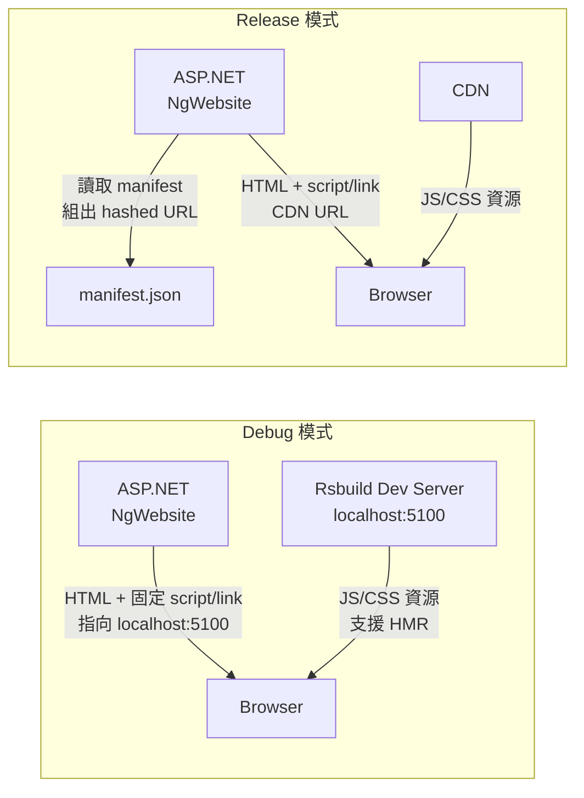
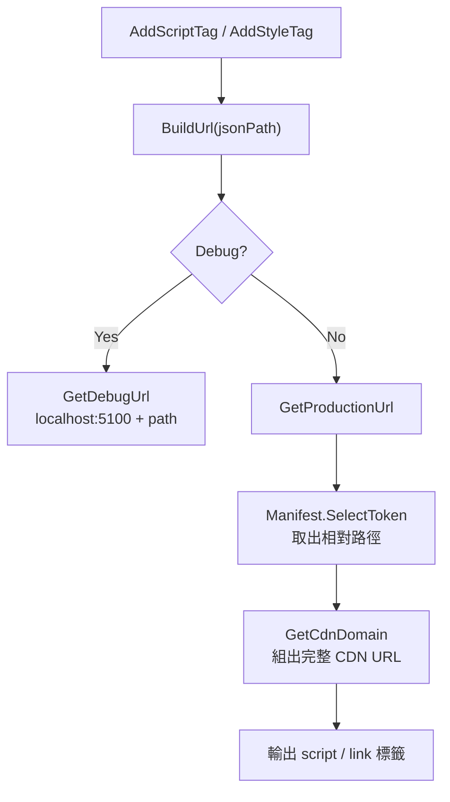
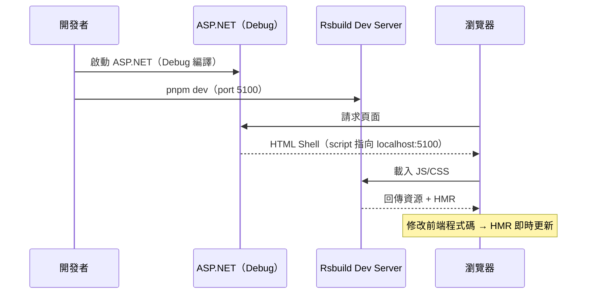
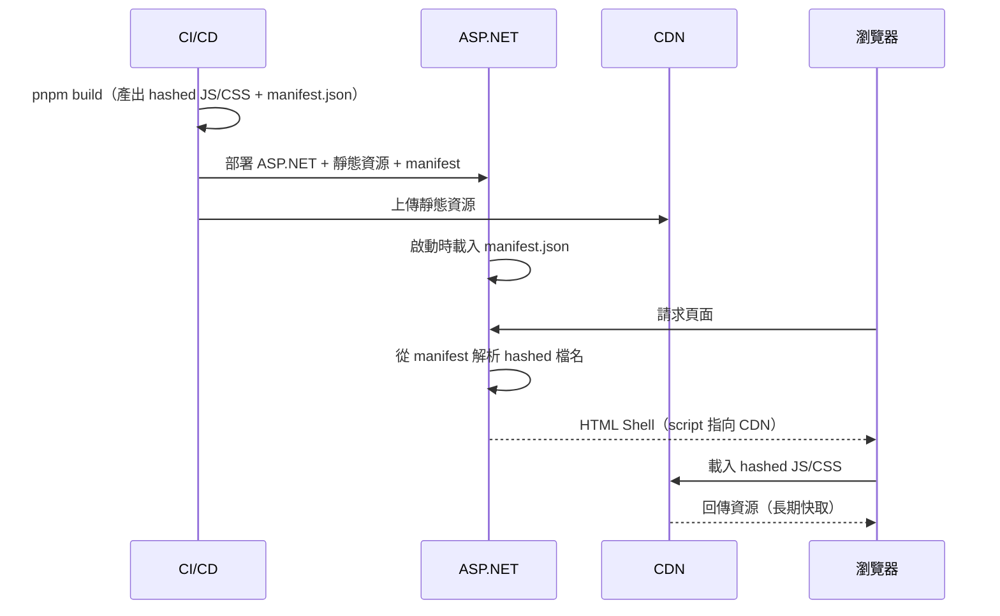

## 前言

大多數 Vue 專案如果需要 Server Side Rendering，通常會選擇 Nuxt.js 作為全端框架。但我們的情境不一樣——後端是既有的 **ASP.NET MVC** 應用，負責身份驗證、Session 管理、多語系路由等，不可能整個換成 Node.js。

因此我們設計了一套特殊的整合架構：**ASP.NET 只負責輸出 HTML Shell**（`_Layout.cshtml`），**Vue 3 SPA 由 Rsbuild 獨立建置**，兩者透過一份 `manifest.json` 在 Debug 和 Release 模式下各自連到對應的前端資源。

這套架構讓前後端可以獨立演進——前端換打包工具（Webpack → Rsbuild）、改 chunk 策略、升級 Vue 版本，都不需要動後端程式碼。

<!-- more -->

## 架構總覽



- **Debug**：瀏覽器向 ASP.NET 拿頁面，JS/CSS 直接指向 Rsbuild 開發伺服器（localhost:5100），支援 HMR 熱更新。
- **Release**：ASP.NET 依 manifest.json 解析出帶 hash 的檔名，組出 CDN URL，再輸出對應的 `<script>` / `<link>`。

## 為什麼不用 Nuxt.js？

| 面向 | Nuxt.js | 我們的架構（ASP.NET + Rsbuild） |
|------|---------|-------------------------------|
| 後端技術 | Node.js（必須） | ASP.NET MVC（既有系統） |
| SSR 方式 | Nuxt Server Render | ASP.NET 輸出 HTML Shell，Vue 做 CSR |
| Session 管理 | Nuxt Server Middleware | ASP.NET 原生 Session + Cookie |
| 部署 | Node.js Server | IIS / Windows Server |
| 前端獨立性 | Nuxt 綁定 Vue 版本與打包工具 | 前端可獨立選擇打包工具和框架版本 |

在我們的場景中，後端的 .NET 生態（身份驗證、Session、多語系路由、後台管理）是核心，不可能也不需要遷移到 Node.js。這套架構讓我們在保留 ASP.NET 優勢的同時，前端依然能享受現代化的開發體驗。

## 前端建置產物與 Manifest

前端專案使用 **Rsbuild** 建置，打包後的產物直接寫入 ASP.NET 專案目錄：

| 設定項 | 值 | 說明 |
|--------|-----|------|
| 輸出路徑 | `distPath.root` → ASP.NET 專案目錄 | 建置結果直接放進後端專案 |
| Manifest | `Configuration/manifest.json` | 建置時產生，供後端讀取檔案路徑 |
| Dev Server | `localhost:5100` | Debug 時前端資源由此提供 |

一次 `pnpm build` 就會同時完成：
- 把帶 hash 的 JS/CSS 放到 ASP.NET 專案的靜態資源目錄
- 產生 `manifest.json`，記錄每個 entry 對應的實際檔名

### manifest.json 結構

```json
{
  "entries": {
    "index": {
      "initial": {
        "js": ["cdn/star4/js/vendor.abc123.js", "cdn/star4/js/index.def456.js"],
        "css": ["cdn/star4/css/vendor.abc123.css", "cdn/star4/css/index.def456.css"]
      },
      "async": { "js": ["..."], "css": ["..."] }
    }
  },
  "locales": {
    "en-gb": { "path": "cdn/star4/js/async/en-gb.abc123.js" },
    "zh-cn": { "path": "cdn/star4/js/async/zh-cn.def456.js" }
  }
}
```

- **entries.index.initial**：首屏需要的 JS/CSS（vendor、entry、chunk）
- **entries.index.async**：懶載入的 chunk
- **locales**：依語系載入的翻譯檔

## 後端如何讀取 Manifest

### 載入時機

ASP.NET 應用程式啟動時，透過 `AppConfigManager` 載入 manifest：

```csharp
Manifest = JsonSerializerHelpr.ToObj<JObject>(folderPath, "manifest.json");
```

每次部署新版本時，manifest.json 跟著一起更新，應用程式重啟後就會自動使用新的檔名。

### ManifestHelper — 用 JSON Path 解析資源 URL

`ManifestHelper` 負責將 JSON Path 述詞轉換為實際 URL：



Release 時所有資源 URL 都帶 hash、指向 CDN，檔名完全由 manifest 決定，後端不寫死任何前端檔名。

## _Layout.cshtml：同一份 Layout 支援雙模式

Layout 是整站共用的 HTML Shell，依 `Html.IsDebug()`（對應編譯常數 `#if DEBUG`）自動分流。

### Debug 模式

```html
<script defer src="http://localhost:5100/cdn/star4/js/vendor.js"></script>
<script defer src="http://localhost:5100/cdn/star4/js/index.js"></script>
<link href="http://localhost:5100/cdn/star4/css/vendor.css" rel="stylesheet">
<link href="http://localhost:5100/cdn/star4/css/index.css" rel="stylesheet">
```

直接寫死 Rsbuild dev server 的位址與預設檔名（無 hash），不讀 manifest。

### Release 模式

```csharp
@(Html.AddStyleTag("$['entries'].index.initial.css[0]"))

@if (Request.Url.Segments.Length > 1 && ManifestHelper.isAvailableLanguage(...))
{
    @(Html.AddScriptTag("$['locales'].['" + langCode + "'].path", ...))
}

@(Html.AddScriptTag("$['entries'].index.initial.js[0]", ...))
@(Html.AddScriptTag("$['entries'].index.initial.js[1]", ...))
```

所有資源都透過 `AddScriptTag` / `AddStyleTag` 傳入 JSON Path，後端從 manifest 解析出帶 hash 的檔名，再組出 CDN URL。語系由 URL 第一段（如 `/en-gb/`）決定，支援語系時額外載入對應的 locale chunk。

## 開發與部署流程

### Debug 開發流程



不需先跑 `rsbuild build`，Debug 時 manifest 不會被 Layout 使用。

### Release 部署流程



## 關鍵檔案對照

| 角色 | 檔案 | 說明 |
|------|------|------|
| 前端建置設定 | `client/packages/star4/rsbuild.config.ts` | 輸出路徑、manifest 產生規則 |
| Manifest 產物 | `NgWebsite/Configuration/manifest.json` | 由 Rsbuild 產生，供後端讀取 |
| 後端 Manifest 載入 | `AppConfigManager.cs` | 啟動時載入 manifest → `Manifest` 物件 |
| 後端 URL 解析 | `ManifestHelper.cs` | JSON Path → CDN URL 轉換 |
| HTML Shell | `_Layout.cshtml` | 依 Debug/Release 分流前端資源來源 |

## 設計要點

- **單一 HTML 入口**：ASP.NET 提供 `<div id="app"></div>`，Vue SPA 掛載上去
- **雙模式一 Layout**：Debug 連 dev server，Release 連 manifest + CDN，同一份 cshtml 搞定
- **版本與快取**：Release 資源帶 hash，部署新版本自動切換，CDN 長期快取不怕舊檔
- **語系懶載入**：locale chunk 路徑寫在 manifest，後端依 URL 語系動態注入
- **PWA 支援**：Service Worker 和 PWA manifest 僅在 Release 時註冊，不干擾開發
- **前後端解耦**：ASP.NET 只管 Shell 和 URL 解析，前端的打包工具、chunk 策略、框架版本可以獨立演進
