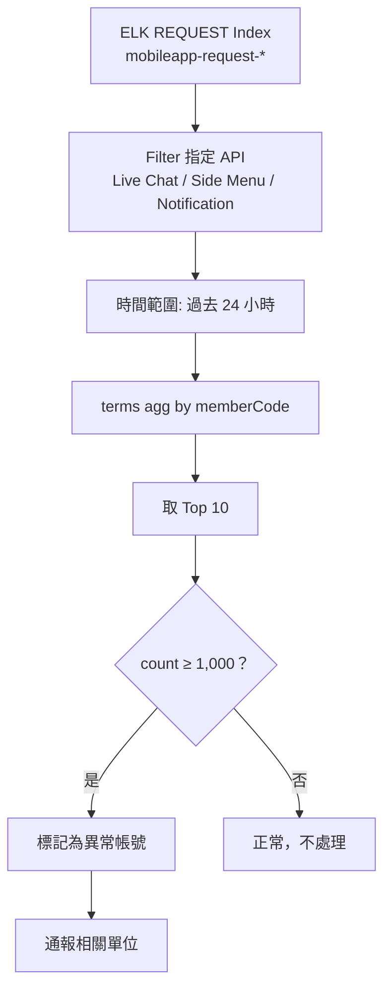
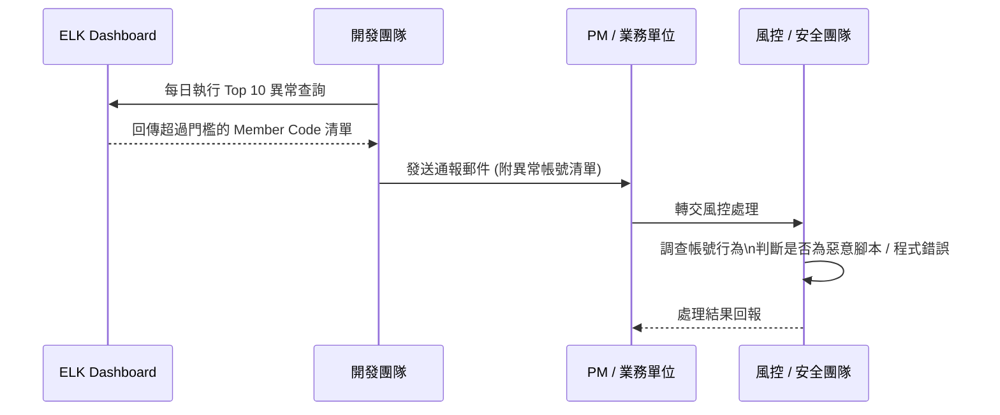

## 背景

Mobile App SPI 的某些 API（例如 Live Chat、側邊選單、重要通知 Widget）屬於**輕量查詢型介面**，正常使用下單日請求量有限。透過 ELK REQUEST 日誌，我們可以統計每位會員每天對這些 API 的呼叫次數，若超過門檻即判定為異常行為。

異常行為的可能原因包含：
- 自動化腳本或爬蟲反覆拉取資料
- 程式端迴圈呼叫未正確控制頻率
- 帳號遭惡意使用，反覆查詢特定資訊

<!-- more -->

## ELK REQUEST Log 格式

Mobile App SPI 的 Request Log 採用以下格式：

```
[REQUEST][Method|requestUrl][HTTPMethod][clientIP][sessionId][memberCode][refererURL|MobileAppVersion] Message
```

| 欄位 | 說明 |
|------|------|
| `requestUrl` | 被呼叫的 API 路徑 |
| `HTTPMethod` | GET / POST |
| `clientIP` | 客戶端 IP |
| `sessionId` | 會話識別碼 |
| `memberCode` | 會員帳號（用於統計依據） |
| `MobileAppVersion` | App 版本號 |

透過 `memberCode` 欄位做 `terms aggregation`，可以統計出每位會員在指定時間區間內的 API 呼叫次數。

## 監控設計

### 目標 API

針對以下三支呼叫頻率理應偏低的 API 進行監控：

| API | 說明 | 正常預期 |
|-----|------|----------|
| Live Chat | 客服聊天入口查詢 | 偶發性呼叫 |
| Side Menu Info | 側邊選單資訊 | 頁面載入時觸發 |
| Important Notification Widgets | 重要通知元件 | 事件驅動，非持續輪詢 |

### 異常門檻

```
單一會員，單日對上述任一 API 的請求次數 ≥ 1,000 次 → 判定為異常
```

正常使用者就算頻繁切換頁面，單日也不應超過此閾值。超過代表可能有自動化行為。

### ELK 查詢邏輯

```
index: mobileapp-request-*
filter:
  - requestUrl: ("livechat" OR "sidemenuinfo" OR "importantnotification")
  - @timestamp: [now-1d TO now]
aggregation:
  terms:
    field: memberCode
    size: 10
    order: _count desc
```



## 案例：2024/8/27 ~ 8/28 調查結果

調查期間發現多個 Member Code 的單日 API 呼叫次數遠超正常值，最高者單日竟達 **40,106 次**，異常程度遠超門檻。

### `/api/message/getimportantnotifications`（Important Notifications）

| Date | Member Code | Count |
|------|-------------|-------|
| 2024/8/27 | bobjytan | **40,106** |
| 2024/8/27 | pazzoiuamy | **36,706** |
| 2024/8/27 | xuannhan1981 | 20,711 |
| 2024/8/27 | chaiwenshuo | 19,053 |
| 2024/8/27 | zhangshuaibao66 | 11,168 |
| 2024/8/27 | radhitkyle58 | 10,718 |
| 2024/8/28 | bobjytan | **34,813** |
| 2024/8/28 | xuannhan1981 | 20,696 |
| 2024/8/28 | radhitkyle58 | 11,000 |
| 2024/8/28 | jieyu06040512 | 8,219 |

### `/api/menuinfo/getaccountsummary`（Account Summary）

| Date | Member Code | Count |
|------|-------------|-------|
| 2024/8/28 | thuha1985 | 2,648 |
| 2024/8/28 | naqsa | 758 |
| 2024/8/28 | thythy123 | 601 |
| 2024/8/28 | hzd981219 | 599 |
| 2024/8/28 | herdisaster182 | 572 |

### `/api/assistance/livechat`（Live Chat）

| Date | Member Code | Count |
|------|-------------|-------|
| 2024/8/28 | nut521 | 611 |
| 2024/8/28 | alfar10 | 128 |

> `bobjytan` 在兩天內對 Important Notifications API 合計呼叫 **74,919 次**，顯示為持續運行的自動化腳本行為。

## 通報與後續處理流程



**通報內容包含：**
- 異常 Member Code 清單（Top 10）
- 各 API 的呼叫次數明細
- 時間區間
- 建議處置方式

## 潛在風險與影響

| 風險類型 | 說明 |
|----------|------|
| 伺服器資源耗用 | 高頻呼叫佔用後端運算與 DB 查詢資源 |
| 資料採集 | 反覆拉取通知 / 聊天資訊可能用於資料蒐集 |
| 帳號異常使用 | 可能代表帳號遭他人控制或出售給自動化工具 |
| 影響其他用戶 | 頻繁請求可能在尖峰時段衝擊整體 API 回應速度 |

## 小結

透過 ELK REQUEST 日誌的 `memberCode` 維度聚合，可以有效識別 Mobile App SPI 中的異常高頻使用者。這類監控的核心邏輯簡單但效果顯著：

1. **選定低頻 API** 作為監控對象（正常使用者不會高頻呼叫）
2. **設定合理門檻**（1,000 次/日）讓誤報率維持在可接受範圍
3. **定期執行並通報**，讓業務單位能及早介入處理

後續可考慮將此查詢自動化，透過 ELK Watcher 排程每日執行並自動發送告警，取代現行的人工查詢方式。
