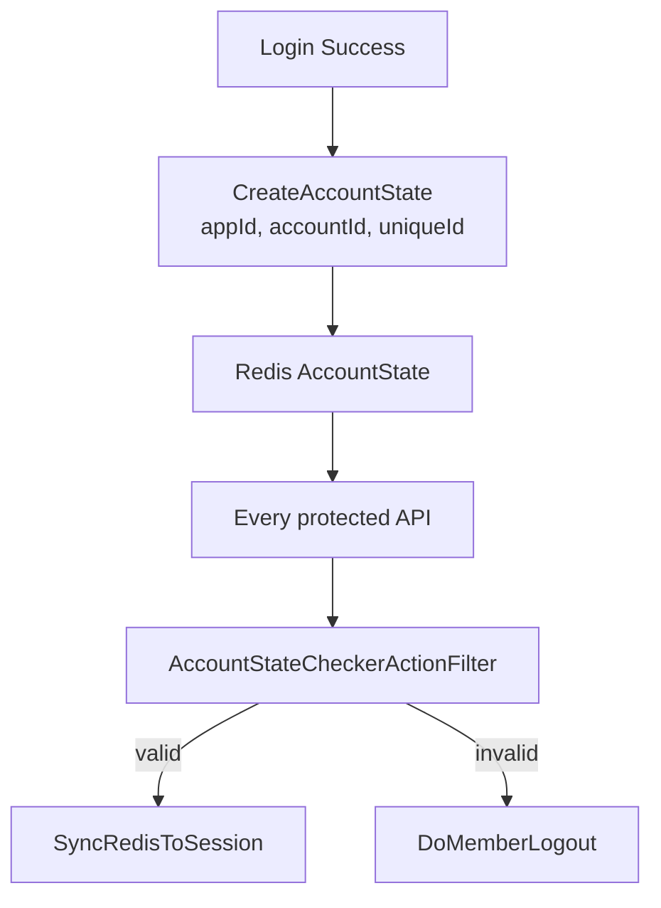
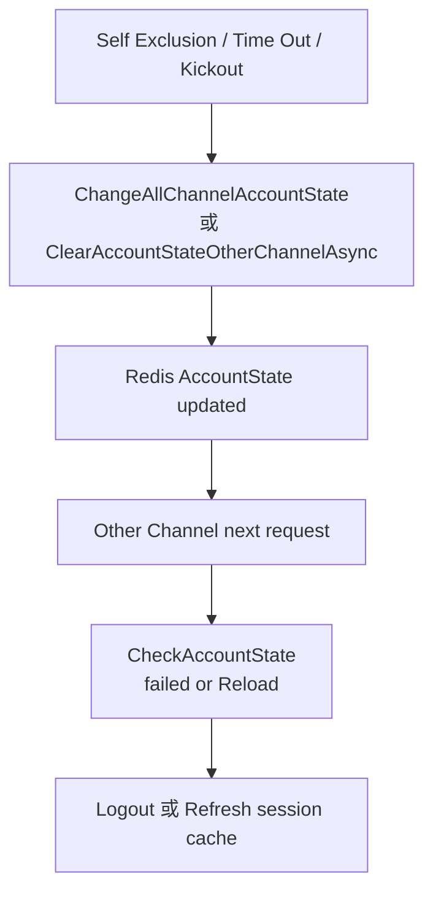

## 前言

在一般網站裡，登入狀態通常只是一個 session flag：

```csharp
Session["IsLogin"] = true;
```

但大型會員平台通常不會這麼單純。使用者可能同時存在於 Desktop Web、Mobile Web、Native App WebView，不同 Channel 各自有 session、cookie、cache 與登入 token。

這時候問題會變成：

- 使用者在 App 登出，Web 是否也要失效？
- 使用者被風控踢出，所有平台是否都要同步？
- Self Exclusion / Time Out 後，其他 Channel 是否要強制 reload 或 logout？
- Redis session 還在，但帳號狀態已失效時怎麼處理？

這個專案透過 `AccountStateManager` 建立一層獨立於 ASP.NET Session 的登入狀態控制層，集中處理 session cache、SSO token 與跨 Channel logout。

<!-- more -->

## AccountState 不是 Session

核心檔案：

```text
src/AgileBet.Cash.Portal.BLL/AccountStateManager.cs
src/AgileBet.Cash.Portal.Web/HttpActionFilter/AccountStateCheckerActionFilter.cs
src/AgileBet.Cash.Portal.Web/BLL/WebAccountManager.cs
```

AccountState 與傳統 session 的差異：

| 機制 | 用途 |
|---|---|
| ASP.NET Session | 保存目前 request 的會員資料 |
| Trading/Profile cache | Redis 中的會員 session cache |
| AccountState | 判斷這個登入來源是否仍有效 |
| Passport token | 跨登入流程的一次性 token / SSO token |

所以就算 ASP.NET Session 還存在，只要 AccountState 已經失效，後端仍然可以強制登出。

## 初始化：把 Redis 與 SSO Service 包起來

`AccountStateManager.InitialAccountState()` 會建立 `SingleSignOnService`：

```csharp
public static void InitialAccountState()
{
    var accountStateDb = RedisUtil.connectionPool.GetDataBase("AccountState");
    var ottDb = RedisUtil.connectionPool.GetDataBase("OneTimeToken");
    JsonAdopter jsonAdopter = new JsonAdopter();

    var redlockmultiplexer = RedisUtil.connectionPool.GetRedLockMultiplexer("AccountState");
    var redLock = RedLockFactory.Create(redlockmultiplexer);

    ssoService = new SingleSignOnService(accountStateDb, ottDb, jsonAdopter, redLock);
}
```

這裡可以看出幾個責任分工：

- `AccountState` Redis DB：保存帳號登入狀態
- `OneTimeToken` Redis DB：保存短效 token
- `RedLock`：處理跨節點併發一致性
- `SingleSignOnService`：封裝 token 與 state 操作

`AccountStateManager` 本身不是直接操作 Redis key，而是包裝 SSO package，讓上層 BLL 不需要理解底層資料結構。

## 建立登入狀態

登入成功後會呼叫：

```csharp
AccountStateManager.CreateAccountState(sourceApp, accountId, uniqueId, memberCode, hours);
```

它會建立一筆帶 TTL 的 AccountState：

```csharp
var ttl = new TimeSpan(hours, 0, 0);
ssoService.CreateAccountState(sourceApp, accountId, uniqueId, ttl);
```

其中：

- `sourceApp`：來源 App，例如 Desktop Web 或 App
- `accountId`：會員帳號 ID
- `uniqueId`：此登入 session 的唯一識別
- `ttl`：狀態有效時間，預設 2 小時

這個設計讓後端可以區分「同一會員」在「不同平台」上的登入狀態。

## Passport：跨流程的一次性登入令牌

`GeneratePassport` 會把登入上下文包成 token：

```csharp
var content = new TokenContent()
{
    AppId = AppDataManager.GetAppID(),
    AccontId = accountId,
    UniqueId = uniqueId,
    OAuthInfo = oAuthInfo,
    DeviceType = deviceType.ToString(),
    WebAuthnCredentialId = webAuthnCredentialId,
};

token = ssoService.GenerateToken(content);
```

這個 token 不只是 accountId，它還包含：

- AppId
- AccountId
- UniqueId
- OAuthInfo
- DeviceType
- WebAuthnCredentialId

這對 OAuth、WebAuthn、MFA 後續登入流程都很重要。它避免前端或 App 端持有完整 session，只拿到一個短效、可驗證的 passport。

## 驗證 AccountState

核心方法是：

```csharp
public static StateResult CheckAccountState(
    int appId,
    long accountId,
    string memberCode,
    string sourceID)
```

預設失敗策略是 invalid：

```csharp
var result = new StateResult()
{
    IsValid = false,
    Remark = ActionRemark.Kickout
};
```

這個設計偏向 fail closed：只要 Redis 找不到狀態、`sourceID` 為空，或 SSO service 發生 exception，預設都視為失效。

```csharp
if (sourceID.IsNullOrEmpty())
{
    return result;
}

state = ssoService.GetAccountState(appId, accountId, sourceID);

if (state == null)
{
    return result;
}

result.IsValid = state.Status.Equals(Status.Validate);
```

`Remark` 會被 parse 成 `ActionRemark`：

```csharp
if (Enum.TryParse<ActionRemark>(state.Remark, out actionRemark))
    result.Remark = actionRemark;
else
    result.Remark = ActionRemark.Kickout;
```

這讓 AccountState 不只是 true/false，而是可以表達「為什麼失效」或「接下來要做什麼」。

## ActionRemark 的價值

在 `WebAccountManager.CheckAccountStateAction` 裡可以看到 `ActionRemark` 的用途：

```csharp
if (!stateResult.IsValid)
{
    result.requireRefresh = true;

    if (stateResult.Remark == ActionRemark.Kickout)
    {
        DoMemberLogout(trading);
    }
    else
    {
        result.alertMessage = stateResult.Remark.ToString();
        result.remarks.Add(stateResult.Remark);
    }
}
else
{
    if (stateResult.Remark == ActionRemark.Reload)
    {
        result.requireRefresh = true;
        ReloadAccountSessionData(trading, profile);
        AccountStateManager.ChangeAllChannelAccountState(
            trading.MemberCode,
            trading.AccountID,
            Status.Validate,
            ActionRemark.Login);
    }
}
```

幾種典型語意：

| Remark | 意義 |
|---|---|
| `Kickout` | 立即登出 |
| `Reload` | session cache 需要重新載入 |
| `Login` | 正常登入狀態 |
| `DisplayNewTnc` | 前端需要顯示新版條款 |

這比單純 `IsValid` 更有彈性，因為它能讓後端把「下一步行為」一起傳給前端。

## AccountStateCheckerActionFilter

API 層的防護由 `AccountStateCheckerActionFilter` 處理：

```csharp
public override void OnActionExecuting(HttpActionContext actionContext)
{
    var isDesktopOrMobileWeb = AppDataManager.GetAppID().Equals(1);
    if (isDesktopOrMobileWeb)
    {
        var sessionData = (SessionData)resolver.GetService(typeof(SessionData));
        var trading = sessionData.Trading;
        if (trading.IsAuthenticated)
        {
            var state = AccountStateManager.CheckAccountState(
                trading.AppId,
                trading.AccountID,
                trading.MemberCode,
                trading.UniqueID);

            if (state.IsValid)
            {
                LoginManager.SyncRedisToSession(trading, profile);
            }
            else
            {
                WebAccountManager.DoMemberLogout(trading);
            }
        }
    }
}
```

這裡的重點是：

- Controller 不需要每支 API 自己檢查 AccountState
- 狀態有效時同步 Redis cache 到 session
- 狀態失效時直接做 logout
- 只有 Desktop / Mobile Web AppId 走這個 filter

這是典型的 cross-cutting concern，放在 ActionFilter 會比散落在各個 Controller 更乾淨。

## 跨 Channel 清除

專案裡有兩個 Channel：

```csharp
private static int[] allChannelAppIds = new int[] { 1, 90 };
```

註解說明：

```csharp
// 1: STAR, 90: APP
```

清除其他 Channel：

```csharp
public static void ClearAccountStateOtherChannelAsync(
    int appId,
    long accountId,
    string memberCode)
{
    List<int> appIds = allChannelAppIds.Where(val => val != appId).ToList();
    ssoService.PurgeAccountStateAsync(accountId, appIds);
}
```

更新所有 Channel：

```csharp
public static bool ChangeAllChannelAccountState(
    string memberCode,
    long accountId,
    Status status,
    ActionRemark action,
    int? excludedAppId = null)
```

這讓後端可以實現：

- App 登出時踢掉 Web
- Web 觸發 Self Exclusion 時踢掉 App
- 狀態需要 Reload 時通知所有 Channel
- 特定 Channel 可以被 excluded

## Logout 的完整流程

`WebAccountManager.DoMemberLogout` 做的不只是清 session：

```csharp
AccountStateManager.ClearAccountStateAsync(
    trading.AppId,
    trading.AccountID,
    trading.MemberCode,
    trading.UniqueID);

EventBusHelper.SetPayloadToFire(
    EventName.MemberLogout,
    BusCategory.Account,
    new Dictionary<string, string>()
    {
        { "key", trading.AccountID.ToString() },
    });

HttpContext.Current.Session.Clear();
HttpContext.Current.Session.Abandon();

HttpCookie cookie = new HttpCookie("ASP.NET_SessionId", "");
cookie.Expires = DateTime.Now.AddDays(-1);
HttpContext.Current.Response.Cookies.Add(cookie);
```

完整責任包括：

1. 清 AccountState
2. 發送 MemberLogout event
3. impersonate service account
4. 清 ASP.NET session
5. 刪除 `ASP.NET_SessionId` cookie

這就是大型系統 logout 複雜的地方：登出不是把 cookie 刪掉而已。

## 架構流程圖



跨 Channel：



## 小結

這套 AccountState 設計的價值在於它把「登入狀態」從 ASP.NET Session 拉出來，變成一個跨 Channel、可觀測、可控制的狀態層。

幾個值得借鑑的設計：

- 不把 session 當唯一 truth source
- 用 Redis AccountState 管理登入有效性
- 用 `ActionRemark` 表達下一步行為
- 用 ActionFilter 集中檢查狀態
- 用 EventBus 同步 logout/cache 失效
- 支援 Desktop Web 與 App 之間的跨 Channel 踢出

大型會員系統真正困難的不是「登入成功」，而是「登入後狀態如何保持一致」。AccountState 正是在解這個問題。
