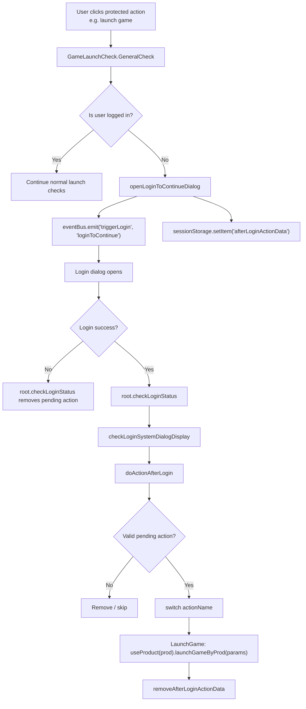
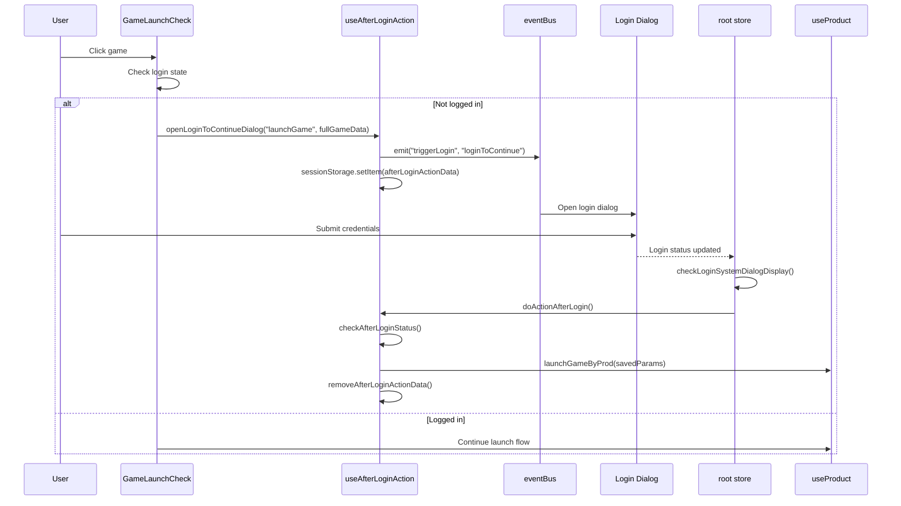
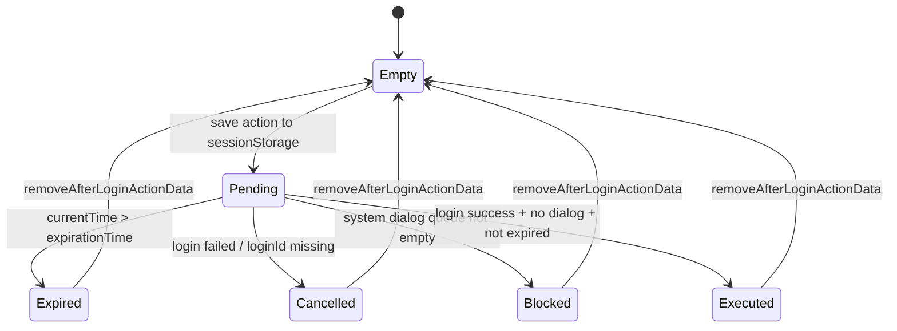
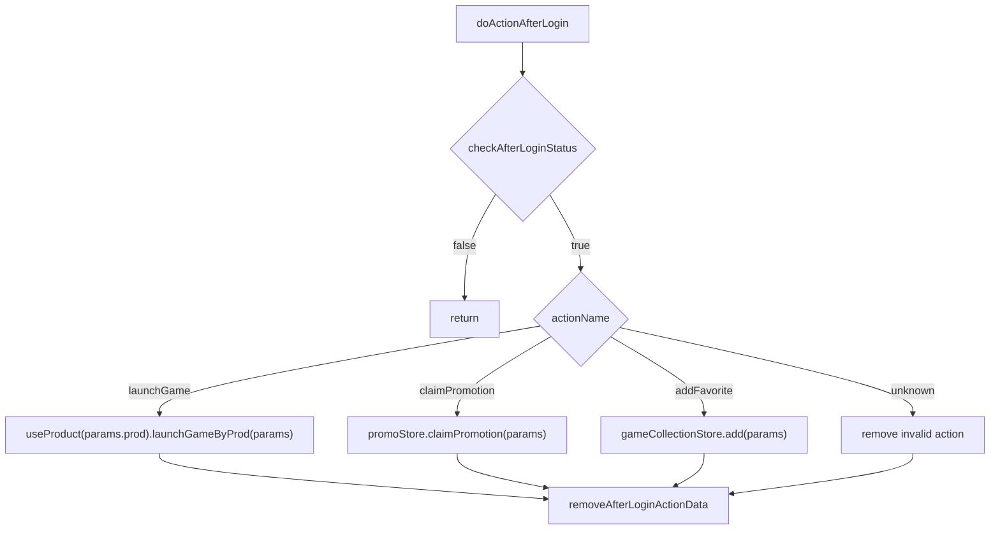

## 前言

很多產品流程都有這種情境：

1. 使用者還沒登入
2. 使用者點了一個需要登入的操作
3. 系統要求登入
4. 登入成功後，使用者期待「剛剛那個動作」繼續執行

例如：

- 未登入時點遊戲，登入後直接啟動該遊戲
- 未登入時點促銷 CTA，登入後回到該促銷
- 未登入時點收藏，登入後完成收藏

如果沒有統一設計，常見做法會變成每個頁面自己處理：

```ts
if (!isLogin) {
  openLoginDialog();
  // TODO: login 後要回來做什麼？
}
```

這很快會失控。

這個專案用 `useAfterLoginAction` 把「登入後恢復動作」封裝成 composable，目前主要應用在 game launch。

## 相關檔案

```text
client/packages/common/composables/useAfterLoginAction.ts
client/packages/common/utils/gameLaunchCheck.ts
client/packages/common/stores/root.ts
client/packages/common/composables/useProduct.ts
```

## 核心概念

After Login Action 的核心是：

```text
Before Login
    |
    v
Save intended action to sessionStorage
    |
    v
Open login dialog
    |
    v
Login success
    |
    v
Root store checks login status
    |
    v
Replay saved action
```

這讓原本中斷的使用者行為可以在登入後接續。

## Action Name 設計

目前 composable 裡定義：

```ts
enum ActionNameEnum {
  LaunchGame = 'launchGame',
}
```

現在只有 `LaunchGame`，但這個 enum 預留了擴充空間。

未來如果要支援其他行為，可以加入：

```ts
enum ActionNameEnum {
  LaunchGame = 'launchGame',
  ClaimPromotion = 'claimPromotion',
  AddFavorite = 'addFavorite',
}
```

重點是 action name 不應該散落成 magic string，而是集中在 composable。

## 保存動作：openLoginToContinueDialog

使用者未登入時，呼叫：

```ts
function openLoginToContinueDialog(actionName, data) {
  if (isLogin) {
    return;
  }

  eventBus.emit('triggerLogin', 'loginToContinue');

  const expirationTime = new Date().getTime() + 5 * 60 * 1000;
  sessionStorage.setItem(
    'afterLoginActionData',
    JSON.stringify({ actionName, data, expirationTime }),
  );
}
```

這裡做了三件事：

1. 如果已登入，直接 return
2. 用 event bus 開啟 login dialog
3. 把 action payload 存到 `sessionStorage`

存起來的資料長這樣：

```json
{
  "actionName": "launchGame",
  "data": {
    "prod": "casino",
    "launchKey": "xxx"
  },
  "expirationTime": 1716000000000
}
```

## 為什麼用 sessionStorage

這裡選 `sessionStorage`，不是 `localStorage`。

理由很清楚：

- after-login action 只屬於目前這個 tab
- 使用者關掉 tab 後不應該保留
- 不應跨 tab 共享，避免 A tab 點遊戲，B tab 登入後啟動錯誤遊戲
- 比 memory state 更能承受 login dialog / route change 造成的 component unmount

這是介於 memory state 與 long-lived storage 之間剛好的選擇。

## 5 分鐘過期時間

```ts
const expirationTime = new Date().getTime() + 5 * 60 * 1000;
```

這個 timeout 很重要。

如果沒有過期時間，使用者可能：

1. 點遊戲
2. 打開 login dialog
3. 放著不登入
4. 幾十分鐘後登入
5. 系統突然啟動很久以前點過的遊戲

這會讓使用者很困惑。

5 分鐘代表：這是一個短期 intent，不是永久任務。

## 讀取資料：computed + sessionStorage

```ts
const afterLoginActionData = computed(() => {
  const afterLoginActionStorage = sessionStorage.getItem('afterLoginActionData');
  return afterLoginActionStorage ? JSON.parse(afterLoginActionStorage) : null;
});
```

這裡每次讀取 computed 都會從 `sessionStorage` parse 最新資料。

因為 action 可能在不同 component / store 裡被寫入，直接從 storage 讀可以避免 composable instance 之間狀態不同步。

## 清除資料

```ts
function removeAfterLoginActionData() {
  sessionStorage.removeItem('afterLoginActionData');
}
```

並且在 component unmount 時清掉：

```ts
onBeforeUnmount(() => {
  removeAfterLoginActionData();
});
```

這代表這個 composable 的生命週期偏保守：如果所在頁面被銷毀，就不保留 pending action。

LoginForm 也會使用它：

```ts
// if not login, remove afterLoginActionData in sessionStorage
useAfterLoginAction();
```

這確保 login form mount/unmount 時會帶到清理邏輯。

## 檢查是否可以執行

```ts
function checkAfterLoginStatus() {
  if (!afterLoginActionData.value) {
    return false;
  }

  const currentTime = new Date().getTime();
  if (!isLogin || dialogQueue.length || currentTime > afterLoginActionData.value.expirationTime) {
    removeAfterLoginActionData();
    return false;
  }

  return true;
}
```

這裡有三個 gate：

### 1. 必須已登入

```ts
!isLogin
```

登入沒完成就不能 replay。

### 2. 系統 Dialog Queue 必須為空

```ts
dialogQueue.length
```

如果登入後還有 Change Password、Terms、Verify Email 這些 system dialog，不能立刻啟動遊戲。

這個細節非常重要。

登入成功不代表使用者已經可以自由操作，系統級流程要先完成。

### 3. 不能過期

```ts
currentTime > afterLoginActionData.value.expirationTime
```

過期就移除，避免舊 intent 被執行。

## 執行動作：doActionAfterLogin

```ts
function doActionAfterLogin() {
  if (!checkAfterLoginStatus()) {
    return;
  }

  switch (afterLoginActionData.value.actionName) {
    case ActionNameEnum.LaunchGame: {
      const params = afterLoginActionData.value.data;
      const { launchGameByProd } = useProduct(params.prod);

      launchGameByProd(params);
      removeAfterLoginActionData();
      break;
    }
  }
}
```

目前唯一實作的是 `LaunchGame`：

1. 取出保存的 params
2. 根據 `params.prod` 建立 `useProduct`
3. 呼叫 `launchGameByProd(params)`
4. 清除 storage

這裡的清除時機也很重要：**成功進入 action 分支後就清掉**，避免使用者重整或 login status 再檢查時重複啟動。

## 與 GameLaunchCheck 的整合

在 `gameLaunchCheck.ts` 中，遊戲啟動前會檢查登入狀態：

```ts
if (!store.uv.sessionD.login) {
  const { fullGameData } = this.options;
  openLoginToContinueDialog(ActionNameEnum.LaunchGame, fullGameData);
}
```

完整行為是：

```text
User clicks game
    |
    v
GameLaunchCheck.GeneralCheck
    |
    +-- not login
          |
          v
        save fullGameData to sessionStorage
          |
          v
        eventBus.emit('triggerLogin', 'loginToContinue')
```

登入後，`root.ts` 會呼叫：

```ts
async checkLoginStatus() {
  const { doActionAfterLogin, removeAfterLoginActionData } = useAfterLoginAction();

  if (!this.uv.sessionD.loginId) {
    removeAfterLoginActionData();
    return;
  }

  if (!param) {
    await this.checkLoginSystemDialogDisplay();
    doActionAfterLogin();
    return;
  }
}
```

這裡的順序是：

1. 如果沒有 loginId，清掉 pending action
2. 如果沒有 `_a` error param
3. 先檢查登入後系統 dialog
4. 再執行 after-login action

這個順序避免「登入後需要改密碼，但遊戲先啟動」的問題。

## 為什麼透過 root store 執行

`doActionAfterLogin` 註解寫得很直接：

```ts
// doActionAfterLoginGlobally, only usage in roots store
```

原因是 after-login action 屬於全局流程，不應綁死在某個頁面：

- Login dialog 可能從任何頁面打開
- 登入成功後可能 route 沒變，也可能 route 已變
- 系統 dialog 狀態在 root / global store 才看得到
- game launch 需要 global user variables

所以把 replay 放在 root store 比放在原本點擊的 component 更穩。

## Event Bus 開 Login Dialog

```ts
eventBus.emit('triggerLogin', 'loginToContinue');
```

這表示 `useAfterLoginAction` 不直接 import LoginDialog，也不直接改 login store 的 UI state。

它只發出事件：

```text
I need login to continue
```

由外層 UI 決定如何顯示 login dialog。

這種做法讓 composable 保持在「流程層」，避免和具體 UI component 耦合。

## 擴充其他 Action 的方式

目前註解中保留了一個 page-level API：

```ts
// function doActionAfterLoginOnPage(
//   actionName: string,
//   action?: (data: any) => void,
//   params?: any,
// )
```

如果未來要擴充，例如 claim promotion，可以走兩種設計。

### 方案一：全局 action

適合任何頁面都能觸發的動作：

```ts
enum ActionNameEnum {
  LaunchGame = 'launchGame',
  ClaimPromotion = 'claimPromotion',
}
```

在 `doActionAfterLogin` 加 case：

```ts
case ActionNameEnum.ClaimPromotion:
  claimPromotion(afterLoginActionData.value.data);
  removeAfterLoginActionData();
  break;
```

### 方案二：頁面 action

適合只有特定頁面知道怎麼執行的動作：

```ts
doActionAfterLoginOnPage('claimPromotion', claimPromo, params);
```

不過這種方式要小心 route change 後 component 是否還存在。

## 邊界情境

### 使用者打開 login dialog 後取消

資料會暫時留在 `sessionStorage`，但 5 分鐘後過期。

如果 LoginForm unmount，也會清除。

### 使用者登入失敗

`root.checkLoginStatus` 如果沒有 `loginId`：

```ts
removeAfterLoginActionData();
return;
```

不會 replay。

### 登入後有系統 Dialog

```ts
dialogQueue.length
```

如果有 dialog，action 會被清掉並不執行。

這是保守策略：避免在尚未完成必要登入後流程時啟動遊戲。

### 使用者跨 tab 登入

因為使用 `sessionStorage`，pending action 不會跨 tab 共享。

這是正確行為。A tab 的「點遊戲」不應該讓 B tab 登入後啟動遊戲。

## 可以優化的地方

目前 `openLoginToContinueDialog` 裡使用：

```ts
const { isLogin } = rootStore;
const { dialogQueue } = systemDialogQueueStore;
```

這是在 composable 初始化時解構出來的值。如果 store state 後續更新，這種解構在某些情境下可能不是 reactive ref。

更穩的寫法可以用 `storeToRefs` 或直接讀 store：

```ts
if (rootStore.isLogin) {
  return;
}
```

以及：

```ts
if (!rootStore.isLogin || systemDialogQueueStore.dialogQueue.length || expired) {
  ...
}
```

不過目前實際主要由 root store 在登入狀態更新後呼叫，所以未必會立即出問題。若未來 after-login action 擴充到更多頁面，這點值得整理。

## 完整流程圖



這個流程最重要的是兩個檢查點：

- 未登入時只保存 intent，不直接執行 action
- 登入後也不是馬上執行，而是先確認系統 Dialog、登入狀態、過期時間

## Sequence Diagram：從點遊戲到登入後啟動



這張圖可以放在文章中段，幫讀者理解為什麼 replay action 不放在原本的 component，而是放在 root store。

## State Machine：Pending Action 的生命週期



這個 state machine 補上了文章前面比較隱性的設計：pending action 不是一直存在，它只有很短的生命週期。

## afterLoginActionData Schema

目前 storage 裡的資料可以視為這個 schema：

```ts
interface AfterLoginActionData<T = unknown> {
  actionName: ActionNameEnum;
  data: T;
  expirationTime: number;
}

interface LaunchGameActionData {
  prod: string;
  launchKey?: string;
  fullGameData?: unknown;
  [key: string]: unknown;
}
```

實際保存：

```ts
sessionStorage.setItem(
  'afterLoginActionData',
  JSON.stringify({ actionName, data, expirationTime }),
);
```

如果未來 action 變多，建議讓不同 action 對應不同 payload 型別：

```ts
type AfterLoginActionPayloadMap = {
  launchGame: LaunchGameActionData;
  claimPromotion: ClaimPromotionActionData;
  addFavorite: AddFavoriteActionData;
};
```

這樣 `doActionAfterLogin` 裡的 switch case 可以更安全。

## 為什麼要等 System Dialog Queue

登入成功後不代表使用者可以馬上回到原本動作。系統可能還需要顯示：

- Change Password
- Terms and Conditions
- Verify Email
- Idle Logout recovery
- Welcome dialog

因此 `checkAfterLoginStatus` 檢查：

```ts
if (!isLogin || dialogQueue.length || currentTime > afterLoginActionData.value.expirationTime) {
  removeAfterLoginActionData();
  return false;
}
```

這個設計是保守的：只要有 system dialog，就清掉 pending action。

另一種策略是保留 pending action，等 dialog 全部結束後再 replay。但那會讓流程更複雜，因為要監聽 queue 變化，也要避免使用者在 dialog 中改變狀態。以遊戲啟動這種高風險動作來說，直接清掉是比較穩的選擇。

## 和 Route Redirect 的差異

很多人會用 URL query 做 after-login redirect：

```text
/login?redirect=/casino/game/abc
```

但這個專案使用 storage action，而不是單純 redirect URL，原因是「啟動遊戲」不一定等於導頁。

啟動遊戲可能包含：

- product launch check
- responsible gambling check
- partner launch key
- window.open / iframe / native launch
- event tracking
- maintenance dialog

所以保存的是 action payload，而不是 URL。

```json
{
  "actionName": "launchGame",
  "data": {
    "prod": "casino",
    "launchKey": "gameName",
    "fullGameData": {}
  }
}
```

這就是 deferred action 和 redirect URL 最大的差異。

## Error Handling 與資料安全

目前 computed 直接 parse：

```ts
return afterLoginActionStorage ? JSON.parse(afterLoginActionStorage) : null;
```

如果 storage 被手動改壞，`JSON.parse` 可能 throw。未來可補強成：

```ts
const afterLoginActionData = computed(() => {
  const raw = sessionStorage.getItem('afterLoginActionData');
  if (!raw) return null;

  try {
    return JSON.parse(raw);
  } catch {
    removeAfterLoginActionData();
    return null;
  }
});
```

這不是目前必要 bug，但如果要把 after-login action 擴大成通用機制，這種保護會更穩。

## 擴充流程圖：多 Action Dispatch



目前只有 `launchGame`，但這張圖可以說明未來怎麼擴充，而不會讓 login flow 被各頁面各自發明。

## 小結

After Login Action 的本質是保存使用者 intent：

```text
User intent
    -> temporary storage
    -> login
    -> validate state
    -> replay
```

這套設計值得借鑑的地方：

- 用 `sessionStorage` 保存 tab-scoped intent
- 用 expiration time 避免舊動作被意外執行
- 用 Event Bus 打開 login dialog，避免 composable 綁 UI
- 登入後由 root store 全局 replay
- replay 前檢查 login state、system dialog queue、expiration
- 目前先支援 LaunchGame，保留後續 action 擴充點

好的 after-login flow 會讓使用者覺得「登入只是流程的一部分」，而不是「我剛剛想做的事情被打斷了」。
