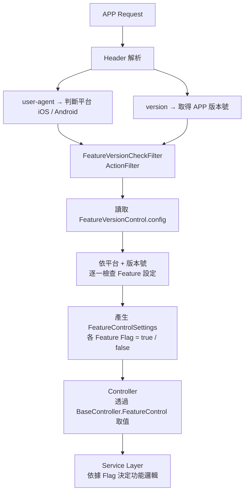
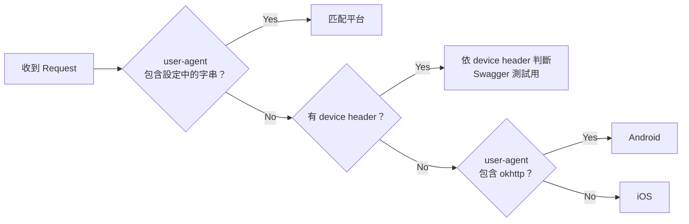
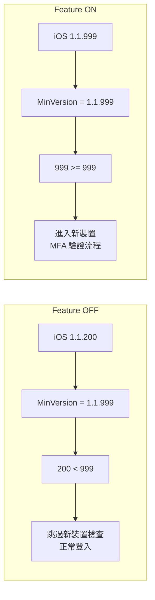
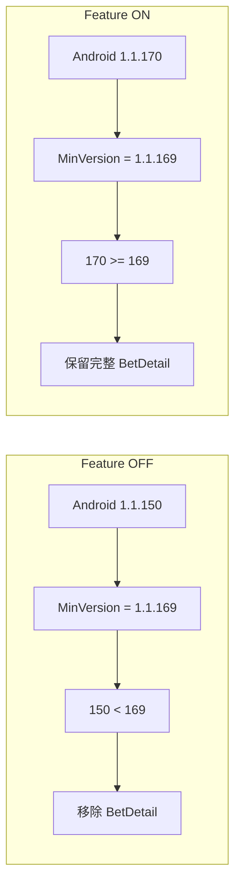
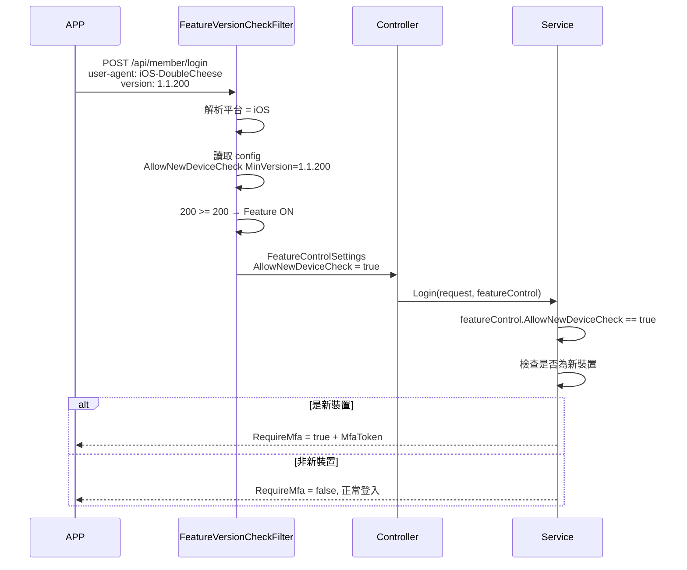

## 前言

Mobile APP 與 Web 不同，使用者不一定會即時更新到最新版本。當後端上線新功能時，舊版 APP 可能尚未支援該功能的 UI 或邏輯。若後端直接回傳新功能相關的資料，可能導致：

- 舊版 APP 出現不預期的 UI 或行為
- 新功能的回應格式在舊版 APP 上解析失敗
- 部分功能僅限特定版本以上使用（例如安全性相關的新裝置驗證）

因此，我們設計了 **Feature Version Control** 機制，讓後端根據 APP 傳入的版本號，動態決定哪些功能要啟用、哪些要關閉。

<!-- more -->

## 整體架構



## 裝置平台判斷

APP 透過 HTTP Header 中的 `user-agent` 傳遞裝置資訊，後端透過 XML 設定檔中的 `AppDeviceSettings` 比對：

```xml
<AppDeviceSettings>
    <AppDevice Name="Android" UserAgent="Android-BigMac" />
    <AppDevice Name="iOS"     UserAgent="iOS-DoubleCheese" />
    <AppDevice Name="iOS"     UserAgent="iOS-188Asia" />
</AppDeviceSettings>
```

### 判斷優先順序



1. **User-Agent 比對**：檢查 `user-agent` header 是否包含設定中的 `UserAgent` 字串（不分大小寫）
2. **Header `device` 比對**：若 user-agent 無法匹配，檢查是否有 `device` header（Swagger 測試用）
3. **預設判斷**：user-agent 包含 `okhttp` 視為 Android，否則視為 iOS

## 版本號傳遞與比對

### 版本號格式

APP 版本號格式為 `{major}.{minor}.{patch}`，例如 `1.1.169`。每次 API 請求透過 HTTP Header `version` 傳入：

```
GET /api/member/login
Headers:
  user-agent: iOS-DoubleCheese/1.1.169
  version: 1.1.169
```

### 版本比對規則

系統**僅比對版本號的最後一碼（patch）**來判斷功能是否啟用：

- `1.1.169` → 取 `169`
- `*.*.*` → 視為無限制（回傳 `-1`，代表不設上/下限）

比對公式：`minVersion <= currentVersion <= maxVersion`

### Feature 設定範例

```xml
<FeatureVersionSettings>
    <!-- 版本號 >= 999 才啟用（等同暫時關閉） -->
    <FeatureVersion Name="AllowNewDeviceCheck"
                    AndroidMinVersion="1.1.999"  AndroidMaxVersion="*.*.*"
                    iOSMinVersion="1.1.999"      iOSMaxVersion="*.*.*" />

    <!-- 版本號 >= 169 即啟用 -->
    <FeatureVersion Name="AllowStatementBetDetailForNewPartner"
                    AndroidMinVersion="1.1.169"  AndroidMaxVersion="*.*.*"
                    iOSMinVersion="1.1.169"      iOSMaxVersion="*.*.*" />
</FeatureVersionSettings>
```

| 設定值 | 說明 |
|--------|------|
| `MinVersion="1.1.169"` | patch >= 169 的版本才啟用 |
| `MinVersion="1.1.999"` | 暫時關閉（目前沒有 APP 版本到 999） |
| `MaxVersion="*.*.*"` | 不設上限，所有版本都允許 |

## 核心元件說明

### FeatureVersionControl.config

XML 設定檔，存放於 `Config/FeatureVersionControl.config`，定義：

- **AppDeviceSettings**：裝置平台與 user-agent 的對應關係
- **FeatureVersionSettings**：每個 Feature 在各平台的版本範圍

### FeatureVersionCheckFilter

路徑：`ActionFilter/FeatureVersionCheckFilter.cs`

ASP.NET Web API 的 `ActionFilterAttribute`，在 Controller Action 執行前：

1. 從 Header 取得裝置平台與版本號
2. 遍歷所有 Feature 設定，計算每個 Feature 是否啟用
3. 將結果存入 `Request.Properties["FeatureControlSettings"]`

使用方式：在 Controller Action 上加上 `[FeatureVersionCheckFilter]` Attribute。

```csharp
[FeatureVersionCheckFilter]
public async Task<ResponseMessage<LoginResponse>> Login(RequestMessage<LoginRequest> request)
{
    var loginRtn = await AccountService.Login(request.Body, uniqueId, version, FeatureControl);
}
```

### FeatureControlSettings

路徑：`Models/SystemSetting/FeatureControlSettings.cs`

強型別的 Feature Flag 容器，每個屬性對應一個功能開關：

```csharp
public class FeatureControlSettings
{
    public bool AllowPromotionOptOutStatus { get; set; } = false;
    public bool AllowStatementBetDetailForNewPartner { get; set; } = false;
    public bool AllowNewDeviceCheck { get; set; } = false;
}
```

### BaseController Helper

在 `PublicController` 和 `PrivateController` 中提供 `FeatureControl` property，各 Controller 無需重複取值：

```csharp
protected FeatureControlSettings FeatureControl =>
    Request.Properties.TryGetValue("FeatureControlSettings", out var obj)
        ? obj as FeatureControlSettings ?? new FeatureControlSettings()
        : new FeatureControlSettings();
```

## 新增 Feature Flag 步驟

當需要新增一個依版本控管的功能時，依序修改以下檔案：

### Step 1：FeatureVersionControl.config

在 `<FeatureVersionSettings>` 中新增設定：

```xml
<FeatureVersion Name="AllowMyNewFeature"
                AndroidMinVersion="1.1.200"  AndroidMaxVersion="*.*.*"
                iOSMinVersion="1.1.200"      iOSMaxVersion="*.*.*" />
```

### Step 2：FeatureControlSettings.cs

新增對應的 bool 屬性：

```csharp
public bool AllowMyNewFeature { get; set; } = false;
```

### Step 3：FeatureVersionCheckFilter.cs

在 `SetFeatureSetting` 的 switch 中新增 case：

```csharp
case nameof(settings.AllowMyNewFeature):
    settings.AllowMyNewFeature = isEnabled; break;
```

### Step 4：Service 層使用

在需要判斷的 Service 方法中檢查 flag：

```csharp
if (featureControlSettings?.AllowMyNewFeature == true)
{
    // 新功能邏輯
}
```

## 目前已啟用的 Feature Flags

| Feature Name | 說明 | Android Min | iOS Min |
|---|---|---|---|
| AllowPromotionOptOutStatus | 允許優惠退出狀態查詢 | 1.1.999（暫關） | 1.1.999（暫關） |
| AllowStatementBetDetailForNewPartner | 帳單明細支援新合作夥伴 | 1.1.169 | 1.1.169 |
| AllowNewDeviceCheck | 新裝置登入 MFA 驗證 | 1.1.999（暫關） | 1.1.999（暫關） |

## 使用情境範例

### 情境 1：新裝置驗證（AllowNewDeviceCheck）

當 APP 版本 >= 指定版本時，登入流程會額外檢查是否為新裝置。舊版 APP 不支援 MFA WebView 流程，因此透過版本控管確保只有新版 APP 才會觸發。



### 情境 2：帳單明細格式（AllowStatementBetDetailForNewPartner）

新合作夥伴的投注明細格式與舊版不同。舊版 APP 無法正確渲染新格式，因此版本不足時會移除 BetDetail 欄位。



## 完整範例：從 Request 到 Service 的實際流程

以下用「新裝置驗證」功能，完整示範從設定檔、ActionFilter、Controller 到 Service 的串接方式。

### XML 設定

```xml
<!-- Config/FeatureVersionControl.config -->
<FeatureVersionControl>
    <AppDeviceSettings>
        <AppDevice Name="Android" UserAgent="Android-BigMac" />
        <AppDevice Name="iOS"     UserAgent="iOS-DoubleCheese" />
    </AppDeviceSettings>
    <FeatureVersionSettings>
        <FeatureVersion Name="AllowNewDeviceCheck"
                        AndroidMinVersion="1.1.200"  AndroidMaxVersion="*.*.*"
                        iOSMinVersion="1.1.200"      iOSMaxVersion="*.*.*" />
    </FeatureVersionSettings>
</FeatureVersionControl>
```

### ActionFilter 核心邏輯

```csharp
public class FeatureVersionCheckFilter : ActionFilterAttribute
{
    public override void OnActionExecuting(HttpActionContext actionContext)
    {
        var request = actionContext.Request;
        var headers = request.Headers;

        // 1. 取得裝置平台
        var userAgent = headers.UserAgent?.ToString() ?? string.Empty;
        var device = GetDevicePlatform(userAgent, headers);

        // 2. 取得版本號
        var version = headers.TryGetValues("version", out var values)
            ? values.FirstOrDefault() ?? "0.0.0"
            : "0.0.0";

        // 3. 讀取設定並產生 Feature Flags
        var config = AppConfigManager.GetFeatureVersionControl();
        var settings = new FeatureControlSettings();

        foreach (var feature in config.FeatureVersionSettings)
        {
            var minVersion = device == "iOS" ? feature.iOSMinVersion : feature.AndroidMinVersion;
            var maxVersion = device == "iOS" ? feature.iOSMaxVersion : feature.AndroidMaxVersion;

            bool isEnabled = IsVersionInRange(version, minVersion, maxVersion);
            SetFeatureSetting(settings, feature.Name, isEnabled);
        }

        // 4. 存入 Request Properties，供 Controller 取用
        request.Properties["FeatureControlSettings"] = settings;
    }

    private bool IsVersionInRange(string current, string min, string max)
    {
        int currentPatch = GetPatchVersion(current);
        int minPatch = GetPatchVersion(min);
        int maxPatch = GetPatchVersion(max);

        if (minPatch != -1 && currentPatch < minPatch) return false;
        if (maxPatch != -1 && currentPatch > maxPatch) return false;
        return true;
    }

    private int GetPatchVersion(string version)
    {
        if (version == "*.*.*") return -1;
        var parts = version.Split('.');
        return parts.Length >= 3 && int.TryParse(parts[2], out var patch) ? patch : 0;
    }

    private void SetFeatureSetting(FeatureControlSettings settings, string name, bool isEnabled)
    {
        switch (name)
        {
            case nameof(settings.AllowNewDeviceCheck):
                settings.AllowNewDeviceCheck = isEnabled; break;
            case nameof(settings.AllowStatementBetDetailForNewPartner):
                settings.AllowStatementBetDetailForNewPartner = isEnabled; break;
            case nameof(settings.AllowPromotionOptOutStatus):
                settings.AllowPromotionOptOutStatus = isEnabled; break;
        }
    }
}
```

### Controller

```csharp
[FeatureVersionCheckFilter]
public async Task<ResponseMessage<LoginResponse>> Login(RequestMessage<LoginRequest> request)
{
    var loginRtn = await AccountService.Login(
        request.Body,
        uniqueId,
        version,
        FeatureControl  // 從 BaseController 取得 FeatureControlSettings
    );
    return loginRtn;
}
```

### Service 層判斷

```csharp
public async Task<LoginResponse> Login(
    LoginRequest request,
    string uniqueId,
    string version,
    FeatureControlSettings featureControl)
{
    var response = await AuthenticateUser(request);

    // 根據 Feature Flag 決定是否觸發新裝置檢查
    if (featureControl.AllowNewDeviceCheck)
    {
        var isNewDevice = await CheckIsNewDevice(response.AccountId, uniqueId);
        if (isNewDevice)
        {
            response.RequireMfa = true;
            response.MfaToken = await GenerateMfaToken(response.AccountId);
            return response;
        }
    }

    response.RequireMfa = false;
    return response;
}
```

### 請求流程示意


