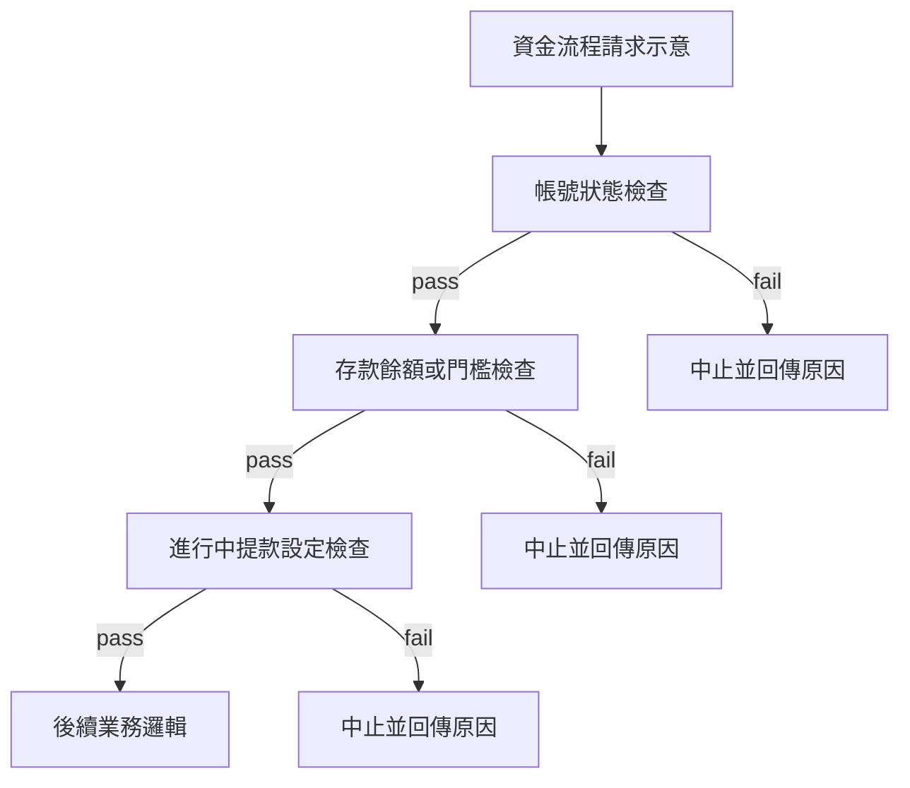
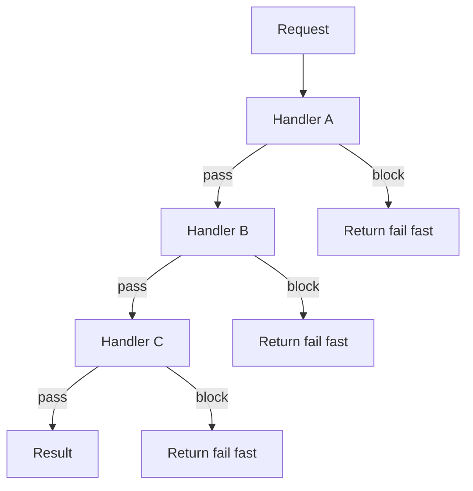
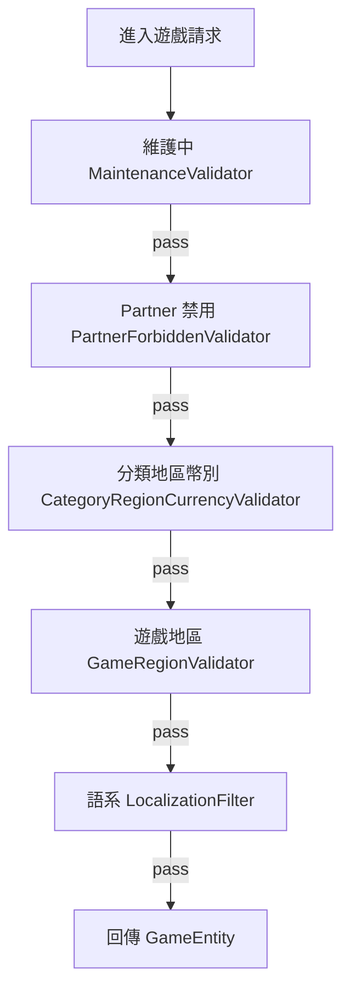
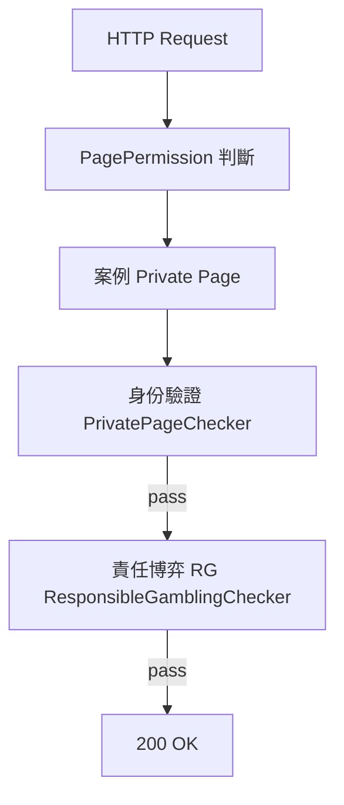
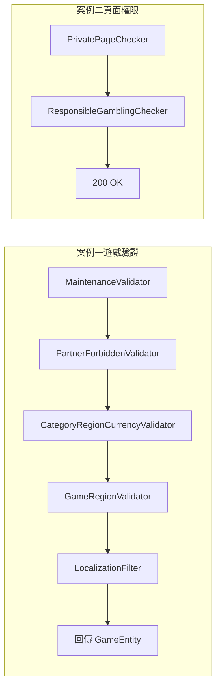

## 什麼是責任鏈模式？

當一個請求需要經過多個獨立的檢查／處理步驟，且每個步驟都可以決定「繼續往下傳」或「在這裡中止」，就是責任鏈（Chain of Responsibility）的使用場景。

### 實務上：一連串檢查，拆開再組合

在後端我們很常把 **同一條業務路徑** 上的條件拆成 **多個彼此獨立的檢查**，而不是寫成一大段 `if/else` 攪在一起。例如提款或資金相關流程可能依序要確認：

- **帳號狀態**（凍結、風控、KYC 等）
- **存款／餘額門檻**（是否達最低可提、餘額是否足夠）
- **是否已有進行中的提款設定**（避免重複提交、與進行中單據衝突）

每一項都是 **不同的業務規則、不同的失敗原因與錯誤訊息**。用責任鏈時，**一個檢查一個 Handler**：職責單一、單元測試好寫、命名也清楚。更重要的是，**同一個 Handler 可以在別的流程再組一條鏈**——例如「帳號狀態檢查」同時出現在提款、轉帳、兌換；**順序與要不要掛某一關，只在組裝鏈的地方決定**，不必複製貼上整段邏輯。

下列為 **示意**（實際類別名與順序依專案而定），重點是 **每一關可獨立抽換、也可在別的情境重用**：



<!-- more -->



## 泛型抽象基底類別

```csharp
// ResponsibleChain.cs
public abstract class ResponsibleChain<TResult, TInput>
{
    public static readonly ISysLog Log =
        SysLog.GetLogger(MethodBase.GetCurrentMethod().DeclaringType);

    protected ResponsibleChain<TResult, TInput> NextFunctionChecker;

    protected ResponsibleChain(ResponsibleChain<TResult, TInput> nextFunctionChecker)
    {
        this.NextFunctionChecker = nextFunctionChecker;
    }

    public abstract TResult ProcessedInNextStep(TInput setting);
}
```

**設計重點：**

- `TResult`：每個 Handler 的回傳型別（`bool` 或 `Tuple<HttpStatusCode, string>`）
- `TInput`：傳遞給每個 Handler 的資料物件
- `NextFunctionChecker`：指向下一個 Handler（null 代表鏈的終點）
- 建構子注入下一個 Handler，在 **compile time** 就組裝好鏈的順序

## 案例一：遊戲可用性驗證（ProductValidatorManager）

### 場景

使用者進入遊戲前，系統需要依序檢查：



### 實作

```csharp
// 每個 Handler 繼承 ResponsibleChain<bool, ProductRelatedData>
private class MaintenanceValidator : ResponsibleChain<bool, ProductRelatedData>
{
    public MaintenanceValidator(ResponsibleChain<bool, ProductRelatedData> next) : base(next) { }

    public override bool ProcessedInNextStep(ProductRelatedData setting)
    {
        // ByPassMaintenance = PreTester 可跳過維護
        if (setting.ByPassMaintenance)
            return NextFunctionChecker?.ProcessedInNextStep(setting) ?? true;

        var maintenanceId = $"{setting.ProductEntity.Id}-{channelId}-{setting.PartnerId}";
        if (AppDataManager.GetMaintenanceModule(maintenanceId).Status != Available)
            return false; // 中止鏈，遊戲維護中

        return NextFunctionChecker?.ProcessedInNextStep(setting) ?? true;
    }
}

private class PartnerForbiddenValidator : ResponsibleChain<bool, ProductRelatedData>
{
    public override bool ProcessedInNextStep(ProductRelatedData setting)
    {
        if (ProductManager.IsPartnerForbidden(
            setting.ProductEntity.Id, setting.PartnerId,
            setting.RegionCode, setting.CurrencyCode,
            setting.ForbiddenProds, setting.ForbiddenPartners))
            return false; // 此 Partner 被該帳號封鎖

        return NextFunctionChecker?.ProcessedInNextStep(setting) ?? true;
    }
}

// ... CategoryRegionCurrencyValidator、GameRegionValidator、LocalizationFilter 類似
```

### 鏈的組裝（使用端）

```csharp
// ProductValidatorManager.GetGameInfo()
var validator =
    new MaintenanceValidator(
        new PartnerForbiddenValidator(
            new CategoryRegionCurrencyValidator(
                new GameRegionValidator(
                    new LocalizationFilter(null)))));  // null = 鏈的終點

if (validator.ProcessedInNextStep(setting))
{
    return setting.GameEntity; // 全部通過
}
return null; // 某一關被擋下
```

## 案例二：頁面權限守衛（PageGuardActionFilter）

### 場景

HTTP 請求進入 API 時，透過 ActionFilter 進行頁面權限檢查：



### 實作

```csharp
// TResult = Tuple<HttpStatusCode, string>
// TInput  = PagePermissionCheck

public class PrivatePageChecker : ResponsibleChain<Tuple<HttpStatusCode, string>, PagePermissionCheck>
{
    public override Tuple<HttpStatusCode, string> ProcessedInNextStep(PagePermissionCheck setting)
    {
        var result = _pageCheckHelper.CheckPrivatePage(setting.Session);
        if (result.Item1 != HttpStatusCode.OK)
            return result; // 401/403，中止鏈

        return NextFunctionChecker != null
            ? NextFunctionChecker.ProcessedInNextStep(setting)
            : new Tuple<HttpStatusCode, string>(HttpStatusCode.OK, "");
    }
}

public class ResponsibleGamblingChecker : ResponsibleChain<Tuple<HttpStatusCode, string>, PagePermissionCheck>
{
    public override Tuple<HttpStatusCode, string> ProcessedInNextStep(PagePermissionCheck setting)
    {
        if (permissionChecker.IsInDisallowPath(
            setting.Session, setting.DisAllowRgStatus,
            setting.DestinationPath, setting.ByPassPathChecker))
            return new Tuple<HttpStatusCode, string>(
                HttpStatusCode.Forbidden, "limit-access");

        return NextFunctionChecker != null
            ? NextFunctionChecker.ProcessedInNextStep(setting)
            : new Tuple<HttpStatusCode, string>(HttpStatusCode.OK, "");
    }
}
```

### 使用端：依頁面類型組裝不同的鏈

```csharp
// PageGuardActionFilter.OnActionExecuting()
switch (permission)
{
    case PagePermission.Private:
        var privateChecker = new PrivatePageChecker(
            new ResponsibleGamblingChecker(null));
        GenerateErrorResponse(actionContext,
            privateChecker.ProcessedInNextStep(check));
        break;

    case PagePermission.Public:
        var publicChecker = new PublicPageChecker(
            new ResponsibleGamblingChecker(null));
        // ...
        break;

    case PagePermission.Product:
        var productChecker = new ProductPageChecker(
            new ResponsibleGamblingChecker(null));
        // ...
        break;
}
```

## 兩個案例的對比



| 面向 | 案例一（遊戲驗證） | 案例二（頁面權限） |
|------|-----------------|-----------------|
| `TResult` | `bool` | `Tuple<HttpStatusCode, string>` |
| `TInput` | `ProductRelatedData` | `PagePermissionCheck` |
| Handler 數量 | 5 個 | 2 個（可動態調整） |
| 觸發時機 | 遊戲啟動前 | HTTP Request ActionFilter |
| 中止條件 | `return false` | `return Tuple(非 200, message)` |

## 模式的優勢

### SOLID 視角

| 原則 | 說明 |
|------|------|
| S | 每個 Handler 只做一件事（維護判斷、地區判斷、RG 判斷…） |
| O | 新增檢查項目只需加一個新 Handler，不修改現有程式 |
| L | 子類（具體 Handler）可替換父類（ResponsibleChain） |
| I | Handler 只依賴自己需要的輸入（ProductRelatedData） |
| D | 依賴抽象（ResponsibleChain），不依賴具體 Handler |

### 新增規則只需插入一個 Handler

```csharp
// 新增「VIP Only 遊戲」的檢查，只需加這個類別
private class VipOnlyValidator : ResponsibleChain<bool, ProductRelatedData>
{
    public override bool ProcessedInNextStep(ProductRelatedData setting)
    {
        if (setting.GameEntity.IsVipOnly && !setting.Trading.IsVip)
            return false;
        return NextFunctionChecker?.ProcessedInNextStep(setting) ?? true;
    }
}

// 插入到鏈的任意位置，不改動其他 Handler
var validator =
    new MaintenanceValidator(
        new VipOnlyValidator(          // ← 新插入
            new PartnerForbiddenValidator(
                new CategoryRegionCurrencyValidator(
                    new GameRegionValidator(
                        new LocalizationFilter(null))))));
```

## 小結

| 傳統 if/else | 責任鏈 |
|--------------|--------|
| 條件全擠在同一方法，難讀難測 | 每個 Handler 獨立、可測試、可替換 |
| 新增規則常要改動舊程式 | 新增規則多半只加類別與調整組鏈 |
| 順序隱藏在分支裡 | 鏈的順序在組裝端一目了然 |

```csharp
// 對照：長鏈組裝在呼叫端一眼能看懂順序
new MaintenanceValidator(
    new PartnerForbiddenValidator(
        new CategoryRegionCurrencyValidator(
            new GameRegionValidator(
                new LocalizationFilter(null)))));
```
