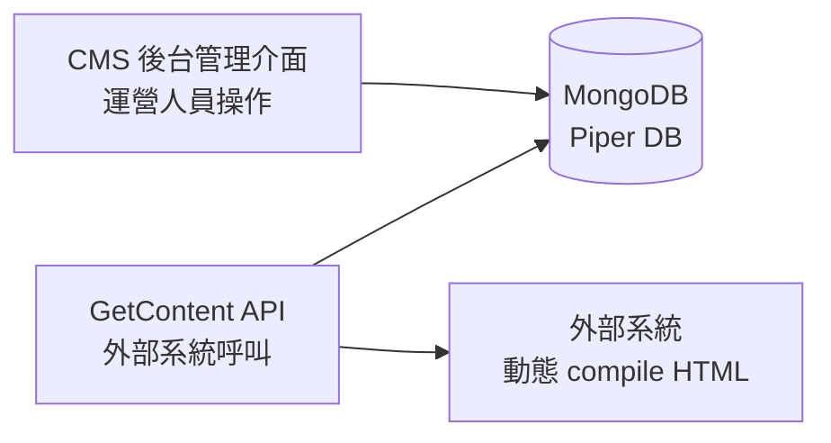
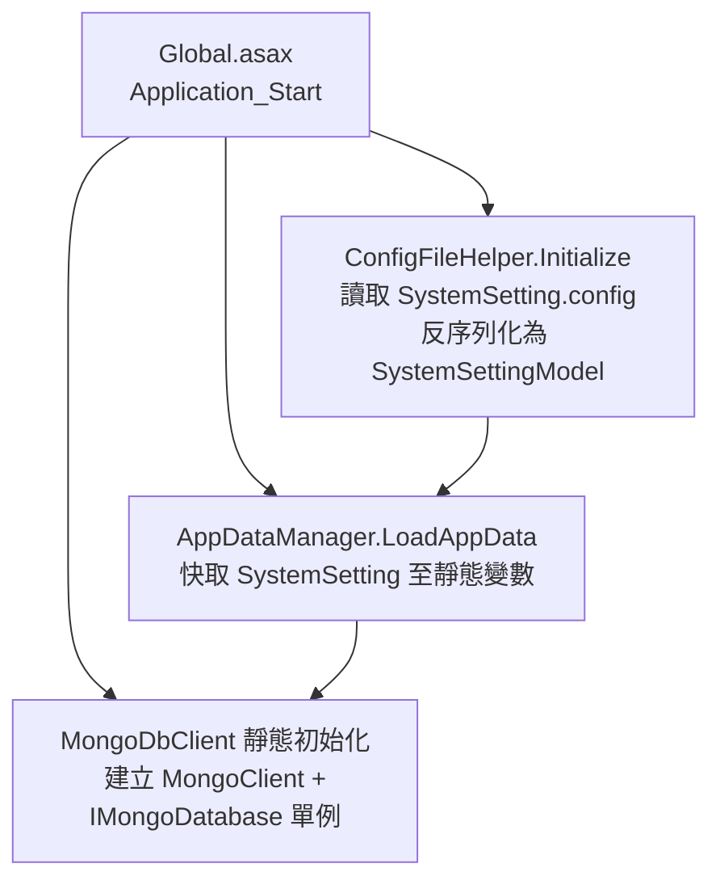
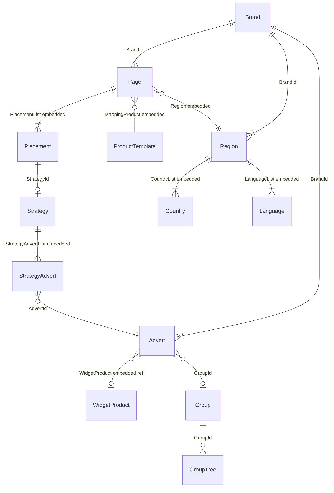
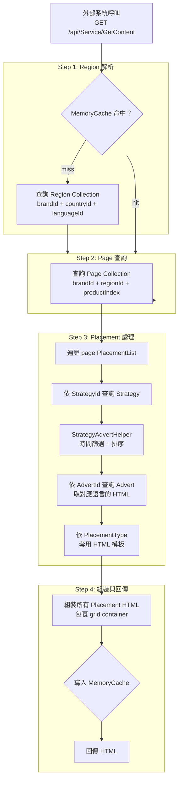
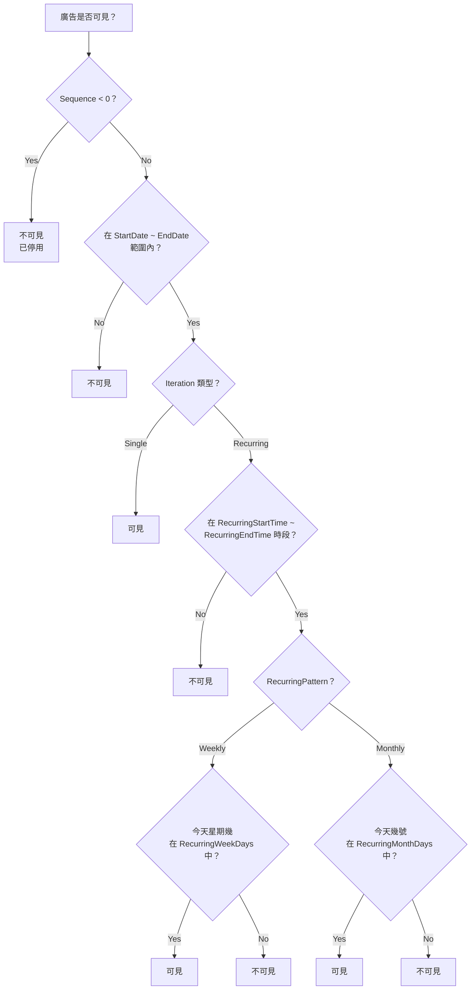
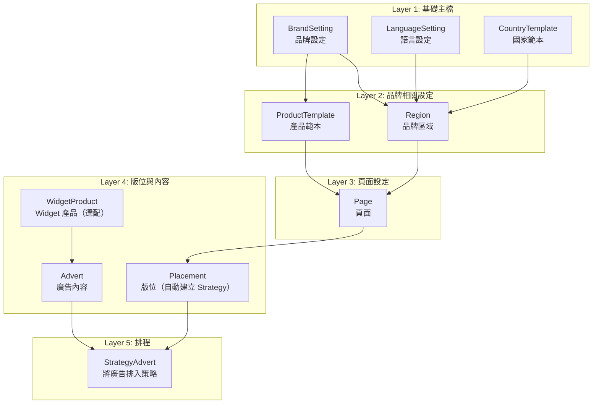

## 前言

在多品牌、多區域、多語系的平台中，首頁的 Banner、Widget、行銷活動區塊都需要能夠由運營人員自行管理，而不是每次改內容都要動到程式碼。市面上有很多成熟的 CMS（WordPress、Strapi 等），但我們的需求比較特殊：

- 內容需要**依區域（Region）和語系（Language）**動態切換
- 版位採用 **CSS Grid（grid-cols-12）** 設計，運營人員可以自行調整 RWD 排版
- 支援**定時排程**，廣告可以設定上下架時間、週期性顯示
- 最終輸出是 HTML 片段，由前端 Vue.js 應用動態 compile 並渲染

因此我們自建了一套簡易 CMS 系統（代號 CMS），本文完整介紹這套系統的架構設計。

<!-- more -->
系統內部設定大概如下 可以設定每一個頁面Display + Layout +HTML





Demo Sample





## 系統概述



系統的核心目標：

- 透過後台管理介面讓運營人員配置品牌頁面的廣告版位（Placement）、內容（Advert）與排程策略（Strategy）
- 透過 `GetContent` API 將配置好的 CMS 內容（多語系 HTML 片段）提供給外部系統
- 外部系統接收 HTML 後，動態 compile 成最終使用者看到的頁面

**技術棧**：

- 後端：ASP.NET MVC 5 + WebApi 2
- 資料庫：MongoDB（Driver 2.9.1）
- 快取：MemoryCache
- 套件：MongoDB.Driver 2.9.1、HtmlAgilityPack、Newtonsoft.Json

## MongoDB 連線設定

### 設定來源

連線資訊儲存在 XML 設定檔，部署時透過變數替換注入實際連線值：

```xml
<SystemSetting>
    <MongoDbSetting>
        <Connection>$(db_mongodb_piper)</Connection>
        <DbName>$(PIPER_MongoDb_DbName)</DbName>
    </MongoDbSetting>
</SystemSetting>
```

### 初始化流程



### MongoDbClient 存取模式

系統使用自訂 `[BsonCollection]` Attribute 搭配靜態 `MongoDbClient.GetCollection<T>()` 方法，透過反射自動取得 Collection 名稱：

```csharp
[BsonCollection("Page")]
public class PageModel { ... }

var collection = MongoDbClient.GetCollection<PageModel>();
```

## Collections 與 Models 對照表

資料庫名稱：**Piper**

| # | Collection | Model | 說明 |
|---|-----------|-------|------|
| 1 | `Page` | `PageModel` | 頁面定義，綁定品牌、區域、產品，內嵌版位清單 |
| 2 | `Advert` | `AdvertModel` | 廣告內容，含多語系 HTML 片段 |
| 3 | `Strategy` | `StrategyModel` | 策略排程，管理廣告的顯示時間與順序 |
| 4 | `Region` | `BrandRegionModel` | 品牌區域定義，含國家與語言清單 |
| 5 | `User` | `UserModel` | 系統使用者 |
| 6 | `Group` | `GroupModel` | 廣告群組（支援巢狀） |
| 7 | `GroupTree` | `GroupTreeModel` | 群組樹狀結構（扁平化儲存） |
| 8 | `BrandSetting` | `BrandModel` | 品牌設定（名稱、CSS、DataFeed） |
| 9 | `LanguageSetting` | `LanguageModel` | 語言設定 |
| 10 | `ProductTemplate` | `ProductTemplate` | 產品範本（對應產品索引） |
| 11 | `CountryTemplate` | `CountryTemplate` | 國家範本 |
| 12 | `WidgetProduct` | `WidgetProductModel` | Widget 產品與可用 Widget 清單 |
| 13 | `RegionTheme` | `RegionThemeModel` | 區域主題樣式設定 |

## 核心資料模型

### PageModel

頁面是系統的核心實體，代表一個特定品牌 + 區域 + 產品的頁面配置。`PlacementList` 直接內嵌於 Page 中。

| 欄位 | 型別 | 說明 |
|------|------|------|
| `Id` | ObjectId | 主鍵 |
| `BrandId` | int | 品牌 ID |
| `Name` | string | 頁面名稱 |
| `MappingProduct` | ProductTemplate（嵌入） | 對應的產品範本 |
| `Region` | BrandRegionModel（嵌入） | 對應的品牌區域 |
| `PlacementList` | List\<PlacementModel\>（嵌入） | 版位清單 |

### PlacementModel（嵌入於 Page）

版位定義了一個廣告區塊的屬性與對應的策略。運營人員可以透過 `gridClass` 和 `Width` 控制版位在 CSS Grid 中的 RWD 排版。

| 欄位 | 型別 | 說明 |
|------|------|------|
| `Id` | ObjectId | 版位 ID |
| `StrategyId` | string | 對應的策略 ID |
| `Name` | string | 版位名稱 |
| `Width` | int | 寬度 |
| `gridClass` | List\<string\> | CSS grid class 列表 |
| `Type` | PlacementType | 版位類型（Carousel、General 等） |

### AdvertModel

廣告是實際的內容載體，儲存多語系的 HTML 片段。

| 欄位 | 型別 | 說明 |
|------|------|------|
| `Id` | ObjectId | 主鍵 |
| `BrandId` | int | 品牌 ID |
| `Name` | string | 廣告名稱 |
| `Active` | bool | 是否啟用 |
| `WidgetContexts` | List\<Dictionary\<string, string\>\> | **多語系 HTML 內容**，key 為語言碼，value 為 HTML |
| `GroupId` | string | 所屬群組 ID |
| `CurrentEdit` | string | 目前編輯者（鎖定用） |
| `EditExpireTime` | string | 編輯鎖定過期時間 |

### StrategyModel / StrategyAdvert

策略管理廣告在版位中的排程與排序。`StrategyAdvert` 嵌入於 Strategy 中。

| 欄位 | 型別 | 說明 |
|------|------|------|
| `Sequence` | int | 排序序號（同序號視為備援） |
| `StartDate` | long | 開始時間（Unix 毫秒） |
| `EndDate` | long | 結束時間（Unix 毫秒） |
| `IsUnlimited` | bool | 是否無限期 |
| `AdvertId` | string | 對應的廣告 ID |
| `Iteration` | int? | 迭代類型：1=Single, 2=Recurring |
| `RecurringPattern` | int? | 週期模式：0=None, 2=Weekly, 3=Monthly |
| `RecurringStartTime` | string | 週期開始時間（HH:mm UTC） |
| `RecurringEndTime` | string | 週期結束時間（HH:mm UTC） |
| `RecurringWeekDays` | int[] | 週期星期幾（0=Sunday ~ 6=Saturday） |
| `RecurringMonthDays` | int[] | 週期每月幾號 |

### 其他模型

- **BrandRegionModel**：品牌區域，內嵌國家清單和語言清單，含預設語言
- **BrandModel**：品牌設定，含預設 CSS 和 DataFeed 清單
- **WidgetProductModel**：Widget 產品，定義可用的 Widget 清單（每個 Widget 有 DirectiveName 供前端 compile）
- **RegionThemeModel**：區域主題樣式，支援排程（StartDate / EndDate）
- **UserModel**：系統使用者，含角色（Admin / PowerUser / User）和可存取的品牌清單
- **GroupModel / GroupTreeModel**：廣告群組管理，支援巢狀結構

## 模型關聯圖



## GetContent API

### 端點

```
GET /api/Service/GetContent
```

### 請求參數

| 參數 | 型別 | 必填 | 說明 |
|------|------|------|------|
| `brandId` | int | 是 | 品牌 ID |
| `productIndex` | int | 是 | 產品索引 |
| `languageId` | int | 是 | 語言 ID |
| `countryId` | int | 是 | 國家 ID |
| `date` | string | 否 | 指定時間（Unix 毫秒），用於預覽排程 |

### 回應格式

```json
{
    "ResultType": "Success",
    "Message": null,
    "Content": "<div class=\"grid grid-cols-12 gap-4\">...HTML 內容...</div>"
}
```

`Content` 欄位包含組裝完成的 HTML 片段，外部系統接收後進行動態 compile（如 Vue directive 解析）。

### 完整資料流



### 資料解析步驟

**Step 1 - Region 解析**：根據 `brandId`、`countryId`、`languageId` 查詢 Region collection，使用 `ElemMatch` 確認 CountryList 和 LanguageList 包含指定值。結果快取 60 秒。

**Step 2 - Page 查詢**：根據 `brandId`、`region.Id`、`productIndex` 查詢 Page。每個頁面唯一對應一個品牌 + 區域 + 產品組合。

**Step 3 - Placement 處理**：遍歷 Page 的 PlacementList，每個 Placement：
1. 依 StrategyId 查詢 Strategy，取得 StrategyAdvertList
2. 透過 `IsAdvertVisible()` 過濾可顯示的廣告
3. 依 Sequence 分組，每組取一個
4. 依 AdvertId 查詢 Advert，從 WidgetContexts 取得對應語言的 HTML
5. 依 PlacementType 套用模板
6. 無可用廣告的 Placement 整個隱藏

**Step 4 - 組裝與回傳**：所有 Placement HTML 串接後包裹在 `<div class="grid grid-cols-12 gap-4">` 中，結果快取 60 秒。

## 策略與排程系統

### 策略廣告可見性判斷

`StrategyAdvertHelper.IsAdvertVisible()` 的判斷邏輯：



### 同序號廣告衝突處理

當多個廣告擁有相同的 `Sequence` 時（備援機制），系統使用 `IComparable<StrategyAdvert>` 排序：

- 有限期廣告優先於無限期廣告
- 同為有限期或無限期時，`StartDate` 較早者優先

### 排程時間格式

所有日期時間均使用 **Unix 毫秒時間戳**。`RecurringStartTime` 和 `RecurringEndTime` 使用 `HH:mm` 格式（UTC 時區）。

## 快取策略

系統使用 `MemoryCache` 進行伺服器端快取：

| 快取鍵格式 | TTL | 說明 |
|-----------|-----|------|
| `s_region_{brandId}_{countryId}_{languageId}` | 60 秒 | Region 查詢結果 |
| `s_page_{pageId}_{languageId}_{timestamp}` | 60 秒 | 組裝完成的 HTML |
| `s_{placementType}_html` | 10 分鐘 | PlacementType HTML 模板 |

快取 timestamp 使用 `yyyyMMddhhmm` 格式，同一分鐘內的重複請求會命中快取。若帶 `date` 參數（預覽模式），timestamp 使用指定的時間。

## PlacementType 與模板對應

### PlacementType 列舉

| 值 | 名稱 | 說明 |
|----|------|------|
| 0 | Carousel | 輪播 |
| 1 | General | 一般版位 |
| 2 | Splash | 全屏廣告 |
| 3 | WinnersList | 得獎名單 |
| 4 | MKTHighlights | 行銷亮點 |
| 5 | TopCarousel | 頂部輪播 |
| 6 | TrendingList | 趨勢列表 |

### 模板檔案

| PlacementType | 模板檔案 | 模板內容 |
|---------------|---------|---------|
| Carousel | `_carousel.html` | `<carousel {{settings}}>{{advertList}}</carousel>` |
| General | `_general.html` | `<div class="{{width}}">{{advertList}}</div>` |
| Splash | `_splash.html` | Teleport + CardCarousel overlay |
| WinnersList | `_winnersList.html` | 自訂模板 |
| MKTHighlights | `_MKTHighlights.html` | 自訂模板 |
| TopCarousel | `_topCarousel.html` | 自訂模板 |
| TrendingList | `_trendingList.html` | 自訂模板 |

### 模板佔位符

| 佔位符 | 說明 |
|--------|------|
| `{{width}}` | Placement 的 `gridClass`（以空格連接） |
| `{{advertList}}` | 所有廣告的 HTML 串接結果 |
| `{{settings}}` | `<settings>` 類型廣告的屬性（用於元件設定） |

**靜態模式**（General、WinnersList）：廣告 HTML 包裹在 `<div>` 中，CSS class 來自 `Advert.gridClass`。其他類型直接輸出。所有廣告 HTML 會被注入 `:cms-advertid` 屬性，供外部系統追蹤。

## 資料建立順序與前置條件

### 資料依賴層次圖



### 各層說明

**Layer 1 - 基礎主檔**：BrandSetting（品牌）、LanguageSetting（語言清單）、CountryTemplate（國家清單），由後台 General Setting 管理。

**Layer 2 - 品牌相關設定**：Region（品牌區域，綁定國家和語言）、ProductTemplate（產品範本，每個產品有唯一的 ProductIndex）。

**Layer 3 - 頁面設定**：Page 綁定一個 Region + Product，系統驗證名稱不重複、組合不重複。

**Layer 4 - 版位與內容**：Placement 新增時系統自動建立空 Strategy。Advert 編輯多語系 HTML，設為 Active。

**Layer 5 - 排程**：將 Advert 排入 Placement 的 Strategy 中，設定排程規則。

### 自動建立行為

- **新增 Placement** 時，自動在 Strategy collection 建立空的 StrategyModel，StrategyId 寫入 Placement
- **刪除 Placement** 時，連帶刪除對應的 Strategy
- **刪除 Page** 時，遍歷所有 Placement 並刪除各自的 Strategy

### 最小可用設定流程

```
1. 確認 BrandSetting 存在
2. 確認 LanguageSetting 有語言資料
3. 確認 CountryTemplate 有國家資料
4. 建立 Region（選擇國家 + 語言）
5. 建立 ProductTemplate（定義產品名稱 + ProductIndex）
6. 建立 Page（選擇 Region + Product）
7. 在 Page 中新增 Placement（系統自動建立 Strategy）
8. 建立 Advert（編輯多語系 HTML，設為 Active）
9. 在 Strategy 中新增 StrategyAdvert（關聯 Advert，設定排程時間）
```

完成後，外部系統即可透過 `GetContent(brandId, productIndex, languageId, countryId)` 取得組裝好的 HTML。

## WebApi 端點一覽

### 公開 API

| 端點 | 方法 | 說明 |
|------|------|------|
| `/api/Service/GetContent` | GET | 取得頁面 HTML 內容 |
| `/api/Service/GetRegionTheme` | GET | 取得區域主題設定 |

### 後台管理 API（需 Session 驗證）

| 控制器 | 路由前綴 | 主要功能 |
|--------|---------|---------|
| PageController | `/api/session/Page/` | 頁面 CRUD、複製、取得可用區域 |
| PlacementController | `/api/session/Placement/` | 版位 CRUD、排序 |
| AdvertController | `/api/session/Advert/` | 廣告 CRUD、排程檢查、編輯鎖定 |
| StrategyController | `/api/session/Strategy/` | 策略廣告 CRUD、排序、移除過期 |
| RegionController | `/api/session/Region/` | 區域 CRUD |
| GroupController | `/api/session/Group/` | 群組 CRUD |
| SettingController | `/api/session/Setting/` | 語言、品牌、產品範本、Widget 設定 |
| RegionThemeController | `/api/session/RegionTheme/` | 區域主題 CRUD |
| UserController | `/api/session/User/` | 使用者 CRUD |

### API 路由規則

```
公開 API：     /api/{controller}/{action}/{id?}
後台管理 API： /api/session/{controller}/{action}/{id?}   （啟用 Session）
```
