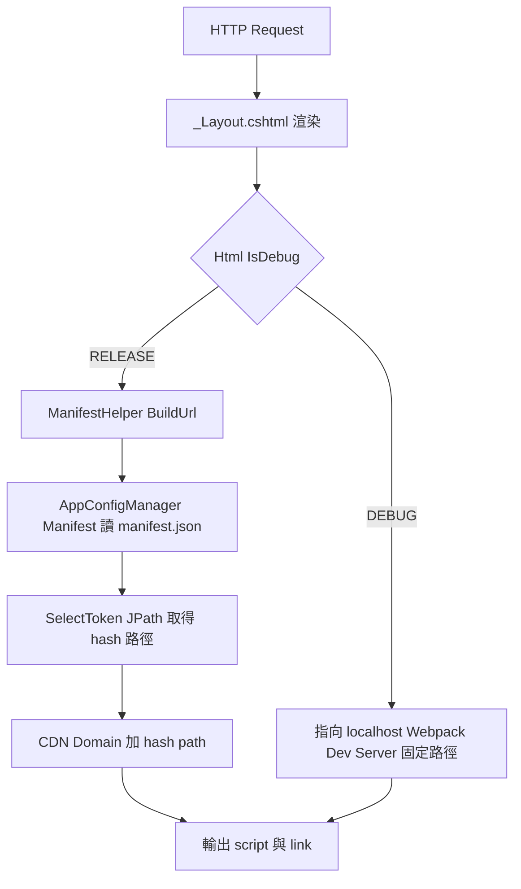
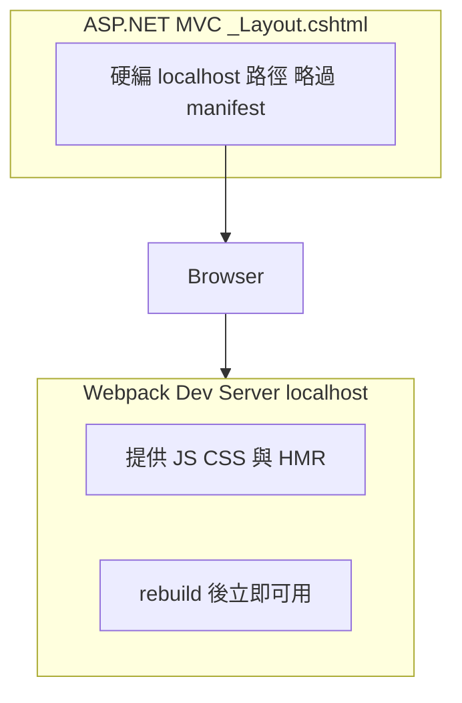
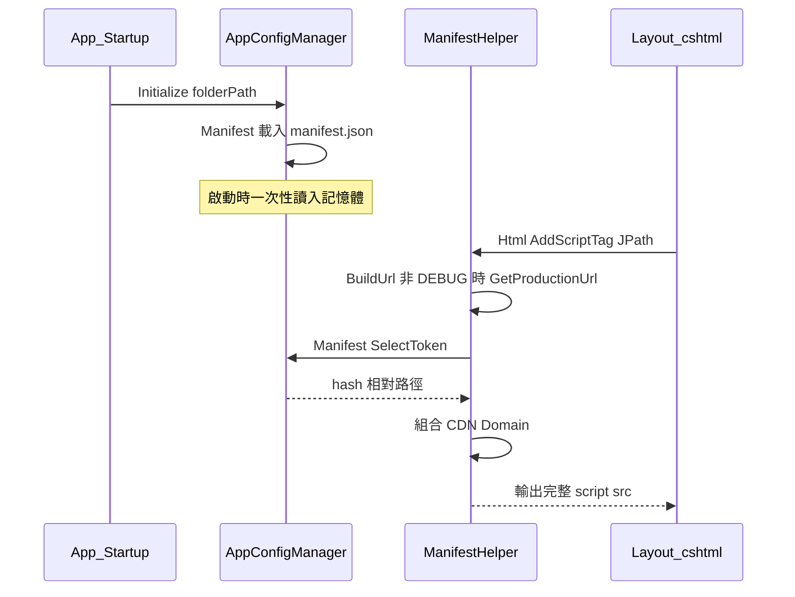

## 背景

正式環境下，前端 JS/CSS 經 Webpack 打包後會帶 **content hash** 檔名；ASP.NET MVC 的 `_Layout.cshtml` 必須依 `manifest.json` 注入正確的 `<script>` / `<link>`。本篇說明在 **Debug** 時如何 **不必重啟後端** 也能對齊 **Webpack 即時編譯** 的輸出。

## 專案型態：前後端未分離的 .NET Framework MVC

我們的專案 **不是**「獨立前端站 + 獨立 API 站」那種典型前後端分離：

- **後端**：**.NET Framework** 上的 **ASP.NET MVC**。頁面骨架仍由 **Razor**（例如 `_Layout.cshtml`）在伺服器端渲染，路由與部分畫面由 MVC 負責。
- **前端互動**：實際的 SPA／模組化 UI 由 **Webpack 打包的 JS、CSS** 在瀏覽器端啟動；**正式環境**這些靜態檔會放到 **CDN**，透過 **hash 檔名** 做快取破壞。
- **Debug 開發**：本機不強制走「部署到 CDN + 重讀 manifest」那條路，而是啟動 **Webpack Dev Server**（或同等 dev 流程），由它 **動態編譯並提供** 最新的 `vendor.js`、`index.js` 等。`_Layout` 在 **Debug 組態**下改把資源 URL 指到 **本機 dev server**，因此 **重新 build / HMR 後只要重新整理頁面**，即可載入新 bundle，**無須為了更新 hash 而去重啟 IIS 或整個 .NET 站台**。

簡單講：**Release**＝後端讀記憶體裡的 `manifest.json`，對應 CDN 上帶 hash 的檔；**Debug**＝後端略過 manifest，改連 **dev server 上「當下編譯出來」的固定路徑**（無 hash 或 dev 產物），讓「改前端 → 立刻看到畫面」。

<!-- more -->

## 為什麼要區分 Debug 與 Production

在 **Production**，`manifest.json` 與 bundle 一併部署，啟動時載入一次即可。若在 **Debug** 仍依賴磁碟／啟動時讀入的 manifest，每次 Webpack rebuild 改 hash，後端若不重啟就會繼續指向 **舊檔名**。因此在 Debug 改為 **硬編本機 dev server URL**，刻意 **不經 manifest**，與「CDN + hash」路徑脫鉤。

## 整體架構流程



## _Layout.cshtml 的條件邏輯

```csharp
@if (Html.IsDebug())
{
    // Debug: 直接指向 Webpack Dev Server，無需 manifest.json
    <script defer src="http://localhost:5100/cdn1121/star4/js/vendor.js"></script>
    <script defer src="http://localhost:5100/cdn1121/star4/js/index.js"></script>
    <link href="http://localhost:5100/cdn1121/star4/css/vendor.css" rel="stylesheet">
    <link href="http://localhost:5100/cdn1121/star4/css/index.css" rel="stylesheet">
}
else
{
    // Production: 透過 manifest.json 查詢帶 hash 的路徑
    @(Html.AddStyleTag("$['entries'].index.initial.css[0]"))
    @(Html.AddScriptTag("$['entries'].index.initial.js[0]", new Dictionary<string, string>() { { "type", "module" } }))
    // ...更多 chunk
}
```

**IsDebug()** 的實作是透過 C# preprocessor directive：

```csharp
// ManifestHelper.cs
public static bool IsDebug(this HtmlHelper htmlHelper)
{
#if DEBUG
    return true;
#else
    return false;
#endif
}
```

這表示它在 **compile time** 就決定，不需要任何 runtime flag。

## Debug 模式：Webpack Dev Server 動態提供



**優點：**

- 前端 rebuild 後，瀏覽器重新整理即可拿到最新版本
- 不需重啟 .NET 後端
- 支援 Webpack HMR（Hot Module Replacement）

**Channel / Port 對應表（ManifestHelper.cs）：**

| Channel ID | Port | 說明 |
|-----------|------|------|
| 1 | 5000 | star4 (RWD) |
| 4 | 5200 | star4webview |

> 注意：`_Layout.cshtml` 中的 port `5100` 來自 Webpack／proxy 設定，實際須依 channel 與本機設定調整。

## Production 模式：manifest.json 的動態解析



### manifest.json 結構範例

```json
{
  "entries": {
    "index": {
      "initial": {
        "js": [
          "/cdn1121/star4/js/vendor.abc123.js",
          "/cdn1121/star4/js/index.def456.js"
        ],
        "css": [
          "/cdn1121/star4/css/index.ghi789.css"
        ]
      }
    }
  },
  "locales": {
    "en-gb": {
      "path": "/cdn1121/star4/js/en-gb.jkl012.js"
    }
  }
}
```

**JPath 查詢範例：**

```csharp
// 查詢 CSS
"$['entries'].index.initial.css[0]"
// → /cdn1121/star4/css/index.ghi789.css

// 查詢 JS chunk
"$['entries'].index.initial.js[0]"
// → /cdn1121/star4/js/vendor.abc123.js

// 查詢語系 chunk
"$['locales']['en-gb'].path"
// → /cdn1121/star4/js/en-gb.jkl012.js
```

## App 啟動時的 manifest 載入

`manifest.json` 在 **Application_Start** 時一次性載入至記憶體：

```csharp
// AppConfigManager.cs
public static void Initialize(string folderPath)
{
    // ... 其他設定檔 ...
    Manifest = JsonSerializerHelpr.ToObj<JObject>(folderPath, "manifest.json");
}
```

**重要含義：**

- `manifest.json` 與前端 bundle **一併部署**
- Production 不需 File Watch，啟動後 manifest 即固定
- 若只更新 bundle 未重啟站台，可能仍指向舊路徑（需 App Pool Recycle）

## 語系 JS 動態注入

`_Layout.cshtml` 還根據 URL segment 動態注入對應語系的 JS chunk：

```csharp
if (Request.Url.Segments.Length > 1 &&
    ManifestHelper.isAvailableLanguage(Request.Url.Segments[1].Replace("/", "")))
{
    @(Html.AddScriptTag(
        "$['locales']['" + Request.Url.Segments[1].Replace("/", "") + "'].path",
        new Dictionary<string, string>() { { "type", "module" } }
    ))
}
```

例如 URL 為 `/en-gb/home`，則注入 `locales['en-gb'].path` 對應的 JS。

## 總結對比

| 面向 | Debug 模式 | Production 模式 |
|------|------------|-----------------|
| JS 來源 | Webpack Dev Server（本機） | CDN（manifest 內 hash 路徑） |
| 版本更新 | Webpack rebuild 後重整即可 | 需部署新 bundle，常需 App Pool Recycle |
| manifest.json | 不使用（略過 hash 對照） | 啟動時載入記憶體 |
| Hash | 通常固定 dev 路徑 | Content hash 快取破壞 |
| HMR | 可支援 | 不適用 |
| Service Worker | 不啟用 | 啟用 |
