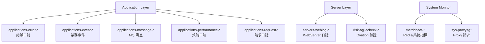

## 前言

本文是團隊內部 ELK（Elasticsearch + Logstash + Kibana）使用分享，涵蓋四大主題：

1. **Index 架構介紹** — 各索引的用途與對應情境
2. **Field 介紹** — Elasticsearch Field Type 與 Common Field 說明
3. **Log Pattern 格式** — 各類型 Log 的解析格式
4. **Case Study** — 實際問題排查流程示範

<!-- more -->

---

## ELK Index 架構

系統中使用的 ELK Index 依功能分為 Application Log、Server Log 與 System Monitor 三大類：

### Application Log

| Index | 說明 |
|-------|------|
| `applications-error-*` | JS 或 Application 層的 Error Log |
| `applications-event-*` | 系統功能、下注等業務事件 Log |
| `applications-message-*` | 打到 Event Bus（RabbitMQ）的訊息 Log，依 Topic 分類 |
| `applications-performance-*` | Application 層效能 Log |
| `applications-request-*` | Application 層 Request Log |
| `applications-statics-*` | 已棄用（原用於收集 LiveChat 來源 SHP 資訊） |
| `applications-debug-*` | Debug 用途，理論上不應長期存放於 ELK |

### Server & Risk Log

| Index | 說明 |
|-------|------|
| `servers-weblog-*` | IIS / Jetty / 其他 WebServer 的存取日誌 |
| `risk-agilecheck-*` | 收集 AgileCheck 呼叫 iOvation 驗證會員合法登入的記錄 |

### System Monitor

| Index | 說明 |
|-------|------|
| `metricbeat-*` | Redis、Disk、Memory、CPU 等系統監控指標 |
| `sys-proxysg*` | 查詢透過 Proxy Server 對外發出的 Request |



### Kibana Index Management



---

## Elasticsearch Field Type 介紹

理解 Field Type 對查詢效能與行為有直接影響：

| Field Type | 說明 |
|-----------|------|
| `text` | 全文搜尋用，**不能**用於 Aggregation，可搜尋片段字元 |
| `keyword` | 精確值搜尋與 Aggregation 用，搜尋**必須完整符合**（預設長度 256） |
| `date` | 時間戳記欄位 |
| `ip` | IP 位址格式 |
| `geo_point` | 地圖用，儲存經緯度 |
| `long` | 整數 |
| `boolean` | 布林值 |
| `float` | 浮點數 |
| `_index` | Document 所屬 Index 名稱（meta field） |
| `_type` | Document 類型（meta field，新版已棄用） |
| `_id` | Document ID（meta field） |
| `_source` | Document 原始 JSON 資料（meta field） |
| `_version` | 版本號，每次更新會遞增（meta field） |

> **重要**：排序（Sort）和聚合（Aggregation）必須使用 `keyword` 欄位；全文搜尋用 `text`。同一個欄位通常會同時有 `field` 和 `field.keyword` 兩種型態。

### Field Mapping 實際畫面



---

## Common Field 各 Log 共用欄位

所有 Index 共享以下基礎欄位，方便跨 Index 交叉查詢：



| 欄位 | 欄位名稱 | 型態 | 說明 |
|------|---------|------|------|
| module | `module` | Custom Field | 服務/站台名稱，例如 `web.star4` |
| tags/category | `tags`/`category` | Custom Field | 功能分類，例如 `frontend`、`integration` |
| processed | `processed` (loggedOrProcessed) | bit | 是否已被處理 |
| logger | `logger` | Custom Field | Logger 類別名稱 |
| category | `category` | Custom Field | 整合分類（payment backoffice 等） |
| host.hostname | `host.hostname` | Custom Field | 主機名稱 |
| host.location | `host.location` | Custom Field | 機房位置 |
| geo.ip | `geo.ip` | Custom Field | 地理位置 IP |
| geo.longitude | `geo.longitude` | geo_float | 經緯度 |

---

## Log Pattern 格式解析

各類型 Log 在寫入 ELK 前都會依照固定的 Pattern 格式化，配合 **log4net** 的通用前綴：

```
%date [%thread] [%level] [%logger]
```



### Application Log Pattern

| Log 類型 | Pattern 格式 |
|---------|-------------|
| **Request Log** | `[REQUEST][Method\|requestUrl][HTTPMethod][clientIP][sessionId][memberCode][refererURL\|MobileAppVersion] Message` |
| **Event Log** | `[EVENT][event][status][subStatus][identity] Message` |
| **Performance Log** | `[Performance][Method][Time]` |
| **Error Log** | `[ERROR] Msg` |
| **Message Log** | `[MESSAGES][guid][worker][topic][queuename][action] Message` |

### Server Log Pattern

| Log 類型 / Server | Pattern 格式 |
|-----------------|-------------|
| **WebLog（IIS）** | `date httpmethod method querystring port sourceuseragent refererurl hostname statuscode substatuscode responsetime` |
| **WebLog（Jetty）** | `clientip - - [date] "httpmethod method protocol" statuscode responsesize "refererurl" "sourceuseragent" - responsetime` |

### Risk Log Pattern

| Log 類型 | Pattern 格式 |
|---------|-------------|
| **AgileCheck** | `[Risk][Brand][Membercode][DeviceId][Result][{"deviceId":"...","reason":"..."}] Message` |
| **Suspect** | `[Risk][Brand][Membercode][IpAddress][Event][Result] Message` |

---

## 效能問題排查

### General Check — 快速定位慢 API

**使用情境**：檢查哪些 API 的回應時間偏高。

查詢索引：
- `applications-performance-*` — Application 內部計時
- `servers-weblog-*` — WebServer 層計時（API 通常以 `/service/` 開頭）



**查詢思路**：
1. 先從 `servers-weblog-*` 找出整體哪個 host / module 請求量最高
2. 搭配 Response Time 排序，找出最慢的前幾支 API
3. 再進入 `applications-performance-*` 做 Drill Down

---

### Specified API Check — 深入分析單一慢 API

當鎖定特定 API 後，透過**雙 Index 對照**找出瓶頸所在：

```
查詢順序：
1. servers-weblog-*    → 確認該 API 在 WebServer 層的 Response Time
2. applications-performance-* → 確認 Application 內部的處理時間
```

若 WebServer 慢但 Application 快 → 瓶頸在**網路 / WebServer 吞吐量**
若 Application 本身就慢 → 瓶頸在**程式邏輯或依賴服務**

**Application Performance Log：**



**WebLog 對照：**



---

## Request Log 查詢

### 主要使用情境

- Mobile App 版本分佈監控
- Internal Request 追蹤（Logger: `HttpWebRequest`）
- 用戶行為稽核（Session、IP、Input Data）

索引：`applications-request-*`

---

### Mobile App 版本監控

在 MobileAppSpi 的 Request Log 中，`refererurl` 欄位記錄了 **device + version** 資訊。

常見用途：
- App 更新後追蹤新版本的覆蓋速度
- 計算仍未更新的會員比例



---

### 會員行為追蹤（Request + Event 交叉查詢）

**查詢索引**：
- `applications-request-*`
- `applications-event-*`

**查詢策略**：以 `sessionId`、`memberCode`、`clientIP` 三個維度交叉比對，必要時加入 IP 縮小範圍。





---

### iOvation 封鎖調查

當會員反映登入異常，可透過以下兩個 Index 交叉確認 iOvation 驗證結果：

**Step 1 — Event Log 確認 Login 事件序列：**

依 `memberCode` 查詢 Event Log 中的 `Login` 事件，確認事件狀態（SUCCESS / FAIL）與 subStatus。

**Step 2 — AgileCheck Log 確認 iOvation 結果：**



| 欄位 | 說明 |
|------|------|
| `membercode` | 會員代號 |
| `result` | `ALLOW` / `DENY` / `BYPASS` |
| `ioResponse.reason` | DENY 原因，例如 `2 Accounts per device in 15 minutes` |
| `geoip.country_name` | 來源國家 |
| `deviceid` | 設備識別碼 |

---

## Error Log 查詢

索引：`applications-error-*`

### 常見 Logger 說明

| Logger | 說明 |
|--------|------|
| `LoggerController` | Client Side 錯誤，或 Client 主動呼叫 Error Log API |
| `Global` | Request 層最底層 Catch 到的 Exception，含路徑 / IP 資訊 |
| `Utility` | 通常是 CDN 檔案缺少或 Parsing 失敗（可能寫入 Warning Log） |
| `AccountStateManager` | 會員 Session 遺失時觸發，將會員 Kick Out |

---

### Case Study：用戶登入後顯示 403 Forbidden

> **UTIM-9867**：用戶回報在某時間點後登入 App 持續出現 403 Forbidden 頁面

**排查步驟**：

先從 Error Log 與 WebLog 確認問題發生時間與錯誤訊息：



從圖中可以看到：
- 錯誤訊息：`unable to open database file`
- 時間集中在特定區間，呈爆量模式
- 透過 Logger 與 Module 可進一步縮小影響範圍

---

## Chatbot Log 查詢

### Chatbot Error Log

索引：`applications-error-*`



透過 `module` 欄位篩選 `webspi.chatbot`，可找出 Chatbot 呼叫下游服務失敗的詳細錯誤訊息與對應 API。

---

### Chatbot Event Log

索引：`applications-event-*`

Chatbot 相關的 Event 類型：

| Event | 說明 |
|-------|------|
| `TokenValidation` | 驗證 Token 合法性 |
| `Greeting` | 歡迎訊息觸發 |
| `FetchData` | 向後端取資料 |
| `FetchDataFromProvider` | 向 Provider 取資料 |
| `HandOffToSF` | 轉接 Salesforce 客服 |



透過 Histogram 可觀察各事件的數量交叉趨勢，例如 `FetchDataFromProvider` 失敗率上升時，`HandOffToSF` 通常也會隨之增加。

---

## Message Log（RabbitMQ）

索引：`applications-message-*`



**查詢重點**：
- 確認某 Topic 是否有被成功觸發
- 確認對應的 Action 是否有被執行

> **注意**：在 QAT RED 環境下，RabbitMQ Queue 可能是共用的，相同 Topic 的訊息有可能被其他環境的 Event SPI 消費，排查時需特別注意。

---

## 系統資源監控（Metricbeat）

### Redis 使用量監控

索引：`metricbeat-*`



| 監控維度 | 說明 |
|---------|------|
| Max Memory | Redis 最大可用記憶體設定 |
| RSS Used | 實際佔用的 OS 記憶體 |
| Max Used | 歷史峰值 |
| Connections | 目前連線數 |
| Limited | 是否觸碰上限 |

---

### 系統資源監控

索引：`metricbeat-*`



可監控指標：
- **CPU 使用率** — 各核心與整體平均
- **Memory 使用率** — 已用 / 可用
- **Disk Space** — 各掛載點容量
- **Network I/O** — Inbound / Outbound Traffic

---

## Proxy Server 查詢

索引：`sys-proxysg*`

**使用情境**：確認系統透過 Proxy Server 對外連線某 Domain 是否成功。

| 欄位 | 說明 |
|------|------|
| `cs_host` | 對外連線的 Domain |
| `c_ip` | 發出請求的 Server IP |



---

## 進階查詢技巧

### Match Phrase 搜尋 Message 欄位中的特定值

當需要在 `messages` 欄位中搜尋含有特殊字元的字串時（例如 JSON 中的 key），使用 `match_phrase` 並正確 Escape：

```json
{
  "query": {
    "match_phrase": {
      "messages": "\"devicetimezone\":\""
    }
  }
}
```

---

### Case Study：iOvation Script 返回 404

> **PIM-26559**：iOvation JS Script 返回 404，影響設備驗證功能

索引：`servers-weblog-*`

**排查思路**：由於 Reverse Proxy 所有對外回應都會先經過 WebServer，即使是 JS 靜態資源也不例外，因此可透過 WebLog 鎖定：
1. 404 錯誤**第一次發生的時間點**
2. 對應的 URL 路徑
3. 受影響的請求量



---

## TimeLion 進階：跨 Index 效能比對

TimeLion 是 Kibana 中的時序分析工具，支援在同一張圖中疊加多個 Index 的指標：

```
.es(
  index="applications-performance*",
  q="module.keyword:web.star4 AND method:getmessageinfounreadcount",
  metric='avg:performancetime'
).label("Application Performance"),

.es(
  index="servers-weblog*",
  q="module.keyword:web.star4 AND method:getmessageinfounreadcount",
  metric='avg:responsetime'
).label("IIS Performance")
```



**解讀方式**：
- 若兩條線**幾乎重疊** → Application 本身就慢，與 WebServer 吞吐量無關
- 若 IIS 線**明顯高於** Application 線 → WebServer 層有排隊或吞吐量瓶頸
- 若出現**尖峰只在 IIS** → 可能是連線數爆量、Keep-Alive 問題等

---

## 查詢情境速查表

| 問題情境 | 建議 Index | 關鍵欄位 |
|---------|-----------|---------|
| API 整體效能異常 | `servers-weblog-*` | `module`、`responsetime` |
| 特定 API 慢 | `applications-performance-*` | `method`、`performancetime` |
| 用戶操作流程追蹤 | `applications-request-*` + `applications-event-*` | `memberCode`、`sessionId`、`clientIP` |
| iOvation 封鎖查詢 | `risk-agilecheck-*` | `membercode`、`result`、`ioResponse.reason` |
| 錯誤根因分析 | `applications-error-*` | `logger`、`module`、`messages` |
| MQ 訊息是否送達 | `applications-message-*` | `topic`、`action`、`queuename` |
| Redis 記憶體用量 | `metricbeat-*` | `redis.info.memory.used.rss` |
| 對外 Proxy 連線 | `sys-proxysg*` | `cs_host`、`c_ip` |

---

## Reference

- [Elasticsearch 基本概念 & 搜尋入門](https://www.elastic.co/guide/en/elasticsearch/reference/current/getting-started.html)
- [Elasticsearch: Text vs. Keyword](https://www.elastic.co/blog/strings-are-dead-long-live-strings)
