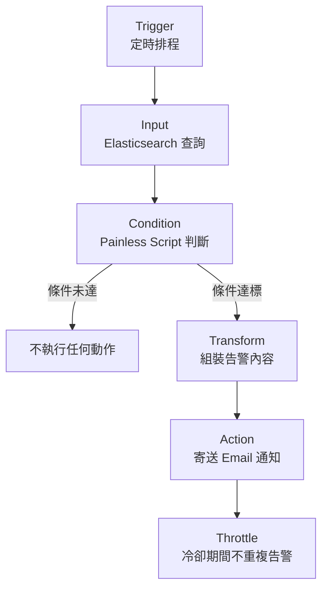
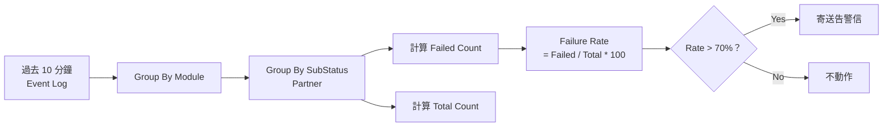
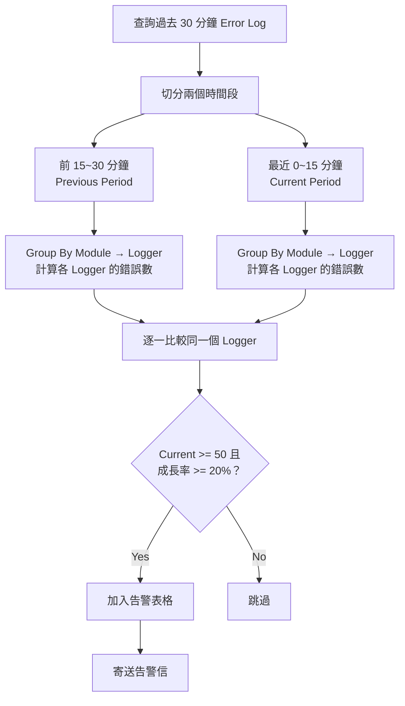

## 前言

在生產環境中，很多問題不會立即被人發現——部署後新版本的 Error Log 悄悄飆升、第三方 Provider 突然故障導致遊戲啟動連續失敗、甚至遭受攻擊產生大量異常請求。如果只靠人工盯 Kibana Dashboard，往往等到使用者回報時已經影響了大量用戶。

本文分享我們實際使用的兩個 **Elasticsearch Watcher** 告警規則，透過定時查詢 + 條件判斷 + 自動寄信，讓團隊在問題擴大前就能收到通知並介入處理。

<!-- more -->

## Log 格式與索引設計

在介紹 Watcher 之前，先說明我們的 Log 結構，這是告警規則能精確命中問題的基礎。

### Event Log（業務事件）

索引：`applications-event*`

格式：`[EVENT][event][status][subStatus][identity] Message`

| 欄位 | 說明 | 範例 |
|------|------|------|
| `category` | 產品類別 | `frontend` |
| `module` | 模組/產品名稱 | `sportsbook`、`casino` |
| `event` | 事件類型 | `TokenAssignment` |
| `status` | 結果狀態 | `SUCCESS`、`FAIL` |
| `substatus` | 子狀態 / Partner | `PartnerA`、`PartnerB` |

### Error Log（錯誤日誌）

索引：`applications-error*`

格式：`[ERROR] Message`

| 欄位 | 說明 | 範例 |
|------|------|------|
| `category` | 產品類別 | `frontend` |
| `module` | 模組名稱 | `sportsbook` |
| `logger` | Logger 類別名稱 | `GameService.LaunchHandler` |

## Watcher 運作原理



每個 Watcher 由五個部分組成：

| 元件 | 功能 |
|------|------|
| **Trigger** | 定時排程（每 N 分鐘執行一次） |
| **Input** | 對 Elasticsearch 發送聚合查詢 |
| **Condition** | 用 Painless Script 判斷是否需要告警 |
| **Transform** | 組裝 Email 內容（HTML 表格） |
| **Action** | 寄送告警信件 |

## Watcher 1：Game Launch 失敗率監控

### 監控目的

偵測特定產品的遊戲啟動是否在短時間內大量失敗。如果某個 Provider 出問題或網路異常，使用者嘗試啟動遊戲會連續失敗，這個 Watcher 能在 10 分鐘內捕捉到異常。

### 觸發條件

| 項目 | 設定 |
|------|------|
| 執行頻率 | 每 10 分鐘 |
| 查詢範圍 | 過去 10 分鐘的 `applications-event*` |
| 篩選條件 | `category=frontend`，`event=TokenAssignment` |
| 分群方式 | 依 `module`（產品）→ `substatus`（Partner）分組 |
| 告警門檻 | 任一組的**失敗率超過 70%** |
| 冷卻時間 | 10 分鐘（避免重複告警） |

### 查詢流程



### Watcher 設定

```json
{
  "trigger": {
    "schedule": {
      "interval": "10m"
    }
  },
  "input": {
    "search": {
      "request": {
        "search_type": "query_then_fetch",
        "indices": ["applications-event*"],
        "rest_total_hits_as_int": true,
        "body": {
          "query": {
            "bool": {
              "filter": [
                { "term": { "category": "frontend" } },
                { "range": { "@timestamp": { "gte": "now-10m" } } },
                { "terms": { "event.keyword": ["TokenAssignment"] } }
              ]
            }
          },
          "size": 0,
          "aggs": {
            "by_module": {
              "terms": { "field": "module.keyword", "size": 10 },
              "aggs": {
                "by_event": {
                  "terms": { "field": "substatus.keyword", "size": 100 },
                  "aggs": {
                    "failed_status": {
                      "filter": { "term": { "status.keyword": "FAIL" } },
                      "aggs": {
                        "failed_count": {
                          "value_count": { "field": "status.keyword" }
                        }
                      }
                    },
                    "total_status": {
                      "value_count": { "field": "status.keyword" }
                    },
                    "failure_rate": {
                      "bucket_script": {
                        "buckets_path": {
                          "failed": "failed_status.failed_count",
                          "total": "total_status"
                        },
                        "script": "if (params.total > 0) { return params.failed / params.total * 100 } else { return 0 }"
                      }
                    }
                  }
                }
              }
            }
          }
        }
      }
    }
  },
  "condition": {
    "script": {
      "source": "return ctx.payload.aggregations.by_module.buckets.stream().flatMap(module -> module.by_event.buckets.stream()).anyMatch(event -> event.failure_rate.value > 70);",
      "lang": "painless"
    }
  },
  "transform": {
    "script": {
      "source": "String emailBody = '<table border=\"1\"><tr><th>Module</th><th>Product Partner</th><th>Failure Rate</th><th>Total Count</th><th>Failed Count</th></tr>'; for (def module : ctx.payload.aggregations.by_module.buckets) { for (def event : module.by_event.buckets) { if ((double)event.failure_rate.value > 50) { emailBody += '<tr><td>' + module.key + '</td><td>' + event.key + '</td><td>' + event.failure_rate.value + '%</td><td>' + event.total_status.value + '</td><td>' + event.failed_status.doc_count + '</td></tr>'; } } } emailBody += '</table>'; return ['email_body': emailBody];",
      "lang": "painless"
    }
  },
  "actions": {
    "send_email": {
      "email": {
        "profile": "standard",
        "to": ["team@example.com"],
        "subject": "[Alert] Game Launch Failed Over 70% - Please Check",
        "body": {
          "html": "{{ctx.payload.email_body}}"
        }
      }
    }
  },
  "throttle_period_in_millis": 600000
}
```

### 聚合邏輯拆解

這個查詢使用了三層巢狀聚合搭配 `bucket_script`：

1. **第一層** — `by_module`：依產品模組分組
2. **第二層** — `by_event`：依 Partner（substatus）分組
3. **第三層** — 同時計算 `failed_count`（FAIL 筆數）和 `total_status`（總筆數）
4. **bucket_script** — 在每個 bucket 內即時算出 `failure_rate = failed / total * 100`

Condition 使用 Java Stream 遍歷所有 bucket，只要任一組的 failure_rate 超過 70% 就觸發告警。

## Watcher 2：Error Log 成長率監控

### 監控目的

偵測部署後或異常情況下，Error Log 是否突然暴增。這個 Watcher 會比較「最近 15 分鐘」和「前 15~30 分鐘」的錯誤數量，如果某個 Logger 的錯誤成長率超過 20% 且數量達到 50 筆以上，就發出告警。

適用場景：

- **部署後** — 新版本引入了 Bug，Error Log 開始飆升
- **被攻擊** — 異常請求導致大量錯誤
- **Provider 故障** — 第三方服務異常導致錯誤集中爆發

### 觸發條件

| 項目 | 設定 |
|------|------|
| 執行頻率 | 每 15 分鐘 |
| 查詢範圍 | 過去 30 分鐘的 `applications-error*` |
| 篩選條件 | `category=frontend`，排除已知噪音 Logger |
| 比較方式 | 將 30 分鐘切為兩段（15~30 min vs 0~15 min），逐 Logger 比較 |
| 告警門檻 | 成長率 >= 20% **且** 最近 15 分鐘的錯誤數 >= 50 |
| 冷卻時間 | 15 分鐘 |

### 比較邏輯



### Watcher 設定

```json
{
  "trigger": {
    "schedule": {
      "interval": "15m"
    }
  },
  "input": {
    "search": {
      "request": {
        "search_type": "query_then_fetch",
        "indices": ["applications-error*"],
        "rest_total_hits_as_int": true,
        "body": {
          "query": {
            "bool": {
              "filter": [
                { "term": { "category": "frontend" } },
                { "range": { "@timestamp": { "gte": "now-30m" } } }
              ],
              "must_not": [
                { "terms": { "logger.keyword": ["Seo.Prerender.SeoHttpModule"] } }
              ]
            }
          },
          "aggs": {
            "intervals": {
              "date_range": {
                "field": "@timestamp",
                "ranges": [
                  { "from": "now-30m/m", "to": "now-15m/m" },
                  { "from": "now-15m/m", "to": "now/m" }
                ]
              },
              "aggs": {
                "by_module": {
                  "terms": { "field": "module.keyword", "size": 10 },
                  "aggs": {
                    "by_logger": {
                      "terms": { "field": "logger.keyword", "size": 100 }
                    }
                  }
                }
              }
            }
          }
        }
      }
    }
  },
  "condition": {
    "script": {
      "source": "boolean alert = false; Map previousSource = new HashMap(); def previousBucket = ctx.payload.aggregations.intervals.buckets[0]; for (def moduleBucket : previousBucket.by_module.buckets) { for (def loggerBucket : moduleBucket.by_logger.buckets) { previousSource.put(moduleBucket.key + '#' + loggerBucket.key, loggerBucket.doc_count); } } def currentBucket = ctx.payload.aggregations.intervals.buckets[1]; for (def moduleBucket : currentBucket.by_module.buckets) { for (def loggerBucket : moduleBucket.by_logger.buckets) { String key = moduleBucket.key + '#' + loggerBucket.key; if (previousSource.containsKey(key)) { double previousCount = previousSource.get(key); double totalCount = previousCount + loggerBucket.doc_count; double preRate = (totalCount > 0) ? (previousCount / totalCount * 100) : 0; double currRate = (totalCount > 0) ? (loggerBucket.doc_count / totalCount * 100) : 0; if(currRate - preRate >= 20 && loggerBucket.doc_count >= 50){ alert = true; } } else if(loggerBucket.doc_count >= 50) { alert = true; } } } return alert;",
      "lang": "painless"
    }
  },
  "actions": {
    "send_email": {
      "email": {
        "profile": "standard",
        "to": ["team@example.com"],
        "subject": "[Alert] Error Rate Growth Over 20% - Last 15 mins vs Previous 15-30 mins",
        "body": {
          "html": "Error Log growth detected. Events in the last 15 mins that increased by more than 20% and occurred over 50 times are listed below. {{ctx.vars.message}}"
        }
      }
    }
  },
  "throttle_period_in_millis": 900000
}
```

### Condition 邏輯拆解

這個 Watcher 的 Condition 做了比較複雜的跨時間段比較：

1. **建立基準**：遍歷前 15~30 分鐘的資料，建立 `Module#Logger → Count` 的 HashMap
2. **逐一比較**：遍歷最近 15 分鐘的每個 Logger，從 HashMap 中找出同一個 Logger 的前期數量
3. **計算佔比**：`currRate = current / (previous + current) * 100`
4. **判斷門檻**：成長率差距 >= 20% **且** 最近 15 分鐘的數量 >= 50 才告警
5. **新出現的 Logger**：如果前期完全沒有出現過但最近 15 分鐘 >= 50 筆，也觸發告警

### 告警信範例

收到的告警信會包含一個 HTML 表格：

| Module | Logger | Previous Count | Current Count | Previous Rate | Current Rate |
|--------|--------|---------------|--------------|--------------|-------------|
| sportsbook | GameService.LaunchHandler | 20 | 85 | 19.05% | 80.95% |
| casino | SlotProvider.TokenService | 15 | 62 | 19.48% | 80.52% |

## 兩個 Watcher 的定位差異

| 面向 | Game Launch 失敗率 | Error Log 成長率 |
|------|-------------------|-----------------|
| 監控對象 | 業務事件（Event Log） | 系統錯誤（Error Log） |
| 偵測方式 | 絕對值 — 失敗率是否超過門檻 | 相對值 — 與前一個時間段比較 |
| 適用場景 | Provider 故障、網路異常 | 部署後 Bug、被攻擊、服務異常 |
| 反應速度 | 10 分鐘內 | 15 分鐘內 |
| 分群維度 | Module → Partner | Module → Logger |

## 結語

Elasticsearch Watcher 的優勢在於查詢和告警邏輯都在 Elasticsearch 內部執行，不需要額外部署監控服務。搭配 Painless Script 的靈活性，可以實作出複雜的聚合比較邏輯——從簡單的失敗率計算到跨時間段的成長率比較。

設計告警規則時的幾個關鍵思考：

- **門檻不要太敏感**：設定最低數量門檻（如 50 筆）避免低流量時的假警報
- **加上 Throttle 冷卻**：避免同一個問題在短時間內連續觸發大量告警信
- **排除已知噪音**：用 `must_not` 過濾掉已知的無害 Logger，減少干擾
- **告警信要有足夠資訊**：附上 Module、Logger、數量和比率，讓收信者能快速判斷嚴重程度
