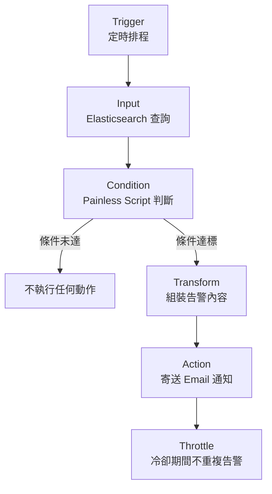
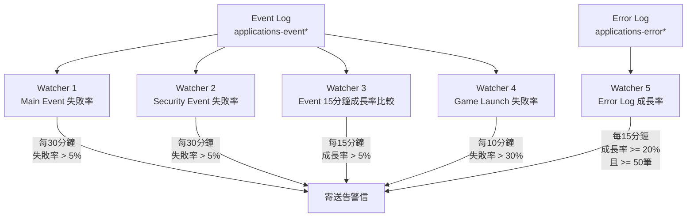
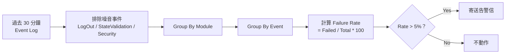
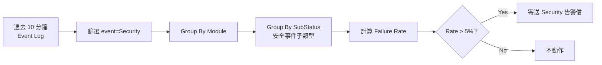
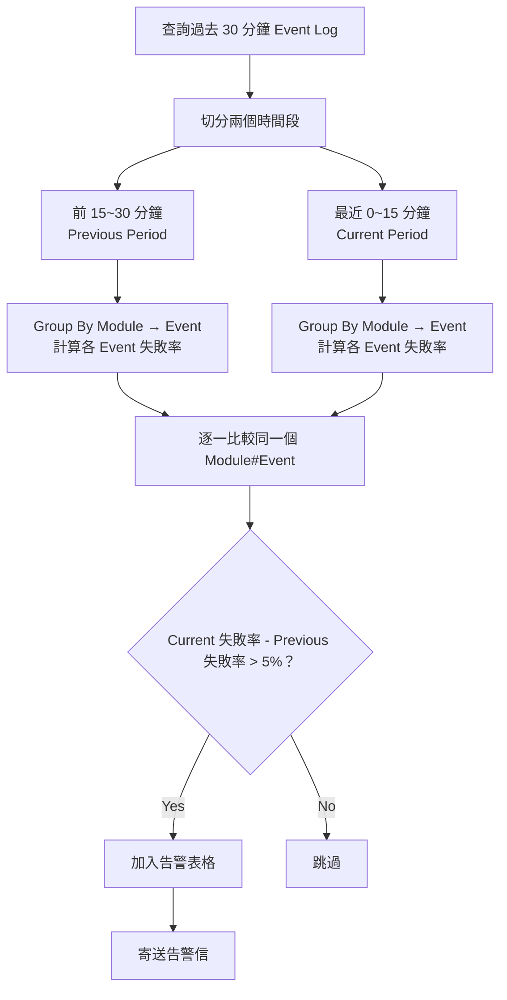
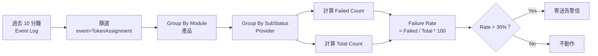
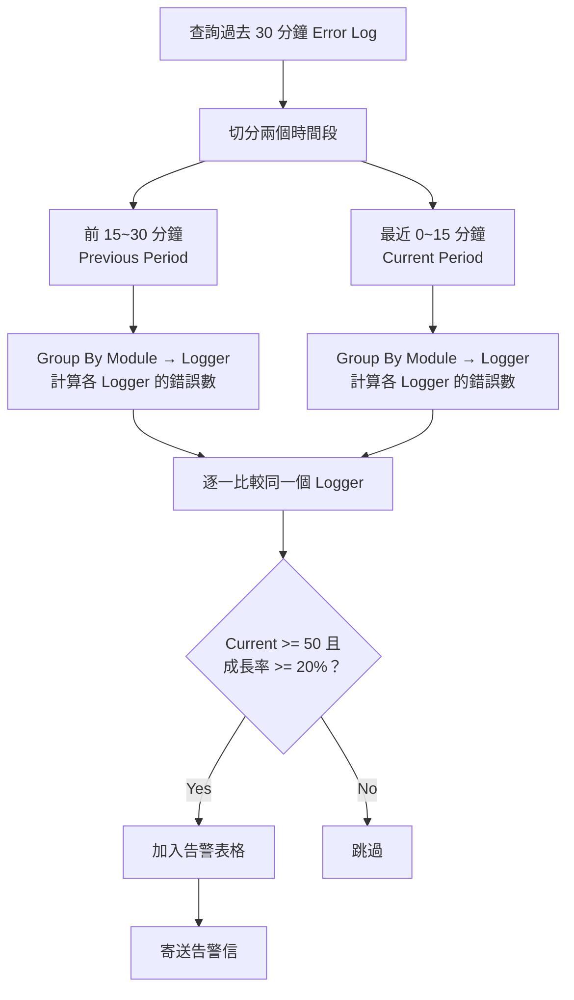
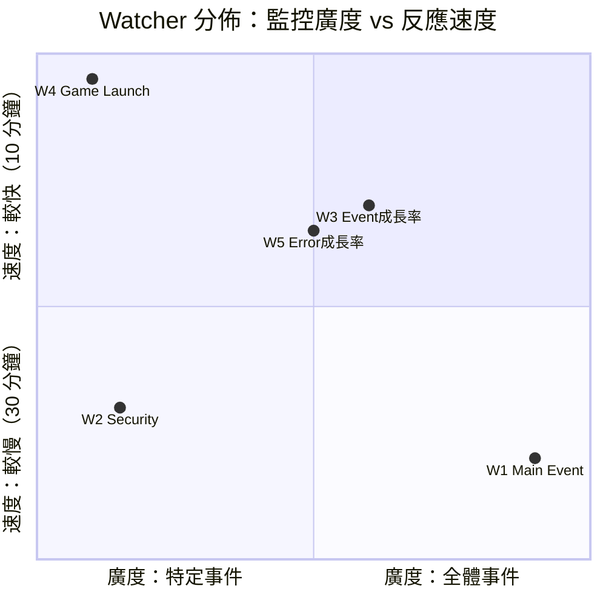
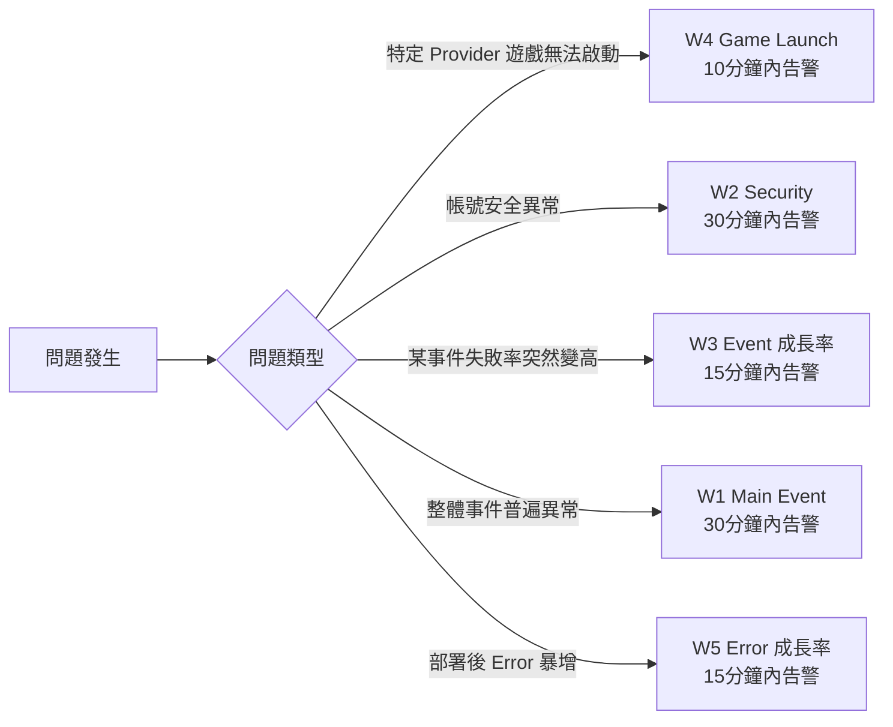

## 前言

在生產環境中，很多問題不會立即被人發現——部署後新版本的 Error Log 悄悄飆升、第三方 Provider 突然故障導致遊戲啟動連續失敗、甚至遭受攻擊產生大量 Security 事件。如果只靠人工盯 Kibana Dashboard，往往等到使用者回報時已經影響了大量用戶。

本文分享我們實際部署的 **五個 Elasticsearch Watcher** 告警規則，涵蓋：

- **一般事件失敗率**（Main Event）— 涵蓋所有業務事件的失敗率異常
- **Security 事件失敗率**— 安全相關事件的集中監控
- **事件成長率比較**（15 分鐘比對）— 偵測事件失敗是否突然飆升
- **Game Launch 失敗率**— 遊戲啟動成功率的精確監控
- **Error Log 成長率**— 部署後 Bug 或攻擊導致的錯誤暴增偵測

透過定時查詢 + 條件判斷 + 自動寄信，讓團隊在問題擴大前就能收到通知並介入處理。

<!-- more -->

## Log 格式與索引設計

在介紹 Watcher 之前，先說明我們的 Log 結構，這是告警規則能精確命中問題的基礎。

### Event Log（業務事件）

索引：`applications-event*`

格式：`[EVENT][event][status][subStatus][identity] Message`

| 欄位 | 說明 | 範例 |
|------|------|------|
| `category` | 產品類別 | `frontend` |
| `module` | 模組/產品名稱 | `sportsbook`、`casino` |
| `event` | 事件類型 | `TokenAssignment`、`LogIn` |
| `status` | 結果狀態 | `SUCCESS`、`FAIL` |
| `substatus` | 子狀態 / Provider | `PartnerA`、`PartnerB` |

### Error Log（錯誤日誌）

索引：`applications-error*`

格式：`[ERROR] Message`

| 欄位 | 說明 | 範例 |
|------|------|------|
| `category` | 產品類別 | `frontend` |
| `module` | 模組名稱 | `sportsbook` |
| `logger` | Logger 類別名稱 | `GameService.LaunchHandler` |

### 完整 Event 清單與告警門檻

以下是系統中所有業務事件類型，以及各事件建議的失敗率告警門檻：

#### 身份驗證 / 帳戶類

| Event 名稱 | 說明 | 建議告警門檻 |
|-----------|------|------------|
| `LogIn` | 用戶登入 | **50%** |
| `LogOut` | 用戶登出 | — （通常不監控） |
| `SignUp` | 用戶註冊 | **90%** |
| `UpdateProfile` | 更新個人資料 | **10%** |
| `Security` | 安全性事件 | **5%**（獨立 Watcher） |

#### 驗證類

| Event 名稱 | 說明 | 建議告警門檻 |
|-----------|------|------------|
| `OTPValidation` | OTP 驗證 | **20%** |
| `TokenValidation` | Token 驗證 | **90%** |
| `CaptchaValidation` | 圖形驗證碼 | **20%** |
| `StateValidation` | 狀態驗證 | — （已知噪音，排除） |
| `Debugger` | 除錯事件 | — |

#### 遊戲啟動類

| Event 名稱 | 說明 | 建議告警門檻 |
|-----------|------|------------|
| `TokenAssignment` | 遊戲 Token 分配（Game Launch）| **30%**（獨立 Watcher）|

#### 金融交易類

| Event 名稱 | 說明 | 建議告警門檻 |
|-----------|------|------------|
| `DepositSubmission` | 存款提交 | **10%** |
| `WithdrawalSubmission` | 提款提交 | **10%** |
| `BankAccountUpdate` | 銀行帳戶更新 | **20%** |
| `PaymentOptionList` | 取得付款選項清單 | **20%** |
| `TxnDetailSubmission` | 交易詳情提交 | **20%** |
| `CancelTransaction` | 取消交易 | **20%** |
| `ChangeWdDispute` | 提款爭議處理 | **20%** |
| `C2CDepositProcess` | C2C 存款流程 | **20%** |
| `RemainingNumbersOfDeposit` | 剩餘存款次數查詢 | **30%** |

#### 通知 / 其他類

| Event 名稱 | 說明 | 建議告警門檻 |
|-----------|------|------------|
| `Affiliate` | 聯盟會員事件 | **10%** |
| `Transaction` | 一般交易事件 | **10%** |
| `ProductReport` | 產品報表 | **20%** |
| `LaunchLiveChat` | 啟動客服聊天 | — |
| `Notifications` | 推播通知 | **20%** |
| `Expose188BankAccount` | 銀行帳號顯示 | **10%** |
| `EmailNotificationSubscription` | Email 訂閱 | **20%** |
| `UploadToAwsS3` | 上傳 S3 | **20%** |
| `SubmitFileUpload` | 提交文件上傳 | **20%** |
| `MicroInterAction` | 微互動事件 | **30%** |
| `Promotion` | 促銷活動 | **90%** |
| `SportsWidget` | 運動小工具 | **20%** |
| `Jumio` | Jumio KYC 驗證 | **20%** |
| `iovation` | iovation 設備驗證 | **20%** |

> **注意**：`LogOut`、`StateValidation` 屬於已知噪音或不需告警的事件，建議在主要 Event Watcher 中使用 `must_not` 排除。

## Watcher 運作原理


```mermaid
flowchart TD
    A["Trigger<br/>定時排程"] --> B["Input<br/>Elasticsearch 查詢"]
    B --> C["Condition<br/>Painless Script 判斷"]
    C -->|條件未達| D["不執行任何動作"]
    C -->|條件達標| E["Transform<br/>組裝告警內容"]
    E --> F["Action<br/>寄送 Email 通知"]
    F --> G["Throttle<br/>冷卻期間不重複告警"]
```

每個 Watcher 由五個部分組成：

| 元件 | 功能 |
|------|------|
| **Trigger** | 定時排程（每 N 分鐘執行一次） |
| **Input** | 對 Elasticsearch 發送聚合查詢 |
| **Condition** | 用 Painless Script 判斷是否需要告警 |
| **Transform** | 組裝 Email 內容（HTML 表格） |
| **Action** | 寄送告警信件 |

## 總覽：五個 Watcher 的分工


```mermaid
flowchart TD
    EL["Event Log<br/>applications-event*"] --> W1["Watcher 1<br/>Main Event 失敗率"]
    EL --> W2["Watcher 2<br/>Security Event 失敗率"]
    EL --> W3["Watcher 3<br/>Event 15分鐘成長率比較"]
    EL --> W4["Watcher 4<br/>Game Launch 失敗率"]
    ER["Error Log<br/>applications-error*"] --> W5["Watcher 5<br/>Error Log 成長率"]

    W1 -->|"每30分鐘<br/>失敗率 > 5%"| Mail["寄送告警信"]
    W2 -->|"每30分鐘<br/>失敗率 > 5%"| Mail
    W3 -->|"每15分鐘<br/>成長率 > 5%"| Mail
    W4 -->|"每10分鐘<br/>失敗率 > 30%"| Mail
    W5 -->|"每15分鐘<br/>成長率 >= 20%<br/>且 >= 50筆"| Mail
```

| # | Watcher 名稱 | 監控對象 | 執行頻率 | 告警門檻 | 適用場景 |
|---|------------|---------|---------|---------|---------|
| 1 | Main Event 失敗率 | 所有業務事件 | 30 分鐘 | 失敗率 > 5% | 整體事件異常偵測 |
| 2 | Security Event | Security 事件 | 30 分鐘 | 失敗率 > 5% | 疑似攻擊或帳號異常 |
| 3 | Event 成長率比較 | 所有業務事件 | 15 分鐘 | 成長率 > 5% | 特定事件突然惡化 |
| 4 | Game Launch 失敗率 | TokenAssignment | 10 分鐘 | 失敗率 > 30% | Provider 故障、遊戲無法啟動 |
| 5 | Error Log 成長率 | Error Log | 15 分鐘 | 成長率 >= 20% 且 >= 50 筆 | 部署後 Bug、被攻擊 |

---

## Watcher 1：Main Event 失敗率監控

### 監控目的

偵測所有業務事件是否出現異常失敗率。此 Watcher 是最廣泛的告警規則，以 **Module → Event** 兩層維度監控所有 frontend 事件，任一事件的失敗率超過 5% 即觸發告警。

排除掉 `LogOut`、`StateValidation`、`Security`（Security 事件由 Watcher 2 獨立處理）。

### 觸發條件

| 項目 | 設定 |
|------|------|
| 執行頻率 | 每 30 分鐘 |
| 查詢範圍 | 過去 30 分鐘的 `applications-event*` |
| 篩選條件 | `category=frontend`，排除 `LogOut`、`StateValidation`、`Security` |
| 分群方式 | 依 `module`（產品）→ `event`（事件類型）分組 |
| 告警門檻 | 任一組的**失敗率超過 5%** |
| 冷卻時間 | 30 分鐘 |

### 查詢流程


```mermaid
flowchart LR
    A["過去 30 分鐘<br/>Event Log"] --> B["排除噪音事件<br/>LogOut / StateValidation / Security"]
    B --> C["Group By Module"]
    C --> D["Group By Event"]
    D --> E["計算 Failure Rate<br/>= Failed / Total * 100"]
    E --> F{"Rate > 5%？"}
    F -->|Yes| G["寄送告警信"]
    F -->|No| H["不動作"]
```

### Watcher 設定

```json
{
  "trigger": {
    "schedule": {
      "interval": "30m"
    }
  },
  "input": {
    "search": {
      "request": {
        "search_type": "query_then_fetch",
        "indices": ["applications-event*"],
        "rest_total_hits_as_int": true,
        "body": {
          "query": {
            "bool": {
              "filter": [
                { "term": { "category": "frontend" } },
                { "range": { "@timestamp": { "gte": "now-30m" } } }
              ],
              "must_not": [
                {
                  "terms": {
                    "event.keyword": ["LogOut", "StateValidation", "Security"]
                  }
                }
              ]
            }
          },
          "size": 0,
          "aggs": {
            "by_module": {
              "terms": { "field": "module.keyword", "size": 10 },
              "aggs": {
                "by_event": {
                  "terms": { "field": "event.keyword", "size": 100 },
                  "aggs": {
                    "failed_status": {
                      "filter": { "term": { "status.keyword": "FAIL" } },
                      "aggs": {
                        "failed_count": {
                          "value_count": { "field": "status.keyword" }
                        }
                      }
                    },
                    "total_status": {
                      "value_count": { "field": "status.keyword" }
                    },
                    "failure_rate": {
                      "bucket_script": {
                        "buckets_path": {
                          "failed": "failed_status.failed_count",
                          "total": "total_status"
                        },
                        "script": "if (params.total > 0) { return params.failed / params.total * 100 } else { return 0 }"
                      }
                    }
                  }
                }
              }
            }
          }
        }
      }
    }
  },
  "condition": {
    "script": {
      "source": "return ctx.payload.aggregations.by_module.buckets.stream().flatMap(module -> module.by_event.buckets.stream()).anyMatch(event -> event.failure_rate.value > 5);",
      "lang": "painless"
    }
  },
  "transform": {
    "script": {
      "source": "String emailBody = '<table border=\"1\"><tr><th>Module</th><th>Event</th><th>Failure Rate</th><th>Total Count</th><th>Failed Count</th></tr>'; for (def module : ctx.payload.aggregations.by_module.buckets) { for (def event : module.by_event.buckets) { if ((double)event.failure_rate.value > 5) { emailBody += '<tr><td>' + module.key + '</td><td>' + event.key + '</td><td>' + event.failure_rate.value + '%</td><td>' + event.total_status.value + '</td><td>' + event.failed_status.doc_count + '</td></tr>'; } } } emailBody += '</table>'; return ['email_body': emailBody];",
      "lang": "painless"
    }
  },
  "actions": {
    "send_email": {
      "email": {
        "profile": "standard",
        "to": ["team@example.com"],
        "subject": "[Alert] Event Failed Over 5%",
        "body": {
          "html": "{{ctx.payload.email_body}}"
        }
      }
    }
  },
  "throttle_period_in_millis": 1800000
}
```

### 聚合邏輯重點

- 使用 `bucket_script` 在每個 `Module × Event` bucket 內即時計算 `failure_rate`
- Condition 使用 Java Stream 遍歷所有 bucket，任一超過 5% 即觸發
- Transform 只將超過門檻的事件組裝進 Email，避免郵件內容過多

---

## Watcher 2：Security Event 失敗率監控

### 監控目的

Security 事件代表系統偵測到的安全性操作（如帳號異常、IP 封鎖嘗試），與一般業務事件邏輯不同，**單獨分出來監控**，以便針對安全問題做更快的反應。

與 Watcher 1 的主要差異：
- 僅監控 `event=Security` 的事件
- 依 `substatus`（安全事件子類型）分組，而非 event
- 告警信標題帶有 `[Security]` 識別

### 觸發條件

| 項目 | 設定 |
|------|------|
| 執行頻率 | 每 30 分鐘 |
| 查詢範圍 | 過去 10 分鐘的 `applications-event*` |
| 篩選條件 | `category=frontend`，`event=Security` |
| 分群方式 | 依 `module` → `substatus`（安全子類型）分組 |
| 告警門檻 | 任一組的**失敗率超過 5%** |
| 冷卻時間 | 30 分鐘 |

### 查詢流程


```mermaid
flowchart LR
    A["過去 10 分鐘<br/>Event Log"] --> B["篩選 event=Security"]
    B --> C["Group By Module"]
    C --> D["Group By SubStatus<br/>安全事件子類型"]
    D --> E["計算 Failure Rate"]
    E --> F{"Rate > 5%？"}
    F -->|Yes| G["寄送 Security 告警信"]
    F -->|No| H["不動作"]
```

### Watcher 設定

```json
{
  "trigger": {
    "schedule": {
      "interval": "30m"
    }
  },
  "input": {
    "search": {
      "request": {
        "search_type": "query_then_fetch",
        "indices": ["applications-event*"],
        "rest_total_hits_as_int": true,
        "body": {
          "query": {
            "bool": {
              "filter": [
                { "term": { "category": "frontend" } },
                { "range": { "@timestamp": { "gte": "now-10m" } } },
                { "terms": { "event.keyword": ["Security"] } }
              ]
            }
          },
          "size": 0,
          "aggs": {
            "by_module": {
              "terms": { "field": "module.keyword", "size": 10 },
              "aggs": {
                "by_event": {
                  "terms": { "field": "substatus.keyword", "size": 100 },
                  "aggs": {
                    "failed_status": {
                      "filter": { "term": { "status.keyword": "FAIL" } },
                      "aggs": {
                        "failed_count": {
                          "value_count": { "field": "status.keyword" }
                        }
                      }
                    },
                    "total_status": {
                      "value_count": { "field": "status.keyword" }
                    },
                    "failure_rate": {
                      "bucket_script": {
                        "buckets_path": {
                          "failed": "failed_status.failed_count",
                          "total": "total_status"
                        },
                        "script": "if (params.total > 0) { return params.failed / params.total * 100 } else { return 0 }"
                      }
                    }
                  }
                }
              }
            }
          }
        }
      }
    }
  },
  "condition": {
    "script": {
      "source": "return ctx.payload.aggregations.by_module.buckets.stream().flatMap(module -> module.by_event.buckets.stream()).anyMatch(event -> event.failure_rate.value > 5);",
      "lang": "painless"
    }
  },
  "transform": {
    "script": {
      "source": "String emailBody = '<table border=\"1\"><tr><th>Module</th><th>SubStatus</th><th>Failure Rate</th><th>Total Count</th><th>Failed Count</th></tr>'; for (def module : ctx.payload.aggregations.by_module.buckets) { for (def event : module.by_event.buckets) { if ((double)event.failure_rate.value > 5) { emailBody += '<tr><td>' + module.key + '</td><td>' + event.key + '</td><td>' + event.failure_rate.value + '%</td><td>' + event.total_status.value + '</td><td>' + event.failed_status.doc_count + '</td></tr>'; } } } emailBody += '</table>'; return ['email_body': emailBody];",
      "lang": "painless"
    }
  },
  "actions": {
    "send_email": {
      "email": {
        "profile": "standard",
        "to": ["team@example.com"],
        "subject": "[Alert] Security Event Failed Over 5%",
        "body": {
          "html": "{{ctx.payload.email_body}}"
        }
      }
    }
  },
  "throttle_period_in_millis": 1800000
}
```

---

## Watcher 3：Event 成長率比較（15 分鐘）

### 監控目的

Watcher 1 監控的是**絕對值**（失敗率是否超標）；Watcher 3 監控的是**相對變化**（失敗率是否突然變差）。

舉例：某事件平常有 10% 的失敗率，突然升到 16%——絕對值沒超 Watcher 1 的門檻，但成長率已超過 5%，代表有問題正在發生。

適用場景：
- **部署後** — 新版本引入 Bug，某事件失敗率開始上升
- **逐漸惡化的 Provider 問題** — 失敗率緩慢爬升而非瞬間暴衝

### 觸發條件

| 項目 | 設定 |
|------|------|
| 執行頻率 | 每 15 分鐘 |
| 查詢範圍 | 過去 30 分鐘的 `applications-event*` |
| 篩選條件 | `category=frontend`，排除 `LogOut`、`StateValidation`、`Security` |
| 比較方式 | 將 30 分鐘切為兩段（15~30 min vs 0~15 min），逐 Event 比較失敗率 |
| 告警門檻 | 最近 15 分鐘的失敗率比前 15 分鐘**高出超過 5%** |
| 冷卻時間 | 15 分鐘 |

### 比較邏輯


```mermaid
flowchart TD
    A["查詢過去 30 分鐘 Event Log"] --> B["切分兩個時間段"]
    B --> C["前 15~30 分鐘<br/>Previous Period"]
    B --> D["最近 0~15 分鐘<br/>Current Period"]
    C --> E["Group By Module → Event<br/>計算各 Event 失敗率"]
    D --> F["Group By Module → Event<br/>計算各 Event 失敗率"]
    E --> G["逐一比較同一個 Module#Event"]
    F --> G
    G --> H{"Current 失敗率 - Previous 失敗率 > 5%？"}
    H -->|Yes| I["加入告警表格"]
    H -->|No| J["跳過"]
    I --> K["寄送告警信"]
```

### Watcher 設定

```json
{
  "trigger": {
    "schedule": {
      "interval": "15m"
    }
  },
  "input": {
    "search": {
      "request": {
        "indices": ["applications-event*"],
        "rest_total_hits_as_int": true,
        "body": {
          "query": {
            "bool": {
              "filter": [
                { "term": { "category": "frontend" } },
                { "range": { "@timestamp": { "gte": "now-30m" } } }
              ],
              "must_not": [
                {
                  "terms": {
                    "event.keyword": ["LogOut", "StateValidation", "Security"]
                  }
                }
              ]
            }
          },
          "aggs": {
            "intervals": {
              "date_range": {
                "field": "@timestamp",
                "ranges": [
                  { "from": "now-30m/m", "to": "now-15m/m" },
                  { "from": "now-15m/m", "to": "now/m" }
                ]
              },
              "aggs": {
                "by_module": {
                  "terms": { "field": "module.keyword", "size": 10 },
                  "aggs": {
                    "by_event": {
                      "terms": { "field": "event.keyword", "size": 100 },
                      "aggs": {
                        "failed_count": {
                          "filter": { "term": { "status.keyword": "FAIL" } },
                          "aggs": {
                            "count": {
                              "value_count": { "field": "status.keyword" }
                            }
                          }
                        },
                        "total_count": {
                          "value_count": { "field": "event.keyword" }
                        }
                      }
                    }
                  }
                }
              }
            }
          }
        }
      }
    }
  },
  "condition": {
    "script": {
      "source": "boolean isAlert = false; String message = '<table border=\"1\"><tr><th>Module</th><th>Event</th><th>Previous Failure Rate</th><th>Current Failure Rate</th><th>(Previous) Fail/Total</th><th>(Current) Fail/Total</th></tr>'; if (ctx.payload.aggregations.intervals.buckets.size() == 2) { Map previousRates = new HashMap(); Map previousSource = new HashMap(); def previousBucket = ctx.payload.aggregations.intervals.buckets[0]; for (def moduleBucket : previousBucket.by_module.buckets) { for (def eventBucket : moduleBucket.by_event.buckets) { double failCount = eventBucket.failed_count.count.value; double totalCount = eventBucket.total_count.value; double failureRate = (totalCount > 0) ? (failCount / totalCount * 100) : 0; previousRates.put(moduleBucket.key + '#' + eventBucket.key, failureRate); previousSource.put(moduleBucket.key + '#' + eventBucket.key, failCount + '/' + totalCount); } } def currentBucket = ctx.payload.aggregations.intervals.buckets[1]; for (def moduleBucket : currentBucket.by_module.buckets) { for (def eventBucket : moduleBucket.by_event.buckets) { double failCount = eventBucket.failed_count.count.value; double totalCount = eventBucket.total_count.value; double failureRate = (totalCount > 0) ? (failCount / totalCount * 100) : 0; if (previousRates.containsKey(moduleBucket.key + '#' + eventBucket.key)) { double prevRate = previousRates.get(moduleBucket.key + '#' + eventBucket.key); String preValue = previousSource.get(moduleBucket.key + '#' + eventBucket.key); double growth = failureRate - prevRate; if (prevRate > 0 && growth > 5) { isAlert = true; message += '<tr><td>' + moduleBucket.key + '</td><td>' + eventBucket.key + '</td><td>' + prevRate + '%</td><td>' + failureRate + '%</td><td>' + preValue + '</td><td>' + failCount + '/' + totalCount + '</td></tr>'; } } else if (failureRate > 0) { isAlert = true; message += '<tr><td>' + moduleBucket.key + '</td><td>' + eventBucket.key + '</td><td>0%</td><td>' + failureRate + '%</td><td>N/A</td><td>' + failCount + '/' + totalCount + '</td></tr>'; } } } } message += '</table>'; if (isAlert) { ctx.vars.message = message; } return isAlert;",
      "lang": "painless"
    }
  },
  "actions": {
    "send_email": {
      "email": {
        "to": ["team@example.com"],
        "subject": "[Alert][Event] Error Rate Growth Alert 5%",
        "body": {
          "html": "{{ctx.vars.message}}"
        }
      }
    }
  },
  "throttle_period_in_millis": 900000
}
```

### Condition 邏輯拆解

| 步驟 | 說明 |
|------|------|
| 1. 建立基準 | 遍歷前 15~30 分鐘，建立 `Module#Event → 失敗率` 的 HashMap |
| 2. 逐一比較 | 遍歷最近 15 分鐘每個 Event，從 HashMap 找出同一個 Event 的前期失敗率 |
| 3. 判斷成長 | `growth = currentRate - previousRate`，若 > 5% 且前期有出現過 → 告警 |
| 4. 新出現事件 | 前期從未出現但最近 15 分鐘有失敗 → 也觸發告警 |

---

## Watcher 4：Game Launch 失敗率監控

### 監控目的

偵測特定產品的遊戲啟動是否在短時間內大量失敗。如果某個 Provider 出問題或網路異常，使用者嘗試啟動遊戲會連續失敗，這個 Watcher 能在 **10 分鐘內**捕捉到異常。

與 Watcher 1 的差異：
- 僅監控 `event=TokenAssignment`（遊戲啟動 Token）
- 依 `substatus`（Provider）分組，精確定位是哪個廠商出問題
- 更高頻率（10 分鐘）、更敏感的監控

### 觸發條件

| 項目 | 設定 |
|------|------|
| 執行頻率 | 每 10 分鐘 |
| 查詢範圍 | 過去 10 分鐘的 `applications-event*` |
| 篩選條件 | `category=frontend`，`event=TokenAssignment` |
| 分群方式 | 依 `module`（產品）→ `substatus`（Provider）分組 |
| 告警門檻 | 任一組的**失敗率超過 30%** |
| 冷卻時間 | 10 分鐘 |

### 查詢流程


```mermaid
flowchart LR
    A["過去 10 分鐘<br/>Event Log"] --> B["篩選<br/>event=TokenAssignment"]
    B --> C["Group By Module<br/>產品"]
    C --> D["Group By SubStatus<br/>Provider"]
    D --> E["計算 Failed Count"]
    D --> F["計算 Total Count"]
    E --> G["Failure Rate<br/>= Failed / Total * 100"]
    F --> G
    G --> H{"Rate > 30%？"}
    H -->|Yes| I["寄送告警信"]
    H -->|No| J["不動作"]
```

### 從 Kibana 看實際資料

下圖為 Kibana 中查看 `TokenAssignment` 失敗事件的畫面，可以看到在特定時間段內失敗事件集中爆發的模式：



下圖顯示失敗的詳細 Log 記錄，包含 substatus（Provider）和具體 message 欄位，可以清楚看出是哪個 Provider 出問題：



### Watcher 設定

```json
{
  "trigger": {
    "schedule": {
      "interval": "10m"
    }
  },
  "input": {
    "search": {
      "request": {
        "search_type": "query_then_fetch",
        "indices": ["applications-event*"],
        "rest_total_hits_as_int": true,
        "body": {
          "query": {
            "bool": {
              "filter": [
                { "term": { "category": "frontend" } },
                { "range": { "@timestamp": { "gte": "now-10m" } } },
                { "terms": { "event.keyword": ["TokenAssignment"] } }
              ]
            }
          },
          "size": 0,
          "aggs": {
            "by_module": {
              "terms": { "field": "module.keyword", "size": 10 },
              "aggs": {
                "by_event": {
                  "terms": { "field": "substatus.keyword", "size": 100 },
                  "aggs": {
                    "failed_status": {
                      "filter": { "term": { "status.keyword": "FAIL" } },
                      "aggs": {
                        "failed_count": {
                          "value_count": { "field": "status.keyword" }
                        }
                      }
                    },
                    "total_status": {
                      "value_count": { "field": "status.keyword" }
                    },
                    "failure_rate": {
                      "bucket_script": {
                        "buckets_path": {
                          "failed": "failed_status.failed_count",
                          "total": "total_status"
                        },
                        "script": "if (params.total > 0) { return params.failed / params.total * 100 } else { return 0 }"
                      }
                    }
                  }
                }
              }
            }
          }
        }
      }
    }
  },
  "condition": {
    "script": {
      "source": "return ctx.payload.aggregations.by_module.buckets.stream().flatMap(module -> module.by_event.buckets.stream()).anyMatch(event -> event.failure_rate.value > 30);",
      "lang": "painless"
    }
  },
  "transform": {
    "script": {
      "source": "String emailBody = '<table border=\"1\"><tr><th>Module</th><th>Product Partner</th><th>Failure Rate</th><th>Total Count</th><th>Failed Count</th></tr>'; for (def module : ctx.payload.aggregations.by_module.buckets) { for (def event : module.by_event.buckets) { if ((double)event.failure_rate.value > 5) { emailBody += '<tr><td>' + module.key + '</td><td>' + event.key + '</td><td>' + event.failure_rate.value + '%</td><td>' + event.total_status.value + '</td><td>' + event.failed_status.doc_count + '</td></tr>'; } } } emailBody += '</table>'; return ['email_body': emailBody];",
      "lang": "painless"
    }
  },
  "actions": {
    "send_email": {
      "email": {
        "profile": "standard",
        "to": ["team@example.com"],
        "subject": "[Alert] Game Launch Event Failed Over 30% - Please Check",
        "body": {
          "html": "{{ctx.payload.email_body}}"
        }
      }
    }
  },
  "throttle_period_in_millis": 600000
}
```

### 聚合邏輯拆解

這個查詢使用了三層巢狀聚合搭配 `bucket_script`：

1. **第一層** — `by_module`：依產品模組分組
2. **第二層** — `by_event`：依 Provider（substatus）分組
3. **第三層** — 同時計算 `failed_count`（FAIL 筆數）和 `total_status`（總筆數）
4. **bucket_script** — 在每個 bucket 內即時算出 `failure_rate = failed / total * 100`

Condition 使用 Java Stream 遍歷所有 bucket，只要任一組的 failure_rate 超過 30% 就觸發告警。

---

## Watcher 5：Error Log 成長率監控

### 監控目的

偵測部署後或異常情況下，Error Log 是否突然暴增。這個 Watcher 會比較「最近 15 分鐘」和「前 15~30 分鐘」的錯誤數量，如果某個 Logger 的錯誤成長率超過 20% **且**數量達到 50 筆以上，就發出告警。

適用場景：

- **部署後** — 新版本引入了 Bug，Error Log 開始飆升
- **被攻擊** — 異常請求導致大量錯誤
- **Provider 故障** — 第三方服務異常導致錯誤集中爆發

### 觸發條件

| 項目 | 設定 |
|------|------|
| 執行頻率 | 每 15 分鐘 |
| 查詢範圍 | 過去 30 分鐘的 `applications-error*` |
| 篩選條件 | `category=frontend`，排除已知噪音 Logger |
| 比較方式 | 將 30 分鐘切為兩段（15~30 min vs 0~15 min），逐 Logger 比較 |
| 告警門檻 | 成長率 >= 20% **且** 最近 15 分鐘的錯誤數 >= 50 |
| 冷卻時間 | 15 分鐘 |

### 比較邏輯


```mermaid
flowchart TD
    A["查詢過去 30 分鐘 Error Log"] --> B["切分兩個時間段"]
    B --> C["前 15~30 分鐘<br/>Previous Period"]
    B --> D["最近 0~15 分鐘<br/>Current Period"]
    C --> E["Group By Module → Logger<br/>計算各 Logger 的錯誤數"]
    D --> F["Group By Module → Logger<br/>計算各 Logger 的錯誤數"]
    E --> G["逐一比較同一個 Logger"]
    F --> G
    G --> H{"Current >= 50 且<br/>成長率 >= 20%？"}
    H -->|Yes| I["加入告警表格"]
    H -->|No| J["跳過"]
    I --> K["寄送告警信"]
```

### Watcher 設定

```json
{
  "trigger": {
    "schedule": {
      "interval": "15m"
    }
  },
  "input": {
    "search": {
      "request": {
        "search_type": "query_then_fetch",
        "indices": ["applications-error*"],
        "rest_total_hits_as_int": true,
        "body": {
          "query": {
            "bool": {
              "filter": [
                { "term": { "category": "frontend" } },
                { "range": { "@timestamp": { "gte": "now-30m" } } }
              ],
              "must_not": [
                { "terms": { "logger.keyword": ["Seo.Prerender.SeoHttpModule"] } }
              ]
            }
          },
          "aggs": {
            "intervals": {
              "date_range": {
                "field": "@timestamp",
                "ranges": [
                  { "from": "now-30m/m", "to": "now-15m/m" },
                  { "from": "now-15m/m", "to": "now/m" }
                ]
              },
              "aggs": {
                "by_module": {
                  "terms": { "field": "module.keyword", "size": 10 },
                  "aggs": {
                    "by_logger": {
                      "terms": { "field": "logger.keyword", "size": 100 }
                    }
                  }
                }
              }
            }
          }
        }
      }
    }
  },
  "condition": {
    "script": {
      "source": "boolean alert = false; String message = '<table style=\"border:3px #cccccc solid;\" cellpadding=\"10\" border=\"1\"><tr><th>Module</th><th>Logger</th><th>Previous Count</th><th>Current Count</th><th>Previous Rate</th><th>Current Rate</th></tr>'; Map previousSource = new HashMap(); def previousBucket = ctx.payload.aggregations.intervals.buckets[0]; for (def moduleBucket : previousBucket.by_module.buckets) { for (def loggerBucket : moduleBucket.by_logger.buckets) { previousSource.put(moduleBucket.key + '#' + loggerBucket.key, loggerBucket.doc_count); } } def currentBucket = ctx.payload.aggregations.intervals.buckets[1]; for (def moduleBucket : currentBucket.by_module.buckets) { for (def loggerBucket : moduleBucket.by_logger.buckets) { String key = moduleBucket.key + '#' + loggerBucket.key; if (previousSource.containsKey(key)) { double previousCount = previousSource.get(key); double totalCount = previousCount + loggerBucket.doc_count; double preRate = (totalCount > 0) ? (previousCount / totalCount * 100) : 0; double currRate = (totalCount > 0) ? (loggerBucket.doc_count / totalCount * 100) : 0; if(currRate - preRate >= 20 && loggerBucket.doc_count >= 50){ alert = true; message += '<tr><td>' + moduleBucket.key + '</td><td>' + loggerBucket.key + '</td><td>' + previousCount + '</td><td>' + loggerBucket.doc_count + '</td><td>' + Math.round(preRate * 100.0) / 100.0 + '%</td><td>' + Math.round(currRate * 100.0) / 100.0 + '%</td></tr>'; } } else if(loggerBucket.doc_count >= 50) { alert = true; } } } message += '</table>'; if (alert) { ctx.vars.message = message; } return alert;",
      "lang": "painless"
    }
  },
  "actions": {
    "send_email": {
      "email": {
        "profile": "standard",
        "to": ["team@example.com"],
        "subject": "[Alert] Error Rate Growth Over 20% - Last 15 mins vs Previous 15-30 mins",
        "body": {
          "html": "Error Log growth detected. Events in the last 15 mins that increased by more than 20% and occurred over 50 times are listed below.<br>{{ctx.vars.message}}<br>Please check the Dashboard for more details."
        }
      }
    }
  },
  "throttle_period_in_millis": 900000
}
```

### Condition 邏輯拆解

這個 Watcher 的 Condition 做了比較複雜的跨時間段比較：

1. **建立基準**：遍歷前 15~30 分鐘的資料，建立 `Module#Logger → Count` 的 HashMap
2. **逐一比較**：遍歷最近 15 分鐘的每個 Logger，從 HashMap 中找出同一個 Logger 的前期數量
3. **計算佔比**：`currRate = current / (previous + current) * 100`
4. **判斷門檻**：成長率差距 >= 20% **且** 最近 15 分鐘的數量 >= 50 才告警
5. **新出現的 Logger**：如果前期完全沒有出現過但最近 15 分鐘 >= 50 筆，也觸發告警

### 告警信範例

收到的告警信會包含一個 HTML 表格：

| Module | Logger | Previous Count | Current Count | Previous Rate | Current Rate |
|--------|--------|---------------|--------------|--------------|-------------|
| sportsbook | GameService.LaunchHandler | 20 | 85 | 19.05% | 80.95% |
| casino | SlotProvider.TokenService | 15 | 62 | 19.48% | 80.52% |

---

## Watcher 1~5 的定位比較


```mermaid
quadrantChart
    title Watcher 分佈：監控廣度 vs 反應速度
    x-axis "廣度：特定事件" --> "廣度：全體事件"
    y-axis "速度：較慢（30 分鐘）" --> "速度：較快（10 分鐘）"
    W4 Game Launch: [0.1, 0.95]
    W3 Event成長率: [0.6, 0.7]
    W5 Error成長率: [0.5, 0.65]
    W2 Security: [0.15, 0.3]
    W1 Main Event: [0.9, 0.2]
```

| 面向 | W1 Main Event | W2 Security | W3 Event 成長率 | W4 Game Launch | W5 Error 成長率 |
|------|-------------|-------------|----------------|---------------|----------------|
| 監控對象 | 所有業務事件 | Security 事件 | 所有業務事件 | TokenAssignment | Error Log |
| 偵測方式 | 絕對值失敗率 | 絕對值失敗率 | 相對值成長率 | 絕對值失敗率 | 相對值成長率 |
| 執行頻率 | 30 分鐘 | 30 分鐘 | 15 分鐘 | 10 分鐘 | 15 分鐘 |
| 告警門檻 | > 5% | > 5% | 成長 > 5% | > 30% | 成長 >= 20% 且 >= 50 筆 |
| 適用場景 | 整體事件異常 | 帳號/安全攻擊 | 特定事件惡化趨勢 | Provider 故障 | 部署 Bug、被攻擊 |
| 分群維度 | Module → Event | Module → SubStatus | Module → Event | Module → Provider | Module → Logger |

## 結語

Elasticsearch Watcher 的優勢在於查詢和告警邏輯都在 Elasticsearch 內部執行，不需要額外部署監控服務。搭配 Painless Script 的靈活性，可以實作出複雜的聚合比較邏輯——從簡單的失敗率計算到跨時間段的成長率比較。

五個 Watcher 的設計思路彼此互補：


```mermaid
flowchart LR
    A["問題發生"] --> B{"問題類型"}
    B -->|"特定 Provider 遊戲無法啟動"| W4["W4 Game Launch<br/>10分鐘內告警"]
    B -->|"帳號安全異常"| W2["W2 Security<br/>30分鐘內告警"]
    B -->|"某事件失敗率突然變高"| W3["W3 Event 成長率<br/>15分鐘內告警"]
    B -->|"整體事件普遍異常"| W1["W1 Main Event<br/>30分鐘內告警"]
    B -->|"部署後 Error 暴增"| W5["W5 Error 成長率<br/>15分鐘內告警"]
```

設計告警規則時的幾個關鍵思考：

- **門檻不要太敏感**：設定最低數量門檻（如 50 筆）避免低流量時的假警報
- **加上 Throttle 冷卻**：避免同一個問題在短時間內連續觸發大量告警信
- **排除已知噪音**：用 `must_not` 過濾掉已知的無害 Logger/Event，減少干擾
- **絕對值 + 相對值雙覆蓋**：單純看失敗率會錯過緩慢惡化的問題；加上成長率比較可以更早發現趨勢
- **告警信要有足夠資訊**：附上 Module、Event/Logger、數量和比率，讓收信者能快速判斷嚴重程度
