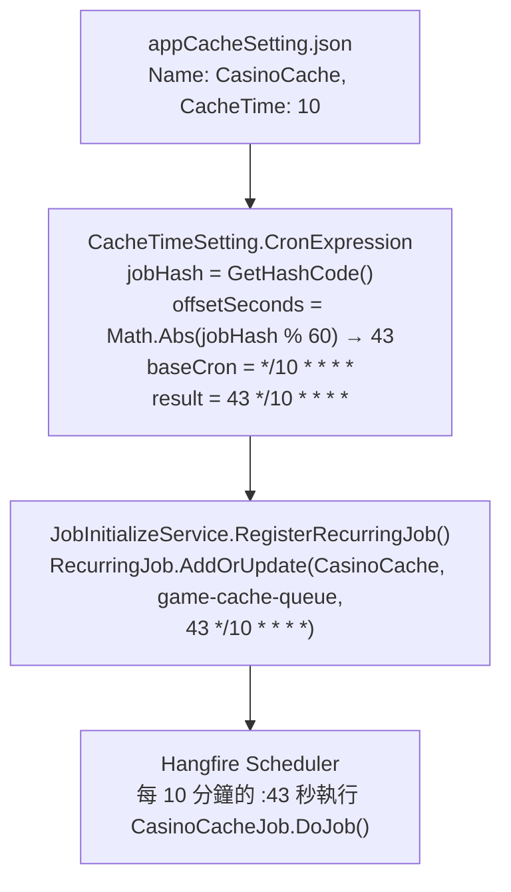

## 問題：Thundering Herd（驚群效應）

系統有 30 支以上的 Hangfire 排程 Job，每支 Job 都會對外部 SPI API 發出多個 HTTP 請求。

當所有 Job 都設定在「整點」或「每 10 分鐘的 :00 秒」執行時，每次觸發瞬間：

- 30 支 Job 同時啟動
- 每支 Job 平均 3 個並行 HTTP 請求
- 瞬間湧入 90+ 個 API 請求

結果：API 被打爆 → timeout → Job 失敗 → Hangfire 自動重試 → 更多請求 → 更多 timeout，雪崩成立。

---

## 人工錯開的問題

最直覺的解法是人工設定每支 Job 的秒數偏移：

```json
{ "Name": "SportsCache",  "Cron": "0 */10 * * * *"  },
{ "Name": "CasinoCache",  "Cron": "15 */10 * * * *" },
{ "Name": "LiveCache",    "Cron": "30 */10 * * * *" },
{ "Name": "LottoCache",   "Cron": "45 */10 * * * *" }
```

但這有幾個問題：

1. **人工維護成本高**：每新增 Job 都要手動分配秒數，確保不衝突
2. **容易出錯**：兩支 Job 設了同一個秒數，管理員不一定發現
3. **無法規模化**：60 支 Job 要人工分配 60 個不同秒數

---

## 解法：以 Job 名稱的 Hash 決定偏移秒數

核心想法：讓每支 Job **自己計算**自己的偏移秒數，不需要人工指定。

條件：
- **決定論式**（Deterministic）：相同 Job 名稱永遠算出相同偏移，App 重啟後行為不變
- **分散性**：不同 Job 名稱算出的偏移值盡量均勻分散在 0-59 之間
- **穩定性**：無需持久化，純計算

`GetHashCode()` 剛好滿足這三點：

```csharp
public string CronExpression => GetAdjustedCronExpression();

private string GetAdjustedCronExpression()
{
    // 取得基礎 Cron，例如 "*/10 * * * *"（每 10 分鐘）
    var baseCron = CacheTime.GetDescription();

    if (ExecutionDelaySecondsForInitializing <= 0)
        return baseCron;

    // 用 Job 名稱 Hash 算出 0-59 的固定偏移
    var jobHash = Name.ToString().GetHashCode();
    var offsetSeconds = Math.Abs(jobHash % 60);

    // Hangfire 支援 6-part cron（含秒）："{second} {minute} {hour} {day} {month} {weekday}"
    return $"{offsetSeconds} {baseCron}";
}
```

---

## 實際效果驗證

以設定檔中幾個 Job 為例（`Name.GetHashCode() % 60` 的結果）：

| Job 名稱 | Hash（示意） | offsetSeconds | 最終 Cron |
|---|---|---|---|
| `SportsCache` | ... | 17 | `17 */10 * * * *` |
| `CasinoCache` | ... | 43 | `43 */10 * * * *` |
| `LiveCache` | ... | 5  | `5 */10 * * * *` |
| `LottoCache` | ... | 29 | `29 */10 * * * *` |
| `Maintenance` | ... | 52 | `52 */3 * * * *` |
| `FaqContent`  | ... | 11 | `11 */15 * * * *` |

各 Job 自動分散在不同秒數，無需任何人工介入。

---

## Hangfire 的 6-Part Cron

標準 Cron 表達式只有 5 個欄位（分 時 日 月 週），Hangfire 擴充支援第 6 個欄位（秒）放在最前面：

```
標準 Cron（5 欄位）：  {分} {時} {日} {月} {週}
Hangfire Cron（6 欄位）：{秒} {分} {時} {日} {月} {週}
```

範例：
```
*/10 * * * *         → 每 10 分鐘整，於 :00 秒執行
17 */10 * * * *      → 每 10 分鐘，於 :17 秒執行
43 */10 * * * *      → 每 10 分鐘，於 :43 秒執行
```

---

## 設計細節：`Math.Abs` 的必要性

`GetHashCode()` 可能回傳負數（例如 `-1234567890`）。直接對負數取模：

```csharp
-1234567890 % 60 = -30  // 負數！不能作為秒數偏移
```

必須先取絕對值：

```csharp
var offsetSeconds = Math.Abs(jobHash % 60);  // 保證 0-59
```

---

## 為何不用 Random？

```csharp
// ❌ 不能這樣寫
var offsetSeconds = new Random().Next(0, 60);
```

`Random` 產生的是隨機值，每次 App 重啟時偏移都不同。這帶來兩個問題：

1. **排程時間漂移**：Hangfire Dashboard 顯示的「下次執行時間」每次重啟後都變，難以觀察和除錯
2. **重啟後偏移衝突**：前一次分散得很好，重啟後可能有多支 Job 剛好算到同一秒

`GetHashCode()` 的決定論特性確保「相同名稱 → 相同偏移 → 相同排程時間」，跨重啟穩定一致。

---

## 設定檔整合

`ExecutionDelaySecondsForInitializing` 控制是否啟用 Hash 偏移機制：

```json
{
  "Name": "CasinoCache",
  "CacheTime": "10",
  "QueueName": "game-cache-queue",
  "ExecutionDelaySecondsForInitializing": 1
}
```

- `> 0`（預設值 1）：啟用 Hash 偏移，自動計算秒數
- `<= 0`：關閉偏移，回傳原始 Cron 表達式

這讓少數需要精確整點執行的 Job 可以個別關閉此機制。

---

## 完整資料流



---

## 效益總結

| | 人工設定偏移 | Hash 自動偏移 |
|---|---|---|
| 新增 Job 時需設秒數 | 是，且要確保不重複 | 否，自動計算 |
| 重啟後排程時間 | 固定（人工設定） | 固定（Hash 決定論） |
| 大量 Job 的維護成本 | 隨 Job 數線性增加 | 恆定 |
| 偏移衝突風險 | 存在，需人工檢查 | 極低（Hash 分散性） |
| 需要修改程式碼的情境 | 每次新增 Job | 永不需要 |

這個機制的精妙之處在於，它用一行數學運算（`Math.Abs(hashCode % 60)`）解決了一個需要持續人工維護的協調問題，而且完全透明——工程師不需要知道這個機制存在，它就自動生效。
