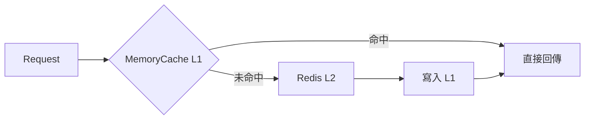
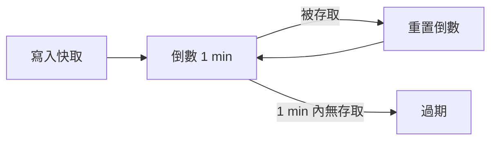
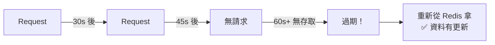

## 前言

這是一個只在正式環境才暴露的問題。
我們使用 LazyCache + Redis 搭建了一個兩層快取架構：
MemoryCache 作為 L1 熱快取，Redis 作為 L2 資料來源。
在 Dev、QAT、UAT 環境一切正常，
但上了 Production 後發現 **Redis 資料更新了，應用卻永遠拿到舊值**。

原因？**LazyCache 的 `GetOrAdd` 直接傳入 `TimeSpan`，預設行為是 `SlidingExpiration`**。

<!-- more -->

## 架構背景

為了減少高頻 API 對 Redis 的直接查詢壓力，我們設計了一個 L1 + L2 的快取機制：



使用的核心套件是 [LazyCache](https://github.com/alastairtree/LazyCache)，
它封裝了 `IMemoryCache`，提供 thread-safe 的 `GetOrAdd` 操作，
確保同一個 Key 在高並發下只會觸發一次 factory 函式。

快取時間透過 XML 設定管理：

```xml
<LazyCacheSetting Name="sbkProduct"
    RedisKey="dev:sbkproduct:domainfortaptap"
    CacheMinutes="1" />
```

```csharp
var setting = AppConfigManager.GetLazyCacheSetting("sbkProduct");
var result = _lazyMemoryCacheService.GetOrAddData<SbkDomainRedis>(
    setting.RedisKey, setting.CacheMinutes
);
```

## 踩到的坑：直接傳 TimeSpan = SlidingExpiration

### 出事的程式碼

最初的版本看起來非常簡潔直覺：

```csharp
// ❌ 出問題的版本 — 直接傳 TimeSpan
public T GetOrAddData<T>(string redisPrefixKey, int expireTimeForMinutes)
{
    var result = default(T);
    if (string.IsNullOrEmpty(redisPrefixKey)) return result;
    return _cache.GetOrAdd(redisPrefixKey, () =>
    {
        try
        {
            var db = RedisUtil.connectionPool.GetDataBase(redisConnectionDb);
            if (db.KeyExists(redisPrefixKey))
            {
                result = GetFromRedis<T>(db, redisPrefixKey);
                if (result != null) return result;
            }
        }
        catch (Exception ex)
        {
            _logger.Exception(ex, "GetOrAddDataAsync got error!");
        }
        return result;
    }, TimeSpan.FromMinutes(expireTimeForMinutes));  // ← 看起來沒問題，其實是地雷
}
```

看起來很合理對吧？傳入 1 分鐘，1 分鐘後過期，重新從 Redis 拿。但事實並非如此。

### LazyCache 的 TimeSpan overload 到底做了什麼？

翻開 LazyCache 的[原始碼](https://github.com/alastairtree/LazyCache)，`GetOrAdd` 接受 `TimeSpan` 的 overload 內部是這樣實作的：

```csharp
// LazyCache 原始碼 (簡化)
public T GetOrAdd<T>(string key, Func<T> factory, TimeSpan expiration)
{
    return GetOrAdd(key, factory, new MemoryCacheEntryOptions
    {
        SlidingExpiration = expiration   // ← 預設是 SlidingExpiration！
    });
}
```

**直接傳 `TimeSpan` = `SlidingExpiration`，不是 `AbsoluteExpiration`！**

這代表：每次讀取快取都會重置過期倒數計時器。

### 什麼是 SlidingExpiration？

`SlidingExpiration = 1 分鐘` 的行為：



> 每次被存取就重新計時，只有連續 1 分鐘沒人存取才會過期。

### 低流量環境 — 一切正常



兩次請求之間的間隔偶爾會超過 1 分鐘，快取自然過期，看起來一切正常。

### 高流量環境（Production）— 永不過期


Production 每秒數百個 request，`SlidingExpiration` 的倒數計時器永遠被重置，
快取條目實質上變成了「永不過期」，Redis 端的資料更新再也反映不到應用層。

## 問題的影響

這個案例中，快取的是 Sportsbook 的 Domain 設定。當我們需要切換 Domain（例如緊急域名切換防封鎖）時：

1. 後台更新了 Redis 中的 Domain 資料
2. 應用的 MemoryCache 因 SlidingExpiration 永不過期
3. 用戶持續被導向舊的 Domain
4. **緊急域名切換完全失效**

因為其他環境流量小，測試時資料都會正常更新，直到 Production 才發現 Domain 怎麼切都切不過去。

## 修正方式

不要直接傳 `TimeSpan`，改用 `MemoryCacheEntryOptions` 明確指定 `AbsoluteExpirationRelativeToNow`：

```csharp
// ✅ 修正後的版本 — 明確指定 AbsoluteExpirationRelativeToNow
public T GetOrAddData<T>(string redisPrefixKey, int expireTimeForMinutes)
{
    var result = default(T);
    if (string.IsNullOrEmpty(redisPrefixKey)) return result;

    var cacheOptions = new MemoryCacheEntryOptions
    {
        AbsoluteExpirationRelativeToNow = TimeSpan.FromMinutes(expireTimeForMinutes)
    };

    return _cache.GetOrAdd(redisPrefixKey, () =>
    {
        try
        {
            var db = RedisUtil.connectionPool.GetDataBase(redisConnectionDb);
            if (db.KeyExists(redisPrefixKey))
            {
                result = GetFromRedis<T>(db, redisPrefixKey);
                if (result != null) return result;
            }
        }
        catch (Exception ex)
        {
            _logger.Exception(ex, "GetOrAddDataAsync got error!");
        }
        return result;
    }, cacheOptions);  // ← 傳入 MemoryCacheEntryOptions 而非 TimeSpan
}
```

### Diff 對照

```diff
+ var cacheOptions = new MemoryCacheEntryOptions
+ {
+     AbsoluteExpirationRelativeToNow = TimeSpan.FromMinutes(expireTimeForMinutes)
+ };
  return _cache.GetOrAdd(redisPrefixKey, () =>
  {
      // ... factory logic ...
- }, TimeSpan.FromMinutes(expireTimeForMinutes));
+ }, cacheOptions);
```

### AbsoluteExpirationRelativeToNow 的行為


> 無論被存取多少次，到了固定時間就一定過期、一定重新取值。

## LazyCache GetOrAdd 的三種 overload 比較

這才是這個坑最根本的原因——API 設計讓人直覺地用錯：

```csharp
// Overload 1: 傳 TimeSpan → ⚠️ SlidingExpiration（地雷！）
_cache.GetOrAdd(key, factory, TimeSpan.FromMinutes(1));

// Overload 2: 傳 DateTimeOffset → AbsoluteExpiration
_cache.GetOrAdd(key, factory, DateTimeOffset.Now.AddMinutes(1));

// Overload 3: 傳 MemoryCacheEntryOptions → ✅ 完全控制（推薦）
_cache.GetOrAdd(key, factory, new MemoryCacheEntryOptions
{
    AbsoluteExpirationRelativeToNow = TimeSpan.FromMinutes(1)
});
```

| Overload | 參數類型 | 實際行為 | 危險程度 |
|----------|---------|---------|---------|
| `TimeSpan` | TimeSpan | SlidingExpiration | ⚠️ 高流量下永不過期 |
| `DateTimeOffset` | DateTimeOffset | AbsoluteExpiration | ✅ 安全 |
| `MemoryCacheEntryOptions` | Options 物件 | 完全由你決定 | ✅ 最安全、最明確 |

第一種 overload 的 API 設計非常容易讓人誤解。大多數人直覺會認為 `TimeSpan.FromMinutes(1)` 代表「1 分鐘後過期」，但實際上是「1 分鐘內沒有被存取才過期」，語意完全不同。

## MemoryCacheEntryOptions 完整比較

| 屬性 | 行為 | 高流量下 | 適用場景 |
|------|------|---------|---------|
| `SlidingExpiration` | 每次存取重置倒數 | ⚠️ 可能永不過期 | 使用者 Session、個人化資料 |
| `AbsoluteExpirationRelativeToNow` | 從寫入開始固定時間後過期 | ✅ 保證過期 | 需要定期刷新的共享資料 |
| `AbsoluteExpiration` | 指定確切的 DateTimeOffset 過期 | ✅ 保證過期 | 已知確切過期時間的場景 |
| 兩者組合 | 先到的條件先觸發過期 | ✅ 最安全 | 需要雙重保險的場景 |

如果真的需要 Sliding 又要保證過期？可以同時設定兩者，以先到的為準：

```csharp
var cacheOptions = new MemoryCacheEntryOptions
{
    SlidingExpiration = TimeSpan.FromMinutes(1),
    AbsoluteExpirationRelativeToNow = TimeSpan.FromMinutes(5)
};
// Sliding 負責低流量時提早回收記憶體
// Absolute 負責高流量時保證最長 5 分鐘一定過期
```

## 額外發現的潛在問題：null 被快取

在排查這個問題時，我們也注意到程式碼中的另一個風險：

```csharp
var result = default(T);  // null
return _cache.GetOrAdd(redisPrefixKey, () =>
{
    try
    {
        // 如果 Redis 暫時不可用（網路抖動、超時）...
        var db = RedisUtil.connectionPool.GetDataBase(redisConnectionDb);
        result = GetFromRedis<T>(db, redisPrefixKey);
    }
    catch (Exception ex)
    {
        _logger.Exception(ex, "GetOrAddDataAsync got error!");
        // exception 被吞掉，result 仍然是 default(T)
    }
    return result;  // → 回傳 null
}, cacheOptions);   // → null 被快取了 expireTimeForMinutes 分鐘！
```

如果 Redis 暫時故障，factory 會回傳 `default(T)`，而 LazyCache 會將這個 `null` 結果快取起來。即使 Redis 1 秒後就恢復，應用也會拿到快取中的 `null` 值直到過期。

## 排查這類問題的建議

- **加入快取重載的 Log**：在 factory 函式中加入日誌，追蹤快取何時真正從 Redis 重新載入
- **ELK 監控**：監控 Redis 讀取頻率，如果某個 Key 的 GET 次數突然歸零，代表快取可能卡住了
- **壓力測試要涵蓋快取行為**：不只測 API 回應時間，也要驗證高流量下快取是否正確過期
- **永遠用 MemoryCacheEntryOptions**：不要用 `TimeSpan` overload，避免踩坑

## 結語

這個問題最狡猾的地方在於：

- **低流量環境下完全正常** — Dev / QAT / UAT 永遠測不出來
- **API 設計讓人直覺用錯** — 傳 `TimeSpan` 看起來就像「N 分鐘後過期」
- **行為完全相反** — 你以為是固定過期，實際上是越忙越不過期

`SlidingExpiration` 本身沒有 Bug，它就是設計來做這件事的——讓經常被存取的資料留在記憶體中。但當你的使用場景是「定期從 Redis 同步最新資料」時，這個行為恰好與你的意圖完全相反。

一個 overload 的選擇，就能讓系統在 Production 上表現出完全不同的行為：

```diff
  return _cache.GetOrAdd(redisPrefixKey, () =>
  {
      // ... factory logic ...
- }, TimeSpan.FromMinutes(expireTimeForMinutes));
+ }, new MemoryCacheEntryOptions
+ {
+     AbsoluteExpirationRelativeToNow = TimeSpan.FromMinutes(expireTimeForMinutes)
+ });
```
