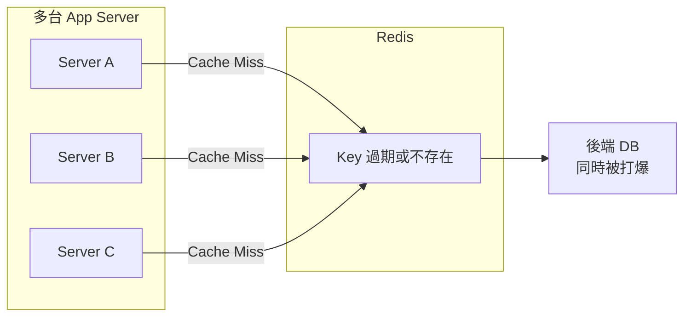
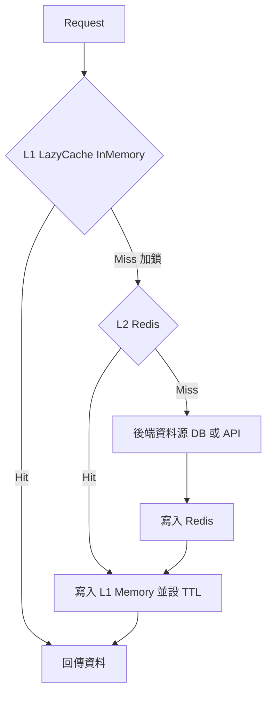
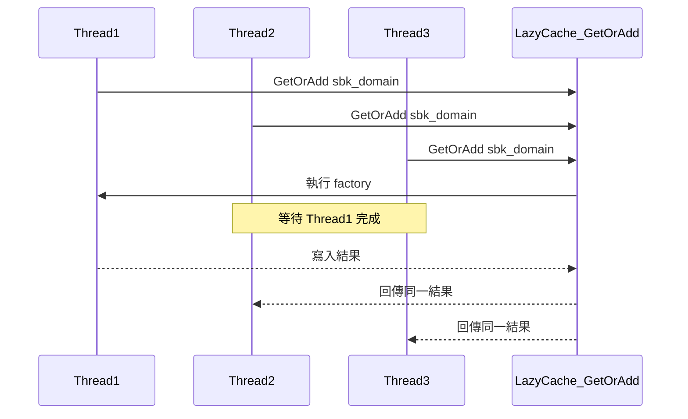
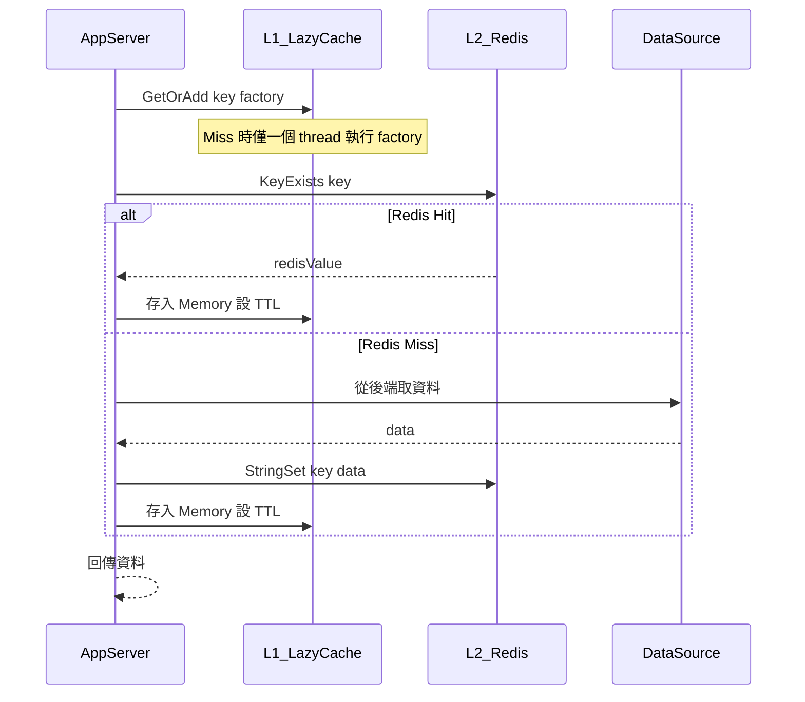
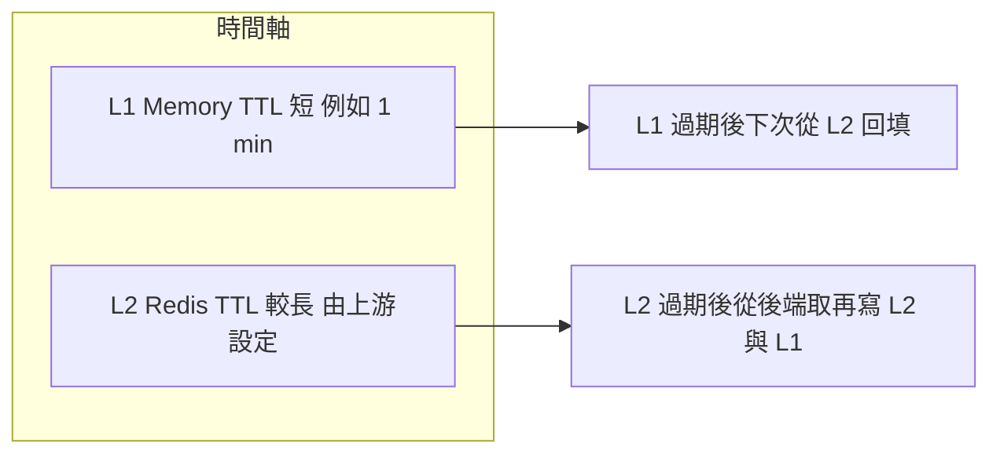
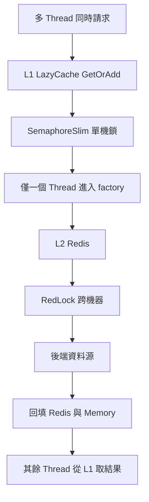

## 為什麼需要雙層快取？

### 使用場景

典型情境是 **多台 App Server 水平擴展**，讀取路徑上會先查本機記憶體、再查 **共用的 Redis（L2）** 當成跨機器的快取來源。業務資料可能在後端更新後寫回 Redis，或依 TTL 在 Redis 上過期；各機的 L1 也會依自己的 TTL 失效。只要出現「**同一時間很多請求都認為快取不可用**」——例如熱點 key 的 TTL 一起到期、部署後快取清空、或 Redis 短暫不可用後恢復——**每一台機、每一條執行緒若都各自回源**，後端與 Redis 會在瞬間承受 **N 台 × 每機併發** 的壓力。

這套 **L1（LazyCache）+ L2（Redis）** 的組合，目的就是在這種 **多機共享快取、又需要週期或事件驅動更新** 的架構下，把「miss 之後誰負責載入」收斂成 **單機內合併請求**，必要時再在 L2 層用分散式鎖（例如 RedLock，見 CacheLayerManager）避免多機同時把同一個 key 打穿到資料庫。**它不是取代「資料在業務上如何同步」的設計**，而是降低 **快取重建瞬間** 的並發災難。

<!-- more -->

### 問題詳解：Cache Stampede（快取雪崩）

**Cache Stampede** 指的是：快取條目一旦失效或不存在，**大量並發讀取幾乎同時發現 miss**，於是 **各自觸發載入**（查 Redis、查 DB、呼叫下游 API），造成：

1. **單機內**：同一個 key，多條 thread / 多個請求同時執行「載入邏輯」，重複計算或重複打後端。
2. **多機間**：每台 App Server 的進程彼此不知道對方也在載入，**同一個邏輯在 N 台機器上各跑一遍**，後端 QPS 近似乘以機器台數。
3. **連鎖效應**：資料庫連線池、下游限流、Redis 單執行緒瓶頸被瞬間打滿，延遲暴衝，甚至演變成 **逾時重試 → 更大量請求** 的二級雪崩。

常見觸發點包括：**熱點 key 的絕對過期時間集中到期**、**快取預熱不足就開流量**、**整體或單一 key 被主動刪除／版本升級後失效**。若沒有「**同一個載入單位只允許一個執行者**」的機制，就很容易在「**快取資料需要在多機環境下重新對齊或重新載入**」的那一瞬間，把整個讀取路徑打穿。



### 雙層架構在此扮演的角色

- **L1 In-Memory（LazyCache）**：同一台機器上，同一 key 的 `GetOrAdd` **只會有一條執行緒進入 factory**，其餘等待結果，避免 **單機內** 的重複載入與重複打 L2。
- **L2 Redis**：跨機器共享的快取層；**跨機器** 若仍可能同時 miss，可再搭配 **RedLock** 等機制，讓「回填 L2 / 回源」在叢集內單飛（見 CacheLayerManager 文件）。

## 架構全覽



## L1：LazyMemoryCacheService

```csharp
// LazyMemoryCacheService.cs
public class LazyMemoryCacheService : ILazyMemoryCacheService
{
    private readonly IAppCache _cache; // LazyCache 套件

    public LazyMemoryCacheService()
    {
        _cache = new CachingService(); // 內建 lock 機制，同 key 只執行一次 factory
    }

    public T GetOrAddData<T>(string redisPrefixKey, int expireTimeForMinutes)
    {
        var cacheOptions = new MemoryCacheEntryOptions
        {
            AbsoluteExpirationRelativeToNow = TimeSpan.FromMinutes(expireTimeForMinutes)
        };

        // GetOrAdd 保證同一 key 的 factory 只執行一次（內建 SemaphoreSlim lock）
        return _cache.GetOrAdd(redisPrefixKey, () =>
        {
            // L1 Miss → 往 L2 Redis 查
            var db = RedisUtil.connectionPool.GetDataBase("AppDataCache");

            if (db.KeyExists(redisPrefixKey))
            {
                var redisValue = db.StringGet(redisPrefixKey);
                return JsonConvert.DeserializeObject<T>(redisValue);
            }

            return default(T); // L2 也 miss，回傳 null（由呼叫方決定後續）
        }, cacheOptions);
    }
}
```

**LazyCache 的關鍵特性：** `GetOrAdd` 底層使用 `SemaphoreSlim`，確保同一個 key 同時只有一個 thread 執行 factory，其餘 thread 等待結果，**消除 Memory 層的 Stampede**。

## LazyCache 內部機制（簡化）



## L2：Redis 快取（搭配 LazyCache 使用）



## 實際使用：SBK Domain 動態查詢

```csharp
// SbkManager.cs — 透過 LazyMemoryCacheService 快取 SBK Domain
public class SbkManager
{
    private readonly ILazyMemoryCacheService _lazyCacheService;

    public string GetSbkDomain(string redisKey)
    {
        return _lazyCacheService.GetOrAddData<string>(redisKey, expireTimeForMinutes: 1);
    }
}
```

對應的 `LazyCacheSetting.config`：

```xml
<ArrayOfLazyCacheSetting>
  <LazyCacheSetting
    Name="sbkProduct"
    RedisKey="dev:sbkproduct:domainfortaptap"
    CacheMinutes="1">
  </LazyCacheSetting>
</ArrayOfLazyCacheSetting>
```

## 兩層 TTL 策略



**L1 TTL 短於 L2 TTL** 的設計意圖：

- L1 短 TTL 讓資料相對新鮮
- L2 作為 L1 的 fallback，避免每次都打後端
- 多台機器各自有 L1，不需跨機器同步 Memory

## 與 CacheLayerManager 的差異

| 面向 | LazyMemoryCacheService | CacheLayerManager |
|------|----------------------|-------------------|
| L1 層 | LazyCache（in-memory） | 無 L1 |
| L2 層 | Redis String | Redis Hash / List |
| 分散式鎖 | 無（靠 LazyCache 單機 lock） | RedLock（跨機器） |
| 適用場景 | 輕量設定類資料（SBK Domain） | 用戶帳戶資料（Trading Session, KYC...） |
| Stampede 防護 | Memory 層 SemaphoreSlim | Redis 層 RedLock |
| 資料結構 | 簡單 Key-Value | 複雜物件 / 分頁列表 |

## 完整防護示意



## 小結

| 層次 | 技術 | 防護機制 | 適用 |
|------|------|---------|------|
| L1 In-Memory | LazyCache | SemaphoreSlim（單機） | 高頻讀取，TTL 短 |
| L2 Redis | StackExchange.Redis | RedLock（跨機器） | 跨機器共享，TTL 長 |
| STB 環境 | 直接跳過 Redis | — | 測試環境不依賴 Redis |
