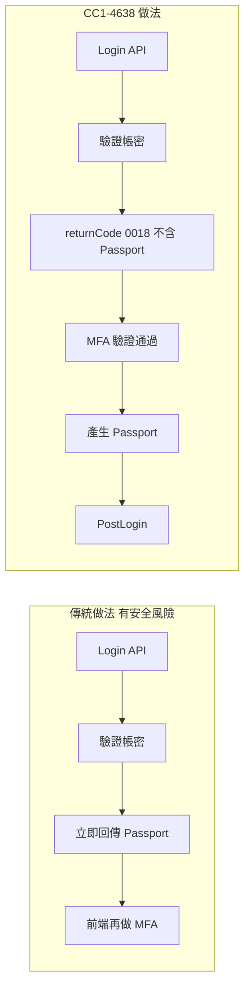
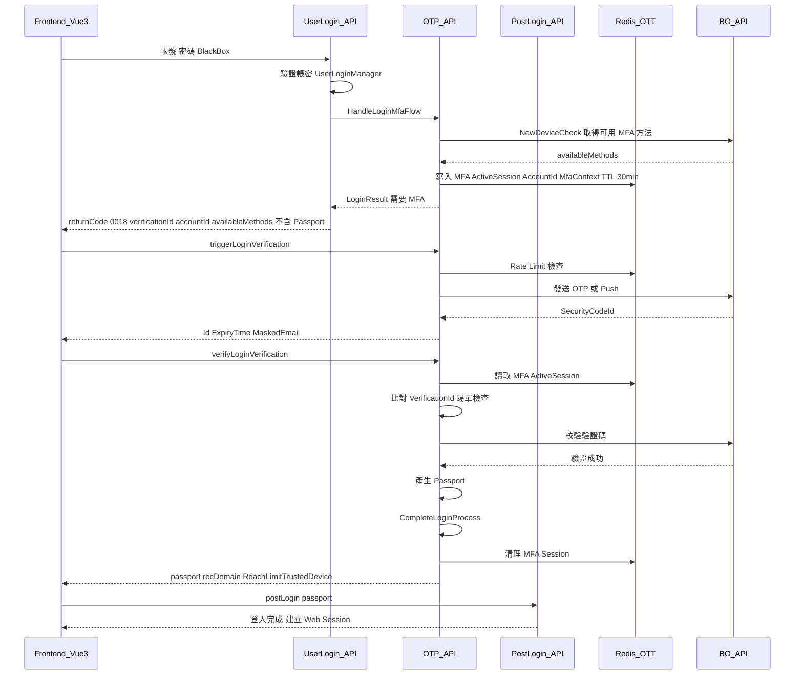
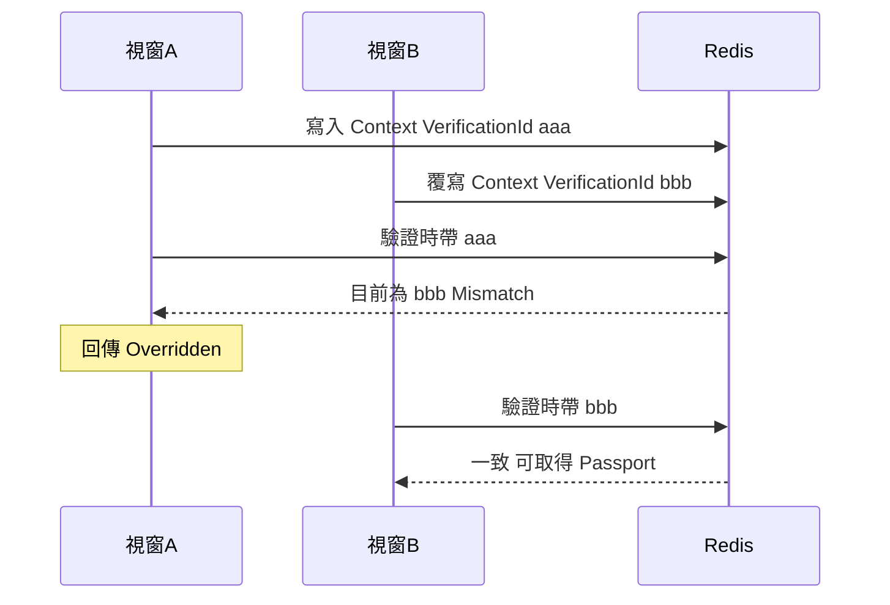
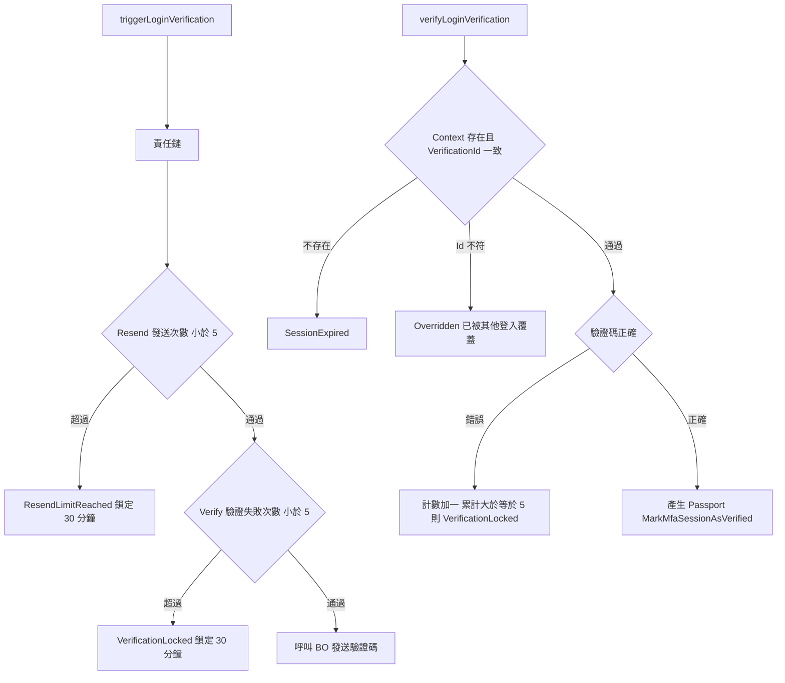
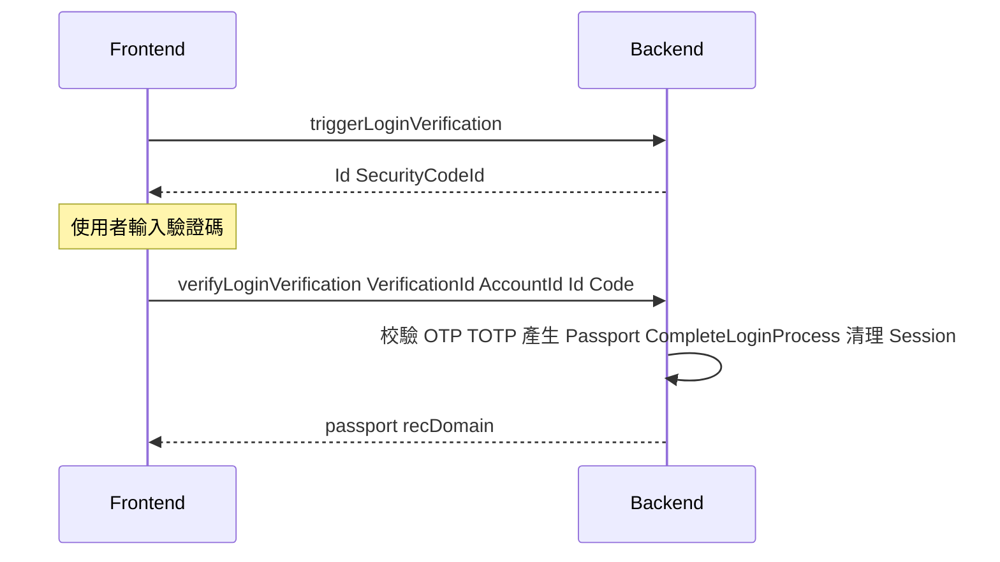
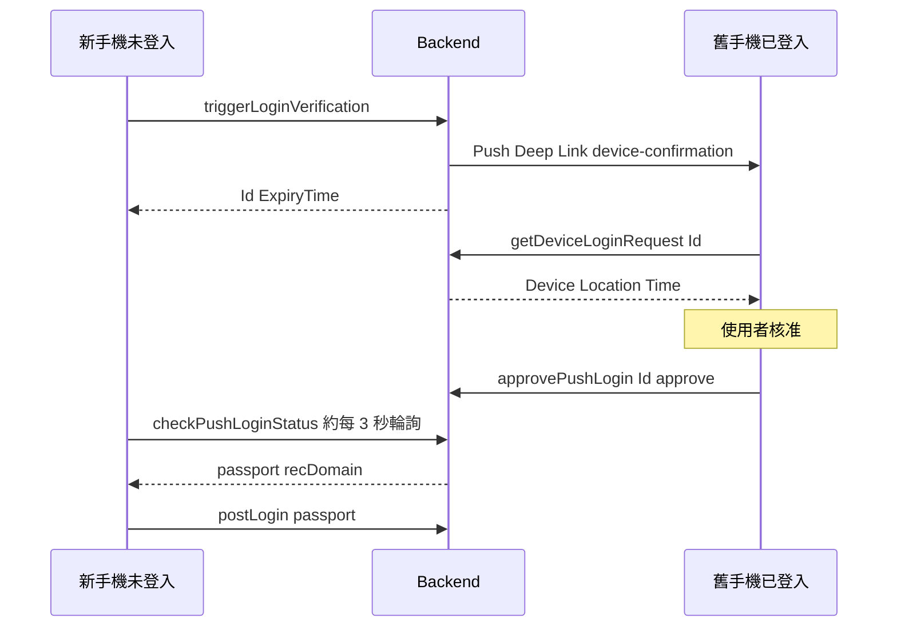
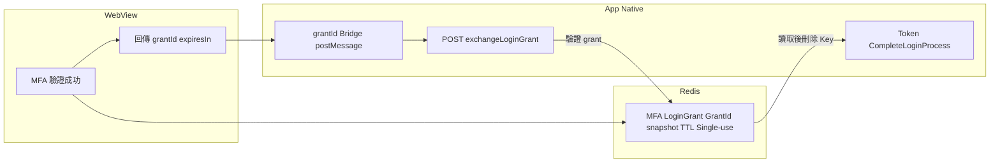
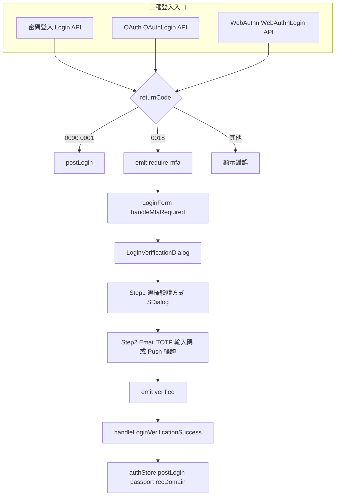
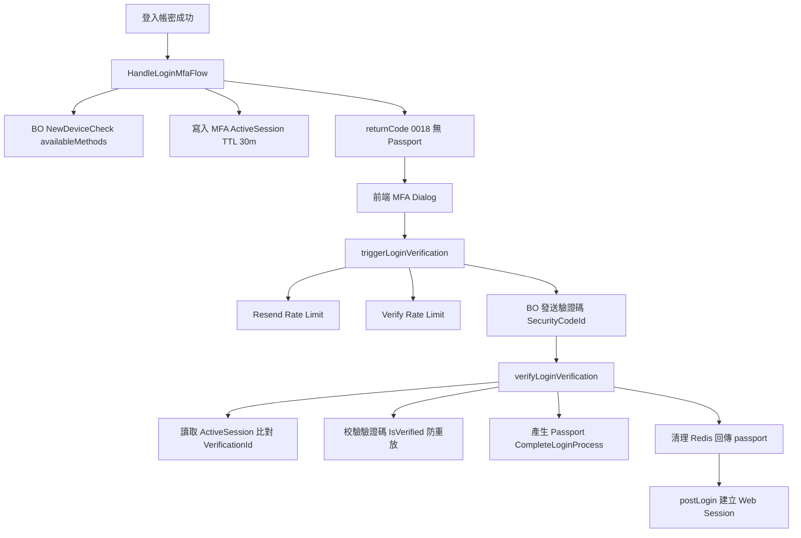

## 背景

傳統登入只驗證帳號 + 密碼，一旦帳密外洩即全面失守。本需求在既有登入流程中加入第二層驗證（MFA）：在使用者完成密碼驗證後、正式取得 Passport 之前，須通過以下其中一種驗證：

| 方法 | 說明 |
|------|------|
| Push Notification | 向已登入的可信裝置推播，由舊手機批准 |
| Email OTP | 發送一次性驗證碼到註冊信箱 |
| TOTP | 使用 Authenticator App（時間型）驗證碼 |

**驗證優先級**：Push Notification > Email OTP > TOTP（`availableMethods[0]` 為預設）

## 核心設計決策：Passport 在驗證成功後才產生



這確保未完成 MFA 的使用者無法取得任何有效 Passport。

<!-- more -->

## 整體三段式流程



## Redis 會話設計

### MfaContext — 會話核心

```csharp
public class MfaContext
{
    // ── 會話識別 ──────────────────────────────────────
    public string VerificationId { get; set; }  // GUID，踢單關鍵
    public long AccountId { get; set; }
    public string LoginId { get; set; }
    public string MemberCode { get; set; }
    public List<recDomain> RecDomain { get; set; }
    public bool IsVerified { get; set; }  // 防重放攻擊，驗證後設為 true

    // ── 環境資訊（Kafka log / 風控用）────────────────────
    public string ClientIP { get; set; }
    public string UserAgent { get; set; }
    public string CountryCode { get; set; }
    public string City { get; set; }
    public string BlackBox { get; set; }  // 驗證成功後執行 FireBBoxAsLogin

    // ── 裝置資訊（App 專用）──────────────────────────────
    public string FingerPrintId { get; set; }
    public string DeviceId { get; set; }
    public string DeviceModel { get; set; }
    public int DeviceType { get; set; }

    // ── 擴展登入資訊（OAuth / WebAuthn）─────────────────
    public int? OAuthType { get; set; }
    public string OAuthId { get; set; }
    public string WebAuthnCredentialId { get; set; }
}
```

### Redis Key 一覽

| Key Pattern | Value | TTL | 用途 |
|-------------|-------|-----|------|
| `MFA:ActiveSession:{AccountId}` | `MfaContext` JSON | 30 min | 會話主體（踢單、驗證一致性） |
| `MFA:LoginGrant:{GrantId}` | `MfaContext` snapshot | 1 min | WebView→App 交接（選配） |
| `LoginVerification_Verify:{AccountId}` | 失敗次數 | 30 min | 暴力破解防護 |
| `LoginVerification_Resend:{AccountId}` | 發送次數 | 30 min | 發送頻率限制 |

## 踢單機制（最後一跳有效）

多視窗或多裝置同時登入時，同一 `AccountId` 的 Redis key 會被後來的登入覆寫，**只保留最新一筆 `VerificationId`**。



**實作**：`SetStrToOTTRedis(key, json, 30, overwriteKey: true)` 覆寫操作是原子性的，確保踢單安全。

## 安全防護：Rate Limit 雙重保護



### 責任鏈實作

```csharp
// LoginMfaManager.TriggerLoginVerificationAsync()
var chain = new MfaResendLimitStep(
    new GenerateLoginVerificationCodeStep(null));
var checkResult = await chain.ProcessAsync(ctx);
```

**`MfaResendLimitStep`**：檢查 `LoginVerification_Resend:{AccountId}` 計數  
**`GenerateLoginVerificationCodeStep`**：通過後呼叫 BO 發送驗證碼，回傳 `SecurityCodeId`

## 三種驗證方式的流程

### Email OTP / TOTP



### Push Notification — 雙裝置流程



**關鍵**：舊手機必須是已登入的 Trusted Device（API 需 `[NeedLogin]`）。  
批准頁面顯示：裝置型號、登入地點、請求時間，讓使用者判斷是否為本人操作。

## Login Grant Exchange — WebView / App 交接

當 App 在 WebView 內顯示登入頁，MFA 驗證成功後不直接建立 Web Session，而是簽發一個短效的 **Login Grant** 給 App。



### 兩種路徑的差異

| 面向 | 做法 1（Web 直接登入） | 做法 2（WebView→App 交接） |
|------|-------------------|----------------------|
| Verify 成功產物 | `passport` | `grantId` + `expiresIn` |
| CompleteLoginProcess | 驗證成功後立即執行 | App 兌換成功後執行 |
| Passport 建立方 | Web 端 | App 端（`webapi.mobileapp`） |
| MFA Session 清理 | 立即清理 | 兌換成功或 Grant 過期後清理 |

### 安全防護

- **Short TTL**：Grant 存活 60~180 秒，降低攔截風險
- **Single-use**：兌換後立即刪除 Redis Key，防重放
- **Device Binding**：Grant 生成時可綁定 `deviceId`，兌換時比對
- **最小化資訊**：WebView 只拿到 `grantId`，不含完整 MfaContext

## 防重放攻擊：IsVerified Flag

```csharp
// MarkMfaSessionAsVerified
private static void MarkMfaSessionAsVerified(MfaContext context)
{
    context.IsVerified = true;
    var contextJson = JsonConvert.SerializeObject(context);
    string activeSessionKey = $"MFA:ActiveSession:{context.AccountId}";

    // 保留剩餘 TTL，只更新 IsVerified 欄位
    ProductManagement.SetStrToOTTRedis(
        activeSessionKey, contextJson,
        MFA_SESSION_DURATION_MINS,
        overwriteKey: true);
}

// ValidateMfaContext（每次驗證前執行）
if (context.IsVerified)
    return (null, MfaErrorCode.SessionExpired); // 已驗證，拒絕重複使用
```

**效果**：就算使用者截取到正確的 `verificationId`，Session 被標記為已驗證後，後續呼叫一律回傳 `SessionExpired`。

## 前端架構（Vue 3）

### 統一入口設計（方案 B）



### 前端狀態管理

```typescript
// LoginForm.vue
const showLoginVerificationDialog = ref(false);
const loginVerificationData = ref({
  verificationId: '',
  accountId: 0,
  availableMethods: [] as LoginVerificationType[],
  selectedMethod: LoginVerificationType.PushNotification,
});

// 收到 0018 時
if (returnCode == '0018') {
  loginVerificationData.value = {
    verificationId: response.data.verificationId,
    accountId: response.data.accountId,
    availableMethods: response.data.availableMethods || [],
    selectedMethod: response.data.availableMethods?.[0] ?? 0,
  };
  showLoginVerificationDialog.value = true;
}
```

### 前端 API 函式

```typescript
// auth.ts
triggerLoginVerification(params: TriggerLoginVerificationParams)
  → POST /service/otpapi/triggerLoginVerification
  → 回傳 { id (SecurityCodeId), expiryTimeDuration, maskedEmail }

verifyLoginVerification(params: VerifyLoginVerificationParams)
  → POST /service/otpapi/verifyLoginVerification
  → 回傳 { passport, recDomain, reachLimitTrustedDevice }

checkPushLoginStatus(params)
  → POST /service/otpapi/checkPushLoginStatus （輪詢 3 秒）

approvePushLogin(params: { id, action: 1|2 })
  → POST /service/otpapi/approvePushLogin

getDeviceLoginRequest(params: { id })
  → POST /service/otpapi/getDeviceLoginRequest
```

## CompleteLoginProcess — 登入收尾

```csharp
// LoginMfaManager.CompleteLoginProcess()
public static void CompleteLoginProcess(Trading trading, string blackbox)
{
    // 1. 重置登入失敗嘗試次數
    AccountManager.ResetLoginAttempt(trading.LoginID);

    // 2. 執行 BBox 風控檢查
    ThreadSecurityManager.ImpersonateWithServiceAccount();
    AccountManager.FireBBoxAsLogin(trading, blackbox);

    // 3. 清理 Session（防止殘留）
    if (HttpContext.Current?.Session != null)
        HttpContext.Current.Session.Clear();
}
```

## 架構摘要


