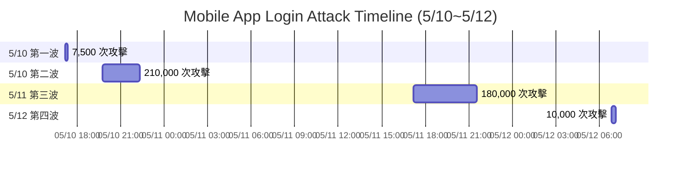
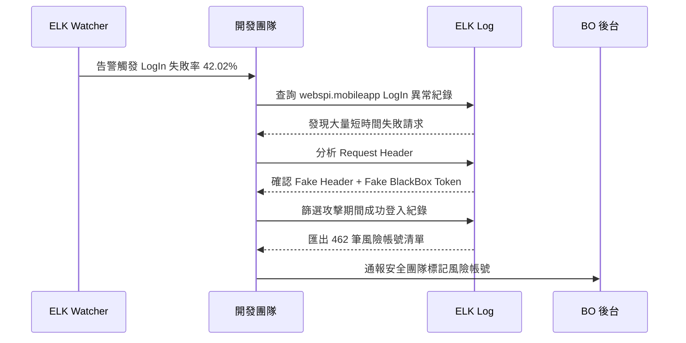
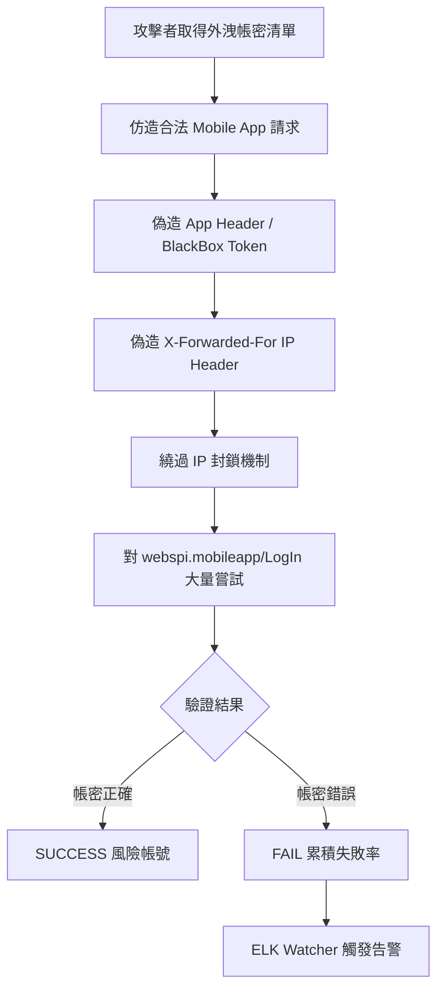
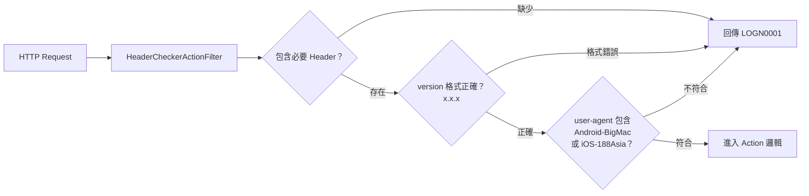

## 背景

2024 年 5 月 10 日，ELK Watcher 於監控期間觸發多次告警，對象為 `webspi.mobileapp` 模組的 `LogIn` 事件。

### ELK Watcher 告警觸發條件

> 計算前 15~30 分鐘的失敗率（依 Module / Method），若與前 15 分鐘相比異常，且最近 15 分鐘內事件超過 10 次，即觸發告警。

| 欄位 | 數值 |
|------|------|
| Module | `webspi.mobileapp` |
| Event | `LogIn` |
| Previous Failure Rate | **1.34%** (89 / 6,622) |
| Current Failure Rate | **42.02%** (5,053 / 12,024) |

失敗率從正常的 1.34% 瞬間飆升至 42.02%，觸發告警後開始調查，發現攻擊者使用**仿造假 Request Header + Fake Token** 對 Mobile App 登入 API 進行大量暴力破解。



<!-- more -->

## 攻擊手法分析

```
正常 Mobile App 請求：
Client ──► API Gateway ──► webspi.mobileapp/LogIn
           [合法 Header + Token]

攻擊者請求：
Attacker ──► API Gateway ──► webspi.mobileapp/LogIn
             [偽造 App Header]
             [偽造 BlackBox Token]
             [偽造 IP Header（X-Forwarded-For）]
```

### 攻擊者的三個特徵

1. **偽造 App Header**：模仿合法 Mobile App 的 User-Agent 與請求格式，使請求看起來來自正常 App 用戶端
2. **偽造 BlackBox Token**：使用假造的風控識別 Token 繞過前端行為分析
3. **偽造 IP 位址**：透過偽造 `X-Forwarded-For` 等 Header 來規避 IP 封鎖



## 攻擊時間軸



| 波次 | 時間區間 | 估計攻擊次數 |
|------|----------|-------------|
| 第一波 | 5/10 17:11 ~ 17:20 | ~7,500 次 |
| 第二波 | 5/10 19:47 ~ 22:18 | ~210,000 次 |
| 第三波 | 5/11 17:12 ~ 21:33 | ~180,000 次 |
| 第四波 | 5/12 06:50 ~ 07:07 | ~10,000 次 |
| **合計** | | **~407,500 次** |

### 第一波：5/10 17:11 ~ 17:20（約 7,500 次）



{% asset_img image04.png "第一波 Status by Module — webspi.mobileapp FAIL/SUCCESS 比例（FAIL 約 75%）" %}

### 第二波：5/10 19:47 ~ 22:18（約 210,000 次）





### 第三波：5/11 17:12 ~ 21:33（約 180,000 次）





### 第四波：5/12 06:50 ~ 07:07（約 10,000 次）





## 事件調查流程



## 成功登入風險帳號

在 407,500 次攻擊中，雖然大多數為失敗嘗試，但仍有部分帳號在攻擊期間成功登入，代表這些帳號的帳密可能已外洩。

從 ELK 篩選出攻擊期間 `webspi.mobileapp / LogIn / SUCCESS` 的紀錄：

```
@timestamp            | module            | event | identity    | status  | AccountId
05-12 07:06:59.875    | webspi.mobileapp  | LogIn | ca65711     | SUCCESS | 18967857
05-12 07:06:52.897    | webspi.mobileapp  | LogIn | shzh123456  | SUCCESS | 41820677
05-12 07:06:40.037    | webspi.mobileapp  | LogIn | yy360360    | SUCCESS | 24962323
05-11 19:30:55.443    | webspi.mobileapp  | LogIn | z812250426  | SUCCESS | 10437625
...（共 462 筆）
```

**時間範圍**：2024-05-11 19:30 ~ 2024-05-12 07:07

這 462 個帳號被列為**高風險帳號**，需通報安全團隊進行後續處置（帳號凍結、強制改密、通知用戶）。

## 根本原因



**核心問題**：API 端對 Mobile App Header 缺乏嚴格驗證，攻擊者得以透過偽造 Header 模仿合法 App 請求，同時偽造 IP 規避封鎖。

## 後續對策

建立 Ticket [IDP-10126] 進行下列改善：

| 對策 | 說明 |
|------|------|
| App Header 驗證強化 | 加入 Action Filter 驗證 `user-agent` 與 `version` Header（暫時修正） |
| BlackBox Token 驗證 | 後端需驗證 BlackBox Token 的合法性，拒絕明顯偽造的值 |
| IP Header 信任來源限制 | 只信任已知的 Load Balancer / CDN 來源的 IP Header |
| 登入頻率限制強化 | 針對同一帳號短時間大量失敗的情況加強 Rate Limit |
| 風險帳號處置 | 強制 462 個風險帳號重設密碼並記錄異常登入紀錄 |

### 暫時修正：HeaderCheckerActionFilter

針對攻擊者偽造 App Header 的問題，第一時間在 Login API 加上 `HeaderCheckerActionFilter`，驗證請求是否包含合法的 `user-agent` 與 `version` Header，不符合者直接回傳 `LOGN0001` 錯誤，阻擋偽造請求進入後端邏輯。



```csharp
public class HeaderCheckerActionFilter : ActionFilterAttribute
{
    private readonly string[] _headerNames;

    public HeaderCheckerActionFilter(params string[] headerNames)
    {
        _headerNames = headerNames;
    }

    public override void OnActionExecuting(HttpActionContext actionContext)
    {
        var headers = HttpHeaderHandler.GetHeadersInfo(actionContext.Request.Headers);
        var fakeMsg = new ResponseMessage<HttpError>
        {
            Id = Guid.NewGuid().ToString(),
            Code = Constants.ErrorCode.LOGN0001.ToString(),
            Msg = Constants.ErrorCode.LOGN0001.DescriptionAttr(),
        };

        foreach (var headerName in _headerNames)
        {
            // Header 不存在直接拒絕
            if (!headers.ContainsKey(headerName))
            {
                actionContext.Response = actionContext.Request.CreateResponse(fakeMsg);
                return;
            }

            // version 必須符合 x.x 或 x.x.x 格式
            if (headerName == "version" && !Regex.IsMatch(headers[headerName], @"^\d+\.\d+(\.\d+)+"))
            {
                actionContext.Response = actionContext.Request.CreateResponse(fakeMsg);
                return;
            }

            // user-agent 必須包含合法 App 識別字串
            if (headerName == "user-agent" &&
                !StringExtension.ContainsIgnoreCase(headers[headerName], "Android-BigMac") &&
                !StringExtension.ContainsIgnoreCase(headers[headerName], "iOS-188Asia"))
            {
                actionContext.Response = actionContext.Request.CreateResponse(fakeMsg);
                return;
            }
        }
    }
}
```

**驗證規則說明：**

| Header | 驗證規則 | 合法範例 |
|--------|----------|----------|
| `version` | 正則 `^\d+\.\d+(\.\d+)+` | `3.2.1`、`10.0.5` |
| `user-agent` | 包含 `Android-BigMac` 或 `iOS-188Asia`（不分大小寫） | `Android-BigMac/3.2.1` |

**使用方式**（套用到 Login Controller）：

```csharp
[HeaderCheckerActionFilter("user-agent", "version")]
public IHttpActionResult Login(LoginRequest request)
{
    // ...
}
```

> **注意**：此為暫時修正，僅靠 User-Agent 字串比對屬於較弱的防禦，攻擊者取得合法 User-Agent 後仍可繞過。長期需配合 App 簽章或動態 Token 機制做更強的驗證。

## 小結

這次事件的發現完全依賴 **ELK Watcher 的自動化告警機制**，在失敗率異常飆升後數分鐘內通知團隊，大幅縮短了事件反應時間。攻擊者使用偽造 Header 手法規避了部分防禦，顯示 API 端對 Mobile App 請求的驗證需要進一步強化，才能有效防堵此類 Credential Stuffing 攻擊。
