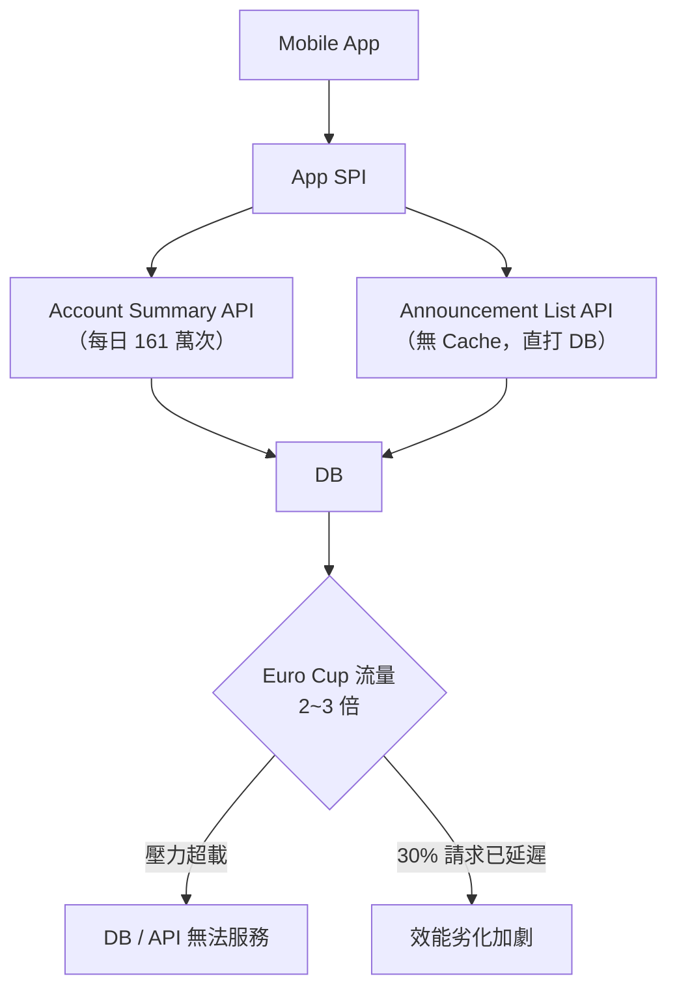
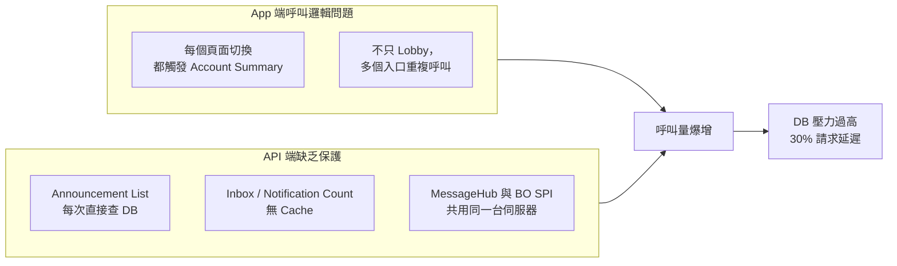
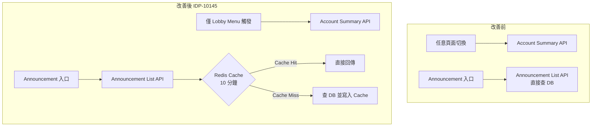
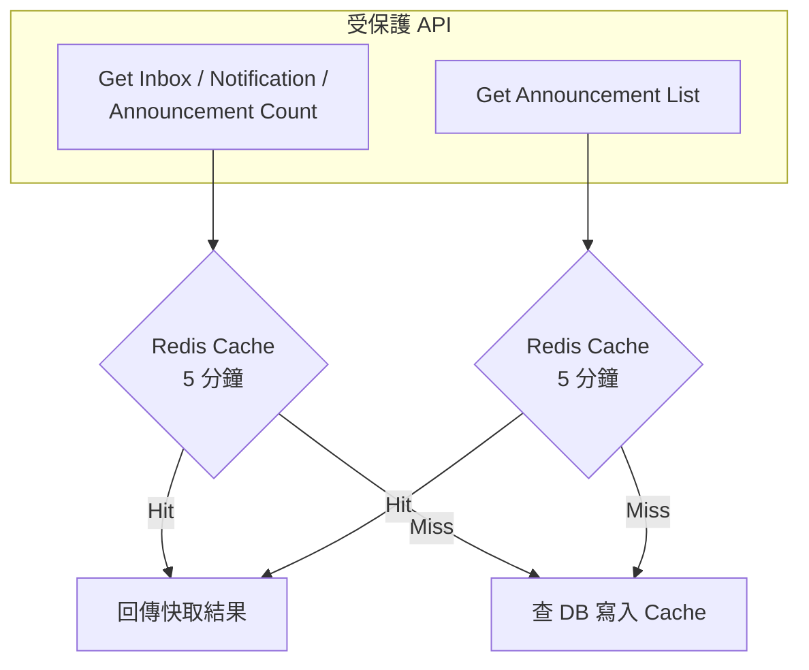
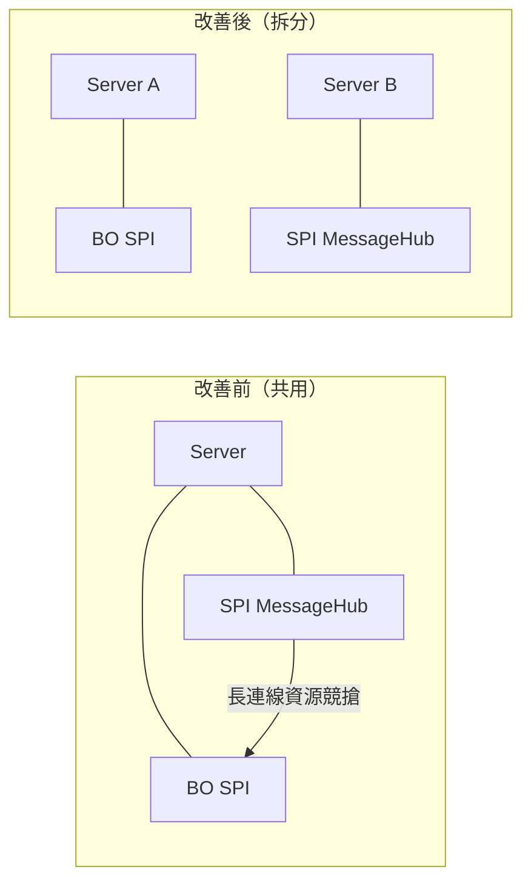

## 背景

2024 年 5 月 17 日，在歐洲盃（Euro Cup）賽季開始前，針對 Mobile App SPI 的 Performance 問題召開專案會議，出席人員涵蓋 App 團隊、BO 團隊與 PM。

會議的核心動機：**歐洲盃期間流量預計達正常的 2~3 倍**，現有 API 設計若未調整，將造成 DB 或 API 無法正常服務。

<!-- more -->

## 問題描述

### API 呼叫量異常：是 STAR4 的 8 倍

透過 ELK REQUEST 日誌對 Account Summary API（收件匣 + 公告未讀數）進行統計：

```
Mobile App SPI Account Summary 呼叫量
= STAR4 RWD 的 8 倍
```

以公告（Announcement）API 為例，數據差異極為顯著：

| 平台 | 每日 API 呼叫量 |
|------|----------------|
| STAR4 RWD | 約 230,000 次 |
| Mobile App SPI | 約 **1,610,000 次** |

Mobile App SPI 的呼叫量是 RWD 的 **7 倍以上**，而兩者服務的用戶基數相近，顯示 App 端存在明顯的多餘呼叫問題。

ELK Performance Log 實際數據對比：





### 效能劣化：30% 請求出現延遲

```
Mobile App SPI：30% 的請求回應時間超過正常門檻
```

這些 API 直接查詢 DB，在歐洲盃高流量期間若無保護機制，DB 壓力將達到臨界點。



## 根本原因分析



**兩層問題同時存在：**
1. **App 端呼叫頻率過高** — Account Summary 不應在每個頁面都觸發，只需在 Lobby 主選單呼叫
2. **API 端缺乏 Cache 保護** — 公告列表、未讀數等低變動資料每次都直查 DB

以下為 App 中涉及高頻呼叫的 UI 元件位置：







## 改善方案

### Ticket IDP-10145：App 端呼叫邏輯調整 + Announcement Cache



**改善項目：**
- **減少 Account Summary 呼叫** — 限制只在 Lobby Menu 觸發，消除其他頁面的多餘呼叫
- **Announcement List 加入 10 分鐘 Cache** — 公告內容變動頻率低，10 分鐘 Cache 可大幅降低 DB 壓力

### Ticket IDP-10136：SPI 端 Cache 保護



**改善項目：**
- **Inbox / Notification / Announcement Count** — 加入 5 分鐘 Redis Cache
- **Announcement List** — 加入 5 分鐘 Redis Cache

### 基礎設施：MessageHub 拆分至獨立伺服器

原本 BO SPI 與 SPI MessageHub 共用同一台伺服器，MessageHub 的長連線特性會佔用大量連線資源，影響一般 SPI 的請求處理。



拆分後：
- BO SPI 與 MessageHub 資源互不干擾
- MessageHub 長連線不再影響一般 API 的回應速度
- 兩者可以各自獨立擴展（Scale Out）

## 改善效益預估

| 項目 | 改善前 | 改善後（預估）|
|------|--------|--------------|
| Account Summary 日呼叫量 | ~1,610,000 次 | 大幅減少（僅 Lobby 觸發）|
| Announcement DB 查詢 | 每次呼叫都查 | Cache Hit 率 > 80%，DB 查詢降至 20% |
| Inbox Count DB 查詢 | 每次呼叫都查 | 5 分鐘內同一用戶只查一次 |
| API 延遲 > 門檻比例 | 30% | 預期降至 < 5% |
| MessageHub 對 SPI 影響 | 資源競搶 | 完全隔離 |

## 小結

這次效能問題的根源在於 App 端呼叫邏輯與 API 端保護機制都不完善，在正常流量下尚可接受，但一旦遇到歐洲盃這類流量高峰，就會造成 DB 無法服務的風險。

改善策略分三個層次：

1. **呼叫頻率控制（App 端）** — 從源頭減少不必要的 API 請求
2. **Cache 保護（API 端）** — Redis 攔截高頻低變動資料，保護 DB
3. **基礎設施隔離（部署端）** — MessageHub 獨立，避免資源競搶

三者缺一不可，才能在歐洲盃高流量期間確保服務穩定。
