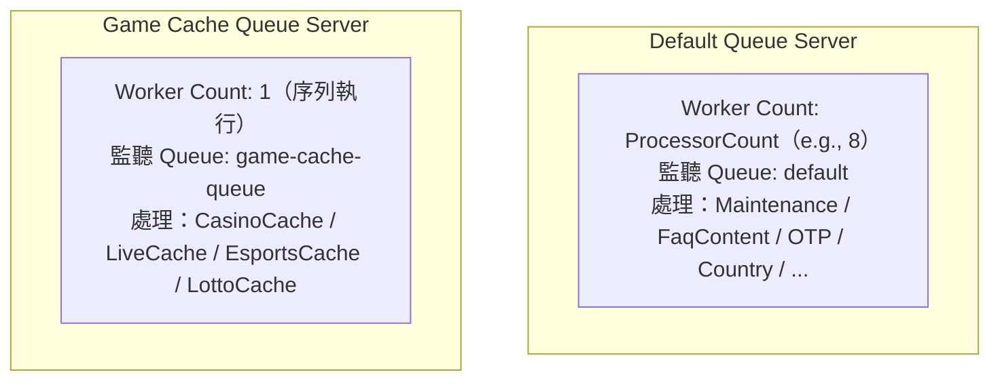

## 問題：重量級 Job 拖垮輕量 Job

所有 Hangfire Job 都跑在同一個 Worker Pool 時，有一個隱藏的資源競爭問題。

以本系統的 Job 分類為例：

**輕量 Job**（毫秒~秒級）：
- `Maintenance`：查一個 API，存一個 key
- `FaqContent`：幾篇 FAQ 文章
- `OTPValidationSetting`：幾筆設定值

**重量 Job**（秒~十幾秒）：
- `CasinoCache`：拉全部 Casino 遊戲清單（數千筆）+ Jackpot feed + 多語言轉換
- `LiveCache`：拉全部 Live Casino 遊戲 + 即時賠率 feed
- `EsportsCache`：拉 Esports 遊戲清單 + 賽事 feed

如果 8 個 Worker 同時執行 `CasinoCache`、`LiveCache`、`EsportsCache`⋯⋯

```
問題 1：SPI API Timeout
  重量 Job 並行呼叫同一個 API，超過 API Rate Limit → Timeout
  Hangfire 自動 Retry → 更多並行請求 → 更多 Timeout → 雪崩

問題 2：輕量 Job 被餓死
  8 個 Worker 全被重量 Job 佔用
  Maintenance（3 分鐘更新一次）無法執行 → 快取過期
```

---

## 解法：多 Queue + 獨立 Worker Pool

Hangfire 支援 **Multi-Server + Multi-Queue** 架構：每個 `BackgroundJobServer` 實例可以只監聽特定 Queue，並有自己獨立的 Worker 數量。



重量 Job 被隔離到 `game-cache-queue`，獨立 1 個 Worker 序列執行，對外 API 的壓力從「N 個並行請求」降為「1 個串行請求」。輕量 Job 的 8 個 Worker 完全不受影響。

---

## 設定驅動的 Multi-Queue（hangfire.json）

Queue 設定完全由設定檔控制，不需要修改程式碼：

```json
{
  "HangfireSetting": {
    "SpecialQueues": [
      {
        "QueueName": "game-cache-queue",
        "WorkerCount": 1
      }
    ],
    "DefaultSpecialQueueWorkerCount": 1
  }
}
```

未來新增一個 `payment-queue` 只需加一筆 JSON，完全不碰 C#。

---

## 核心實作

### Worker Count 決策邏輯（HangfireSetting）

```csharp
public static int GetWorkerCountForQueue(string queueName)
{
    // 優先查明確設定的特殊 Queue
    var specialQueue = GetQueueByPattern(queueName);
    if (specialQueue != null)
        return specialQueue.WorkerCount;

    // 名稱符合 -queue 後綴但沒有明確設定，使用預設值（通常為 1）
    if (IsSpecialQueue(queueName))
        return DefaultSpecialQueueWorkerCount;

    // Default Queue：使用 CPU 核心數，充分利用硬體並行能力
    return Environment.ProcessorCount;
}

public static bool IsSpecialQueue(string queueName)
{
    return queueName.EndsWith("-queue", StringComparison.OrdinalIgnoreCase);
}
```

命名慣例：Queue 名稱以 `-queue` 結尾即為「特殊 Queue」，自動套用 Worker 限制。

### 動態建立多個 BackgroundJobServer（ServiceCollectionExtension）

```csharp
public static IServiceCollection AddHangfireServices(this IServiceCollection services)
{
    // 設定 Hangfire 使用 Redis 作為 Job Storage
    services.AddHangfire((serviceProvider, config) =>
    {
        config.UseRedisStorage(
            HangfireSetting.RedisConnectionString,
            new RedisStorageOptions { Prefix = HangfireSetting.PrefixKey }
        ).WithJobExpirationTimeout(TimeSpan.FromDays(1));
    });

    // 預設 Server（處理 default queue，Worker 數 = CPU 核心數）
    services.AddHangfireServer();

    // 為每個特殊 Queue 建立獨立 Server
    var specialQueues = HangfireSetting.GetAllSpecialQueueNames();
    foreach (var queueName in specialQueues)
    {
        var workerCount = HangfireSetting.GetWorkerCountForQueue(queueName);

        services.AddHangfireServer(options =>
        {
            options.Queues = new[] { queueName };
            options.WorkerCount = workerCount;
            // Server 命名便於在 Hangfire Dashboard 辨識
            options.ServerName = $"{queueName.Replace("-", "").ToUpper()}Server-{Environment.MachineName}";
        });
    }

    return services;
}
```

`ServerName` 格式 `GAMECACHEQUEUE Server-MYSERVER01` 讓 Dashboard 一眼看出每個 Server 負責哪個 Queue。

### Job 指派到 Queue（appCacheSetting.json）

```json
{
  "Name": "CasinoCache",
  "CacheTime": "10",
  "QueueName": "game-cache-queue"   ← 明確路由到特殊 Queue
},
{
  "Name": "Maintenance",
  "CacheTime": "3"
  // QueueName 未設定，預設為 "default"
}
```

`CacheTimeSetting` 的 `QueueName` 預設值為 `"default"`：

```csharp
public class CacheTimeSetting
{
    public AppDataCacheNameEnum Name { get; set; }
    public HangFireJobTimeEnum CacheTime { get; set; }
    public string QueueName { get; set; } = "default";  // 預設 default queue
    // ...
}
```

---

## 設定驗證（Fail Fast）

Hangfire Server 建立時若 `WorkerCount <= 0` 會在運行期才爆，很難 debug。把驗證移到啟動期：

```csharp
public void Validate()
{
    if (DefaultSpecialQueueWorkerCount <= 0)
        throw new ArgumentException("DefaultSpecialQueueWorkerCount must be > 0");

    foreach (var queue in SpecialQueues ?? Enumerable.Empty<SpecialQueueConfig>())
    {
        if (string.IsNullOrEmpty(queue.QueueName))
            throw new ArgumentException("SpecialQueue QueueName cannot be empty");
        if (queue.WorkerCount <= 0)
            throw new ArgumentException($"Queue '{queue.QueueName}' WorkerCount must be > 0");
    }
}
```

設定錯誤 → 啟動失敗 → 明確錯誤訊息，不會等到 Job 執行時才無聲失敗。

---

## 實戰：如何新增一支 Job 並指定 Queue

以下用新增一支 `SmsNotification` Job 為例，完整走一次四個步驟。

---

### 情境一：加入已有的 Queue（例如 `game-cache-queue`）

只需改動 **三個地方**。

---

#### Step 1 — 定義介面

路徑：`Application/Interfaces/ISmsNotificationJob.cs`

```csharp
namespace Application.Interfaces
{
    public interface ISmsNotificationJob
    {
        Task DoJob();
    }
}
```

> 命名規則固定為 `I{JobName}Job`，`JobInitializeService` 會用 Reflection 自動用這個名稱找到你的介面，名稱不符合就找不到。

---

#### Step 2 — 實作 Job 類別

路徑：`Application/Jobs/SmsNotificationJob.cs`

```csharp
namespace Application.Jobs
{
    public class SmsNotificationJob : ISmsNotificationJob
    {
        public async Task DoJob()
        {
            // 實際業務邏輯
        }
    }
}
```

---

#### Step 3 — 在 DI 容器註冊

路徑：`Application/DependencyInjection/ServiceCollectionExtension.cs`

在 `AddApplicationServices()` 裡加一行：

```csharp
// 找到其他 Job 的註冊行，在附近加入
services.AddTransient<ISmsNotificationJob, SmsNotificationJob>();
```

> 沒有這行的話，`JobInitializeService` 在 `ValidateServiceRegistration()` 階段就會拋錯，App 無法啟動。

---

#### Step 4 — 在設定檔新增排程設定

路徑：`Presentation/webspi.frontend.cache/Configs/appCacheSetting.json`

```json
{
  "AppCacheSetting": {
    "CacheTimeSettings": [
      // ... 其他 Job ...
      {
        "Name": "SmsNotification",
        "CacheTime": "5",
        "QueueName": "game-cache-queue"
      }
    ]
  }
}
```

| 欄位 | 說明 |
|---|---|
| `Name` | 必須和介面名稱 `I{Name}Job` 對應，大小寫一致 |
| `CacheTime` | 執行頻率（分鐘），對應 `HangFireJobTimeEnum` 的數值 |
| `QueueName` | 要路由到哪個 Queue；不填預設為 `"default"` |

完成。重啟 App 後 `JobInitializeService` 會自動在 Hangfire 掛上這支排程。

---

### 情境二：新增一個全新的 Queue

如果 `game-cache-queue` 的 Worker=1 不適合你的需求（例如你需要 2 個 Worker），或你想把某類 Job 完全獨立出來，就需要建立新 Queue。

在情境一的四個步驟之外，多加一個步驟：

#### Step 0（額外）— 在 hangfire.json 宣告新 Queue

路徑：`Presentation/webspi.frontend.cache/Configs/hangfire.json`

```json
{
  "HangfireSetting": {
    "SpecialQueues": [
      {
        "QueueName": "game-cache-queue",
        "WorkerCount": 1
      },
      {
        "QueueName": "sms-queue",
        "WorkerCount": 2
      }
    ]
  }
}
```

加入後，`ServiceCollectionExtension.AddHangfireServices()` 會在啟動時自動為 `sms-queue` 建立一個獨立的 `BackgroundJobServer`，配置 2 個 Worker。

然後 Step 4 的 `appCacheSetting.json` 把 `QueueName` 設為 `"sms-queue"` 即可：

```json
{
  "Name": "SmsNotification",
  "CacheTime": "5",
  "QueueName": "sms-queue"
}
```

> **命名慣例**：Queue 名稱結尾要加 `-queue`（例如 `sms-queue`、`payment-queue`），`HangfireSetting.IsSpecialQueue()` 靠這個後綴來識別特殊 Queue。不符合慣例的 Queue 名稱會被視為 default queue，不會建立獨立 Server。

---

### 新增 Job 的完整檔案清單

| 情境 | 需要改動的檔案 |
|---|---|
| **加入已有 Queue** | ① 新增 `Interfaces/I{Name}Job.cs` ② 新增 `Jobs/{Name}Job.cs` ③ `DependencyInjection/ServiceCollectionExtension.cs` ④ `Configs/appCacheSetting.json` |
| **新增全新 Queue** | 同上，再加 ⑤ `Configs/hangfire.json` |

---

## 實際 Queue 分配一覽

依據 `appCacheSetting.json` 的設定：

| Queue | Job | Worker 數 | 執行模式 |
|---|---|---|---|
| `default` | Maintenance, BankMaintenance, OTPValidation, FaqContent, PmsSetting, Affiliate, ... | ProcessorCount | 並行 |
| `game-cache-queue` | EsportsCache, CasinoCache, LiveCache, LottoCache, PromoCache, VirtualCache, ChessCache | 1 | 序列 |

---

## 多實例部署的擴展方式

當單台 Server 的 `game-cache-queue` 處理不過來（Job 積壓），不需要修改程式碼，只需部署第二台 Server 並讓它只監聽 `game-cache-queue`：

```
Server A：default queue（8 workers）+ game-cache-queue（1 worker）
Server B：game-cache-queue only（1 worker）
```

兩台 Server 共享同一個 Redis Job Storage，Hangfire 自動做 Job 分配，`game-cache-queue` 的吞吐量翻倍。

---

## 效益對比

| 場景 | 單一 Queue | Multi-Queue |
|---|---|---|
| 重量 Job 執行中 | 輕量 Job 被排隊等待 | 輕量 Job 不受影響 |
| SPI API 並行壓力 | N 個 Worker 同時打 API | Game Queue 序列，一次一個 |
| Job 積壓時的擴展 | 加 Worker → 更多 API 壓力 | 加 Game Server → 獨立擴展 |
| Queue 設定變更 | 改程式碼 + 部署 | 改 JSON + 重啟 |
| Dashboard 可見度 | 所有 Job 混在一起 | 各 Queue 分開監控 |

---

## 小結

Multi-Queue 架構的核心價值是**資源隔離**：不讓一類工作的資源消耗影響到另一類工作的 SLA。

設計要點：
1. **以 `-queue` 後綴作為特殊 Queue 的命名慣例**，便於自動識別
2. **每個特殊 Queue 對應獨立的 `BackgroundJobServer`**，Worker 數可獨立設定
3. **設定驅動**：新增 Queue 只需改 JSON，程式碼本身是通用的
4. **啟動期驗證**：錯誤設定立即爆出，不等到執行期
