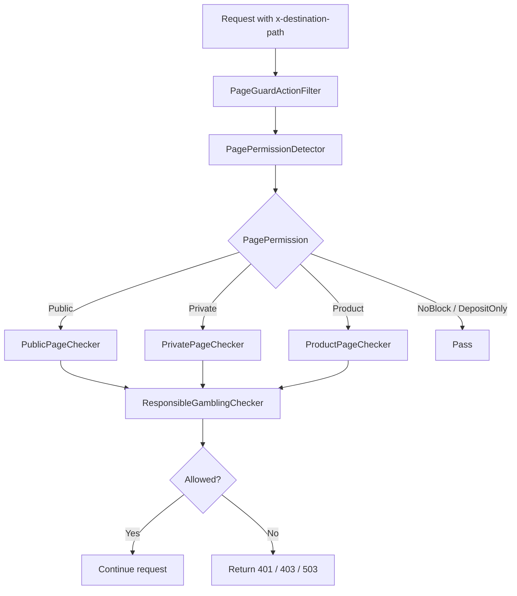

## 前言

大型網站通常不是只有「登入」與「未登入」兩種頁面。

真實平台會有更多分類：

- Public Page：首頁、註冊、FAQ
- Private Page：我的帳戶、Inbox、裝置確認
- Product Page：Sports、Casino、Lotto 等遊戲頁
- NoBlock Page：Live Chat、Pre Chat
- DepositOnly / 特殊狀態頁

再加上維護狀態、產品地區限制、Responsible Gambling 限制，頁面權限就不能只靠一個 `[Authorize]` 解決。

這個專案用 `PagePermissionDetector`、`RouteConstraint`、`PageGuardActionFilter` 與 `ResponsibleChain` 組成一條後端頁面權限管線。

## 相關檔案

```text
src/AgileBet.Cash.Portal.Web/Utilities/PagePermissionDetector.cs
src/AgileBet.Cash.Portal.Web/Routing/PublicPageRouteConstraint.cs
src/AgileBet.Cash.Portal.Web/Routing/PrivatePageRouteConstraint.cs
src/AgileBet.Cash.Portal.Web/Routing/ProductRouteConstraint.cs
src/AgileBet.Cash.Portal.Web/HttpActionFilter/PageGuardActionFilter.cs
src/AgileBet.Cash.Portal.Web/Helper/PageCheckHelper.cs
src/AgileBet.Cash.Portal.Web/Utilities/UserPagePermissionChecker.cs
```

## 第一層：PagePermissionDetector

`PagePermissionDetector` 負責把 URL page 判斷成權限類型：

```csharp
public PagePermission DetectPagePermission(string page, string path)
{
    if (string.IsNullOrEmpty(page))
    {
        return PagePermission.Public;
    }
    if (Check(privatePageRules, page, path))
    {
        return PagePermission.Private;
    }
    if (Check(publicPageRules, page, path))
    {
        return PagePermission.Public;
    }
    if (IsProductPage(page))
    {
        return PagePermission.Product;
    }
    if (Check(noBlockPageRules, page, path))
    {
        return PagePermission.NoBlock;
    }
    return PagePermission.None;
}
```

這裡不是用 route name 判斷，而是用 page/path 對應規則。

例如 private page：

```csharp
private static readonly List<PageRoutingModel> privatePageRules =
    new List<PageRoutingModel>()
{
    new PageRoutingModel()
    {
        PageName = "my-account",
        IgnorePath = new List<string>() { "sports" }
    },
    new PageRoutingModel() { PageName = "inbox" },
    new PageRoutingModel() { PageName = "privilege-club" },
    new PageRoutingModel() { PageName = "device-confirmation" }
};
```

Public page：

```csharp
new PageRoutingModel() { PageName = "home" },
new PageRoutingModel() { PageName = "user" },
new PageRoutingModel() { PageName = "faqs" },
new PageRoutingModel() { PageName = "support" },
new PageRoutingModel() { PageName = "sign-up" },
new PageRoutingModel() { PageName = "new-device-verify" }
```

`IgnorePath` 是這裡很實用的細節。像 `my-account` 通常是 private，但某些 path 包含 `sports` 時要排除，避免過度攔截。

## Product Page 由設定驅動

Product page 不是 hardcode list，而是從 `AppConfigManager.RegionProducts` 判斷：

```csharp
private bool IsProductPage(string page)
{
    var prodSetting = AppConfigManager.RegionProducts
        .FirstOrDefault(x =>
            x.Name.Equals(page) ||
            (string.IsNullOrEmpty(x.RegexPath) ? false :
                Regex.IsMatch(page, $"{x.RegexPath.Replace("|", "$|")}$",
                    RegexOptions.IgnoreCase))
        );
    return prodSetting != null;
}
```

這代表新增產品或 region product mapping 時，不一定要改 route 程式碼，而是可以透過 config 擴充。

## 第二層：RouteConstraint

MVC route 用 `IRouteConstraint` 決定該 URL 是否符合某種頁面類型。

Public route：

```csharp
public bool Match(
    HttpContextBase httpContext,
    Route route,
    string parameterName,
    RouteValueDictionary values,
    RouteDirection routeDirection)
{
    var page = values[parameterName]?.ToString();
    if (page == null)
    {
        return false;
    }
    if (values.ContainsKey("path"))
    {
        var path = values["path"]?.ToString();
        return Detector.DetectPagePermission(page, path) == PagePermission.Public;
    }
    return false;
}
```

Private route 特別排除 logout：

```csharp
if (page == null || page == "logout")
{
    return false;
}
```

Product route 排除 sports 和 lobby：

```csharp
if (page == "sports")
{
    return false;
}

if (path != null && path.Contains("lobby"))
{
    return false;
}

return Detector.DetectPagePermission(page, path) == PagePermission.Product;
```

這些小規則看起來零碎，但正是大型站點 routing 的真實樣貌：不是所有頁面都能用一條泛用 route 吃掉。

## 第三層：PageGuardActionFilter

前面 RouteConstraint 解決的是 MVC route matching；API 或前端導頁時，仍需要後端檢查目標頁是否可進入。

`PageGuardActionFilter` 會讀 `x-destination-path`：

```csharp
private Tuple<string, string> GetPageAndPath(HttpActionContext actionContext)
{
    if (actionContext.Request.Headers.TryGetValues("x-destination-path",
        out var destinationPathValues))
    {
        var destinationPath = destinationPathValues.FirstOrDefault();
        var page = destinationPath != null
            ? destinationPath.ToString().Split('/').Skip(2).FirstOrDefault()
            : "";
        return Tuple.Create(page, destinationPath);
    }
    return Tuple.Create(string.Empty, string.Empty);
}
```

也就是說前端可以在 API request 帶上即將前往的 path，後端再根據該 path 判斷是否允許。

## Access Gate：先判斷是否允許進站

第一道關卡：

```csharp
var isAllowToAccess = trading.IsAllowedToAccess.HasValue
    ? trading.IsAllowedToAccess.Value
    : false;

if ((isAllowToAccess || trading.IsCrawler) == false)
{
    actionContext.Response =
        actionContext.Request.CreateErrorResponse(HttpStatusCode.Forbidden,
            new HttpError());
}
```

這裡允許兩種身份：

- 正常可訪問使用者
- crawler

如果兩者都不是，直接 403。

## 權限類型對應不同 Checker

```csharp
var permission = detector.DetectPagePermission(page, path);

switch (permission)
{
    case PagePermission.Private:
        var privateChecker =
            new PrivatePageChecker(new ResponsibleGamblingChecker(null));
        break;

    case PagePermission.Public:
        var publicChecker =
            new PublicPageChecker(new ResponsibleGamblingChecker(null));
        break;

    case PagePermission.Product:
        var productChecker =
            new ProductPageChecker(new ResponsibleGamblingChecker(null));
        break;
}
```

每種頁面先跑自己的 checker，再接 Responsible Gambling checker。

這是一個 Chain of Responsibility：

```text
PrivatePageChecker
    -> ResponsibleGamblingChecker

PublicPageChecker
    -> ResponsibleGamblingChecker

ProductPageChecker
    -> ResponsibleGamblingChecker
```

## PageCheckHelper：實際權限檢查

Private page：

```csharp
public Tuple<HttpStatusCode, string> CheckPrivatePage(SessionData session)
{
    var trading = session.Trading;

    if (checker.IsMaintenance(session))
    {
        return Tuple.Create(HttpStatusCode.ServiceUnavailable, "");
    }

    if (!trading.IsAuthenticated || trading.ChangePasswordFlag)
    {
        return Tuple.Create(HttpStatusCode.Unauthorized,
            "please login to continue");
    }

    var (isValid, remark) = checker.IsAccountValidate(session);
    if (isValid == false)
    {
        return Tuple.Create(HttpStatusCode.Unauthorized,
            ((int)remark).ToString());
    }

    return Tuple.Create(HttpStatusCode.OK, "");
}
```

Product page：

```csharp
public Tuple<HttpStatusCode, string> CheckProductPage(
    SessionData session,
    string prod)
{
    if (checker.IsMaintenance(session))
    {
        return Tuple.Create(HttpStatusCode.ServiceUnavailable, "");
    }

    if (checker.IsProdForbidden(session, prod))
    {
        return Tuple.Create(HttpStatusCode.Forbidden,
            $"prodforbidden={prod}");
    }

    return Tuple.Create(HttpStatusCode.OK, "");
}
```

Public page 只檢查 maintenance：

```csharp
public Tuple<HttpStatusCode, string> CheckPublicPage(SessionData session)
{
    if (checker.IsMaintenance(session))
    {
        return Tuple.Create(HttpStatusCode.ServiceUnavailable, "");
    }
    return Tuple.Create(HttpStatusCode.OK, "");
}
```

## Responsible Gambling 作為最後一層

`ResponsibleGamblingChecker` 不關心頁面是 Public、Private 還是 Product，只關心這個使用者狀態是否允許進入目標 path：

```csharp
if (permissionChecker.IsInDisallowPath(
    setting.Session,
    setting.DisAllowRgStatus,
    setting.DestinationPath,
    setting.ByPassPathChecker))
{
    return new Tuple<HttpStatusCode, string>(
        HttpStatusCode.Forbidden,
        LimitHttpStatus.LimitAccess.ToString().ToLower());
}
```

這個設計的好處是 Responsible Gambling 不需要散落到各種 checker 裡，它是一個獨立的最後關卡。

## if/else 可以怎麼收斂

這套設計的方向是對的，但目前有幾個地方容易隨規則增加而變成 if/else 堆疊：

- `PagePermissionDetector` 用固定順序判斷 private / public / product / no block
- `RouteConstraint` 各自處理 page/path 解析與特例
- `PageGuardActionFilter` 用 `switch` 建立不同 checker chain
- `PageCheckHelper` 裡面有很多 guard clause

我會保留 `PageCheckHelper` 的 guard clause。maintenance、login、account validate 都是線性關卡，直接 return 反而清楚。真正值得收斂的是「會隨規則新增而一直長大」的分派邏輯。

### 1. PagePermissionDetector 改成規則列

目前寫法是程式碼控制順序：

```csharp
if (Check(privatePageRules, page, path)) return PagePermission.Private;
if (Check(publicPageRules, page, path)) return PagePermission.Public;
if (IsProductPage(page)) return PagePermission.Product;
if (Check(noBlockPageRules, page, path)) return PagePermission.NoBlock;
```

可以改成 ordered rule list，讓順序與判斷集中在一個資料結構：

```csharp
private readonly IReadOnlyList<PagePermissionRule> rules = new[]
{
    new PagePermissionRule(PagePermission.Private,
        (page, path) => Check(privatePageRules, page, path)),
    new PagePermissionRule(PagePermission.Public,
        (page, path) => Check(publicPageRules, page, path)),
    new PagePermissionRule(PagePermission.Product,
        (page, path) => IsProductPage(page)),
    new PagePermissionRule(PagePermission.NoBlock,
        (page, path) => Check(noBlockPageRules, page, path)),
};

public PagePermission DetectPagePermission(string page, string path)
{
    if (string.IsNullOrEmpty(page))
    {
        return PagePermission.Public;
    }

    return rules.FirstOrDefault(rule => rule.IsMatch(page, path))?.Permission
        ?? PagePermission.None;
}
```

這樣新增 `DepositOnly` 或特殊 page type 時，主要是加 rule，不是在 method 裡繼續加 `if`。

### 2. Permission 到 checker chain 改成 factory map

`PageGuardActionFilter` 的 `switch` 可以改成 dictionary，把「PagePermission 對應哪條 chain」變成配置：

```csharp
private readonly IReadOnlyDictionary<PagePermission, Func<IPageChecker>> checkerFactories =
    new Dictionary<PagePermission, Func<IPageChecker>>
{
    [PagePermission.Private] = () =>
        new PrivatePageChecker(new ResponsibleGamblingChecker(null)),
    [PagePermission.Public] = () =>
        new PublicPageChecker(new ResponsibleGamblingChecker(null)),
    [PagePermission.Product] = () =>
        new ProductPageChecker(new ResponsibleGamblingChecker(null)),
};

if (!checkerFactories.TryGetValue(permission, out var createChecker))
{
    return Allow();
}

var checker = createChecker();
var result = checker.Check(context);
```

如果頁面類型越來越多，這個 map 還可以抽到 `PageCheckerFactory`，讓 action filter 只負責管線，不負責組裝細節。

### 3. RouteConstraint 抽出共用 base

Public / Private / Product route 都在做相似的事：解 page、解 path、套特例、呼叫 detector。可以留下各自的特例，但把重複流程收到 base class：

```csharp
protected abstract PagePermission TargetPermission { get; }

protected virtual bool ShouldSkip(string page, string path)
{
    return false;
}

public bool Match(...)
{
    var routePage = GetPage(values, parameterName);
    var routePath = GetPath(values);

    if (string.IsNullOrEmpty(routePage) || ShouldSkip(routePage, routePath))
    {
        return false;
    }

    return Detector.DetectPagePermission(routePage, routePath) == TargetPermission;
}
```

`ProductRouteConstraint` 只要 override `ShouldSkip` 處理 sports / lobby，主流程不用重複寫。

## 完整流程



## 小結

這套設計的核心不是單一技術，而是責任拆分：

- `PagePermissionDetector`：判斷頁面類型
- `RouteConstraint`：讓 MVC route 選對 controller
- `PageGuardActionFilter`：API 層集中做頁面權限檢查
- `PageCheckHelper`：封裝 maintenance / login / product forbidden
- `ResponsibleGamblingChecker`：補上法規與風控限制

如果只用 `[Authorize]`，這些邏輯最後會全部塞進 Controller 或前端 router guard。這個專案把它們拆成後端管線，讓頁面權限可以被測試、被擴充，也能在前端繞過時仍然生效。
