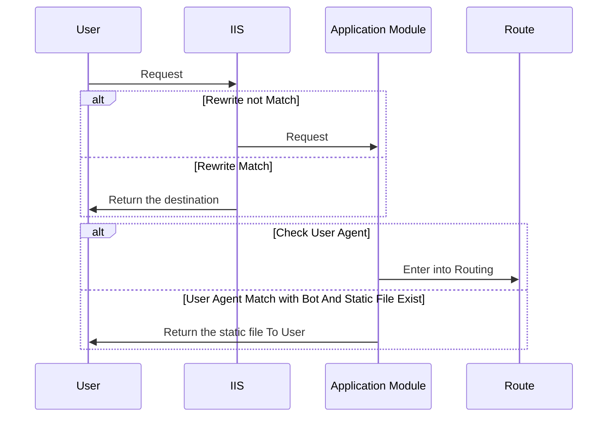
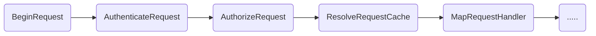

此篇文章是介紹 SEO Prerender，可能很多人會大概會想說聽過 Server Side Render 以及 Client Side Render ，
Prerender 簡單來說就是預先將網頁 snap shot 起來，等到搜尋引擎來的時候 就不需要當場在渲染頁面

以下是這三種方法的介紹以及優缺點


我這裡總結一下
**就是 Prerender 以及 Server Side Render 都是後端產生的 html 差異在**

> Prerender 是預先拿取 snapshot 的檔案回來，效能比較好但是比較不即時
> Server Side Render 是當下的 Request 才開始渲染網頁，比較消耗效能 但是比較即時

所以就看大家怎麼選擇

# Asp.net 實作 Prerender

我們這裡會稍微介紹一下 怎麼使用 Asp.net 實作一個 Prerender 檢查的 Dll ,

首先我們要先知道在 Request 的什麼階段比較適合將 Snap Shot 的檔案回傳給搜尋引擎

那以下是我們的介紹

### Request Flow

我們先來介紹當一個 Request 進到 IIS Server 中的生命週期

簡單來說 IIS 上面有一些預先檢查 EX: URL Rerewrite . 當這些檢查如果都不符合的時候
就會開始進到 Asp.net 生命週期，所以在做 Prerender 的檢查應該使用 Application Module
在 Request 還沒有進到 Asp.net 驗證以及 Routing 之前判斷，如果根據某一些 User Agent 就應該將預設好的 html
回給 search engine



### Application Flow

這是 ASP.NET 應用程式生命週期流程圖 這裡不多加詳述
剛剛說的檢查是否為 Search Engine 應該在 BeginRequest 就檢查，避免做太多不必要的檢查之類
因為看到 MapRequestHandler 代表就是已經進到 Route Config 裡面了



### 使用 BeginRequest 實作

```C#

using System;
using System.Web;

public class Global : HttpApplication
{
    protected void Application_BeginRequest(object sender, EventArgs e)
    {

        bool isRouteRequest = RouteTable.Routes.GetRouteData(new HttpContextWrapper(Context)) != null;
        // 判斷條件
        if (isSearchAgent(Request.UserAgent.ToLower()) && isNotStaticFileOrAjaxRequest() && isRouteRequest)
        {
            //回傳SnapShot檔案
        }
    }

    public bool isSearchAgent(string userAgent)
    {
        string[] searchEngineUserAgents = { "googlebot", "bingbot", "yahoo", "baiduspider", "yandex" };

        bool isSearchEngine = false;
        foreach (var searchEngineUserAgent in searchEngineUserAgents)
        {
            if (userAgent.Contains(searchEngineUserAgent))
            {
                isSearchEngine = true;
                break;
            }
        }
        return true;
    }

    public bool isNotStaticFileOrAjaxRequest()
    {
        // 檢查是否為AJAX請求
        bool isAjaxRequest = string.Equals(Request.Headers["X-Requested-With"], "XMLHttpRequest", StringComparison.OrdinalIgnoreCase);

        // 檢查是否為靜態檔案存取
        string fileExtension = System.IO.Path.GetExtension(Request.Url.AbsolutePath).ToLower();
        bool isStaticFileRequest = fileExtension == ".css" || fileExtension == ".js" || fileExtension == ".jpg" || fileExtension == ".png" || fileExtension == ".gif";
        return !isAjaxRequest && !isStaticFileRequest;
    }
}

```

上述的例子是直接在 global.asax 裡面直接判斷，也可以使用 modules 來達到這件事情。

下面是常見的搜尋引擎的 UserAgent

| 搜索引擎   | User-Agent                                                                          |
| ---------- | ----------------------------------------------------------------------------------- |
| Google     | Googlebot/2.1 (+http://www.google.com/bot.html)                                     |
| Bing       | Mozilla/5.0 (compatible; bingbot/2.0; +http://www.bing.com/bingbot.htm)             |
| Baidu      | Mozilla/5.0 (compatible; Baiduspider/2.0; +http://www.baidu.com/search/spider.html) |
| Yahoo      | Mozilla/5.0 (compatible; Yahoo! Slurp; http://help.yahoo.com/help/us/ysearch/slurp) |
| Yandex     | Mozilla/5.0 (compatible; YandexBot/3.0; +http://yandex.com/bots)                    |
| DuckDuckGo | DuckDuckBot/1.0; (+http://duckduckgo.com/duckduckbot.html)                          |
| Sogou      | Sogou web spider/4.0(+http://www.sogou.com/docs/help/webmasters.htm#07)             |

# 結論

使用 Prerender 好處在於說可以自己決定要回傳什麼時候的 SnapShot 檔案給搜尋引擎使用，

但是反之也要注意更新檔案的頻率。
