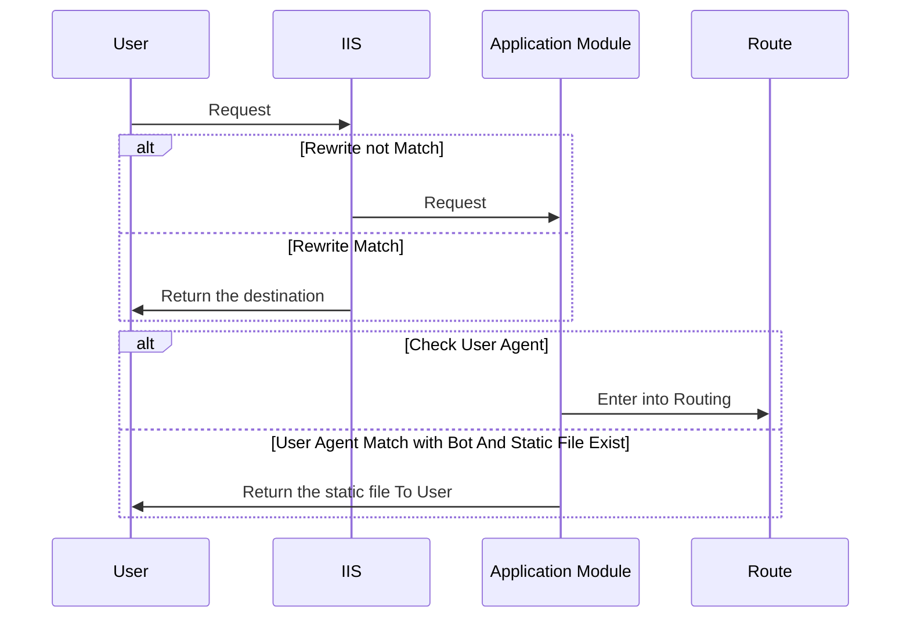

此篇文章是介紹 SEO Prerender，可能很多人會大概會想說聽過 Server Side Render 以及 Client Side Render ，
Prerender 簡單來說就是預先將網頁 snap shot 起來，等到搜尋引擎來的時候 就不需要當場在渲染頁面

以下是這三種方法的介紹以及優缺點


我這裡總結一下
**就是 Prerender 以及 Server Side Render 都是後端產生的 html 差異在**

> Prerender 是預先拿取 snapshot 的檔案回來，效能比較好但是比較不即時
> Server Side Render 是當下的 Request 才開始渲染網頁，比較消耗效能 但是比較即時

所以就看大家怎麼選擇

# Asp.net 實作 Prerender

我們這裡會稍微介紹一下 怎麼使用 Asp.net 實作一個 Prerender 檢查的 Dll

### Request Flow

我們先來介紹當一個 Request 進到 IIS Server 中的生命週期

簡單來說 IIS 上面有一些預先檢查 EX: URL Rerewrite . 當這些檢查如果都不符合的時候
就會開始進到 Asp.net 生命週期，所以在做 Prerender 的檢查應該使用 Application Module
在 Request 還沒有進到 Asp.net 驗證以及 Routing 之前判斷，如果根據某一些 User Agent 就應該將預設好的 html
回給 search engine

### Application Flow

這是 ASP.NET 應用程式生命週期流程圖 這裡不多加詳述
剛剛說的檢查是否為 Search Engine 應該在 BeginRequest 就檢查，避免做太多不必要的檢查之類
因為看到 MapRequestHandler 代表就是已經進到 Route Config 裡面了

