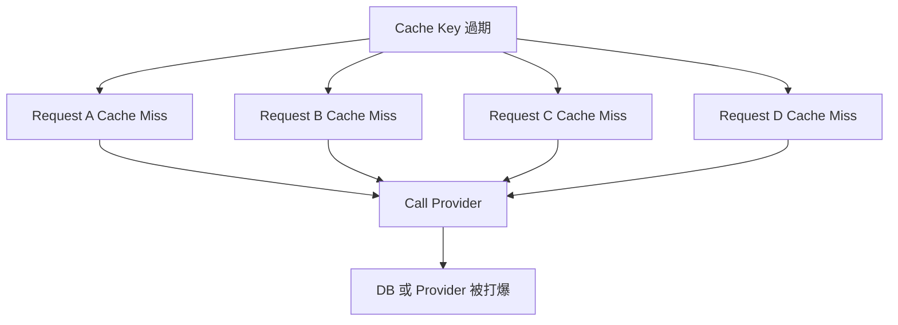
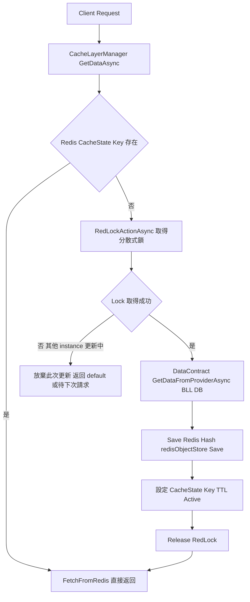
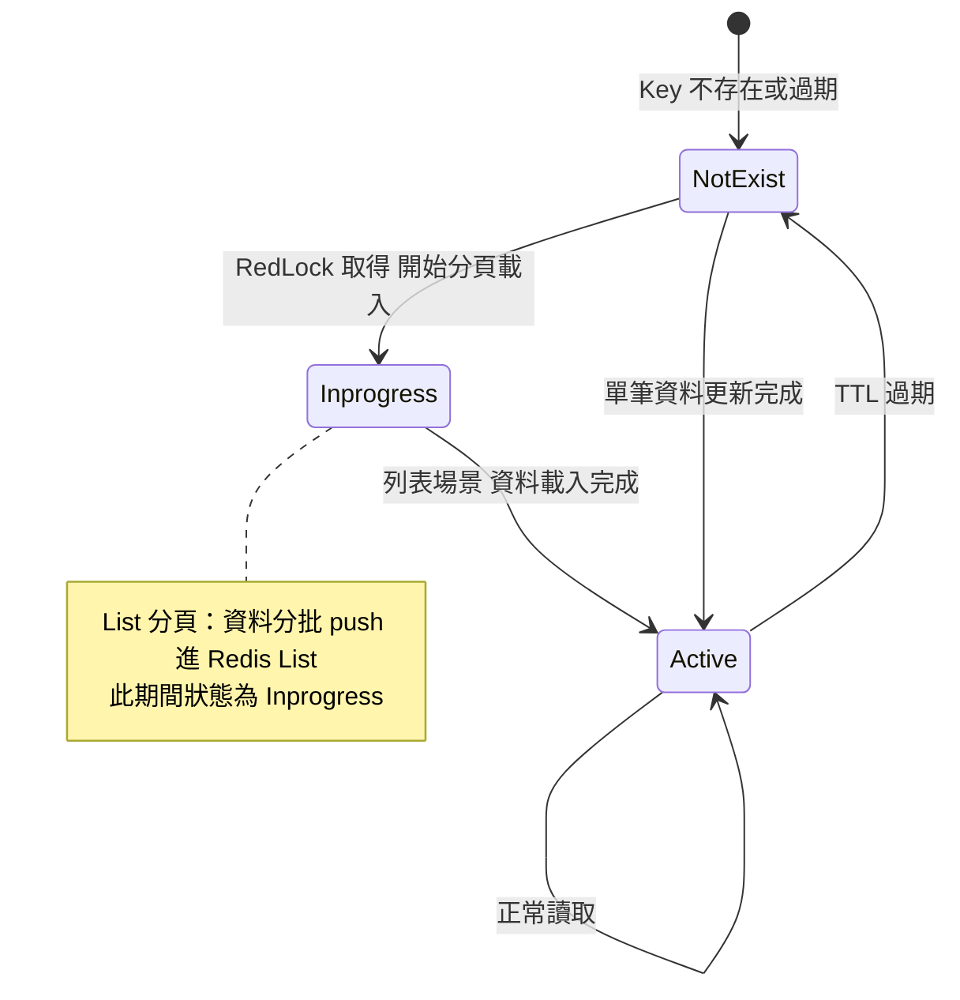
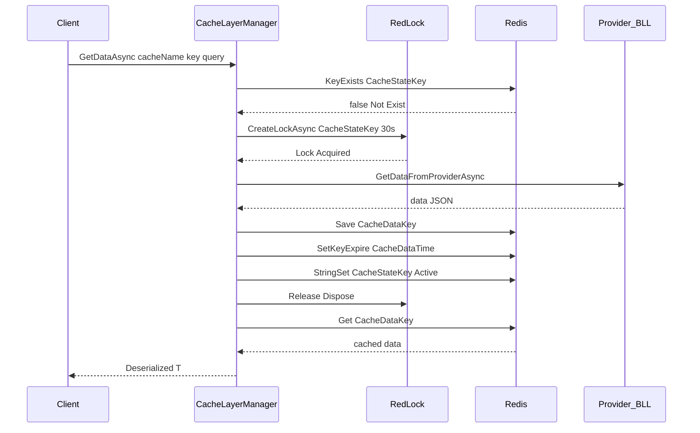
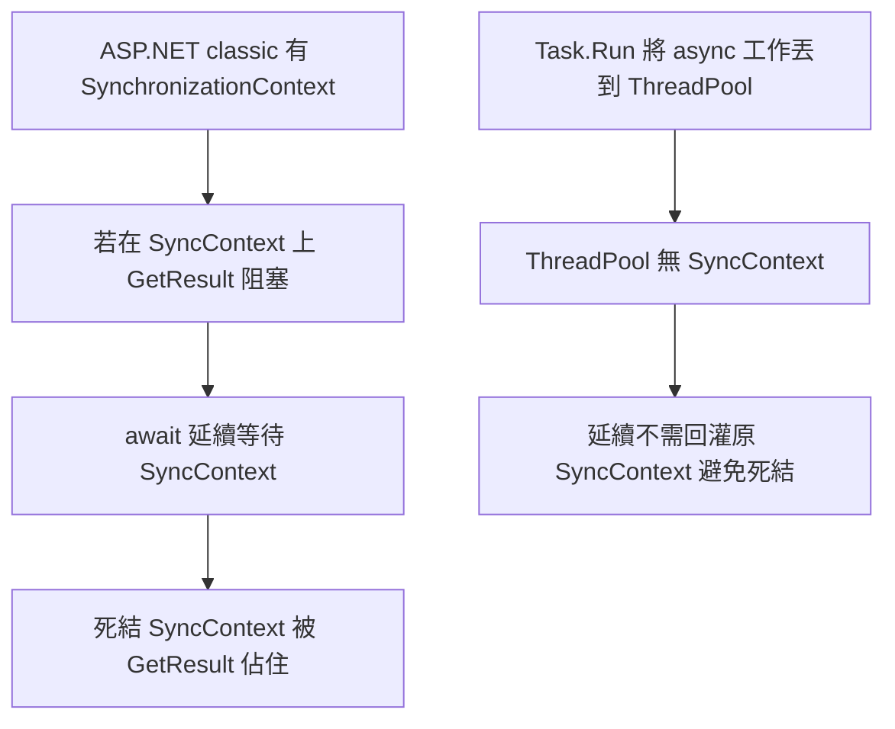
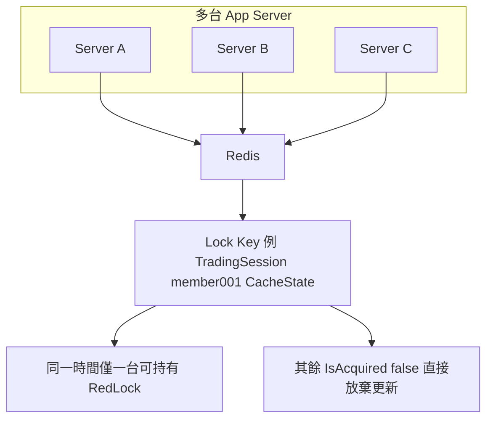

## 背景問題：Cache Stampede（快取雪崩）

在高並發環境下，當某個 Redis cache key 同時過期，大量請求會同時發現 cache miss 並全部打向後端 DB / Provider，這就是 **Cache Stampede**。



**解決方案：** 在更新 Cache 時加 **分散式鎖（RedLock）**，確保同一時間只有一個 instance 去 Provider 取資料並回填 Cache。

<!-- more -->

## 系統架構



## 核心元件

### 1. RedLockService — 工廠初始化

```csharp
// RedLockService.cs
public static class RedLockService
{
    private static RedLockFactory _redLockFactory;

    public static void InitRedLockFactory()
    {
        if (_redLockFactory == null)
        {
            var redlockmultiplexer = RedisUtil.connectionPool
                .GetRedLockMultiplexer("OneTimeToken");
            _redLockFactory = RedLockFactory.Create(redlockmultiplexer);
        }
    }

    public static RedLockFactory GetRedLockFactory() => _redLockFactory;
}
```

- 使用 `RedLockNet.SERedis` NuGet 套件
- `RedLockFactory` 以 `OneTimeToken` Redis connection 建立
- Singleton pattern，整個 App 共用同一個 Factory

### 2. RedLock Key 設計

```csharp
// CacheLayerManager.cs
private static string GetCacheStateKey(CacheName cacheName, string objKey)
{
    return string.Join(":", cacheName.ToString(), objKey.ToLower(), "CacheState");
}
```

**Key 格式：** `{CacheName}:{memberKey}:CacheState`

例如：`TradingSession:member001:CacheState`

> RedLock 直接鎖 CacheState Key，因為這個 key 同時也是 cache 是否存在的狀態旗標，語義一致。

### 3. RedLockActionAsync — 非同步鎖

```csharp
private static async Task RedLockActionAsync(
    CacheName cacheName,
    string key,
    string functionName,
    Func<Task> func)
{
    string cacheStateKey = GetCacheStateKey(cacheName, key);

    // 嘗試取得分散式鎖，最多持有 30 秒
    using (var redLock = await RedLockService.GetRedLockFactory()
        .CreateLockAsync(cacheStateKey, TimeSpan.FromSeconds(30))
        .ConfigureAwait(false))
    {
        if (!redLock.IsAcquired)
            return; // 鎖被其他 instance 持有，直接返回，不重複更新

        // 在鎖保護下執行更新邏輯
        await watcher.Watch(
            PerformanceSource.REDIS,
            $"{functionName}_{cacheName}",
            func
        ).ConfigureAwait(false);
    } // Dispose 自動釋放鎖
}
```

**關鍵設計決策：**

- `!redLock.IsAcquired` → **放棄而非等待**，避免 thread 堆積
- Lock TTL = 30 秒，防止持有者 crash 後鎖不釋放（dead lock）
- `using` 確保鎖一定被釋放

## Cache 狀態機



**CacheStatus Enum：**

| Status | 說明 |
|--------|------|
| `NotExist` | Key 不存在，需要初始化 |
| `Inprogress` | List 場景下，資料正在分批填充 |
| `Active` | 資料完整，可直接讀取 |

## 兩種 Cache 模式

### 模式一：單筆資料（Hash 儲存）

適用於 `TradingSession`, `ProfileSession`, `KYCVerification` 等單一物件。



**實作：**

```csharp
private static async Task UpdateCacheToRedisAsync(
    CacheName cacheName, string key, object queryModel)
{
    var cacheData = new AccountCache();
    var dataContract = dataMap[cacheName];
    cacheData.Key = GetCacheDataKey(dataContract.Name, key);

    await RedLockActionAsync(cacheName, key, "UpdateRedisCacheAsync", async () =>
    {
        var dataArray = await dataContract
            .GetDataFromProviderAsync(key, queryModel)
            .ConfigureAwait(false);

        cacheData.jsonStr = dataArray[0];
        redisObjectStore.Save(cacheData.Key, cacheData);

        var config = AppConfigManager.CacheLayerInstances
            .Find(c => c.CacheName.Equals(dataContract.Name));

        redisObjectStore.SetKeyExpire(cacheData.Key, config.CacheDataTime);
        db.StringSet(
            GetCacheStateKey(dataContract.Name, key),
            CacheStatus.Active.ToString(),
            TimeSpan.FromMinutes(config.CacheStatusTime));
    }).ConfigureAwait(false);
}
```

### 模式二：分頁列表（List 儲存）

適用於 `ImportantNotifications`, `BankingNotifications` 等分頁資料。

| 項目 | 說明 |
|------|------|
| Redis List Key | `{CacheName}:{key}:CacheData` |
| 結構 | 索引 0, 1, 2… 各元素為一筆序列化資料 |

**分批載入流程：**

```csharp
var index = status.Equals(CacheStatus.NotExist) ? 0 : range.startIndex;

while (index < range.startIndex + range.queryLimit)
{
    await RedLockActionAsync(cacheName, key, "UpdateRedisCacheAsync", async () =>
    {
        result = await dataContract.GetDataFromProviderAsync(key,
            new DataQuery { startIndex = index, queryLimit = range.queryLimit, ... });

        db.ListRightPush(cacheData.Key,
            result.Select(item => (RedisValue)item).ToArray());

        if (status == CacheStatus.NotExist)
        {
            db.KeyExpire(cacheData.Key, TimeSpan.FromMinutes(config.CacheDataTime));
            db.StringSet(stateKey, CacheStatus.Inprogress.ToString(), ...);
        }

        index += result.Length;

        if (result.Length < range.queryLimit)
        {
            // 最後一頁，標記為 Active
            db.StringSet(stateKey, CacheStatus.Active.ToString(), null, keepTtl: true);
            index = range.startIndex + range.queryLimit; // 跳出 while
        }
    });
}
```

## CacheLayerManager 支援的 Cache 項目

| CacheName | 資料類型 | Provider 來源 |
|-----------|---------|---------------|
| `Star4KYCVerification` | 單筆 | AccountManager |
| `TradingSession` | 單筆 | LoginManager |
| `ProfileSession` | 單筆 | LoginManager |
| `MemberPromotionsLight` | 單筆 | PromotionManagement |
| `MemberRecentTransactions` | 單筆 | TransHistoryManager |
| `MemberRecentGames` | 單筆 | ProductManager |
| `MemberRecommendGames` | 單筆 | ProductManager |
| `ImportantNotifications` | 列表（分頁）| MsgHubManagement |
| `BankingNotifications` | 列表（分頁）| MsgHubManagement |
| `MyBetsNotifications` | 列表（分頁）| MsgHubManagement |
| `PromotionsNotifications` | 列表（分頁）| MsgHubManagement |
| `PaymentInfo` | 單筆 | TransactionContext |
| `Announcement` | 列表（分頁）| MsgHubManagement |
| `MemberRewards` | 單筆（async）| PromotionManagement |
| `MemberRebates` | 單筆 | PromotionManagement |

## 同步包裝 Async 的注意事項

`CacheLayerManager` 中有多處 `Task.Run(...).GetAwaiter().GetResult()` 的模式：

```csharp
public static T GetData<T>(CacheName cacheName, string key, object queryModel) where T : new()
{
    // 使用 Task.Run 避免同步上下文死鎖
    return Task.Run(async () =>
        await GetDataAsync<T>(cacheName, key, queryModel).ConfigureAwait(false)
    ).GetAwaiter().GetResult();
}
```

**為什麼這樣做：**



## 設定：CacheLayerManager.config

```xml
<ArrayOfCacheLayerInstance>
  <CacheLayerInstance>
    <CacheName>TradingSession</CacheName>
    <CacheDataTime>30</CacheDataTime>    <!-- 資料 TTL（分鐘）-->
    <CacheStatusTime>25</CacheStatusTime> <!-- 狀態 Key TTL（分鐘）-->
  </CacheLayerInstance>
  <!-- ... -->
</ArrayOfCacheLayerInstance>
```

**CacheStatusTime < CacheDataTime** 的設計：

- Status Key 先過期 → 下次請求觸發重新填充
- Data Key 後過期 → 更新期間仍可讀取舊資料（防止空白期）

## 總結：RedLock 在此系統的角色



**設計原則：**

1. **Lock on CacheStateKey** — 鎖的語義和 cache 狀態旗標一致
2. **Lock TTL = 30s** — 防止 dead lock，長於正常更新時間
3. **Fail-fast（非等待）** — `!IsAcquired` 直接 return，避免 thread 堆積
4. **ConfigureAwait(false)** — 避免 ASP.NET SynchronizationContext 死鎖
