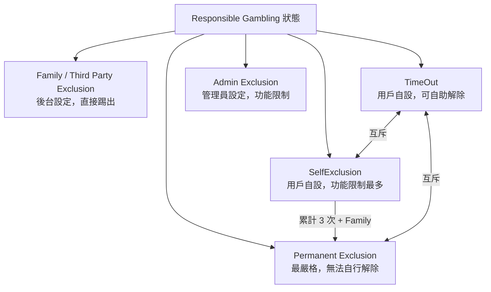
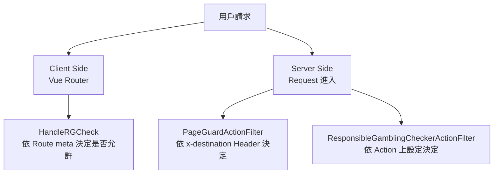
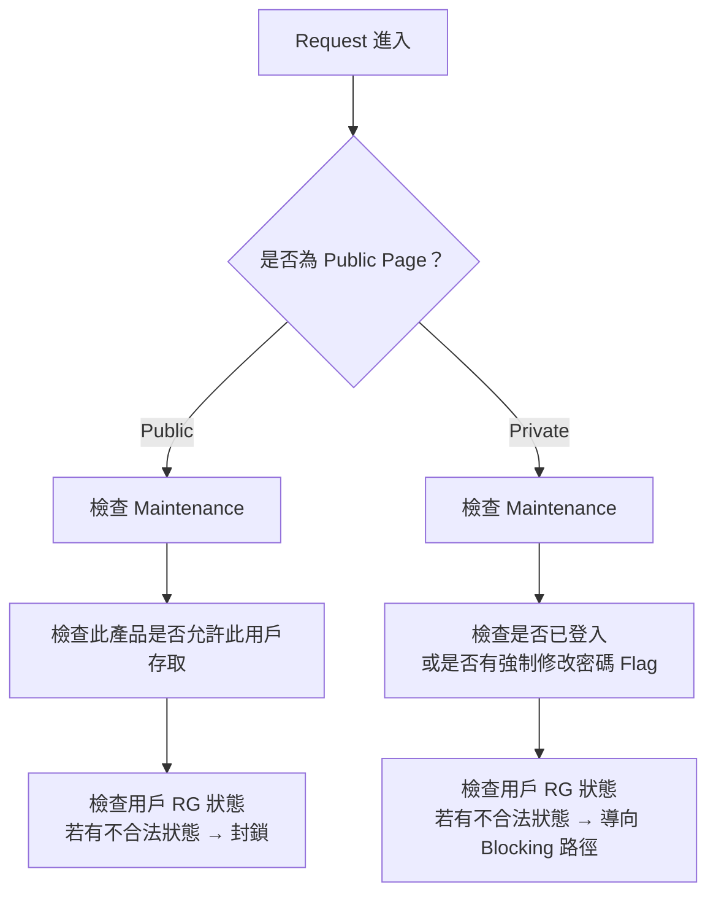
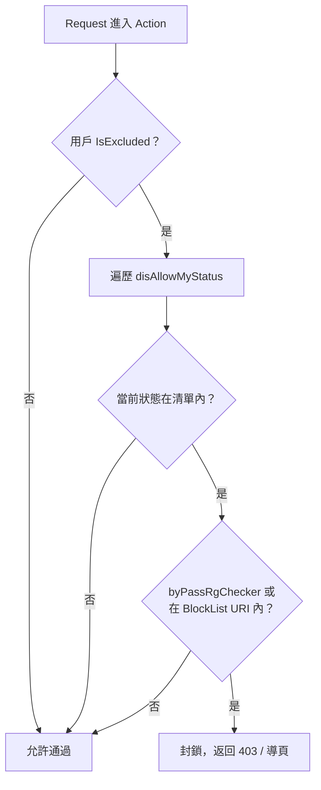

## 前言

本文記錄 CC1-2443 票號的 Responsible Gambling（RG）功能重構，核心目的是：

> **讓用戶可以自助解除 TimeOut 與 SelfExclusion，不再需要透過客服介入。**

改版後系統在 RG 狀態到期時，主動在頁面讓用戶決定是否延長或移除限制；同時全面收緊了頁面可見性與帳號功能的權限控管，並在前後端各層都加入了守衛機制。

<!-- more -->

---

## Responsible Gambling 狀態說明

系統共有五種 RG 狀態，互斥關係與觸發方式各不相同：

| 狀態 | 說明 |
|------|------|
| **Family Exclusion / Third Party Exclusion** | 後台設定。設定後用戶會被踢出，無法再登入 |
| **TimeOut** | 與 SelfExclusion、Permanent Exclusion **互斥** |
| **SelfExclusion** | 與 TimeOut、Permanent Exclusion **互斥**；設定完成後有額外功能限制 |
| **Permanent Exclusion** | 與 TimeOut、SelfExclusion **互斥**。Family Exclusion + SelfExclusion 累計 3 次會自動轉成 Permanent，或設定 SelfExclusion 時選擇 Permanent；登出後無法再登入 |
| **Admin Exclusion** | 不屬於標準 RG 流程，用於管理員對用戶做功能限制（如禁止遊戲），與 RG 邏輯分離 |



---

## SelfExclusion 改版比較

### 行為對照表

| 操作 | 改版前（Now） | 改版後（CC1-2443） |
|------|-------------|-----------------|
| **Set SelfExclusion** | 設定完成後其他平台會被踢掉 | 設定完成後其他平台會被踢掉（不變） |
| **Banking（存款）** | 不允許存款 | 不允許存款（不變） |
| **Login** | 登出後不能再登入，時間到只能請**客服**解除 | 時間到會在 Page 讓 **Member 自己決定** extend 或移除（24 hrs 後由 EOD Job 自動移除） |
| **Game** | 不允許玩遊戲，但還是看得到遊戲 | **看不到遊戲**，也不能玩 |
| **Statement** | 可看到 All product，Playcheck 可能有問題 | 可看到 All product，Playcheck **無法查看** |
| **Other View Page** | 看得到，但部分功能有問題（未定義） | 依 Page Visibility / Account Function Permission 規範 |

### SelfExclusion 設計流程



流程重點：
- 進入 SelfExclusion Page 時先做 **Status Check**
- 若已 **Expired** → 自動移除，顯示設定訊息，用戶可重新設定
- 若 **Not Expired** → 維持限制
- 選擇 **Permanent** → 顯示提款或登出訊息（不可自助解除）
- 選擇其他期間 → 顯示設定訊息，**EOD Job 在設定 24 小時後自動移除**

---

## TimeOut 改版比較

### 行為對照表

| 操作 | 改版前（Now） | 改版後（CC1-2443） |
|------|-------------|-----------------|
| **Set TimeOut** | 設定完成後**立馬**所有平台都被登出 | 設定完成後其他平台會被踢掉 |
| **Banking（存款）** | N/A（無限制） | **不允許存款** |
| **Login** | 登出後不能再登入，時間到只能請**客服**解除 | 時間到在 TimeOut Page 讓 Member **手動移除**；Auto 模式則由 EOD Job 自動移除 |
| **Game** | N/A（無限制） | **看不到遊戲**，也不能玩 |
| **Statement** | N/A（無限制） | 可看到 All product，Playcheck **無法查看** |
| **Other View Page** | N/A（無限制） | 依 Page Visibility / Account Function Permission 規範 |

### TimeOut 設計流程



流程重點：
- 進入 TimeOut Page 時做 **Status Check**
- 若 **Expired 或 Manual Remove** → 移除 TimeOut
- 若 **Not Expired** → 維持限制
- 設定 TimeOut 時選擇移除方式：
  - **Manual**：Member 自行在到期後手動解除
  - **Auto**：EOD Job 在到期時自動移除

---

## Mobile App 過渡期行為

> **適用情境**：後端已部署 CC1-2443，但 App 尚未發版，新舊 App 並存約一週的過渡期。

| 功能 | 舊 App（約 1 週後過期） | 新 App（CC1-2443） |
|------|----------------------|------------------|
| **Login** | 不允許 TimeOut / SelfExclusion 用戶登入 | **允許** TimeOut / SelfExclusion 用戶登入 |
| **ForgotAccount** | 允許 TimeOut / SelfExclusion | 允許 TimeOut / SelfExclusion（不變） |
| **LostAccessToEmail** | 允許 TimeOut / SelfExclusion | 允許 TimeOut / SelfExclusion（不變） |
| **Prod Tab** | 設定 TimeOut/SelfExclusion 導頁至 Limit-Access Page | **看不到 Tab** |
| **Notification** | 看不到 Promotions / NewsAndOffer / Announcement | 看不到 Promotions / NewsAndOffer / Announcement（不變） |
| **Statement** | 可看 All product，Playcheck 無法查看，SBK Statement 可見 | 相同（不變） |
| **Rules 等 Webview Page** | 設定 TimeOut/SelfExclusion 導頁至 Limit-Access Page | 看不到受限頁面 |

---

## Breaking Change — Redis Cache 欄位異動

此次改版對 Trading Cache 的 Redis 結構有 Breaking Change，新增多個 RG 相關欄位：



| | 改版前（Exist fields） | 改版後（New Fields） |
|---|---|---|
| **Trading Cache** | `SelfExclusion`、`IsExcluded`、`IsAdminExclusion`、`UpliftDate`、`ExclusionPeriod` | 新增：`IsTimeOut`、`TimeOutMethod`、`ExclusionExpiredDate`、`SelfExclusionEndDate`、`ExclusionAppliedDate` |

> **注意**：`IsExcluded` 原本包含了 `IsTimeOut` 的語義（此欄位代表不允許下注），CC1-2443 後兩者正式分離。

---

## Permission 守衛架構

CC1-2443 將 RG 權限檢查分成三個層次，確保前後端都有完整防護：



### Permission Check Point 總覽

| 檢查點 | 層次 | Filter / Handler | 說明 |
|--------|------|-----------------|------|
| **HandleRGCheck** | Client Side | Vue Router Guard | 依 Routing 的 `meta.disAllowRGStatus` 決定是否允許進入 |
| **PageGuardActionFilter** | Server Side | ActionFilter | 依 Header `x-destination` 決定是否允許此路徑 |
| **ResponsibleGamblingCheckerActionFilter** | Server Side | ActionFilter | 依個別 Action 設定決定是否允許 |
| **Health Check** | Server Side | PageGuardActionFilter | 依當下 Routing 決定是否允許 |

---

## HandleRGCheck（Client Side）

在 Vue Router 的 route 定義中，透過 `meta.disAllowRGStatus` 陣列宣告哪些 RG 狀態不允許進入此路由：



```js
{
  name: 'Widget Page',
  path: `:prod(...)/widget/:widget(...)`,
  component: () => import('@star/common/pages/product/ProductWidget.vue'),
  meta: {
    disAllowRGStatus: [
      RGType.ProductDisable,
      RGType.SelfExclusion,
      RGType.TimeOut,
      RGType.PermanentExclusion,
    ],
    theme: Theme.Dark,
  },
}
```

Guard 執行時遍歷用戶目前的 RG 狀態，只要命中任一 `disAllowRGStatus` 就阻擋進入，並導向對應的限制頁面。

---

## PageGuardActionFilter（Server Side）

伺服器端透過 ActionFilter 攔截每一個進入 Controller 的請求，分 Public / Private Page 兩套流程：



---

## ResponsibleGamblingCheckerActionFilter（Server Side）

此 Filter 是更細粒度的 RG 狀態守衛，可在個別 Controller Action 上設定允許哪些狀態通過。

### 實作邏輯（1/2）— 核心程式碼



```csharp
public bool IsBlockedByRGCheck(
    ISession tradingSession,
    RGType[] disallowMyStatus,
    string currentPathWithOutLanguage,
    bool byPassRgChecker)
{
    if (Session.Trading.IsExcluded)
    {
        // Default: All Status Blocked
        foreach (var status in disallowMyStatus)
        {
            var isExcluded = GetIsExcludedByStatus(tradingSession, status);
            if (isExcluded)
            {
                if (byPassRgChecker || IsInBlockListUri(status, currentPathWithOutLanguage))
                    return true;
            }
        }
    }
    return false;
}
```

### 邏輯說明（2/2）— 兩個判斷維度

Filter 在 Attribute 層面支援兩種設定方式，讓 Action 層級可以精細控制：

| 設定方式 | 說明 |
|---------|------|
| **Responsible Gambling Status Check** | 直接宣告哪些 RG 狀態不被允許（對應 `disAllowRGStatus`） |
| **Path Check（Block All path or By Status）** | 依路徑白名單或狀態組合決定是否封鎖，比 Status 更細 |



---

## TODO（後續優化）

- [ ] **PageGuardActionFilter** 重構為全部使用 Responsible Chain Pattern，讓每個檢查步驟可獨立擴充
- [ ] 將 RG 相關的 **Cache Data 抽成獨立 Object**，避免散落在不同 Service 層

---

## Reference

- [CC1-2443 WBS](#)
- [Chain-of-Responsibility Pattern](https://en.wikipedia.org/wiki/Chain-of-responsibility_pattern)
