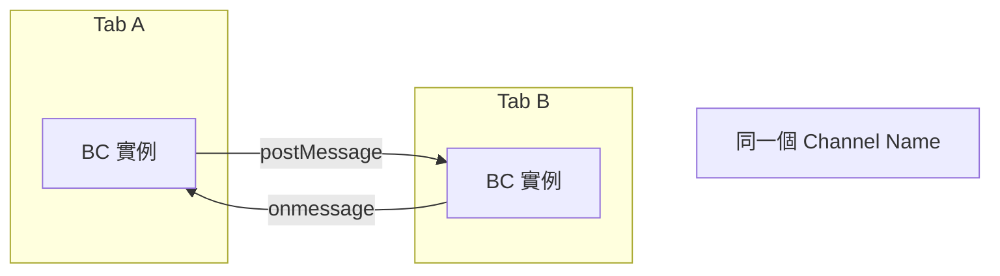
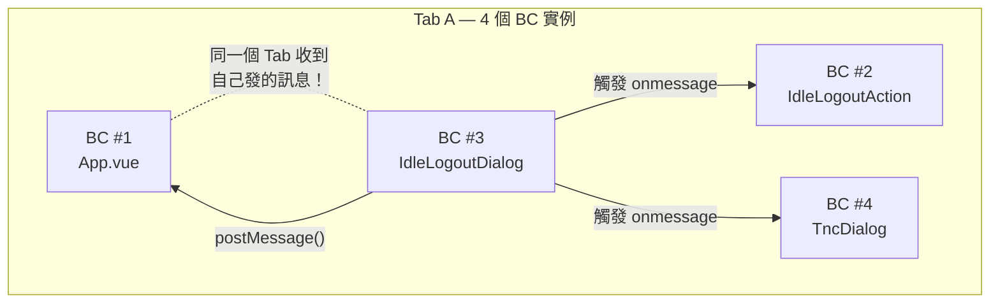
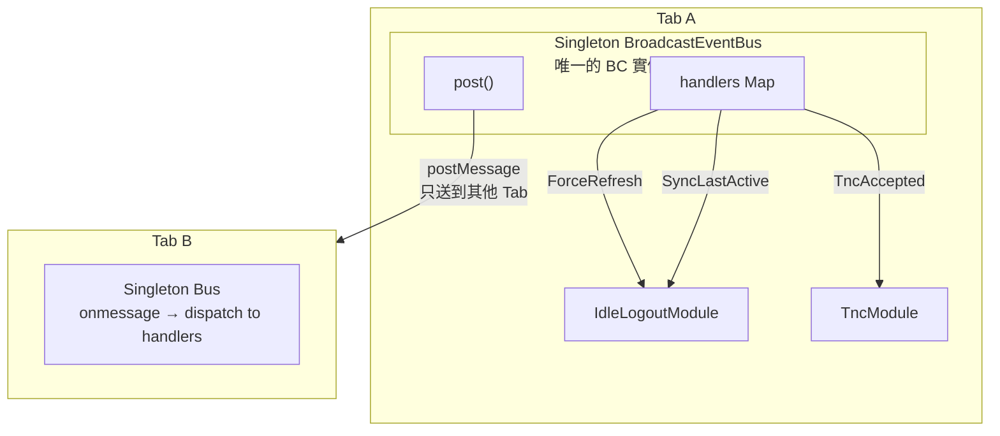

## 前言

在多分頁的 Web 應用中，跨 Tab 同步狀態是常見需求——例如閒置登出同步、Session 過期通知、T&C 接受後其他 Tab 強制刷新等。瀏覽器原生的 `BroadcastChannel` API 是最直覺的方案，搭配 VueUse 的 `useBroadcastChannel` 封裝更是方便。

但在實際開發中，我們踩了一個非常隱晦的坑——**同一個 Tab 內建立多個 BroadcastChannel 實例，會互相收到訊息**。本文記錄我們從「能用」到「好用」的架構演進過程。

<!-- more -->

## BroadcastChannel API 基礎



核心特性：

- **同源限制**：只能在相同 origin 的 Tab 之間通訊
- **發送者不收自己**：`postMessage` 不會觸發**同一個實例**的 `onmessage`
- **多實例陷阱**：但同一 Tab 內如果有**多個 BC 實例**用相同 name，**彼此會收到對方的訊息**

第三點是大多數文章不會提到的關鍵行為，也是我們踩坑的根源。

## 初版設計：直接封裝 VueUse

我們最初用 VueUse 的 `useBroadcastChannel` 做了一個簡單封裝：

```typescript
// useBroadCast.ts
import { useBroadcastChannel } from '@vueuse/core';

export function useBroadcast() {
  const { post, data } = useBroadcastChannel({ name: 'Star4' });
  const sessionTabId = sessionStorage.getItem('currentTabId');
  const currentTabId = ref(sessionTabId);

  if (!currentTabId.value) {
    currentTabId.value = Math.random().toString();
    sessionStorage.setItem('currentTabId', currentTabId.value);
  }

  function sendMessageToOtherTab(key: BroadCastChannelAction, data: string) {
    post({ action: key, data, senderTabId: currentTabId.value ?? '' });
  }

  return { sendMessageToOtherTab, receivedMessage: data, currentTabId };
}
```

在 App.vue 用 watch 集中處理所有訊息：

```typescript
// App.vue — Options API watch
watch: {
  receivedMessage(value) {
    const message = value as BroadCastMessage;
    if (message.senderTabId !== this.currentTabId) {
      switch (message.action) {
        case BroadCastChannelAction.ForceRefresh:
          location.reload();
          break;
        case BroadCastChannelAction.UpdateLastActiveTimeStamp:
          const val = parseInt(message.data) || new Date().getTime();
          useIdleLogoutAction().setLastActiveTimeStamp(val);
          break;
        case BroadCastChannelAction.UpdateShowIdleLogoutDialog:
          const show = JSON.parse(message.data || 'true');
          useIdleLogoutAction().setShowIdleLogoutDialog(show);
          break;
      }
    }
  },
},
```

看起來能用，但隱藏了 5 個問題。

## 問題一：多個 BroadcastChannel 實例的陷阱

`useBroadcast()` 在以下 4 個地方被呼叫：

1. **App.vue** — setup() 裡呼叫，接收訊息
2. **useIdleLogoutAction** — watch callback 裡呼叫，發送閒置狀態
3. **IdleLogoutDialog** — 點擊「繼續使用」時呼叫，發送 ForceRefresh
4. **AcceptTermsAndConditionsDialog** — 接受 T&C 時呼叫，發送 ForceRefresh

VueUse 的 `useBroadcastChannel` 每次呼叫都會 `new BroadcastChannel('Star4')`。當同一個 Tab 裡有 4 個 BC 實例時：



BroadcastChannel 的規格是「同一個實例不會收到自己的訊息」，但同一個 Tab 內的**其他實例會收到**！

這就是為什麼程式碼裡需要 `senderTabId` 過濾：

```typescript
if (message.senderTabId !== this.currentTabId) {
  // 過濾掉同一 Tab 內其他實例發出的訊息
}
```

這個 `senderTabId` 機制能 work，但本質上是用 workaround 修補架構問題。

## 問題二：receivedMessage 型別是 any

```typescript
export interface BroadCastChannel {
  sendMessageToOtherTab: (key: BroadCastChannelAction, data: string) => void;
  receivedMessage: any;  // ← 完全失去型別安全
}
```

在接收端：

```typescript
const message = value as BroadCastMessage;  // 手動 type assertion
const val = parseInt(message.data);          // data 永遠是 string，每次手動轉型
const show = JSON.parse(message.data);       // 每個 handler 都要自己 parse
```

沒有型別推導，也無法利用 TypeScript 的 Discriminated Union 做 exhaustive check。

## 問題三：Handler 邏輯集中在 App.vue

所有 action 的處理都寫在 App.vue 的 switch/case 裡：

```typescript
switch (message.action) {
  case BroadCastChannelAction.ForceRefresh:
    // 處理邏輯
    break;
  case BroadCastChannelAction.UpdateLastActiveTimeStamp:
    // 處理邏輯
    break;
  //TODO Add Action here  ← 每次新增功能都要改 App.vue
}
```

- 違反開放封閉原則：新增 action 就要修改 App.vue
- 職責混亂：Idle Logout 的處理邏輯應該在 IdleLogout 相關模組裡，不是 App.vue
- App.vue 膨脹：隨著 action 增加，switch/case 越來越長

## 問題四：沒有瀏覽器支援檢查

VueUse 有回傳 `isSupported`，但完全沒用到。雖然 BroadcastChannel 的瀏覽器支援率已經很高，但在 WebView、某些封裝瀏覽器或 Fallback 場景下仍可能不支援。

## 問題五：watch callback 裡重複建立實例

```typescript
watch(idle, (idleValue) => {
  const { sendMessageToOtherTab } = useBroadcast(); // 每次都建新的 BC 實例
  sendMessageToOtherTab(BroadCastChannelAction.UpdateShowIdleLogoutDialog, ...);
});

watch(lastActive, (lastActiveValue) => {
  const { sendMessageToOtherTab } = useBroadcast(); // 用戶每次操作都觸發
  sendMessageToOtherTab(BroadCastChannelAction.UpdateLastActiveTimeStamp, ...);
});
```

`lastActive` 在用戶有操作時會頻繁觸發，意味著每次滑鼠移動或鍵盤輸入都會建立一個新的 BroadcastChannel 實例。

---

## 改進方案：Singleton + Typed Event Bus

### 核心設計原則

1. **全域只有一個 BroadcastChannel 實例** — 消除 senderTabId workaround
2. **型別安全的 Event Map** — Discriminated Union 取代 string data
3. **Handler 自行註冊** — 各 feature 模組自行 subscribe，不需改 App.vue

### 架構圖



### Step 1：定義型別安全的 Event Map

用 TypeScript Discriminated Union 取代 `{ action: enum, data: string }`：

```typescript
// typings/broadcast-channel.ts
export enum BroadcastAction {
  ForceRefresh = 'ForceRefresh',
  SyncLastActive = 'SyncLastActive',
  SyncIdleDialog = 'SyncIdleDialog',
}

interface ForceRefreshEvent {
  action: BroadcastAction.ForceRefresh;
}

interface SyncLastActiveEvent {
  action: BroadcastAction.SyncLastActive;
  timestamp: number;
}

interface SyncIdleDialogEvent {
  action: BroadcastAction.SyncIdleDialog;
  show: boolean;
}

export type BroadcastEvent =
  | ForceRefreshEvent
  | SyncLastActiveEvent
  | SyncIdleDialogEvent;

export type BroadcastHandler<A extends BroadcastAction> = (
  event: Extract<BroadcastEvent, { action: A }>
) => void;
```

好處：

- 新增 event 只需擴充 union type，不需要改任何現有程式碼
- handler 的參數型別自動推斷，不需要手動 `parseInt` 或 `JSON.parse`
- TypeScript 會在 compile time 檢查你是否處理了所有 event type

### Step 2：Singleton Event Bus

用 VueUse 的 `createSharedComposable` 確保全域只有一個 BC 實例：

```typescript
// composables/useBroadcastBus.ts
import { useBroadcastChannel, createSharedComposable } from '@vueuse/core';
import { watch } from 'vue';
import type { BroadcastEvent, BroadcastAction, BroadcastHandler } from '../typings/broadcast-channel';

function _useBroadcastBus() {
  const { data, post, isSupported } = useBroadcastChannel<BroadcastEvent>({
    name: 'AppBroadcast',
  });

  const handlers = new Map<BroadcastAction, Set<BroadcastHandler<any>>>();

  watch(data, (event) => {
    if (!event?.action) return;
    const actionHandlers = handlers.get(event.action);
    if (actionHandlers) {
      actionHandlers.forEach((handler) => handler(event));
    }
  });

  function emit(event: BroadcastEvent) {
    if (!isSupported.value) return;
    post(event);
  }

  function on<A extends BroadcastAction>(
    action: A,
    handler: BroadcastHandler<A>,
  ): () => void {
    if (!handlers.has(action)) {
      handlers.set(action, new Set());
    }
    handlers.get(action)!.add(handler);
    return () => {
      handlers.get(action)?.delete(handler);
    };
  }

  return { emit, on, isSupported };
}

export const useBroadcastBus = createSharedComposable(_useBroadcastBus);
```

`createSharedComposable` 的效果：

```typescript
const bus1 = useBroadcastBus(); // 建立實例
const bus2 = useBroadcastBus(); // 回傳同一個實例
bus1 === bus2; // true
```

因為只有一個 BC 實例，同一個 Tab 內不會收到自己的訊息，`senderTabId` 過濾邏輯完全不需要了。

### Step 3：各模組自行註冊 Handler

```typescript
// composables/useIdleLogoutBroadcast.ts
import { onScopeDispose } from 'vue';
import { useBroadcastBus } from './useBroadcastBus';
import { BroadcastAction } from '../typings/broadcast-channel';

export function useIdleLogoutBroadcast() {
  const { emit, on } = useBroadcastBus();

  const offSyncActive = on(BroadcastAction.SyncLastActive, (event) => {
    setLastActiveTimeStamp(event.timestamp); // number，不需要 parseInt
  });

  const offSyncDialog = on(BroadcastAction.SyncIdleDialog, (event) => {
    setShowIdleLogoutDialog(event.show); // boolean，不需要 JSON.parse
  });

  const offForceRefresh = on(BroadcastAction.ForceRefresh, () => {
    setShowIdleLogoutDialog(false);
    location.reload();
  });

  function broadcastLastActive(timestamp: number) {
    emit({ action: BroadcastAction.SyncLastActive, timestamp });
  }

  function broadcastIdleDialog(show: boolean) {
    emit({ action: BroadcastAction.SyncIdleDialog, show });
  }

  function broadcastForceRefresh() {
    emit({ action: BroadcastAction.ForceRefresh });
  }

  onScopeDispose(() => {
    offSyncActive();
    offSyncDialog();
    offForceRefresh();
  });

  return { broadcastLastActive, broadcastIdleDialog, broadcastForceRefresh };
}
```

### App.vue — 大幅簡化

```vue
<script setup lang="ts">
import { useIdleLogoutBroadcast } from '@/composables/useIdleLogoutBroadcast';
useIdleLogoutBroadcast();
</script>
```

原本 App.vue 裡 20 行的 watch + switch/case，現在只需要一行。新增功能？建一個新的 composable，在需要的地方呼叫，完全不用改 App.vue。

### Step 4：新增功能示範

假設要新增「用戶在某個 Tab 接受了 T&C，其他 Tab 自動刷新」：

**1. 擴充 Event 型別**

```typescript
interface TncAcceptedEvent {
  action: BroadcastAction.TncAccepted;
  version: string;
}

export type BroadcastEvent =
  | ForceRefreshEvent
  | SyncLastActiveEvent
  | SyncIdleDialogEvent
  | TncAcceptedEvent;   // ← 加這一行
```

**2. 發送端**

```typescript
const { emit } = useBroadcastBus();
emit({ action: BroadcastAction.TncAccepted, version: '2.0' });
```

**3. 接收端**

```typescript
const { on } = useBroadcastBus();
on(BroadcastAction.TncAccepted, (event) => {
  console.log(`T&C version ${event.version} accepted`);
  location.reload();
});
```

不需要改 App.vue，不需要改 useBroadcastBus，不需要改任何現有程式碼。

## 改進前後對比

| 面向 | 改進前 | 改進後 |
|------|-------|-------|
| BC 實例數 | 每次 `useBroadcast()` 都建新的，同一 Tab 4+ 個 | 全域唯一 1 個 (`createSharedComposable`) |
| senderTabId | 需要手動過濾同 Tab 訊息 | 不需要，單實例不會收到自己的訊息 |
| 型別安全 | `receivedMessage: any`，手動 `as` 轉型 | Discriminated Union 自動推斷 |
| data 解析 | 每個 handler 手動 `parseInt` / `JSON.parse` | payload 直接是正確型別 |
| 新增 action | 改 App.vue 的 switch/case | 建新 composable，不動現有程式碼 |
| Handler 位置 | 全部集中在 App.vue | 各模組自行管理，職責分離 |
| isSupported | 沒檢查 | emit 內建檢查 |
| 記憶體 | watch callback 裡重複建實例 | 全域唯一，自動 dispose |

## createSharedComposable 原理補充

很多人可能不知道 VueUse 提供了 `createSharedComposable` 這個工具，它的原理很簡單：

```typescript
function createSharedComposable(composable) {
  let state = null;
  let subscribers = 0;

  return () => {
    if (subscribers === 0) {
      state = composable();  // 第一次呼叫才真正執行
    }
    subscribers++;

    onScopeDispose(() => {
      subscribers--;
      if (subscribers === 0) {
        state = null;  // 最後一個使用者離開時清理
      }
    });

    return state;  // 所有呼叫者共享同一個 state
  };
}
```

用它包裝 composable 就能確保：

- 第一次呼叫才真正建立 BC 實例
- 後續呼叫回傳同一個實例
- 所有使用者都 unmount 後自動清理

## 適用場景

這套 Singleton Event Bus 模式適用於任何需要跨 Tab 同步的場景：

- **閒置登出同步**：一個 Tab 偵測到閒置，所有 Tab 同步顯示 dialog
- **登入/登出同步**：一個 Tab 登出，其他 Tab 強制刷新
- **即時資料同步**：A Tab 修改了設定，B Tab 自動更新
- **T&C 接受通知**：A Tab 接受條款，B Tab 不再顯示彈窗
- **Domain 切換**：後台切換 Domain 後，所有 Tab 同步導向新 Domain
- **主題切換**：A Tab 切換深色模式，其他 Tab 同步

## 結語

BroadcastChannel API 本身設計簡潔，但「多實例同 Tab 互相觸發」這個行為非常容易讓人忽略。直接封裝 VueUse 的 `useBroadcastChannel` 雖然能快速上手，但在多處呼叫的情境下會造成不必要的實例膨脹和 workaround。

關鍵改進：

- **createSharedComposable** — 一行解決多實例問題
- **Discriminated Union** — 型別安全，compile time 檢查
- **Handler 註冊機制** — 開放封閉原則，新功能不改舊程式碼

最終的結果是一個 30 行的 Singleton Event Bus，取代了原本散落在多個檔案、需要 senderTabId workaround 的實作。
