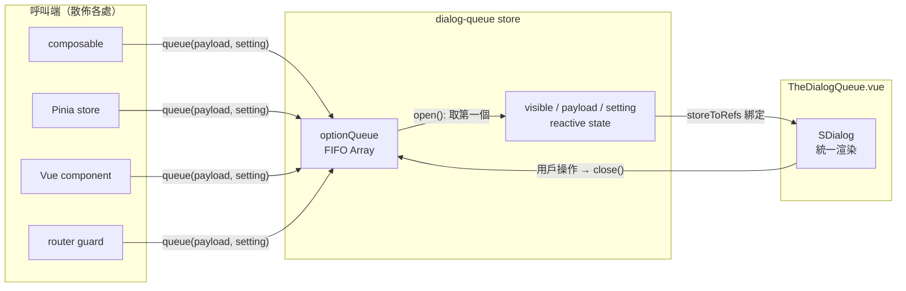
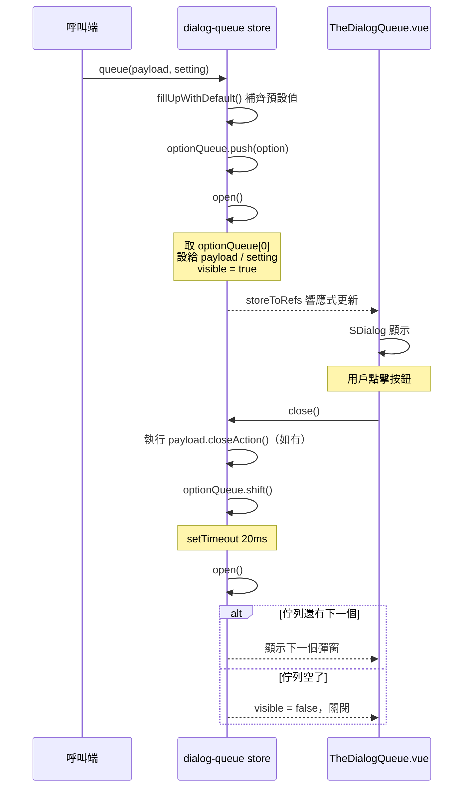

## 前言

在平台系統中，操作過程經常同時觸發多個彈窗——HTTP 錯誤、銀行維護提示、KYC 驗證結果、交易確認等。如果各元件各自管理 `v-model`，多個 overlay 會同時疊加在畫面上，不僅使用者體驗混亂，對開發者來說也極度難以維護。

我們需要一個統一的 Dialog 管理機制：所有需要彈窗的地方都不自己開 Dialog，而是把「要顯示什麼」丟進佇列，由一個元件依序一個一個渲染。

<!-- more -->




## 架構總覽



涉及檔案：

| 檔案 | 路徑 | 職責 |
|------|------|------|
| Store | `stores/dialog-queue.ts` | 佇列資料管理 |
| UI | `components/utilities/TheDialogQueue.vue` | 統一渲染 |
| Types | `typings/dialog-queue.ts` | 型別定義 |

## Store 運作機制

### 資料結構

```typescript
interface Option {
  payload: Payload;
  setting: Setting;
}

interface Payload {
  title: string;
  msg: string;                              // 支援 HTML（經 v-sanitize）
  type?: 'success' | 'fail' | 'reject';    // 對應不同圖示
  buttons?: Button[];
  closeAction?: () => void;                 // overlay 關閉時的 callback
}

interface Setting {
  titleAlign?: 'left' | 'center' | 'right';
  buttonAlign?: 'left' | 'center' | 'right' | 'stacked-left' | 'stacked-center' | 'stacked-right';
  contentAlign?: 'left' | 'center' | 'right';
  persistent?: boolean;                     // 禁止點 overlay 關閉
  beforeClose?: number;                     // 自動關閉倒數（毫秒）
  showClose?: boolean;                      // 右上角 X 按鈕
  titleAtTop?: boolean;                     // 標題在圖示上方 or 下方
}
```

`Payload` 管「顯示什麼」，`Setting` 管「怎麼顯示」，呼叫端不需要知道 UI 實作細節。

### 佇列流程



### 關鍵設計細節

**20ms setTimeout**

`close()` 在 shift 掉當前項目後，等 20ms 才呼叫 `open()` 顯示下一個。這是為了讓 `SDialog` 的 `fab-transition` 離場動畫完成，再觸發下一個的進場動畫，避免兩個 transition 撞在一起。

**fillUpWithDefault()**

呼叫端可以只傳必要的欄位，其餘由預設值補齊：

```typescript
const defaultSetting: Setting = {
  titleAlign: 'left',
  buttonAlign: 'right',
  persistent: false,
  showClose: false,
  titleAtTop: true,
};

function fillUpWithDefault(option: Option) {
  return {
    payload: Object.assign({}, defaultPayload, option.payload),
    setting: Object.assign({}, defaultSetting, option.setting),
  };
}
```

**beforeClose 自動關閉**

`open()` 時如果 `setting.beforeClose > 0`，會自動起一個 setTimeout，時間到了呼叫 `close()`：

```typescript
if (this.setting.beforeClose && this.setting.beforeClose > 0) {
  setTimeout(() => { this.close(); }, this.setting.beforeClose);
}
```

## UI 元件設計

### 掛載位置

`TheDialogQueue` 掛在 `App.vue` 根層級，與 `router-view` 平行，確保任何頁面都能顯示：

```html
<router-view />
<TheDialogQueue />
```

### 響應式綁定

元件透過 `storeToRefs` 直接綁定 store state，store 更新時畫面自動響應：

```typescript
const dialogQueueStore = useDialogQueueStore();
const { visible, payload, setting } = storeToRefs(dialogQueueStore);
const { close } = dialogQueueStore;
```

### 按鈕排版策略

- **2 個以內**：水平排列，對齊方式由 `setting.buttonAlign` 控制
- **超過 2 個**：強制垂直堆疊靠右

多語系環境下按鈕文字長度差異很大，超過兩個水平排列容易破版。

### XSS 防護

`payload.msg` 和按鈕文字 `item.text` 使用 `v-sanitize` 而非 `v-html`。部分內容來自後端回傳且帶有 HTML 格式化標籤，`v-sanitize` 可以允許安全的 HTML 同時過濾惡意腳本。

### 瀏覽器上一頁處理

```typescript
useEventListener(window, 'popstate', () => {
  dialogQueueStore.clearQueue();
});
```

用戶按瀏覽器上一頁時直接清空整個佇列，避免前一頁觸發的彈窗殘留在新頁面上。

## 使用範例

### 基本用法

```typescript
import { useDialogQueueStore } from '@star/common/stores/dialog-queue';

const dialogQueueStore = useDialogQueueStore();

dialogQueueStore.queue({
  title: '操作成功',
  msg: '您的資料已更新',
  type: 'success',
  buttons: [{ text: '確定', type: 'primary' }],
});
```

### 帶 callback 的確認彈窗

```typescript
dialogQueueStore.queue(
  {
    title: '確認提款',
    msg: `即將提款 <b>${amount}</b> 至您的銀行帳戶`,
    buttons: [
      { text: '取消', type: 'text' },
      { text: '確認', type: 'primary', action: () => submitWithdrawal() },
    ],
  },
  { persistent: true, buttonAlign: 'right' },
);
```

### 自動消失的提示

```typescript
dialogQueueStore.queue(
  { title: '', msg: '系統維護中，請稍後再試' },
  { beforeClose: 3000 },
);
```

## 結語

這套機制的核心其實很簡單——一個 FIFO 陣列加上一個 Pinia Store。但它解決的問題很實際：在多模組、多非同步操作的平台中，讓所有彈窗都有秩序地排隊顯示，而不是互相覆蓋。

呼叫端只需要一行 `dialogQueueStore.queue()`，不需要關心 Dialog 的 `v-model`、z-index、transition 動畫、還是同時有幾個彈窗在排隊。所有複雜度都被封裝在 Store 和 TheDialogQueue 元件裡。
