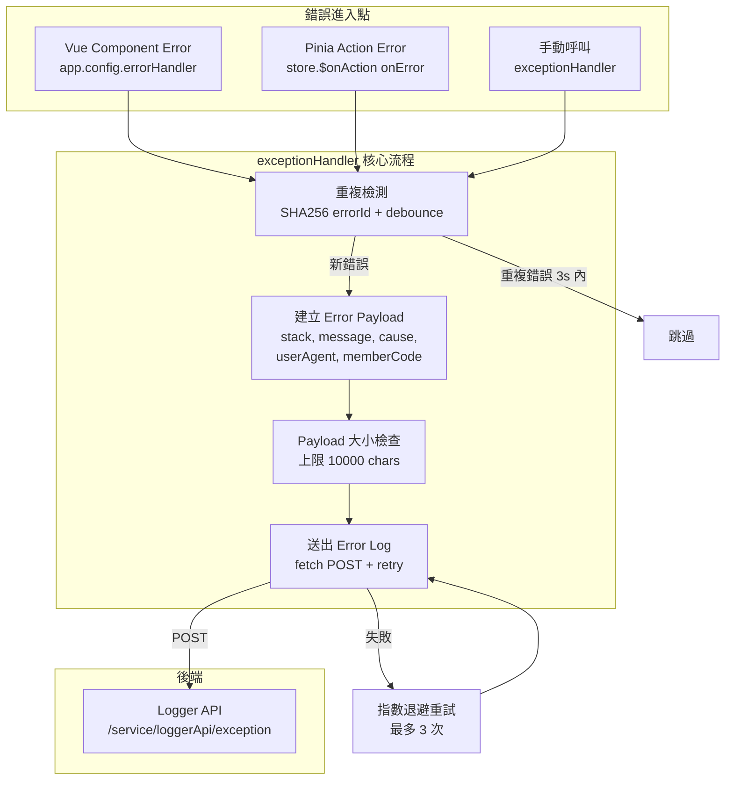
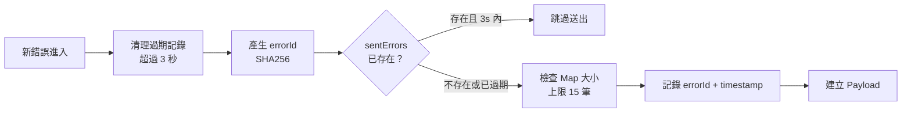
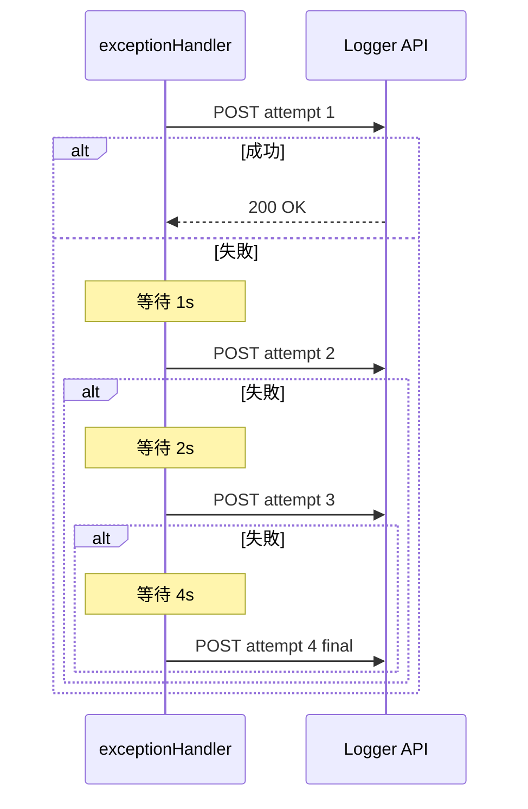

## 前言

前端開發中最難追蹤的不是語法錯誤，而是那些只在特定操作流程下才會出現的邏輯錯誤。使用者通常無法準確描述發生了什麼，如果沒有錯誤記錄機制，等於瞎子摸象。

本文分享我們從**基礎版 Vue Error Handler**演進到**生產級 Exception Handler 架構**的完整過程，涵蓋 Vue 元件錯誤捕捉、Pinia Store Action 錯誤攔截、錯誤去重、自動重試、Source Map 還原等實戰經驗。

<!-- more -->

## 前端錯誤的四種類型

| 類型 | 說明 | 偵測方式 |
|------|------|---------|
| Syntax Error | Template 中的語法錯誤（多餘 TAG、未關閉標籤） | ESLint / IDE Extension / Pre-commit |
| Runtime Error | 執行階段錯誤（缺少引用的元件等） | IDE Extension / 開發環境即時提示 |
| **Logical Error** | 邏輯錯誤，最難被測試發現 | **需要錯誤記錄機制主動捕捉** |
| API Error | Server Side 錯誤，通常有 Request Log 可追蹤 | IIS Log / Jetty Log / HTTP Status |

其中 **Logical Error** 是最棘手的——它不會讓頁面直接崩潰，但會導致功能行為不符預期。接下來的架構就是為了解決這個問題。

## Part 1：基礎版 — Vue Error Handler

### Vue 全域 Error Handler

Vue 提供了 [app.config.errorHandler](https://vuejs.org/api/application.html#app-config-errorhandler)，可以集中捕捉所有未被 `try-catch` 處理的元件錯誤，統一送到後端記錄：

```javascript
function sendErrorLogRequest(logData) {
  fetch('/api/log/error', {
    method: 'POST',
    headers: { 'Content-type': 'application/json; charset=UTF-8' },
    body: JSON.stringify(logData),
  });
}

function formatComponentName(vm) {
  if (vm.$root === vm) return 'root';
  var name = vm._isVue
    ? (vm.$options && vm.$options.name) ||
      (vm.$options && vm.$options._componentTag)
    : vm.name;
  return (
    (name ? 'component <' + name + '>' : 'anonymous component') +
    (vm._isVue && vm.$options && vm.$options.__file
      ? ' at ' + (vm.$options && vm.$options.__file)
      : '')
  );
}

function ErrorHandler(err, vm, info) {
  const errorData = {
    Location: window.location.pathname,
    Name: formatComponentName(vm),
    Message: err.message.toString(),
    StackTrace: err.stack.toString(),
  };
  sendErrorLogRequest(errorData);
  throw err;
}

export default ErrorHandler;
```

### Vue Lifecycle Hook — errorCaptured

除了全域 handler，也可以透過各元件的 [errorCaptured](https://vuejs.org/api/options-lifecycle.html#errorcaptured) lifecycle hook 攔截錯誤，適合需要在特定元件做局部處理的場景：

```javascript
export default {
  name: 'ErrorSample',
  errorCaptured(err, vm, info) {
    // err: 錯誤物件
    // vm: 發生錯誤的元件實例
    // info: Vue 特定的錯誤資訊 (如 lifecycle hooks, events)
  },
};
```

### 實際排錯流程：用 Source Map 還原壓縮後的錯誤

生產環境的 JS 經過壓縮混淆，Stack Trace 會變成這樣：

```
chunk-vendors.f74a5e6c.js:1 SyntaxError: Unexpected token D in JSON at position 0
    at JSON.parse (<anonymous>)
    at Proxy.jsError (validate.942ffcee.js:1:51528)
```



後端收到錯誤 Log 後：



透過 [source-map-cli](https://www.npmjs.com/package/source-map-cli) 還原壓縮前的程式碼位置：

```bash
source-map resolve validate.9cc0683f.js.map 1 51528
# Maps to webpack://vue_menu/src/views/ErrorSample.vue:70:32 (parse)
#       this.convertedData = JSON.parse(jsonData);
```



即使使用者無法準確描述問題，也能透過 Log 系統反推出錯的位置和上下文：



---

## Part 2：生產級 — Exception Handler 架構

基礎版在小型專案中夠用，但在高流量的生產環境中，我們遇到了幾個問題：

- 相同的錯誤短時間內被送出上百次，後端 Log 被灌爆
- Pinia Store Action 中的錯誤沒有被 Vue Error Handler 捕捉到
- 網路不穩時錯誤 Log 直接丟失
- 大型 Stack Trace 拖慢了 Log API 回應

因此我們設計了進階版的 `exceptionHandler`，完整架構如下：



### 進入點 1：Vue 全域錯誤處理

```typescript
// packages/star4/src/main.ts
app.config.errorHandler = exceptionHandler;
```

Vue 會將所有未被 `try-catch` 捕捉的元件錯誤交給此 handler，包含：

- Template render 錯誤
- `setup()` / `mounted()` / `updated()` 等 lifecycle hook 錯誤
- Event handler（`@click` 等）錯誤
- `watch` callback 錯誤

### 進入點 2：Pinia Store Action 錯誤

```typescript
// packages/common/stores/pinia.ts
const pinia = createPinia();
pinia.use(({ store }) => {
  store.$onAction(({ name, onError }) => {
    onError((error) => {
      exceptionHandler(error, undefined, `Pinia action: ${name}`);
    });
  });
});
```

透過 Pinia Plugin 的 `$onAction` hook 攔截所有 Store Action 錯誤，`info` 參數會帶入 `Pinia action: ${actionName}` 供後端識別錯誤來源。

### 錯誤去重機制

高流量下同一個錯誤可能在幾秒內被觸發上百次，不做去重會灌爆 Log API：



errorId 的產生方式：

```typescript
const errorData = {
  message: error?.message || 'unknown',
  stack: error?.stack?.slice(0, 200) || 'no-stack',
  pathname: location.pathname,
  timestamp: Math.floor(Date.now() / 1000),
};
const errorId = crypto.SHA256(JSON.stringify(errorData)).toString();
```

| 常數 | 值 | 說明 |
|------|---|------|
| `DEBOUNCE_DELAY` | 3000ms | 相同錯誤在此時間內不重複送出 |
| `MAX_STORED_ERRORS` | 15 | Map 最大存放數量，超過移除最舊 |
| `MAX_ERROR_SIZE` | 10000 字元 | 超過會截斷 stack trace |

### Error Payload 結構

```typescript
{
  stack: string;       // 錯誤堆疊（截斷至 1000 字元 if oversized）
  message: string;     // 錯誤訊息
  cause: string;       // 錯誤來源（路徑 + 元件/action 資訊）
  userAgent: string;   // 瀏覽器 User Agent
  memberCode: string;  // 會員代碼
}
```

`cause` 欄位的組成邏輯：

| 條件 | cause 內容 |
|------|-----------|
| `vm.$el` 存在（Vue 元件） | `Path is /xxx, Error in {info} with element div.class-name` |
| `vm.type` 存在（Pinia action） | `Path is /xxx, Error in action: {type}` |
| 僅有 `info` | `Path is /xxx, Info is {info}` |
| 都無 | `Path is /xxx` |

### 送出與重試機制

網路不穩時，錯誤 Log 不能直接丟棄。我們採用指數退避重試：



| 設定 | 值 | 說明 |
|------|---|------|
| `MAX_RETRY_COUNT` | 3 | 最多重試 3 次（含首次共 4 次） |
| 退避策略 | `2^retryCount * 1000ms` | 指數退避 |
| Timeout | 10000ms | 每次 fetch 的 AbortSignal timeout |
| 離線檢測 | `navigator.onLine` | 離線時直接跳過 |

### API 端點

```
POST {origin}/service/loggerApi/exception
Content-Type: application/json

{
  "stack": "Error: xxx\n    at ...",
  "message": "Cannot read properties of undefined",
  "cause": "Path is /en-gb/casino, Error in setup function with element div.game-list",
  "userAgent": "Mozilla/5.0 ...",
  "memberCode": "ABC123"
}
```

## 兩個版本的比較

| 面向 | 基礎版 | 生產級 |
|------|-------|-------|
| 錯誤來源 | Vue 元件 | Vue 元件 + Pinia Action + 手動呼叫 |
| 去重機制 | 無 | SHA256 + 3 秒 debounce |
| 重試機制 | 無 | 指數退避，最多 3 次 |
| Payload 大小控制 | 無 | 截斷至 10000 字元 |
| 離線處理 | 直接丟失 | 偵測 `navigator.onLine`，離線跳過 |
| 適用場景 | 小型專案 / 開發環境 | 高流量生產環境 |

## Reference

- [Sample Code](https://github.com/Josephmtsai/vue_menu)
- [Vue Error Handling](https://vuejs.org/api/application.html#app-config-errorhandler)
- [Vue errorCaptured](https://vuejs.org/api/options-lifecycle.html#errorcaptured)
- [Source Map CLI](https://www.npmjs.com/package/source-map-cli)
- [Pinia $onAction](https://pinia.vuejs.org/core-concepts/actions.html#subscribing-to-actions)
