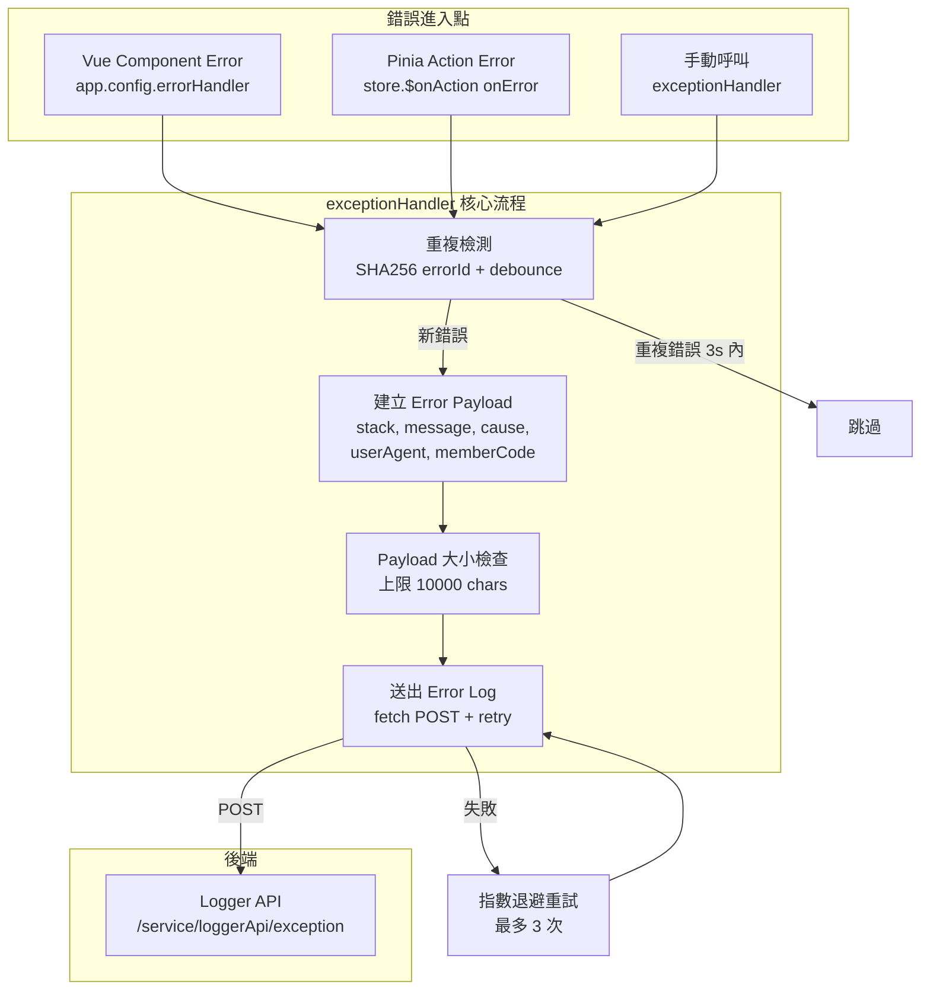
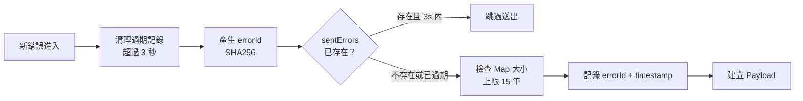
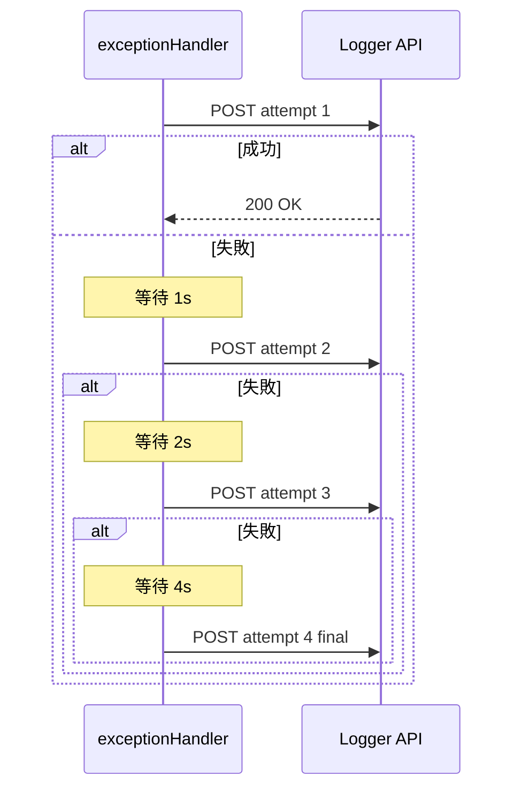

## 前言

前端開發中最難追蹤的不是語法錯誤，而是那些只在特定操作流程下才會出現的邏輯錯誤。使用者通常無法準確描述發生了什麼，如果沒有錯誤記錄機制，等於瞎子摸象。

本文分享我們從**基礎版 Vue Error Handler**演進到**生產級 Exception Handler 架構**的完整過程，涵蓋 Vue 元件錯誤捕捉、Pinia Store Action 錯誤攔截、錯誤去重、自動重試、Source Map 還原等實戰經驗。

<!-- more -->

## 前端錯誤的四種類型

| 類型 | 說明 | 偵測方式 |
|------|------|---------|
| Syntax Error | Template 中的語法錯誤（多餘 TAG、未關閉標籤） | ESLint / IDE Extension / Pre-commit |
| Runtime Error | 執行階段錯誤（缺少引用的元件等） | IDE Extension / 開發環境即時提示 |
| **Logical Error** | 邏輯錯誤，最難被測試發現 | **需要錯誤記錄機制主動捕捉** |
| API Error | Server Side 錯誤，通常有 Request Log 可追蹤 | IIS Log / Jetty Log / HTTP Status |

其中 **Logical Error** 是最棘手的——它不會讓頁面直接崩潰，但會導致功能行為不符預期。接下來的架構就是為了解決這個問題。

## Part 1：基礎版 — Vue Error Handler

### Vue 全域 Error Handler

Vue 提供了 [app.config.errorHandler](https://vuejs.org/api/application.html#app-config-errorhandler)，可以集中捕捉所有未被 `try-catch` 處理的元件錯誤，統一送到後端記錄：

```javascript
function sendErrorLogRequest(logData) {
  fetch('/api/log/error', {
    method: 'POST',
    headers: { 'Content-type': 'application/json; charset=UTF-8' },
    body: JSON.stringify(logData),
  });
}

function formatComponentName(vm) {
  if (vm.$root === vm) return 'root';
  var name = vm._isVue
    ? (vm.$options && vm.$options.name) ||
      (vm.$options && vm.$options._componentTag)
    : vm.name;
  return (
    (name ? 'component <' + name + '>' : 'anonymous component') +
    (vm._isVue && vm.$options && vm.$options.__file
      ? ' at ' + (vm.$options && vm.$options.__file)
      : '')
  );
}

function ErrorHandler(err, vm, info) {
  const errorData = {
    Location: window.location.pathname,
    Name: formatComponentName(vm),
    Message: err.message.toString(),
    StackTrace: err.stack.toString(),
  };
  sendErrorLogRequest(errorData);
  throw err;
}

export default ErrorHandler;
```

### Vue Lifecycle Hook — errorCaptured

除了全域 handler，也可以透過各元件的 [errorCaptured](https://vuejs.org/api/options-lifecycle.html#errorcaptured) lifecycle hook 攔截錯誤，適合需要在特定元件做局部處理的場景：

```javascript
export default {
  name: 'ErrorSample',
  errorCaptured(err, vm, info) {
    // err: 錯誤物件
    // vm: 發生錯誤的元件實例
    // info: Vue 特定的錯誤資訊 (如 lifecycle hooks, events)
  },
};
```

### 實際排錯流程：用 Source Map 還原壓縮後的錯誤

生產環境的 JS 經過壓縮混淆，Stack Trace 會變成這樣：

```
chunk-vendors.f74a5e6c.js:1 SyntaxError: Unexpected token D in JSON at position 0
    at JSON.parse (<anonymous>)
    at Proxy.jsError (validate.942ffcee.js:1:51528)
```



後端收到錯誤 Log 後：



透過 [source-map-cli](https://www.npmjs.com/package/source-map-cli) 還原壓縮前的程式碼位置：

```bash
source-map resolve validate.9cc0683f.js.map 1 51528
# Maps to webpack://vue_menu/src/views/ErrorSample.vue:70:32 (parse)
#       this.convertedData = JSON.parse(jsonData);
```



即使使用者無法準確描述問題，也能透過 Log 系統反推出錯的位置和上下文：



---

## Part 2：生產級 — Exception Handler 架構

基礎版在小型專案中夠用，但在高流量的生產環境中，我們遇到了幾個具體問題：

1. **重複轟炸**：一個 `render` 函式裡的錯誤，每次 re-render 都觸發一次，一秒可能送幾百次，打爆 log server 或觸發 WAF 限流。
2. **網路失敗靜默丟棄**：斷線重連後的第一個錯誤永遠送不到。
3. **記憶體不受控**：如果用 `Set` 記錄「已送的錯誤 ID」但從不清理，長時間運行的 SPA 會持續累積。
4. **payload 過大**：某些框架的 stack trace 超過 10 萬字元，HTTP body 過大會被 nginx 或 WAF 拒絕（413 Payload Too Large）。
5. **handler 本身崩潰**：`window.onerror` 裡面的 `fetch` 如果因為環境問題拋出例外，整個 handler 失效，後續所有錯誤都不上報。

因此我們設計了進階版的 `exceptionHandler`，完整架構如下：


```mermaid
flowchart TD
    subgraph entry [錯誤進入點]
        VueError["Vue Component Error<br/>app.config.errorHandler"]
        PiniaError["Pinia Action Error<br/>store.$onAction onError"]
        ManualError["手動呼叫<br/>exceptionHandler"]
    end
    subgraph handler [exceptionHandler 核心流程]
        Dedup["重複檢測<br/>SHA256 errorId + debounce"]
        Payload["建立 Error Payload<br/>stack, message, cause,<br/>userAgent, memberCode"]
        SizeCheck["Payload 大小檢查<br/>上限 10000 chars"]
        Submit["送出 Error Log<br/>fetch POST + retry"]
    end
    subgraph backend [後端]
        LoggerAPI["Logger API<br/>/service/loggerApi/exception"]
    end
    VueError --> Dedup
    PiniaError --> Dedup
    ManualError --> Dedup
    Dedup -->|新錯誤| Payload
    Dedup -->|"重複錯誤 3s 內"| Skip["跳過"]
    Payload --> SizeCheck
    SizeCheck --> Submit
    Submit -->|POST| LoggerAPI
    Submit -->|失敗| Retry["指數退避重試<br/>最多 3 次"]
    Retry --> Submit
```

### 進入點 1：Vue 全域錯誤處理

```typescript
// packages/star4/src/main.ts
app.config.errorHandler = exceptionHandler;
```

Vue 會將所有未被 `try-catch` 捕捉的元件錯誤交給此 handler，包含：

- Template render 錯誤
- `setup()` / `mounted()` / `updated()` 等 lifecycle hook 錯誤
- Event handler（`@click` 等）錯誤
- `watch` callback 錯誤

### 進入點 2：Pinia Store Action 錯誤

```typescript
// packages/common/stores/pinia.ts
const pinia = createPinia();
pinia.use(({ store }) => {
  store.$onAction(({ name, onError }) => {
    onError((error) => {
      exceptionHandler(error, undefined, `Pinia action: ${name}`);
    });
  });
});
```

透過 Pinia Plugin 的 `$onAction` hook 攔截所有 Store Action 錯誤，`info` 參數會帶入 `Pinia action: ${actionName}` 供後端識別錯誤來源。

### 進入點 3：原生 JS 與 Promise 錯誤

```typescript
// main.ts
// 原生 JS 錯誤（Vue 捕捉不到的場景：setTimeout callback、第三方 lib 等）
window.onerror = (message, source, lineno, colno, error) => {
  if (error) {
    exceptionHandler(error);
  } else {
    exceptionHandler(new Error(String(message)));
  }
};

// Promise rejection（async 函式、.then() 鏈中未捕獲的錯誤）
window.addEventListener('unhandledrejection', (event) => {
  exceptionHandler(
    event.reason instanceof Error ? event.reason : new Error(String(event.reason))
  );
});
```

三個掛載點的覆蓋範圍：

| 掛載點 | 捕捉範圍 |
|--------|---------|
| `app.config.errorHandler` | Vue 組件樹內的同步錯誤、生命週期錯誤 |
| `window.onerror` | 全局同步錯誤、`setTimeout`/`setInterval` callback |
| `unhandledrejection` | `async/await`、`Promise.then/catch` 中的錯誤 |

### 錯誤去重機制

高流量下同一個錯誤可能在幾秒內被觸發上百次，不做去重會灌爆 Log API：


```mermaid
flowchart LR
    A["新錯誤進入"] --> B["清理過期記錄<br/>超過 3 秒"]
    B --> C["產生 errorId<br/>SHA256"]
    C --> D{"sentErrors<br/>已存在？"}
    D -->|"存在且 3s 內"| E["跳過送出"]
    D -->|"不存在或已過期"| F["檢查 Map 大小<br/>上限 15 筆"]
    F --> G["記錄 errorId + timestamp"]
    G --> H["建立 Payload"]
```

#### 為什麼用 SHA256 而不是比對 message 字串

最直覺的去重只比對 `error.message`，但不同的 bug 可能有相同的訊息（例如 `TypeError: Cannot read properties of undefined`），導致第二個錯誤被誤判為重複。這份實作的去重 key 包含四個維度：

```typescript
const errorData = {
  message: error?.message || 'unknown',
  stack: error?.stack?.slice(0, 200) || 'no-stack',  // 只取前 200 字
  pathname: location.pathname,                         // 頁面路徑
  timestamp: Math.floor(Date.now() / 1000),           // 秒級時間戳
};
const errorId = crypto.SHA256(JSON.stringify(errorData)).toString();
```

**`stack.slice(0, 200)` 的設計考量**：只取「最核心的調用棧頭部」——哪個函式拋出了錯誤——這部分是穩定的。完整的 stack 作為 payload 上報，但不作為去重 key，因為不同環境下 source map 解析或行號可能有細微差異。

**秒級時間戳的作用**：將同一秒內的相同錯誤歸為一組（不重複上報），但超過 `DEBOUNCE_DELAY`（3 秒）後，同類錯誤可以重新上報，讓間歇性錯誤在下一個時間窗口仍能被記錄。

#### 懶清理（Lazy Cleanup）

相較於 `setInterval` 定時清理，懶清理（每次新錯誤進來時才掃描）不會在頁面空閒時浪費 CPU，也不存在清理間隔過長導致記憶體失控的問題：

```typescript
const sentErrors = new Map<string, number>(); // errorId → 上報時間 (ms)

function cleanupExpiredErrors(): void {
  const now = Date.now();
  const expiredKeys: string[] = [];

  for (const [errorId, timestamp] of sentErrors.entries()) {
    if (now - timestamp > DEBOUNCE_DELAY) {
      expiredKeys.push(errorId);
    }
  }
  // 先收集再刪除：不在迭代中 mutate Map，避免依賴實作細節
  expiredKeys.forEach((key) => sentErrors.delete(key));
}
```

`Map` 超過上限時用 FIFO 淘汰最舊的記錄（`Map` 保證 insertion-order iteration，`keys().next().value` 永遠是最早插入的 key）：

```typescript
function enforceMaxStoredErrors(): void {
  while (sentErrors.size >= MAX_STORED_ERRORS) {
    const firstKey = sentErrors.keys().next().value;
    if (firstKey) {
      sentErrors.delete(firstKey);
    } else {
      break;
    }
  }
}
```

| 常數 | 值 | 說明 |
|------|---|------|
| `DEBOUNCE_DELAY` | 3000ms | 相同錯誤在此時間內不重複送出 |
| `MAX_STORED_ERRORS` | 15 | Map 最大存放數量，超過移除最舊 |
| `MAX_ERROR_SIZE` | 10000 字元 | 超過會截斷 stack trace |

### Error Payload 結構

```typescript
{
  stack: string;       // 錯誤堆疊（截斷至 1000 字元 if oversized）
  message: string;     // 錯誤訊息
  cause: string;       // 錯誤來源（路徑 + 元件/action 資訊）
  userAgent: string;   // 瀏覽器 User Agent
  memberCode: string;  // 會員代碼
}
```

#### getCause：Vue context 的安全讀取

```typescript
function getCause(vm?: any, info?: string): string {
  let cause = `Path is ${getLocationPathname()}`;

  try {
    if (vm && vm.$el) {
      cause += `, Error in ${info} with element ${vm.$el.nodeName.toLowerCase()}`;
      if (vm.$el.className) {
        cause += `.${vm.$el.className}`;
      }
    } else if (vm && vm.type) {
      cause += `, Error in action: ${vm.type}`;
    } else if (info) {
      cause += `, Info is ${info}`;
    }
  } catch {
    // vm 的屬性存取可能因為組件已被 unmount 而失敗，靜默處理
  }

  return cause;
}
```

存取 `vm.$el` 可能在組件 unmount 後拋出例外（某些 Vue 版本的 timing 問題），整個 `getCause` 包在 `try/catch` 裡確保不中斷主流程。

`cause` 欄位的組成邏輯：

| 條件 | cause 內容 |
|------|-----------|
| `vm.$el` 存在（Vue 元件） | `Path is /xxx, Error in {info} with element div.class-name` |
| `vm.type` 存在（Pinia action） | `Path is /xxx, Error in action: {type}` |
| 僅有 `info` | `Path is /xxx, Info is {info}` |
| 都無 | `Path is /xxx` |

#### Payload 大小控制

```typescript
const MAX_ERROR_SIZE = 10000;

const payload = createErrorPayload(error, vm, info);
if (JSON.stringify(payload).length > MAX_ERROR_SIZE) {
  payload.stack = payload.stack?.slice(0, 1000); // 只截斷 stack
}
```

只截斷 `stack` 而非整個 payload：`message`、`memberCode`、`cause` 是排查問題最關鍵的欄位，即使 stack 很長也要保留完整。stack 的核心資訊在前 1,000 字元，截斷後仍能定位問題。

### 送出與重試機制

網路不穩時，錯誤 Log 不能直接丟棄。我們採用指數退避重試：


```mermaid
sequenceDiagram
    participant H as exceptionHandler
    participant API as Logger API
    H->>API: POST attempt 1
    alt 成功
        API-->>H: 200 OK
    else 失敗
        Note over H: 等待 1s
        H->>API: POST attempt 2
        alt 失敗
            Note over H: 等待 2s
            H->>API: POST attempt 3
            alt 失敗
                Note over H: 等待 4s
                H->>API: POST attempt 4 final
            end
        end
    end
```

```typescript
const MAX_RETRY_COUNT = 3;

function submitErrorLog(url: string, payload: any, retryCount: number): Promise<void> {
  if (typeof navigator !== 'undefined' && 'onLine' in navigator && !navigator.onLine) {
    return Promise.resolve(); // 離線時靜默跳過，不進入 retry 循環
  }

  return fetch(url, {
    body: JSON.stringify(payload),
    method: 'POST',
    headers: new Headers({ 'Content-Type': 'application/json' }),
    signal: AbortSignal.timeout?.(10000), // 10s timeout，舊環境 fallback 為 undefined
  })
    .then((response) => {
      if (!response.ok) {
        throw new Error(`HTTP ${response.status}: ${response.statusText}`);
      }
    })
    .catch((error) => {
      if (retryCount < MAX_RETRY_COUNT) {
        const delay = Math.min(Math.pow(2, retryCount) * 1000, 10000);
        return new Promise<void>((resolve, reject) => {
          setTimeout(() => {
            submitErrorLog(url, payload, retryCount + 1).then(resolve).catch(reject);
          }, delay);
        });
      } else {
        throw error; // 超過上限：保持 reject，讓外層 .catch(console.error) 記錄
      }
    });
}
```

| 嘗試次數 | 等待時間 |
|---------|---------|
| 首次 | 0ms |
| Retry 1 | 1s |
| Retry 2 | 2s |
| Retry 3 | 4s |

| 設定 | 值 | 說明 |
|------|---|------|
| `MAX_RETRY_COUNT` | 3 | 最多重試 3 次（含首次共 4 次） |
| 退避策略 | `2^retryCount * 1000ms` | 指數退避，上限 10s |
| Timeout | 10000ms | 每次 fetch 的 AbortSignal timeout |
| 離線檢測 | `navigator.onLine` | 離線時直接跳過 |

### API 端點

```
POST {origin}/service/loggerApi/exception
Content-Type: application/json

{
  "stack": "Error: xxx\n    at ...",
  "message": "Cannot read properties of undefined",
  "cause": "Path is /en-gb/casino, Error in setup function with element div.game-list",
  "userAgent": "Mozilla/5.0 ...",
  "memberCode": "ABC123"
}
```

## 設計決策對比總結

| 問題 | 常見做法 | 本實作 |
|------|---------|--------|
| 錯誤來源 | Vue 元件 | Vue 元件 + Pinia Action + window.onerror + unhandledrejection |
| 重複上報 | 無處理 | SHA256 去重 + 3s debounce |
| 去重 key | `error.message` | `message + stack[:200] + pathname + 秒戳` |
| 記憶體管理 | 無清理或定時清理 | 懶清理 + 15 筆 FIFO 硬上限 |
| 網路失敗 | 丟棄 | Exponential Backoff，最多 retry 3 次 |
| Payload 過大 | 完整上報 | 超 10000 字元截斷 stack |
| 離線場景 | fetch 失敗進 retry | 先 check `navigator.onLine` |
| Handler 崩潰 | 整個機制失效 | 外層 try/catch 保護 |
| 超時 | 無限等待 | `AbortSignal.timeout(10s)` |

## Reference

- [Sample Code](https://github.com/Josephmtsai/vue_menu)
- [Vue Error Handling](https://vuejs.org/api/application.html#app-config-errorhandler)
- [Vue errorCaptured](https://vuejs.org/api/options-lifecycle.html#errorcaptured)
- [Source Map CLI](https://www.npmjs.com/package/source-map-cli)
- [Pinia $onAction](https://pinia.vuejs.org/core-concepts/actions.html#subscribing-to-actions)
