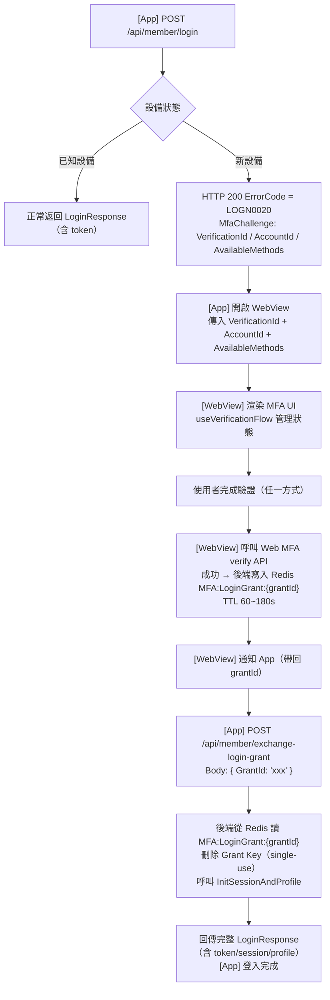
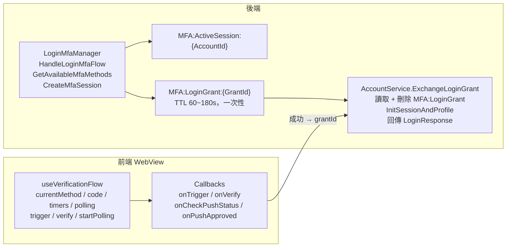

## 背景：為什麼需要新裝置驗證

App 的登入安全升級需求：當使用者從「未曾登入過的新裝置」登入時，需要完成 MFA 驗證，才能取得完整的登入 token 和 session。

這個場景有幾個特殊的工程挑戰：

1. **MFA 流程在 WebView 中完成**：App 收到「需要驗證」的訊號後開啟 WebView，驗證 UI 完全由 Web 端負責
2. **三種驗證方式共用一套 UI 邏輯**：Email OTP、TOTP、Push Notification，切換時不能有狀態殘留
3. **Push Notification 需要前端輪詢**：使用者在另一台設備點「允許」，前端要主動查詢結果
4. **驗證成功後產生短效 grantId**：App 用 grantId 換取正式 token，WebView 本身不持有最終憑證

---

## 整體登入流程（App + WebView 協作）



**關鍵設計：grantId 的一次性機制**

`grantId` 是短效（60~180 秒）一次性憑證。這樣設計的原因：
- WebView 完成驗證後立即簽發，App 用完即失效
- 就算 grantId 在傳遞過程中被攔截，時間窗口極短
- 重放攻擊（replay attack）無效：用過一次就從 Redis 刪除

---

## 後端：MFA 方式的決定邏輯

哪些 MFA 方式可用，由「API 回應」和「Config 設定」共同決定，兩者都 `true` 才啟用：

```
可用 MFA 方式 = API 回應 ∩ Config 開關
```

| 方式 | API 條件 | Config 開關 | 啟用條件 |
|------|---------|------------|---------|
| Push Notification | `pushNotificationEnable = true` | `NewDeviceMfaEnablePushNotification = true` | 兩者皆 true |
| Email OTP | 無條件（預設可用）| `NewDeviceMfaEnableEmailOtp = true` | Config 為 true 即可 |
| TOTP | `totpEnable = true` | `NewDeviceMfaEnableTotp = true` | 兩者皆 true |

這個設計讓「會員沒有設定 TOTP」時 TOTP 不出現在列表，「Push Notification 功能全域關閉」時即使會員有綁定也不顯示。

---

## 功能開關與版本控制

新設備驗證功能透過 App 版本控制分階段上線：

```xml
<!-- FeatureVersionControl.config -->
<FeatureVersion Name="AllowNewDeviceCheck"
                AndroidMinVersion="1.2.0"  AndroidMaxVersion="*.*.*"
                iOSMinVersion="1.2.0"      iOSMaxVersion="*.*.*" />
```

| App 版本 | `AllowNewDeviceCheck` | 行為 |
|---------|----------------------|------|
| < 1.2.0 | `false` | 完全不觸發新設備檢查，走原有登入流程 |
| ≥ 1.2.0 | `true` | 新設備觸發 MFA，回傳 LOGN0020 |

分階段上線策略：初期將版本門檻設為 `1.9.0`（只有最新版測試），確認穩定後降至 `1.2.0`。緊急關閉只需將版本門檻調高至 `99.0.0`。

---

## 前端：useVerificationFlow Composable 設計

WebView 裡的 MFA UI 完全由 `useVerificationFlow` 管理。設計目標：

1. 三種方式共用一套狀態，切換時自動清理
2. Push Notification 的輪詢邏輯完全封裝在 Composable 內
3. **Callback 注入**：Composable 不直接呼叫 API，由呼叫方提供實作
4. `onUnmounted` 自動清理 Polling

### 型別設計

```typescript
export enum LoginVerificationType {
  Email = 1,
  PushNotification = 2,  // 注意：後端 enum 和前端順序不同
  TOTP = 3,
}

export enum VerificationErrorCode {
  InvalidCode = 1001,
  MaxAttemptsReached = 1002,
  PushPending = 2001,   // 輪詢回應：還在等待，不是錯誤
  Exception = 9999,
}

export interface UseVerificationFlowOptions {
  onTrigger?: (method: LoginVerificationType) => Promise<TriggerResult>;
  onVerify?: (code: string, securityCodeId: string, method: LoginVerificationType) => Promise<VerifyResult>;
  onCheckPushStatus?: (verificationId: string, accountId: number, securityCodeId: string) => Promise<PushStatusResult>;
  onPushApproved?: (data: { passport: string; recDomain: Array<{ domain: string }> }) => void;
  onTimeout?: () => void;
  onError?: (errorCode: number) => void;
  onMaxAttemptsReached?: () => void;
}
```

**Callback 模式的工程理由**：

- 同一個 `useVerificationFlow` 可以在「登入驗證」和「裝置驗證」兩個不同頁面使用，注入不同的 API 函式
- Composable 本身可以被獨立單元測試，無需 mock HTTP client
- 驗證成功後的導頁邏輯（`onPushApproved`）由呼叫方決定，Composable 不需要知道 router

---

### 狀態設計：為什麼用 timestamp 而非 countdown

```typescript
// ❌ 常見但有問題的設計
const resendCooldown = ref(60); // 秒數遞減
setInterval(() => { resendCooldown.value--; }, 1000); // 需要管理 interval 清理

// ✅ 本實作：timestamp 比對
const resendCooldownEndTime = ref(0); // 到期時間點（ms）
const canResend = computed(() => resendCooldownEndTime.value <= Date.now());

// 設定：
resendCooldownEndTime.value = Date.now() + 60 * 1000;

// UI 顯示剩餘秒數（由 UI 層自行計算，不需要 Composable 管理 interval）：
const secondsLeft = computed(() =>
  Math.max(0, Math.ceil((resendCooldownEndTime.value - Date.now()) / 1000))
);
```

這個設計的優點：
- Composable 不需要持有任何 `setInterval`（倒數的驅動責任移交給 UI 層）
- 頁面重整後恢復：只要把 `endTime` 存到 localStorage 就能重建狀態
- 多個計時器（resend cooldown + verification expiry）各自獨立，不互相干擾

---

### Push Notification Polling 的完整狀態機

Push Notification 是三種方式中最複雜的，因為它是**非同步等待使用者在另一台設備操作**：

```typescript
const PUSH_POLLING_INTERVAL = 3000; // 每 3 秒輪詢一次

function startPolling(verificationId: string, accountId: number): void {
  if (!onCheckPushStatus || isPolling.value) return; // 冪等：重複呼叫無副作用

  verificationIdForPolling.value = verificationId;
  accountIdForPolling.value = accountId;
  isPolling.value = true;

  // 立即執行一次，不等第一個 3 秒 interval
  // （使用者可能已在另一台設備預先點了允許）
  checkPushStatus();

  pollingIntervalId.value = window.setInterval(() => {
    // 每個 tick 都先檢查 session 是否已過期
    // 不依賴 setInterval 的 timing 精度（可能因 tab 背景化而延遲）
    if (verificationExpiryEndTime.value > 0 && Date.now() >= verificationExpiryEndTime.value) {
      stopPolling();
      onTimeout?.();
      return;
    }
    checkPushStatus();
  }, PUSH_POLLING_INTERVAL);
}

async function checkPushStatus() {
  if (!onCheckPushStatus || !verificationIdForPolling.value) return { success: false };

  try {
    const result = await onCheckPushStatus(
      verificationIdForPolling.value,
      accountIdForPolling.value,
      securityCodeId.value,
    );

    if (result.success) {
      stopPolling();
      if (onPushApproved && result.data) {
        onPushApproved(result.data as { passport: string; recDomain: Array<{ domain: string }> });
      }
      return { success: true };

    } else if (result.errorCode === VerificationErrorCode.PushPending) {
      // 還在等待：什麼都不做，繼續下一個 tick
      return { success: false };

    } else {
      // 真正的錯誤（過期、使用者拒絕等）
      stopPolling();
      onError?.(result.errorCode!);
      return { success: false, errorCode: result.errorCode };
    }
  } catch {
    // 網路錯誤：不停止 Polling，下一個 3 秒 tick 自動重試
    return { success: false };
  }
}
```

**三種 Push 狀態的不同處理**：

| API 回應 | `isPolling` | UI 行為 | 呼叫 Callback |
|---------|------------|---------|-------------|
| `success: true` | 停止 | 成功畫面 | `onPushApproved(data)` |
| `errorCode: PushPending` | 繼續 | 等待動畫 | 無 |
| 其他 errorCode | 停止 | 錯誤 Dialog | `onError(code)` |
| Network error (catch) | 繼續 | 等待動畫 | 無 |

**網路錯誤不停 Polling 的設計理由**：

Push Notification 的場景中，使用者已在等待介面。網路短暫抖動不應該強制使用者重新操作。3 秒後自動重試，對 UX 更友好。只有真正的業務邏輯錯誤（session 過期、Push 被拒絕）才停止。

---

### 精確的過期偵測：為什麼 setInterval 的 3 秒間隔不夠

```typescript
// 問題：setInterval 在 Tab 背景化時可能被 throttle 到 1 分鐘執行一次
// 就算正常執行，3 秒的間隔意味著最多 3 秒的過期判斷誤差

// 解法：額外加一個 1 秒精確檢查的 watcher
watch(
  () => verificationExpiryEndTime.value,
  (newEndTime) => {
    if (newEndTime > 0 && isPolling.value) {
      const expiryCheckInterval = setInterval(() => {
        if (Date.now() >= newEndTime || !isPolling.value) {
          clearInterval(expiryCheckInterval);
          if (Date.now() >= newEndTime) {
            stopPolling();
            onTimeout?.();
          }
        }
      }, 1000); // 1 秒精度
    }
  },
);
```

這個 `watch` 在 `verificationExpiryEndTime` 被設定時（`trigger` 成功後）才啟動，避免在 Push 尚未開始時就跑多餘的 interval。

---

### setMethod：切換方式時的狀態清理

```typescript
function setMethod(method: LoginVerificationType) {
  // 從 Push 切換走：必須先停止 Polling
  // 不停的話 Polling 會在背景繼續，成功後呼叫 onPushApproved，但 UI 已換成 Email 畫面
  if (currentMethod.value === LoginVerificationType.PushNotification && isPolling.value) {
    stopPolling();
  }
  currentMethod.value = method;
  // 清除輸入狀態，但保留 verificationExpiryEndTime
  // 原因：session 還沒過期，切換方式不應重置過期時間
  verificationCode.value = '';
  errorMessage.value = '';
  securityCodeId.value = ''; // 需要重新 trigger 才能取得新的 securityCodeId
}
```

---

### 錯誤訊息的責任邊界

```typescript
function getErrorMessage(errorCode?: number, failCountValue?: number): string {
  switch (errorCode) {
    case VerificationErrorCode.InvalidCode:
      // 只有「驗證碼錯誤」顯示在 input 下方（inline error）
      if (failCountValue !== undefined && maxFailCount.value > 0) {
        const attemptsLeft = maxFailCount.value - failCountValue;
        if (attemptsLeft > 0) {
          // 語言複數處理：1 次用單數文案，多次用複數文案
          const key = attemptsLeft > 1
            ? 'txtAccountInvalidCodeErrors'
            : 'txtAccountInvalidCodeError';
          return t(key, { attemptsLeft });
        }
      }
      return ''; // attemptsLeft = 0 時，MaxAttemptsReached 由 Dialog 處理
    default:
      // 所有其他錯誤（session 過期、網路錯誤、後端錯誤）
      // 由 UI 層的 Dialog 或 Toast 處理，Composable 不知道 Dialog 的存在
      return '';
  }
}
```

**這個邊界的工程意義**：

- `getErrorMessage` 只返回「應該顯示在 input 旁的 inline 訊息」
- 其他所有錯誤的呈現方式（Dialog、Toast、頁面跳轉）由 Composable 的 callback（`onError`、`onTimeout`、`onMaxAttemptsReached`）通知 UI 層
- 這讓 Composable 不依賴任何 UI 框架，可以在不同的設計系統下複用

---

### verify：失敗計數與自動觸發 onMaxAttemptsReached

```typescript
async function verify() {
  if (!isCodeValid.value) return { success: false };
  errorMessage.value = '';

  try {
    const result = await onVerify!(
      verificationCode.value,
      securityCodeId.value,
      currentMethod.value,
    );

    if (result.success) {
      return { success: true, data: result.data };
    }

    if (result.failCount !== undefined) {
      failCount.value = result.failCount;
    }

    // 達到上限：通知 UI 層（通常是鎖定 Dialog），不顯示 inline error
    if (result.failCount !== undefined && maxFailCount.value > 0) {
      const attemptsLeft = maxFailCount.value - result.failCount;
      if (attemptsLeft <= 0) {
        onMaxAttemptsReached?.();
        return { success: false, errorCode: result.errorCode, failCount: result.failCount };
      }
    }

    // 未達上限：顯示 inline error（還剩 N 次）
    errorMessage.value = getErrorMessage(result.errorCode, result.failCount);
    verificationCode.value = ''; // 清空輸入，讓使用者重新輸入
    return { success: false, errorCode: result.errorCode, failCount: result.failCount };

  } catch {
    return { success: false, errorCode: VerificationErrorCode.Exception };
  }
}
```

`maxFailCount` 從 `trigger` 的 API 回應取得，而非硬編碼。這讓後端可以根據風險等級動態調整（例如風險較高的帳號縮短至 3 次）。

---

### reset 與 onUnmounted

```typescript
function reset() {
  stopPolling();
  clearVerificationExpiryTimer();
  clearResendCooldown();
  verificationCode.value = '';
  errorMessage.value = '';
  securityCodeId.value = '';
  maskedEmail.value = '';
  failCount.value = 0;
  // 注意：不重置 maxFailCount，它是由 API 決定的業務規則
}

// 組件 unmount 時自動清理 Polling
// 防止：使用者導頁後 setInterval 仍在背景執行，觸發 onPushApproved 並試圖操作已銷毀的 vue instance
onUnmounted(() => {
  stopPolling();
});
```

---

## WebView 的使用方式（完整範例）

```vue
<script setup lang="ts">
import { useRoute } from 'vue-router';

const route = useRoute();
// WebView URL 從 App 傳入：?verificationId=xxx&accountId=12345&methods=1,2,3
const verificationId = route.query.verificationId as string;
const accountId = Number(route.query.accountId);
const availableMethods = (route.query.methods as string)
  .split(',')
  .map(Number) as LoginVerificationType[];

const {
  currentMethod,
  verificationCode,
  errorMessage,
  canResend,
  isPolling,
  verificationExpiryEndTime,
  setMethod,
  trigger,
  verify,
  resend,
  startPolling,
  handleTimeout,
  reset,
} = useVerificationFlow({
  onTrigger: async (method) => {
    return await mfaApi.trigger({ verificationId, accountId, method });
  },
  onVerify: async (code, securityCodeId, method) => {
    return await mfaApi.verify({ verificationId, accountId, code, securityCodeId, method });
  },
  onCheckPushStatus: async (verificationId, accountId, securityCodeId) => {
    return await mfaApi.checkPushStatus({ verificationId, accountId, securityCodeId });
  },
  onPushApproved: (data) => {
    // 透過 App Bridge 通知 App，帶回 grantId
    nativeBridge.notifyVerificationComplete({ grantId: data.passport });
  },
  onTimeout: () => {
    showTimeoutDialog.value = true;
  },
  onError: (errorCode) => {
    showErrorDialog(errorCode);
  },
  onMaxAttemptsReached: () => {
    showLockedDialog.value = true;
  },
});

// 初始化：根據 availableMethods 設定預設方式，並觸發第一次驗證碼發送
onMounted(async () => {
  // Push 優先（使用者體驗最佳），其次 Email，最後 TOTP
  const preferredOrder = [
    LoginVerificationType.PushNotification,
    LoginVerificationType.Email,
    LoginVerificationType.TOTP,
  ];
  const defaultMethod = preferredOrder.find(m => availableMethods.includes(m))
    ?? LoginVerificationType.Email;

  setMethod(defaultMethod);
  const result = await trigger();

  if (defaultMethod === LoginVerificationType.PushNotification && result.success) {
    startPolling(verificationId, accountId);
  }
});
</script>
```

---

## Redis 儲存結構（前後端對應）

前端完成 MFA 驗證後，後端在 Redis 寫入兩種 key：

```
MFA:ActiveSession:{AccountId}   TTL 30 分鐘
  └─ MfaContext (JSON)
       ├─ VerificationId, AccountId, LoginId, MemberCode
       ├─ ClientIP, UserAgent, CountryCode, City
       ├─ FingerPrintId, ScreenResolution, DeviceLanguage
       ├─ DeviceType, BlackBox, DeviceId, DeviceModel
       └─ LightSpeedToken, BundleId, WebAuthnCredentialId

MFA:LoginGrant:{GrantId}        TTL 60~180 秒（一次性）
  └─ MfaContext 全量 snapshot（同上）
```

`MFA:ActiveSession` 在同一 AccountId 重複登入時**覆蓋舊記錄**（踢單機制）。`MFA:LoginGrant` 兌換成功後**立即刪除**，防止重放攻擊。

---

## 架構全景


