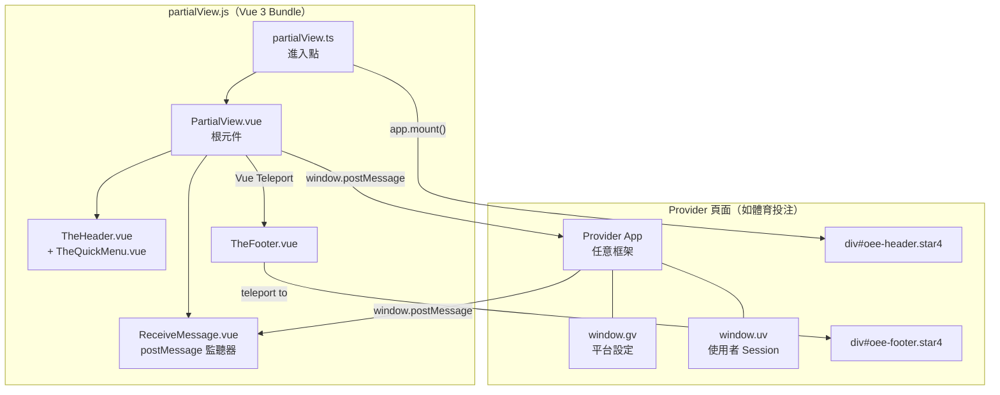
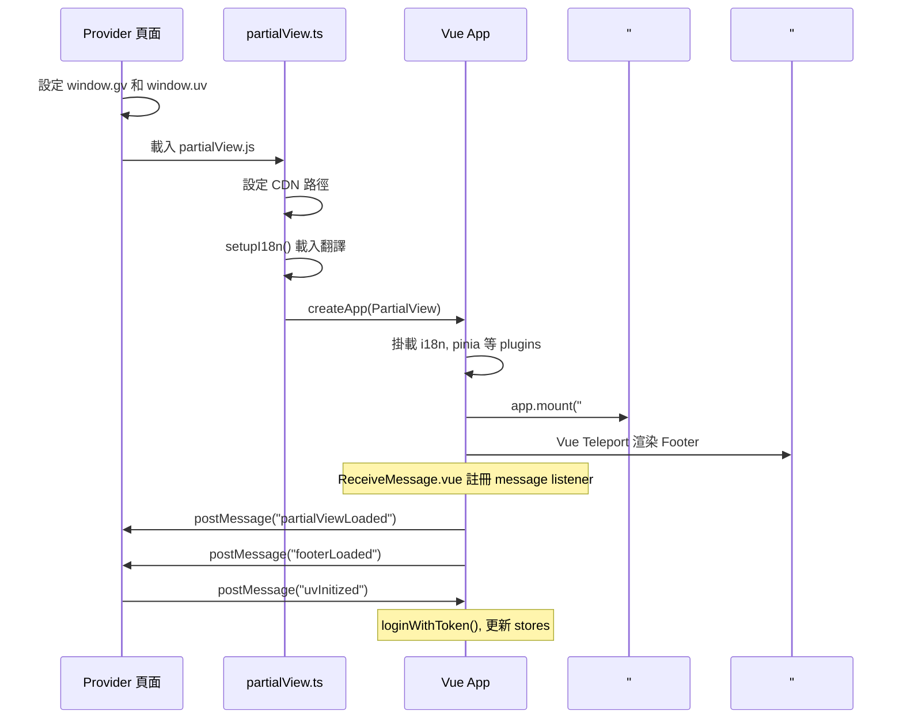
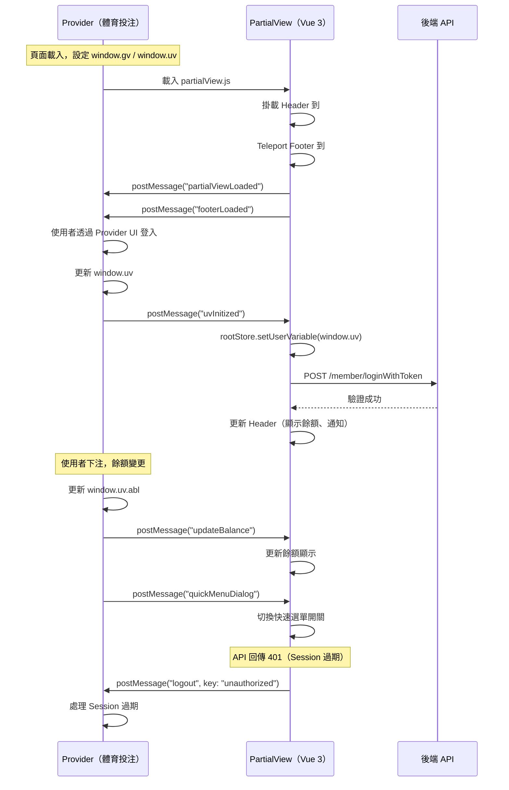
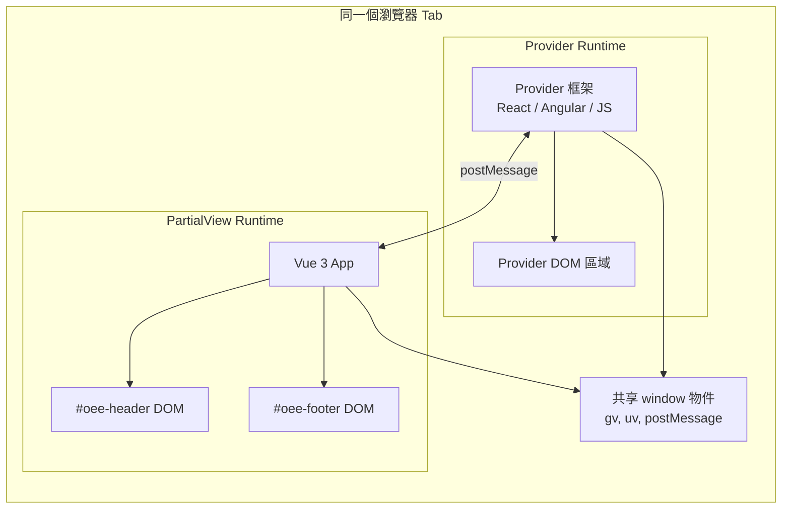

## 前言

在多產品平台中，每個產品（體育、娛樂城、棋牌等）可能由不同的合作夥伴（Provider）開發，使用的技術棧也各不相同——React、Angular、甚至純 JS。但平台需要在所有產品頁面上維持一致的品牌形象、導航列、會員狀態和法律聲明。

要求每個 Provider 自行實作這些 UI 元件既不現實也難以維護。因此我們設計了 **star4partialview** — 一個獨立打包的 Vue 3 應用，輸出單一 `partialView.js`，Provider 只需引入一個 `<script>` 標籤就能獲得完整的 Header + Footer。

兩個獨立的 JS Runtime 透過 `window.postMessage` 通訊，實現了一種輕量級的 **Micro Frontend** 模式。

<!-- more -->

## 整體架構



### 關鍵設計決策

| 面向 | 決策 | 原因 |
|------|------|------|
| 掛載策略 | 直接 DOM 掛載（非 iframe） | 共享 Cookie/Session、無 CORS 問題、原生捲動行為 |
| 通訊方式 | `window.postMessage` | 解耦、框架無關、同源和跨域都能用 |
| CSS 隔離 | Tailwind 限定在 `.star4` class 下 | 避免樣式污染 Provider 頁面 |
| 打包策略 | `all-in-one` 單一 chunk | Provider 只需引入一個 `<script>` |

## 打包與部署

使用 Rsbuild (`@rsbuild/core`) 搭配 Vue Plugin 打包。

### 產出檔案

| 資源 | 路徑 | 命名規則 |
|------|------|---------|
| 主要 JS | `cdn/star4partialview/js/partialView.js` | 固定檔名（無 hash） |
| CSS | `cdn/star4partialview/css/partialView.css` | 固定檔名 |
| 非同步 chunk | `cdn/star4partialview/js/async/` | 含 content hash |
| 圖片 | `cdn/star4partialview/img/` | — |
| 字型 | `cdn/star4partialview/woff/` | — |

### CSS 隔離策略

Tailwind CSS 透過 `important: '.star4'` 限定作用範圍：

```javascript
// tailwind.config.js
const settings = {
  important: '.star4',       // 所有 utility 限定在 .star4 內
  corePlugins: {
    preflight: false,         // 關閉 CSS reset，避免影響 Provider 樣式
  },
  darkMode: 'class',
};
```

Provider 頁面的掛載點需要加上 `.star4` class：

```html
<div id="oee-header" class="star4 !star4"></div>
<div id="oee-footer" class="star4 !star4"></div>
```

這確保所有 Tailwind utility 只在 `.star4` 容器內生效，不會與 Provider 自身的樣式衝突。

## 掛載機制

### Provider 需要準備的前置條件

**1. DOM 掛載點**

```html
<div id="oee-header" class="star4 !star4"></div>
<!-- Provider 內容 -->
<div id="oee-footer" class="star4 !star4"></div>
```

**2. 全域變數**

```javascript
// window.gv — 平台設定（由 Server Side Render 注入）
window.gv = {
  cooperativeSet: { ... },  // 贊助商、社群媒體、授權資訊
  modules: [ ... ],         // 各模組維護狀態
  prods: [ ... ],           // 可用產品（體育、娛樂城、棋牌等）
  domains: {
    cdn: "https://cdn.example.com",
    content: "https://cdn.example.com/content"
  },
  r: "China",               // 當前地區
  lan: "zh-cn",             // 當前語系
  productName: "sports",    // 目前產品
  logoUrl: { ... },         // 地區對應的 Logo URL
};

// window.uv — 使用者 Session（登入後更新）
window.uv = {
  prod: 'sports',
  ssid: '',                 // Session ID（未登入時為空）
  newLogin: false,
  abl: '',                  // 可用餘額
};
```

### 初始化流程



進入點程式碼：

```typescript
setupI18n().then((i18n) => {
  const app = createApp(PartialView)
    .use(i18n)
    .use(VWave, {})
    .use(VueSanitize)
    .use(VueLazyload, { ... })
    .use(pinia);
  app.mount('#oee-header');
});
```

## PostMessage 通訊協議

### Topic 定義

```typescript
export enum Topic {
  PartialViewLoaded = 'partialViewLoaded',
  FooterLoaded = 'footerLoaded',
  Logout = 'logout',
  UpdateBalance = 'updateBalance',
  UvInitized = 'uvInitized',
  QuickMenuDialog = 'quickMenuDialog',
}

export enum Key {
  Unauthorized = 'unauthorized',
}
```

### Provider → PartialView

| Topic | Payload | 用途 | PartialView 動作 |
|-------|---------|------|-----------------|
| `uvInitized` | `{ topic: 'uvInitized' }` | 通知使用者 Session 就緒 | 讀取 `window.uv`，呼叫 `loginWithToken()` |
| `updateBalance` | `{ topic: 'updateBalance' }` | 餘額變更 | 從 `window.uv.abl` 或 API 重新取得餘額 |
| `quickMenuDialog` | `{ topic: 'quickMenuDialog' }` | 切換漢堡選單 | `rootStore.toggleQuickMenu()` |

### PartialView → Provider

| Topic | Payload | 觸發時機 |
|-------|---------|---------|
| `partialViewLoaded` | `{ topic: 'partialViewLoaded' }` | Footer 元件掛載完成 |
| `footerLoaded` | `{ topic: 'footerLoaded', data: { footerLoaded: true } }` | Footer 元件掛載完成 |
| `logout` | `{ topic: 'logout', data: { key: 'unauthorized' } }` | API 回傳 401（Session 過期） |

### 完整生命週期



### 訊息處理器

```typescript
async function receiveMessage(ev) {
  let payload = ev.data;
  switch (payload.topic) {
    case Topic.UpdateBalance:
      if (payload.data?.key === Topic.UvInitized) {
        rootStore.setUserVariable(window.uv);
        await authStore.loginWithToken();
        eventBus.emit(Topic.UvInitized, true);
      } else {
        // 重新整理餘額顯示
      }
      break;
    case Topic.UvInitized:
      rootStore.setUserVariable(window.uv);
      await authStore.loginWithToken();
      eventBus.emit(Topic.UvInitized, true);
      break;
    case Topic.QuickMenuDialog:
      rootStore.toggleQuickMenu();
      break;
  }
}
```

## Header 功能

### App Bar（桌面版 + 手機版）

| 功能 | 說明 |
|------|------|
| Logo | 依地區顯示對應 Logo，連結到首頁 |
| 產品導航 | 體育、電競、娛樂城、真人、棋牌、虛擬、彩票，含維護狀態標記 |
| 登入按鈕 | 導向 Provider 的註冊/登入頁面 |
| 會員餘額 | 顯示/隱藏切換，透過 postMessage 即時更新 |
| 通知徽章 | KYC 狀態、收件匣未讀、通知數量 |
| 語系選擇 | 切換語言後重新載入頁面 |
| 快速選單 | 漢堡圖示開啟側邊抽屜 |

### 快速選單（側邊抽屜）

| 區塊 | 內容 |
|------|------|
| 時鐘 | 當前時間與 GMT 時區偏移 |
| 餘額 | 可用餘額、顯示/隱藏、重新整理 |
| 產品導航 | 方塊圖示快速切換產品 |
| 帳戶連結 | 我的帳戶、獎勵、銀行、通知、訊息 |
| 資訊連結 | 優惠活動、推薦好友、APP 下載、客服、線上聊天 |
| 設定 | 地區選擇、語系選擇、網站地圖 |
| 認證 | 登出按鈕 |

所有導航使用 `window.location.href` 做整頁跳轉（Partial View 內不使用 SPA 路由）。

## Footer 功能

| 區塊 | 內容 |
|------|------|
| 常用連結 | 條款與條件、隱私權政策、責任博弈、客服、合作夥伴、聯盟 |
| 安全與信任 | 授權標章（IOM、Anjouan）含外部連結 |
| 責任博弈 | 相關組織標章（ResGame、GameCare、GambleAware） |
| 授權聲明 | Anjouan 授權免責聲明文字 |
| 伺服器版本 | 點擊顯示伺服器版本代碼 |
| 開發工具 | 連點 9 次「責任博弈」載入 Eruda 除錯器 |

Footer 掛載完成後會發送 `partialViewLoaded` 和 `footerLoaded` 訊息，通知 Provider 可以開始互動。

## 跨框架設計模式分析

### 模式：透過直接 DOM 掛載的嵌入式 Micro Frontend



### 為什麼選擇 postMessage？

| 方案 | 優點 | 缺點 | 結論 |
|------|------|------|------|
| **postMessage** | 框架無關、非同步、解耦、支援跨域 | 需定義訊息協議 | **採用** |
| Custom Events | 簡單、原生 DOM | 需共享 DOM 節點參考、不支援跨域 | 不適用 |
| 共享全域狀態 | 零延遲 | 緊耦合、競態條件、跨框架無響應性 | 不適用 |
| iframe | 完全隔離 | CORS 複雜、無法共享 Cookie、捲動/縮放問題 | 過度設計 |

### CSS 隔離策略

| 層級 | 技術 |
|------|------|
| Tailwind 作用域 | `important: '.star4'` 確保 utility 只在 `.star4` 容器內生效 |
| 關閉 Preflight | `preflight: false` 避免 Tailwind 的 CSS reset 影響 Provider |
| 容器 class | `#oee-header` 和 `#oee-footer` 都加上 `class="star4"` |
| 字型隔離 | 自訂字型在 PartialView.vue 的 `<style>` 區塊內宣告 |

### 資料傳遞契約：全域變數注入

Provider 在載入 bundle 前設定兩個全域變數，而非透過 API 或複雜的握手協議：

| 變數 | 擁有者 | 更新者 | 消費者 |
|------|--------|--------|--------|
| `window.gv` | Server Side Render | Provider（頁面初始載入） | PartialView（唯讀） |
| `window.uv` | Provider | Provider（登入/餘額變更時） | PartialView（透過 postMessage 觸發讀取） |

postMessage 在這裡扮演的是**通知機制**（「資料已更新，請重新讀取」），實際資料傳遞透過共享的 `window` 物件完成。這避免了大型設定物件的序列化開銷。

## Pinia Stores

| Store | State | 主要 Actions |
|-------|-------|-------------|
| **root** | `gv`, `uv`, `domains`, `showQuickMenu` | `setDomainVariable`, `setLanguageCode`, `setUserVariable`, `toggleQuickMenu` |
| **auth** | 登入狀態, trading info | `loginWithToken`, `healthCheck` |
| **my-account** | 餘額, 可提領金額, rollover | `fetchBalanceInfo`, `fetchBalanceInfoRealTime`, `updateAvailableBalance` |
| **message** | `inboxUnreadCount`, `notificationsUnreadCount` | 取得未讀數量 |
| **kyc** | `redStatusCount` | KYC 狀態檢查 |
| **rewards** | `availableRewardsCount` | 獎勵數量 |
| **theme** | `regionTheme`, `logoUrl` | 依地區解析主題 |
  