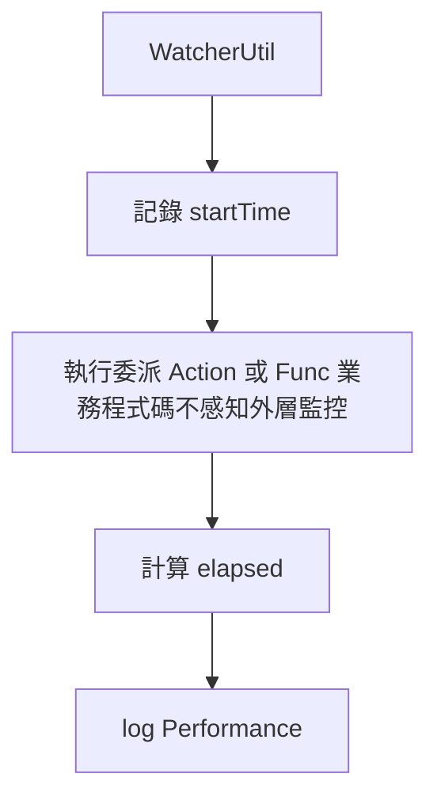
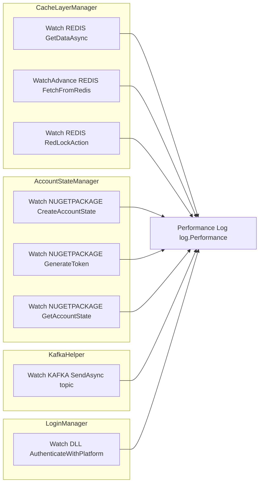

## 問題：效能監控程式碼到處散落

一般做法是在每個方法手動埋計時：

```csharp
// 到處複製貼上，業務邏輯被監控代碼淹沒
var start = DateTime.Now;
try {
    result = db.GetSomething(key);
    var ms = (DateTime.Now - start).TotalMilliseconds;
    log.Performance("REDIS", "GetSomething", ms.ToString(), "");
} catch (Exception ex) {
    log.Exception(ex);
}
```

這違反了 **單一職責原則（SRP）**，監控邏輯和業務邏輯耦合在一起。

<!-- more -->

## 解法：WatcherUtil — 用 Delegate 包裝



## 核心實作

```csharp
// WatcherUtil.cs
public class WatcherUtil
{
    private readonly ISysLog log;

    public WatcherUtil(ISysLog outLog)
    {
        log = outLog;
    }

    // 同步 void
    public void Watch(PerformanceSource source, string funcName, Action func)
    {
        DateTime startTime = DateTime.Now;
        func();
        FunctionEnd(source, funcName, startTime);
    }

    // 非同步 void
    public async Task Watch(PerformanceSource source, string funcName, Func<Task> func)
    {
        DateTime startTime = DateTime.Now;
        await func();
        FunctionEnd(source, funcName, startTime);
    }

    // 同步有回傳值
    public TResult Watch<TResult>(PerformanceSource source, string funcName, Func<TResult> func)
    {
        DateTime startTime = DateTime.Now;
        TResult t = func();
        FunctionEnd(source, funcName, startTime);
        return t;
    }

    // 附例外處理的進階版
    public void WatchAdvance(PerformanceSource source, string funcName, Action func)
    {
        DateTime startTime = DateTime.Now;
        try
        {
            func();
            FunctionEnd(source, funcName, startTime);
        }
        catch (Exception ex)
        {
            log.Exception($"{funcName} throwing error", ex.Message);
        }
    }

    private void FunctionEnd(PerformanceSource source, string funcName, DateTime startTime)
    {
        double timeSpan = (DateTime.Now - startTime).TotalMilliseconds;
        log.Performance(source, funcName, timeSpan.ToString("0"), "");
    }
}
```

## PerformanceSource — 分類監控來源

```csharp
public enum PerformanceSource
{
    REDIS,        // Redis 操作
    DLL,          // 內部 DLL 呼叫
    NUGETPACKAGE, // NuGet 套件呼叫
    REQUEST,      // HTTP 外部請求
    KAFKA         // Kafka 訊息發送
}
```

每筆 Performance log 都會帶上來源分類，讓 log 平台可以按維度聚合分析。

## 呼叫方式對比

### 使用前

```csharp
// CacheLayerManager — 每個方法手動埋時間
DateTime start = DateTime.Now;
cacheData = redisObjectStore.Get(GetCacheDataKey(cacheName, key));
result = JsonConvert.DeserializeObject<T>(cacheData.jsonStr);
double ms = (DateTime.Now - start).TotalMilliseconds;
log.Performance(PerformanceSource.REDIS, "FetchFromRedis", ms.ToString(), "");
```

### 使用後

```csharp
// 業務邏輯完全乾淨，監控是外層關心的事
watcher.WatchAdvance(PerformanceSource.REDIS, $"FetchFromRedis_{cacheName}", () =>
{
    cacheData = redisObjectStore.Get(GetCacheDataKey(cacheName, key));
    result = JsonConvert.DeserializeObject<T>(cacheData.jsonStr);
});
```

## 實際使用案例



**全專案共超過 20+ 個監控點，全部只用同一個 `WatcherUtil`。**

## Watch vs WatchAdvance 差異

| 項目 | Watch | WatchAdvance |
|------|--------|----------------|
| 例外 | 直接往外拋，呼叫者處理 | 捕捉後 `log.Exception`，不往外拋 |
| 適用 | 關鍵路徑，必須讓上層知道錯誤 | 讀取／可降級場景（例如 cache miss 不影響主流程） |
| 行為示意 | 例外流向 caller | 例外在工具內記錄後結束 |

## 這是什麼設計模式？

這是 **Decorator Pattern** 與 **AOP（Aspect-Oriented Programming）** 的輕量實作：在不修改業務方法本體的前提下，於執行前後加上計時與記錄。

| 面向 | 傳統 AOP 框架（如 PostSharp） | WatcherUtil |
|------|------------------------------|-------------|
| 寫法 | Attribute + 織入 IL | `watcher.Watch(source, name, () => { ... })` |
| 依賴 | 需框架、編譯期或執行期織入 | 單一類別 + `Action` / `Func` |
| 彈性 | 宣告式，改動需重新編譯／部署策略 | 呼叫端明確包一層，易讀易搜 |

不需要任何 AOP 框架，利用 C# `Action`／`Func` delegate，就能以較小代價達到類似「橫切關注點」的效果。

## Log 輸出格式

```
[Performance] source=REDIS | method=FetchFromRedis_TradingSession | time=3ms
[Performance] source=NUGETPACKAGE | method=SingleSignOnService_GenerateToken | time=12ms
[Performance] source=KAFKA | method=SendAsync_AP.FE.MEMBER_LOGIN | time=45ms
[Performance] source=DLL | method=AuthenticateWithPlatform | time=230ms
```

這些 log 可以直接接入 ELK / Grafana，按 `source`、`method` 做 P95/P99 分析。

## 小結

| 特性 | 說明 |
|------|------|
| **零侵入** | 業務邏輯不需要加任何 attribute 或繼承 |
| **泛型支援** | `Watch<TResult>` 支援有回傳值的函式 |
| **async 支援** | `Watch(Func<Task>)` 原生支援 async/await |
| **例外策略** | `Watch` vs `WatchAdvance` 兩種策略可選 |
| **可測試** | `ISysLog` 可輕易 Mock，單元測試友善 |
