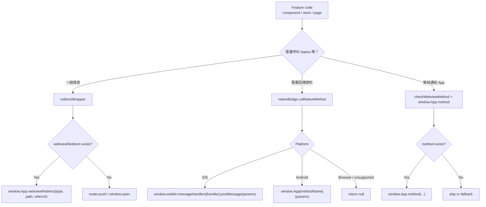
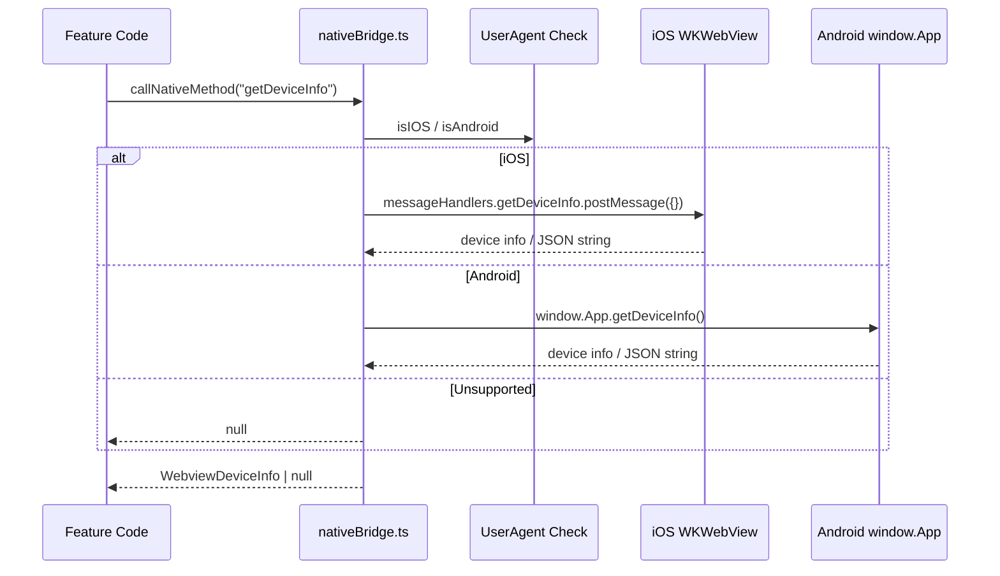
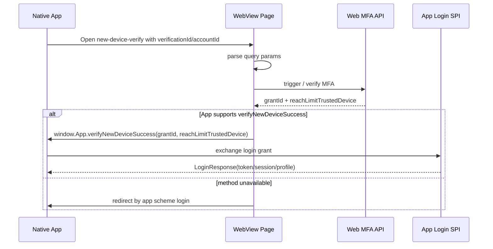

## 前言

WebView 專案最容易長歪的地方，是前端到處直接呼叫：

```ts
window.App.nativeRedirect('lobby');
window.App.logout();
window.App.webviewRedirect('deposit', '', '');
```

短期看起來很快，長期會出現幾個問題：

- Web 瀏覽器環境沒有 `window.App`，直接噴錯
- Android 與 iOS bridge API 不一定長一樣
- 有些 native method 是 fire-and-forget，有些會回傳資料
- 同一個功能在 RWD 與 WebView 需要不同 fallback
- App team 改 method 或部分版本未支援時，前端會直接壞掉

這個專案用 `webviewUtil.ts` 與 `nativeBridge.ts` 把 native bridge 包成一層 utility，讓呼叫點先檢查能力，再決定走 Native 還是 Web fallback。

## 相關檔案

```text
client/packages/common/utils/webviewUtil.ts
client/packages/common/utils/nativeBridge.ts
client/packages/common/utils/appEventsHelper.ts
client/packages/common/stores/account-security.ts
client/packages/star4webview/src/pages/NewDeviceVerifyPage.vue
client/packages/star4webview/src/layout/HeaderFooterLayout.vue
```

## 第一層：最基本的能力檢查

`checkWebviewMethod` 是最基礎的保護：

```ts
export function checkWebviewMethod(methodName) {
  return typeof window.App !== 'undefined' && typeof window.App[methodName] !== 'undefined';
}
```

這個函式看起來很小，但價值很高。

它避免所有呼叫點直接假設 `window.App` 一定存在：

```ts
if (checkWebviewMethod('logout')) {
  window.App.logout();
}
```

這對共用 package 很重要，因為同一份 common code 同時會跑在：

- Desktop Web
- Mobile Web
- App WebView
- Storybook / test environment

沒有這層檢查，common code 很容易在非 WebView 環境直接 crash。

## Android 與 iOS Bridge 差異

Android WebView 常見 bridge 形式：

```ts
window.App.getDeviceInfo();
window.App.nativeRedirect('lobby');
```

iOS WKWebView 常見 bridge 形式：

```ts
window.webkit.messageHandlers.getDeviceInfo.postMessage({});
```

因此 `nativeBridge.ts` 把「檢查 method」分成兩種。

有回傳資料的 method：

```ts
export function checkWebviewMethodWithResponseData(
  methodName: string,
  iosHandlerName?: string,
): boolean {
  const userAgent = navigator.userAgent;
  const iosHandler = iosHandlerName || methodName;

  if (isIOS(userAgent)) {
    return !!window.webkit?.messageHandlers?.[iosHandler];
  }

  if (isAndroid(userAgent)) {
    return checkWebviewMethod(methodName);
  }

  return false;
}
```

這個函式的重點是：**iOS 不查 `window.App`，而是查 `window.webkit.messageHandlers`**。

同一個功能在不同平台可能不是同一個 bridge 入口，這也是 WebView utility 需要存在的原因。

## 統一呼叫入口：callNativeMethod

`callNativeMethod` 把 iOS 與 Android 的呼叫方式包起來：

```ts
export async function callNativeMethod<T>(
  methodName: string,
  params?: unknown,
  iosHandlerName?: string,
): Promise<T | null> {
  const userAgent = navigator.userAgent;
  const iosHandler = iosHandlerName || methodName;

  if (isIOS(userAgent) && window.webkit?.messageHandlers?.[iosHandler]) {
    try {
      const result = await window.webkit.messageHandlers[iosHandler].postMessage(params ?? {});
      return result as T;
    } catch (error) {
      console.warn(`Failed to call iOS native method ${iosHandler}:`, error);
      return null;
    }
  }

  if (isAndroid(userAgent) && checkWebviewMethod(methodName)) {
    try {
      const result =
        params !== undefined ? window.App[methodName](params) : window.App[methodName]();
      return result as T;
    } catch (error) {
      console.warn(`Failed to call Android native method ${methodName}:`, error);
      return null;
    }
  }

  return null;
}
```

這裡有幾個設計重點：

- 回傳 `Promise<T | null>`，呼叫方一定要處理 method 不存在
- iOS 與 Android 都用 try/catch 包住
- iOS handler name 可以和 Android method name 不同
- 不支援的平台回傳 null，而不是 throw

這樣可以讓上層流程寫得比較乾淨：

```ts
const result = await callNativeMethod<boolean>('checkAppSchemeAction', {
  scheme: appSchemeName,
});

return result ?? false;
```

## Case 1：取得 Native Device Info

Trusted Device 功能需要取得裝置資訊：

```ts
export async function getDeviceInfo(): Promise<WebviewDeviceInfo | null> {
  const result = await callNativeMethod<string | WebviewDeviceInfo>('getDeviceInfo');

  if (!result) return null;

  if (typeof result === 'string') {
    try {
      return JSON.parse(result) as WebviewDeviceInfo;
    } catch {
      console.warn('Failed to parse device info JSON');
      return null;
    }
  }

  return result as WebviewDeviceInfo;
}
```

這段處理了 App bridge 常見的資料格式不一致：

- 有些 native 版本直接回 object
- 有些 native 版本回 JSON string

前端不把這個差異丟給 feature code，而是在 bridge utility 裡做 parse 與 fallback。

在 `account-security.ts` 中使用：

```ts
if (checkWebviewMethodWithResponseData('getDeviceInfo')) {
  const webviewDeviceInfo = await getDeviceInfo();

  if (webviewDeviceInfo) {
    fingerPrintId = webviewDeviceInfo.fingerPrintId || fingerPrintId;
    deviceModel = webviewDeviceInfo.deviceModel || deviceModel;
    screenResolution = webviewDeviceInfo.screenResolution || screenResolution;
    deviceLanguage = webviewDeviceInfo.deviceLanguage || deviceLanguage;
    countryCode = webviewDeviceInfo.countryCode || countryCode;
    deviceType = webviewDeviceInfo.deviceType;
  }
}
```

這裡的 fallback 很關鍵：

```ts
deviceModel = webviewDeviceInfo.deviceModel || deviceModel;
```

如果 App 沒回某個欄位，仍然保留 Web 環境原本可取得的資料，不會把 request 組壞。

## Case 2：WebView Redirect 與 Web Fallback

`redirectWrapper` 把 WebView 與一般 Web 導頁合併：

```ts
export function redirectWrapper(router, path, openWindow = false, type = 'Star', referUrl = '') {
  if (checkWebviewMethod('webviewRedirect')) {
    window.App.webviewRedirect(type, path, referUrl);
  } else {
    if (openWindow) {
      window.open(`/${window.gv.lan}/${path}`);
    } else {
      router.push(`/${window.gv.lan}/${path}`);
    }
  }
}
```

在 WebView：

```ts
window.App.webviewRedirect(type, path, referUrl);
```

在一般 Web：

```ts
router.push(`/${window.gv.lan}/${path}`);
```

這種寫法避免 feature component 裡到處寫：

```ts
if (isWebView) {
  // native
} else {
  // router
}
```

## webviewRedirect 的語意不是單一路徑

`webviewUtil.ts` 裡的註解其實很有價值，因為它說明 `webviewRedirect` 不是單純 router path，而是 App 與 Web 約定好的 command：

```text
App.webviewRedirect('Browser', path, '', '')
App.webviewRedirect('Star', path, referUrl)
App.webviewRedirect('PCH', path, referUrl)
App.webviewRedirect('profileVerification', '', '')
App.webviewRedirect('faq', '', '')
App.webviewRedirect('deposit', '', '')
App.webviewRedirect('withdrawal', '', '')
App.webviewRedirect('termsConditions', '', '')
App.webviewRedirect('responsibleGambling', '', '')
App.webviewRedirect('profile', '', '')
App.webviewRedirect('withdrawalTransHistory', '', '')
```

這代表 bridge API 的第一個參數其實有 routing command 的味道。

如果把這些呼叫散落在 component，很快就會變成 App/Web 約定難以追蹤。集中放在 utility 或封裝成 domain function 會更安全。

## Case 3：New Device Verify 成功後通知 App

在 New Device 驗證流程中，WebView 完成 MFA 後會拿到 `grantId`：

```ts
function handleVerified(result: {
  success: boolean;
  passport: string;
  recDomain: Array<{ domain: string }>;
  grantId?: string;
  reachLimitTrustedDevice?: boolean;
}) {
  if (result.grantId && checkWebviewMethod('verifyNewDeviceSuccess')) {
    window.App.verifyNewDeviceSuccess(result.grantId, result.reachLimitTrustedDevice);
  } else {
    window.location.href = `${rootStore.gv.appScheme}${AppSchemePath.Login}`;
  }
}
```

這段的設計邏輯是：

1. WebView 完成驗證
2. 後端回 `grantId`
3. 如果 App 支援 `verifyNewDeviceSuccess`，把 grantId 交給 App
4. App 再用 grantId 兌換完整 login response
5. 如果 method 不存在，fallback 到 app scheme login

這是前後端與 Native App 三方協作的典型場景。

Web 不直接拿完整 session，而是把短效 grant 交回 App，讓 App 走原本的登入完成流程。

## Case 4：WebView Header Title

`HeaderFooterLayout.vue` 會把頁面 title 傳給 App：

```ts
if (checkWebviewMethod('webViewTitle')) {
  window.App.webViewTitle(title);
}
```

這類 method 屬於 UI sync：

- Web 決定目前頁面 title
- App native shell 負責顯示 header
- Web 只在 method 存在時通知 App

這種小同步很多，但如果沒有統一能力檢查，也很容易在瀏覽器測試時炸掉。

## Case 5：Native Redirect

在 WebView router 或 Sports direct launch 中：

```ts
if (checkWebviewMethod('nativeRedirect')) {
  window.App.nativeRedirect('lobby');
}
```

或：

```ts
window.App.nativeRedirect('sbk');
```

`nativeRedirect` 通常不是普通 URL，而是 App 底部 tab 或 native module 的 navigation command。

這類行為不能用 web router 模擬，所以最安全的策略是：

- 有 native method 就交給 App
- 沒有 native method 就不做 native redirect，改走 Web fallback 或結束流程

## Bridge 設計原則

從這個專案可以整理出幾個原則：

### 1. 任何 `window.App` 呼叫前都要 check

```ts
if (checkWebviewMethod('logout')) {
  window.App.logout();
}
```

這是最低限度的保護。

### 2. Android 與 iOS bridge 要分開抽象

Android：

```ts
window.App[methodName](params)
```

iOS：

```ts
window.webkit.messageHandlers[handlerName].postMessage(params)
```

如果只封裝 Android，iOS 後續會長出一堆特殊 case。

### 3. 回傳值要允許 null

```ts
Promise<T | null>
```

Native method 可能不存在、失敗、版本太舊、回傳格式錯誤。前端應該把這些都當成正常分支。

### 4. Feature code 不應該理解所有 native 細節

Feature code 應該像這樣：

```ts
const webviewDeviceInfo = await getDeviceInfo();
```

而不是：

```ts
if (isIOS) {
  window.webkit...
} else if (isAndroid) {
  window.App...
}
```

平台差異應該收斂在 bridge utility。

### 5. Web fallback 要明確

例如：

```ts
if (checkWebviewMethod('webviewRedirect')) {
  window.App.webviewRedirect(type, path, referUrl);
} else {
  router.push(`/${window.gv.lan}/${path}`);
}
```

不是所有 native method 都能 fallback，但能 fallback 的應該在 utility 層處理。

## 整體架構圖



這張圖可以把整篇文章的核心濃縮成一句話：**feature code 不直接理解平台差異，而是把平台差異交給 bridge layer**。

## iOS / Android 呼叫序列圖



這個設計讓 feature code 可以只處理資料結果：

```ts
const deviceInfo = await getDeviceInfo();
```

不用在每個 feature 裡重複寫 `isIOS`、`isAndroid`、`window.webkit`、`window.App`。

## New Device Verify 三方流程

New Device Verify 是這套 Bridge 最典型的場景，因為它不是單純 Web 導頁，而是 Web、後端、Native App 三方協作。



這裡最關鍵的是 `grantId` 的責任邊界：

- WebView 負責完成 MFA
- Web API 負責簽發短效 grant
- Native App 負責把 grant 兌換成正式 login session

WebView 不直接保存完整 login session，這樣可以維持 App 原本的登入主控權，也能降低 WebView token 外洩的風險。

## Bridge Method 分類

這個專案裡的 native method 大致可以分成幾類：

| 類型 | 範例 | 特性 |
|---|---|---|
| Navigation | `nativeRedirect`, `webviewRedirect`, `externalBrowser` | 多半沒有回傳值，語意像 command |
| UI Sync | `webViewTitle`, `updateUI`, `showSnackBar` | Web 通知 App shell 更新 UI |
| Auth / Session | `logout`, `verifyNewDeviceSuccess` | 會影響登入狀態，需要非常保守 |
| Device Data | `getDeviceInfo`, `checkAppSchemeAction` | 需要回傳值，iOS / Android 差異最大 |
| Feature Entry | `startChatbotWithParam`, `chatNowEvent`, `jumioLostEmail` | 通常綁特定產品功能 |

分類後會更清楚：不是所有 native method 都該用同一種呼叫策略。

- command 型 method 可以用 `checkWebviewMethod`
- data 型 method 應該用 `callNativeMethod<T>`
- redirect 型 method 應該提供 Web fallback
- auth 型 method 必須檢查存在且避免重複呼叫

## 失敗情境與處理策略

### Method 不存在

```ts
if (!checkWebviewMethod('webviewRedirect')) {
  router.push(`/${window.gv.lan}/${path}`);
}
```

這通常發生在：

- 使用者用瀏覽器開啟
- App 版本太舊
- Android / iOS method 名稱不一致
- 測試環境沒有注入 bridge

策略是：能 fallback 就 fallback，不能 fallback 就靜默跳過或導向安全頁。

### Native 回傳格式不一致

`getDeviceInfo` 同時支援 object 與 JSON string：

```ts
if (typeof result === 'string') {
  return JSON.parse(result) as WebviewDeviceInfo;
}
return result as WebviewDeviceInfo;
```

這是 WebView 常見現實：不同 App 版本或平台可能回傳不同型別。Bridge layer 應該吸收這個差異，而不是讓每個 feature 自己 parse。

### Native method throw exception

`callNativeMethod` 用 try/catch 包住：

```ts
try {
  const result = window.App[methodName](params);
  return result as T;
} catch (error) {
  console.warn(...);
  return null;
}
```

回傳 null 比 throw 更適合 bridge layer，因為 Native method 失敗通常是環境能力問題，不應讓整個 Vue app crash。

## 可以再演進的方向

目前 `checkWebviewMethod` 回傳 boolean，但 method payload 與 response type 還是靠呼叫方記得。若後續 bridge method 越來越多，可以再演進成 registry：

```ts
type NativeBridgeMethodMap = {
  getDeviceInfo: {
    params: void;
    response: WebviewDeviceInfo;
  };
  checkAppSchemeAction: {
    params: { scheme: string };
    response: boolean;
  };
  verifyNewDeviceSuccess: {
    params: { grantId: string; reachLimitTrustedDevice?: boolean };
    response: void;
  };
};
```

再包一層 typed caller：

```ts
callNative<'getDeviceInfo'>('getDeviceInfo');
```

這樣可以把「method name、params、response」都收斂成型別契約，減少 App/Web 協作時的口頭約定。

## 小結

這套 WebView Native Bridge 的價值不在於某個函式很複雜，而在於它建立了一個邊界：

```text
Feature Component / Store
    |
    v
webviewUtil / nativeBridge
    |
    +-- Android window.App
    |
    +-- iOS window.webkit.messageHandlers
    |
    +-- Web fallback
```

幾個值得借鑑的點：

- `checkWebviewMethod` 防止非 WebView crash
- `checkWebviewMethodWithResponseData` 處理 iOS / Android 差異
- `callNativeMethod<T>` 統一回傳型別與錯誤處理
- `getDeviceInfo` 處理 object / JSON string 兩種回傳
- `redirectWrapper` 把 native redirect 與 web router fallback 放在同一層
- New Device Verify 用 `grantId` 回傳 App，保留 App 登入流程主控權

WebView 架構最怕「到處直接呼叫 native」。一旦專案長大，Bridge utility 不是選配，而是前端與 App 協作的防火牆。
