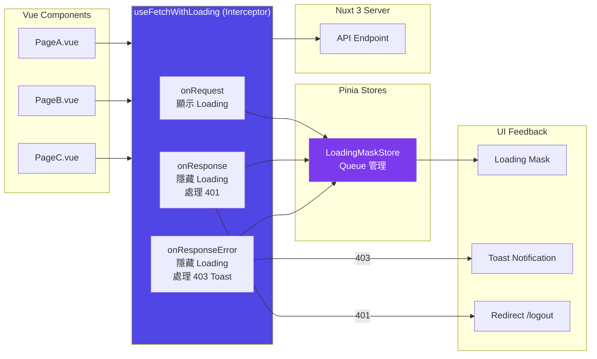
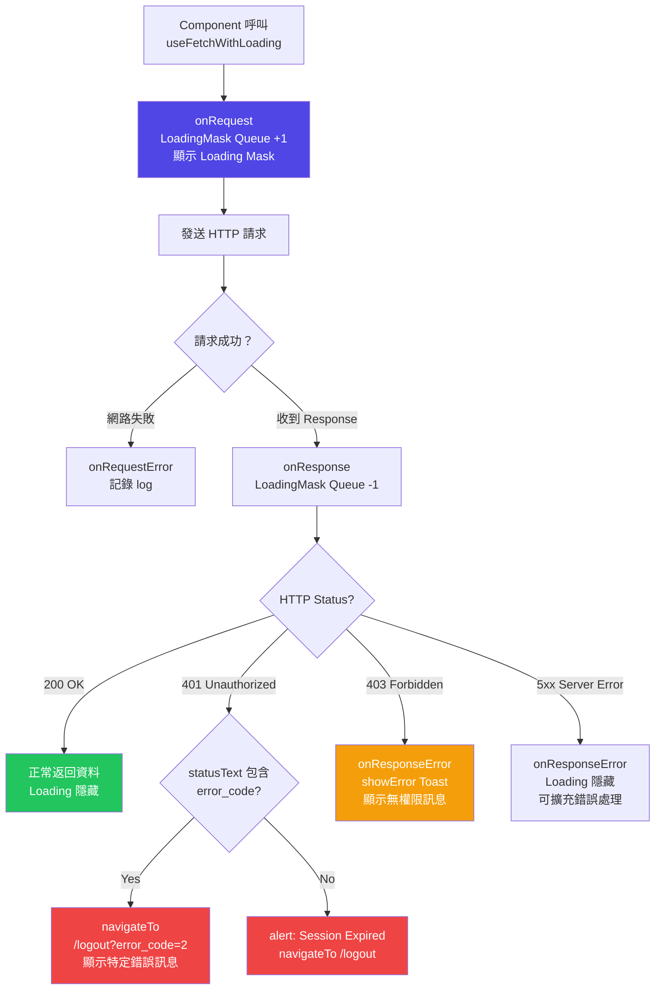
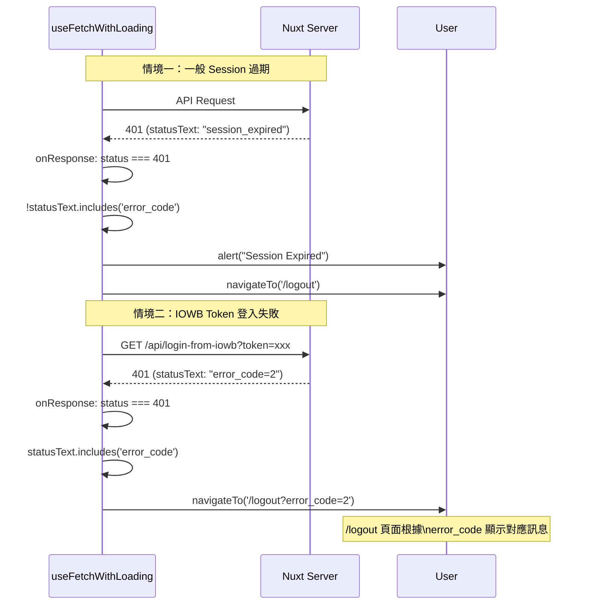

在 Nuxt 3 中，直接使用 `useFetch` 或 `$fetch` 發 API 請求雖然方便，
但在真實專案中你很快會遇到這些問題：

- Loading 狀態分散在每個 component
- 401 / 403 處理邏輯到處重複
- Toast 錯誤通知散落各處難以維護

解決方案：將這些**橫切關注點（cross-cutting concerns）** 集中到一個 composable。

<!-- more -->

## 問題描述

**問題一：Loading 狀態分散**
```vue
<!-- ❌ 每個 component 都要手動管理 loading -->
<script setup>
const isLoading = ref(false);

async function fetchData() {
  isLoading.value = true;
  const data = await $fetch('/api/xxx');
  isLoading.value = false;
}
</script>
```

**問題二：401/403 處理重複**
```typescript
// ❌ 每個請求都要個別處理 401
const { data, error } = await useFetch('/api/xxx');
if (error.value?.statusCode === 401) {
  navigateTo('/logout'); // 每個地方都要寫一遍
}
```

**問題三：錯誤通知邏輯散落各處**
```typescript
// ❌ Toast 通知散落在每個 component 裡
if (error.value?.statusCode === 403) {
  toast.add({ severity: 'error', summary: 'Forbidden' }); // 重複寫
}
```

---

## 架構設計



---

## 完整實作（`composables/useFetchWithLoading.ts`）

```typescript
import { type UseFetchOptions } from '#app';
import { useLoadingMaskStore } from '@/stores/loading-mask';
import { Resource } from '@/constants/resource.constant';

export function useFetchWithLoading<T>(
  url: string | (() => string),
  options: UseFetchOptions<T> = {}
) {
  return useFetch(url, {
    // 保留外部傳入的所有選項（headers、query、body 等）
    ...options,

    // ── Hook 1：請求發出前 ──
    onRequest({ request, options }) {
      console.log('[fetch request]');

      // process.client 確保只在瀏覽器端執行（Nuxt SSR 安全）
      if (process.client) {
        const loadingMaskStore = useLoadingMaskStore();
        loadingMaskStore.showLoadingMask(); // Queue +1
      }
    },

    // ── Hook 2：請求錯誤（網路層錯誤，例如無法連線） ──
    onRequestError({ request, options, error }) {
      console.log('[fetch request error]');
      // 目前記錄 log，可擴充為顯示「網路連線失敗」提示
    },

    // ── Hook 3：收到 Response（包含 4xx、5xx） ──
    onResponse({ request, response, options }) {
      console.log('[fetch response]');

      if (process.client) {
        const loadingMaskStore = useLoadingMaskStore();
        loadingMaskStore.hideLoadingMask(); // Queue -1

        if (response.status === 401) {
          // 判斷是 Session 過期（一般 401）還是 IOWB 特殊錯誤碼（帶 error_code）
          if (response.statusText.includes('error_code')) {
            // IOWB 登入失敗，帶 error_code 參數到 /logout 頁面顯示對應錯誤訊息
            navigateTo(`/logout?${response.statusText}`);
          } else {
            // 一般 Session 過期
            alert(Resource.SessionExpired);
            navigateTo(`/logout`);
          }
        }
      }
    },

    // ── Hook 4：Response 處理錯誤（4xx/5xx 由 useFetch 拋出時） ──
    onResponseError({ request, response, options }) {
      console.log('[fetch response error]');

      if (process.client) {
        const loadingMaskStore = useLoadingMaskStore();
        loadingMaskStore.hideLoadingMask(); // 確保 loading 被關閉

        try {
          const { showError } = useCustomToast();
          if (response?.status === 403) {
            // 403 Forbidden：顯示 toast 通知（不跳轉，讓使用者知道權限不足）
            showError((response as any)._data?.message || response.statusText || 'Forbidden');
          }
        } catch {
          // 若 toast 元件不可用（例如 SSR 階段），靜默處理
        }
      }
    },
  });
}
```

---

## 請求生命週期完整流程



---

## 使用範例

### 基本使用（替換原生 `useFetch`）

```typescript
// ❌ 原始 useFetch（無攔截）
const { data, error } = await useFetch('/api/promotion/overview');

// ✅ 使用 useFetchWithLoading（自動 loading + 401/403 處理）
const { data, error } = await useFetchWithLoading('/api/promotion/overview');
```

### 帶查詢參數

```typescript
const { data } = await useFetchWithLoading('/api/member/summary', {
  query: {
    page: 1,
    size: 20,
    status: 'active',
  },
});
```

### POST 請求

```typescript
const { data, error } = await useFetchWithLoading('/api/promotion/create', {
  method: 'POST',
  body: {
    name: '春節活動',
    startDate: '2026-01-20',
  },
});
```

### 動態 URL（Reactive）

```typescript
const memberId = ref('U001');

// URL 會隨 memberId 自動重新請求
const { data } = await useFetchWithLoading(
  () => `/api/member/${memberId.value}/detail`
);
```

---

## 401 的兩種處理情境

本系統有兩種 401 情境，處理方式不同：



---

## useCustomToast 整合

```typescript
// composables/useCustomToast.ts
export function useCustomToast() {
  const toast = useToast(); // PrimeVue Toast

  return {
    showError(message: string, summary = 'Error') {
      toast.add({
        severity: 'error',
        summary,
        detail: message,
        life: ToastHiddenMilliseconds,
      });
    },
    showSuccess(message: string, summary = 'Success') { /* ... */ },
    showInfo(message: string, summary = 'Info') { /* ... */ },
    showWarn(message: string, summary = 'Warning') { /* ... */ },
  };
}
```

在 `useFetchWithLoading` 中，403 錯誤會自動呼叫 `showError`，
Component 完全不需要知道這件事。

---

## 擴充點：加入更多攔截邏輯

當你需要擴充更多全域行為時，只需修改 `useFetchWithLoading` 一個地方：

```typescript
// 擴充範例：加入 CSRF Token 自動附加
onRequest({ options }) {
  options.headers = {
    ...options.headers,
    'X-CSRF-Token': getCsrfToken(),
  };
  loadingMaskStore.showLoadingMask();
},

// 擴充範例：加入全域 retry 機制
onResponseError({ response }) {
  if (response?.status === 503) {
    showWarn('系統維護中，請稍後再試');
  }
},
```

---

## 小結

`useFetchWithLoading` 是一個**薄薄的攔截層**，職責非常明確：

| Hook | 職責 |
|------|------|
| `onRequest` | Loading Queue +1（顯示 Loading）|
| `onRequestError` | 記錄網路層錯誤 log |
| `onResponse` | Loading Queue -1（隱藏 Loading）+ 401 登出處理 |
| `onResponseError` | Loading Queue -1 + 403 Toast 通知 |

這個模式的設計哲學：

> **Components 只關心「要請求什麼資料」，不關心「請求過程中發生了什麼」。**
> 請求的橫切關注點（loading、auth、error feedback）由 composable 層統一處理。

結合完整架構：
- **後端** `defineLogAndAuthHandler` HOF → 統一 Auth + Logging
- **前端** `useFetchWithLoading` Composable → 統一 Loading + Error Handling
- **前端** Queue-based Loading Mask → 解決並發請求的 UX 問題

這三層架構共同構成了一個**從 UI 到 Server 的完整請求管理體系**。
