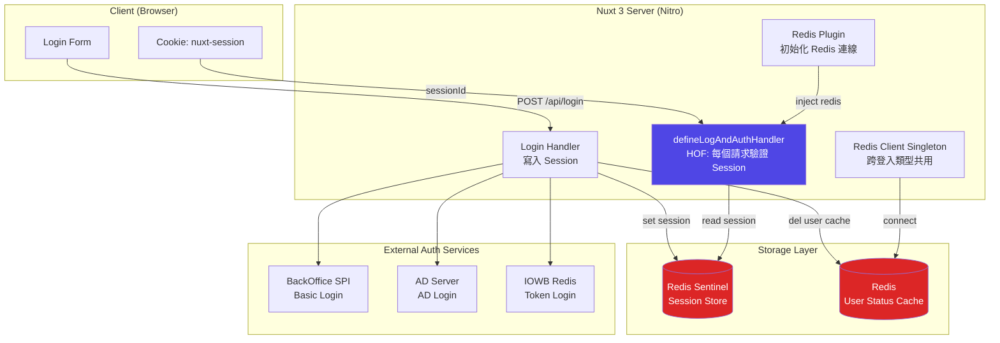
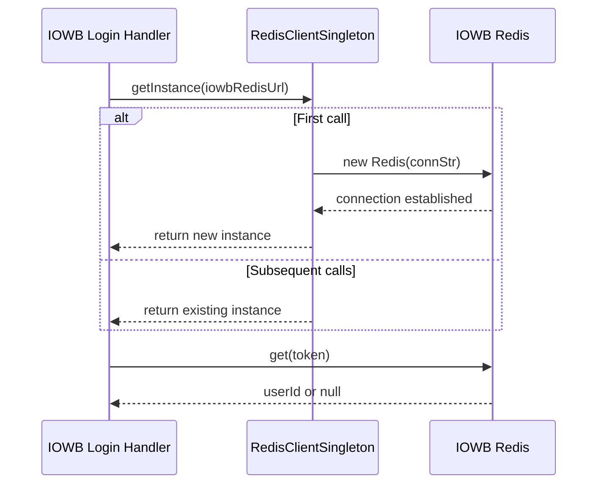
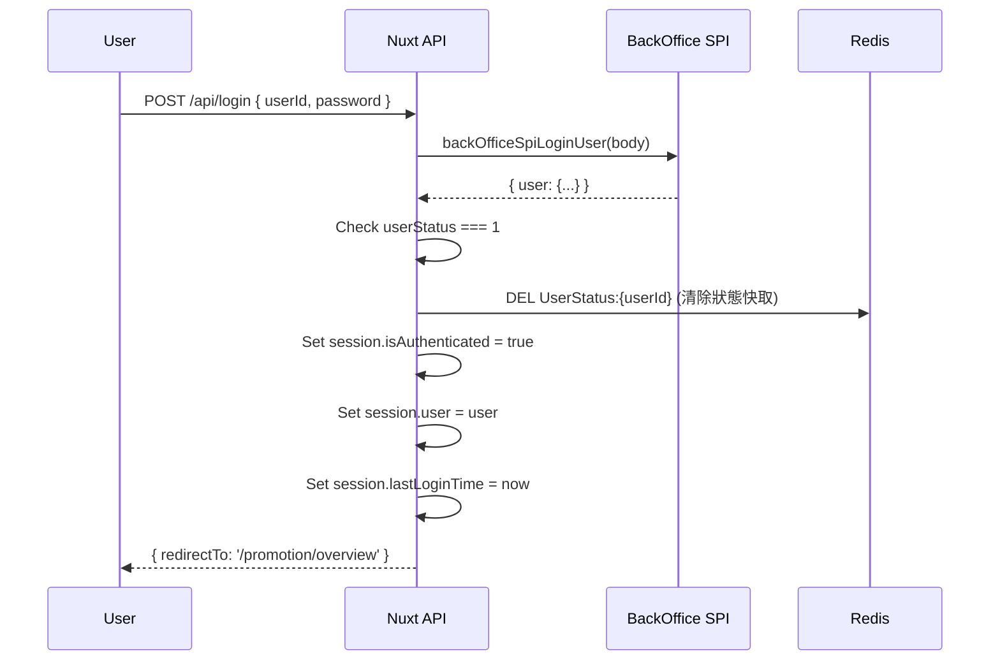
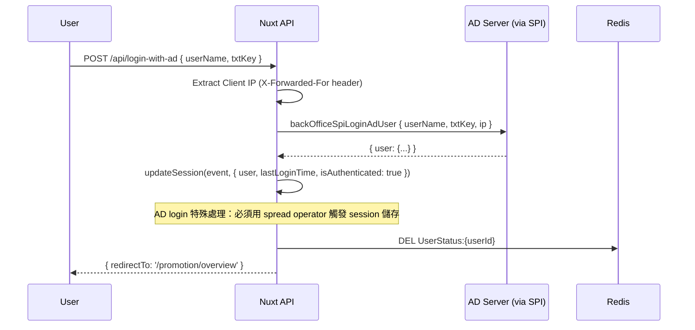
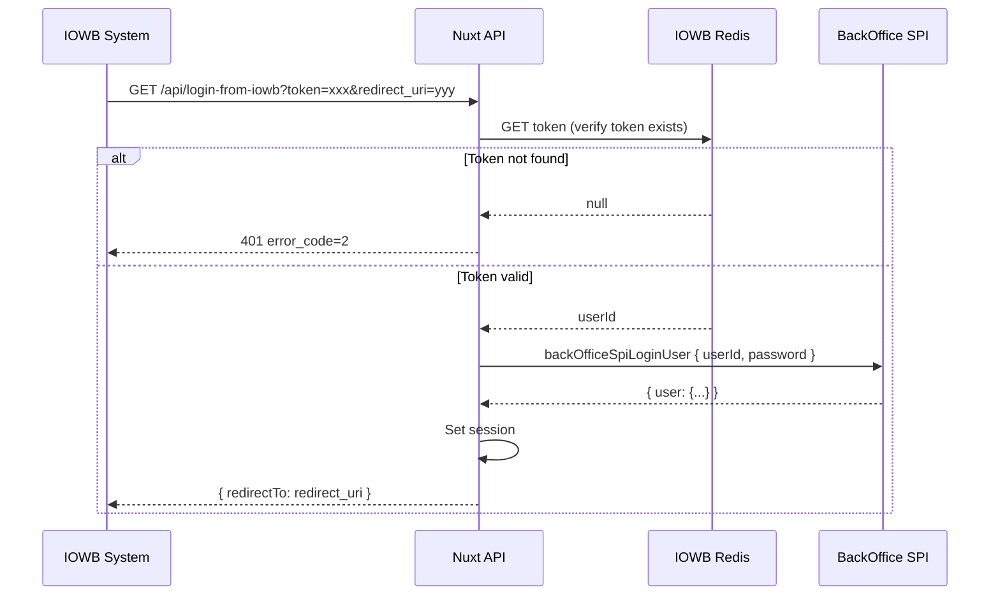

Session 管理是後台系統的核心安全基礎。
一個生產級的 Session 架構需要：

- 安全的 Cookie 設定（httpOnly、secure、sameSite）
- 高可用的 Session 儲存（Redis Sentinel）
- 多種登入方式的統一處理
- 使用者狀態的即時同步（Redis Cache）
- 活動式 TTL 重置（Rolling Session）

本文拆解一個真實 Nuxt 3 後台系統的完整 Session 架構。

<!-- more -->

---

## 整體架構圖



---

## Session 安全設定（`nuxt.config.ts`）

```typescript
// nuxt.config.ts
let redisOptions = {};

if (process.env.NUXT_PUBLIC_DC_VERSION === 'local') {
  // 開發環境：直連 Redis
  redisOptions = {
    host: process.env.NUXT_SESSION_SESSION_STORAGE_OPTIONS_OPTIONS_HOST,
    port: process.env.NUXT_SESSION_SESSION_STORAGE_OPTIONS_OPTIONS_PORT,
  };
} else {
  // 生產環境：使用 Redis Sentinel 高可用架構
  redisOptions = {
    password: process.env.NUXT_SESSION_SESSION_STORAGE_OPTIONS_OPTIONS_PASSWORD,
    sentinels: process.env.NUXT_SESSION_SESSION_STORAGE_OPTIONS_OPTIONS_SENTINELS,
  };
}

export default defineNuxtConfig({
  modules: ['@sidebase/nuxt-session'],
  session: {
    isEnabled: true,
    session: {
      idLength: 64,              // Session ID 長度：64 字元（高熵值）
      cookieSameSite: 'lax',     // 防 CSRF：同站請求才帶 cookie
      cookieSecure: true,        // 只允許 HTTPS 傳輸 cookie
      cookieHttpOnly: true,      // JavaScript 無法讀取 cookie（防 XSS）
      rolling: true,             // 活動式 TTL：每次請求都重置過期時間
      ipPinning: false,          // 不鎖定 IP（Load Balancer 環境常見需求）
      storageOptions: {
        driver: 'redis',
        options: redisOptions,
      },
    },
    api: {
      isEnabled: true,
      methods: ['patch', 'get', 'post', 'delete'],
      basePath: '/api/session',
    },
  },
});
```

### Cookie 安全設定說明

| 設定 | 值 | 防禦目標 |
|------|-----|---------|
| `cookieHttpOnly` | `true` | 防止 XSS 攻擊竊取 Session |
| `cookieSecure` | `true` | 防止中間人攻擊（強制 HTTPS）|
| `cookieSameSite` | `'lax'` | 防止 CSRF 跨站請求偽造 |
| `idLength` | `64` | 增加 Session ID 猜測難度 |
| `rolling` | `true` | 活躍使用者不會被意外登出 |

---

## Session 資料結構設計

每個登入成功的使用者，在 Redis 中儲存以下 Session 結構：

```typescript
interface SessionData {
  isAuthenticated: boolean;        // 是否已通過驗證
  user: {
    userId: string;
    userStatus: number;            // 1 = active
    permissions: Array<{
      id: number;
      userId: string;
      sortNum: number;
    }>;
    isForceChangePassword?: boolean; // 強制修改密碼旗標
  } | null;
  lastLoginTime: number | null;    // Unix timestamp（ms）用於 Session 過期計算
  visitedUrl: string | null;       // 登入前最後瀏覽的 URL（登入後重導向用）
}
```

> **設計重點**：`lastLoginTime` 不依賴 Cookie 的 TTL，而是在 HOF handler 中主動計算時間差，
> 搭配 `maxExpiryInSeconds` 環境變數，達到後端控制的 Session 過期機制。

---

## Redis Plugin：連線注入（`server/plugins/redis.ts`）

```typescript
import { Redis } from 'ioredis';

export default defineNitroPlugin((nitroApp) => {
  const config = useRuntimeConfig();
  const sessionConfig = config.session.session.storageOptions.options as any;

  // 建立 Redis 連線（使用 session 的 Redis 設定）
  const redis = new Redis(sessionConfig);

  // 將 redis instance 注入每個請求的 context
  nitroApp.hooks.hook('request', (event) => {
    event.context.redis = redis;
  });

  // Server 關閉時優雅斷線
  nitroApp.hooks.hook('close', () => {
    if (redis) {
      redis.disconnect();
    }
  });
});
```

> **設計重點**：透過 Nitro Plugin 的 `request` hook，每個 API handler 都可以直接
> 從 `event.context.redis` 取得 Redis 連線，無需自行建立連線。

---

## Redis Singleton Pattern（`server/utils/redis-client-singleton.ts`）

某些特殊登入流程（如 IOWB Token Login）需要連到**不同的 Redis 實例**。
此時使用 Singleton Pattern 確保同一個連線字串只建立一個連線：

```typescript
import Redis from 'ioredis';

class RedisClientSingleton {
  private static instance: Redis;

  public static getInstance(connStr: string): Redis {
    if (!RedisClientSingleton.instance) {
      // 只在第一次呼叫時建立連線
      RedisClientSingleton.instance = new Redis(connStr);
    }
    return RedisClientSingleton.instance;
  }
}

export default RedisClientSingleton;
```



---

## 三種登入流程

### 流程一：Basic Login（帳號密碼）



**關鍵程式碼**：
```typescript
export default defineLogAndAuthHandler<LoginRequest>(async (event) => {
  const body = await readBody(event);
  const content = (await api.backOfficeSpiLoginUser(body)).data;

  if (content.user) {
    const user = content.user;
    event.context.session.user = user;
    event.context.session.lastLoginTime = new Date().getTime();

    if (user.userStatus !== 1) {
      event.context.session.user = null;
      throw createError({ statusCode: 400, statusMessage: getUserStatusErrorMsg(user.userStatus) });
    }

    event.context.session.isAuthenticated = true;
    // 清除 Redis 中的使用者狀態快取（確保下次讀到最新狀態）
    await ottRedis.del(`${UserRedisPrefix}${user.userId}`);

    // 登入前有瀏覽頁面？重導向到原頁面
    if (event.context.session.visitedUrl) {
      return { redirectTo: event.context.session.visitedUrl, permissions };
    }
    // 強制修改密碼？
    if (user.isForceChangePassword) {
      return { redirectTo: '/user/profile', permissions };
    }
    return { redirectTo: '/promotion/overview', permissions };
  }
});
```

---

### 流程二：AD Login（Active Directory）



**AD Login 特殊注意點**：
```typescript
// ⚠️ @sidebase/nuxt-session 的內部機制需要完整替換 session 物件才能觸發儲存
// 直接 assign property 有時不會觸發 save
const updateSession = (event: any, updates: any) => {
  Object.assign(event.context.session, updates);
  event.context.session = { ...event.context.session }; // 強制觸發響應性更新
};
```

---

### 流程三：IOWB Token Login（跨系統 SSO）



**關鍵程式碼**：
```typescript
export default defineLogAndAuthHandler(async (event) => {
  const query = getQuery(event);
  const config = useRuntimeConfig();

  // 動態建立 IOWB Redis 連線（使用 Singleton）
  const connStr = buildIowbRedisConnStr(config);
  const client = RedisClientSingleton.getInstance(connStr);

  // 驗證 token 是否存在於 IOWB Redis
  const result = await client.get(query.token as string);

  if (!result) {
    // error_code=2: token 無效或已過期
    return createError({ statusCode: 401, statusMessage: 'error_code=2' });
  }

  // Token 有效，使用固定的 iowb 帳號登入
  const content = (await api.backOfficeSpiLoginUser({ userId: 'iowb', password: 'iowb' })).data;
  // ... 設定 session，重導向到 redirect_uri
});
```

---

## Session 過期：主動計算 vs Cookie TTL

本系統使用**主動計算**而非依賴 Cookie TTL：

```typescript
// 在 defineLogAndAuthHandler 中，每個請求都會檢查
if (event.context?.session?.isAuthenticated && event.context?.session?.lastLoginTime) {
  const currentTime = new Date().getTime();
  const lastLoginTimestamp = event.context.session.lastLoginTime;
  const maxTimeDiff = (currentTime - lastLoginTimestamp) / 1000; // 轉換為秒

  if (maxTimeDiff >= parseInt(config.public.maxExpiryInSeconds, 10)) {
    // 主動清除 session
    event.context.session.isAuthenticated = false;
    event.context.session.user = null;
    event.context.session.lastLoginTime = null;
    return createError({ statusCode: 401, statusText: Resource.SessionExpired });
  }
}
```

| 機制 | 優點 | 缺點 |
|------|------|------|
| Cookie TTL（被動） | 自動，不需後端計算 | 無法強制登出特定使用者 |
| 主動計算（本系統） | 可精確控制、可即時強制登出 | 每次請求都需要計算 |

搭配 `rolling: true`，只要使用者持續操作，Session 不會過期。
若使用者超過 `maxExpiryInSeconds` 未操作，下次請求時後端主動踢除。

---

## 小結

| 功能 | 技術選擇 | 說明 |
|------|---------|------|
| Session 儲存 | Redis Sentinel | 高可用、水平擴展 |
| Session 套件 | @sidebase/nuxt-session | Nuxt 3 官方推薦 |
| Redis 注入 | Nitro Plugin + request hook | 每個請求都有 redis context |
| 跨系統 Redis | Singleton Pattern | 避免重複建立連線 |
| Cookie 安全 | httpOnly + secure + sameSite | 防 XSS + CSRF |
| Session 過期 | 後端主動計算 + Rolling TTL | 精確控制 + 良好 UX |
| 多登入方式 | Basic / AD / IOWB Token | 統一 Session 結構 |
